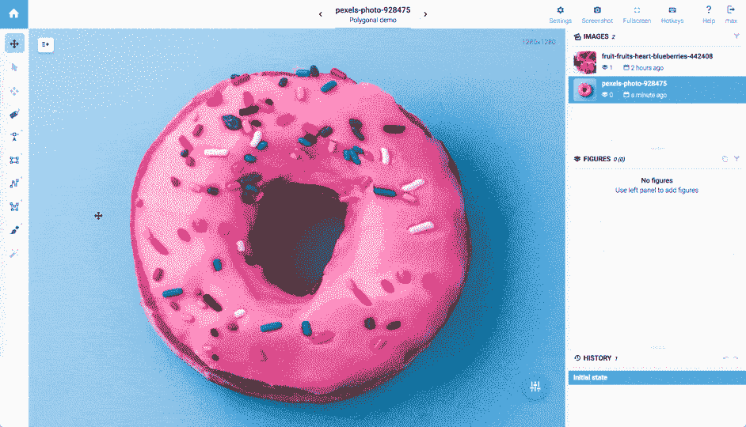

# 深度学习中的✏️高级注释工具:有监督的计算机视觉的训练数据

> 原文：<https://medium.com/hackernoon/%EF%B8%8F-advanced-annotation-tools-in-deep-learning-training-data-for-computer-vision-with-supervisely-847f8699a9cb>

计算机视觉平台[监管](https://supervise.ly/)覆盖整个研发生命周期，包括数据标签。为了构建精确的计算机视觉系统，你需要大量高质量的标记数据。Supervisely 提供了一流的数据标注工具和基础架构，只需点击几下鼠标即可组织可扩展的标注流程。

这篇文章的目标是涵盖 Supervisely 最有用的注释特性，帮助你为你的计算机视觉应用程序标记图像和视频。

试试**社区版，**它是免费的，在线可用，没有任何限制。

**企业版**是一款为企业设计的自托管解决方案，可保证 100%的数据隐私。

# SmartTool — p **精确标注语义分段**

告别多边形和笔刷工具。一年前，我们[宣布了](https://hackernoon.com/%EF%B8%8F-big-challenge-in-deep-learning-training-data-31a88b97b282)超级智能工具的第一个版本——交互式实例分割。Supervisely SmartTool 是一个类不可知的神经网络，在选定的区域内执行主要对象的精确分割。

关键特征是用户可以为他们的特定对象定制它。自首次发布以来，我们不断收集新的标记数据，并提高我们的 SmartTool 的准确性，以涵盖越来越多的开箱即用用例。

相比之下，市场上的其他注释工具迫使用户使用基于超像素、分水岭算法或类似的弱工具。用户必须在注释期间调整许多参数。好像我们在 2005 年初。标签公司展示了一些玩具样品，但几乎不可能在生产中使用他们的方法。

# 多边形

多边形工具允许用矢量对象分割区域。添加/删除点以修正现有形状，添加多边形孔以分割复杂结构。

# **包围盒**

只需在物体周围放两个点，移动它们来调整检测。“瞄准装置”将帮助你使它更快。

# **画笔和橡皮擦**

用笔刷画出均匀精确的注释，用橡皮擦修改。

还超级允许纠正(填充和裁剪)多边形工具的光栅对象。用例之一是校正神经网络预测。

# **标签和描述**

注释平台 Supervisely 拥有强大的标签引擎。可能的用例:为图像和对象分配标签以准备分类模型的训练数据，使用描述来准备 OCR 模型的训练数据，或者只是在注释过程中将它们用作注释和评论。

# **选择、移动、编辑**

选择工具有助于浏览图像上的大量对象。一旦你选择了感兴趣的对象，只需移动它或开始编辑。移动操作有助于视频注释:标记第一帧，然后将对象复制到下一帧，并稍微调整对象的位置。

# **亮度/对比度**

图像必须具有适当的亮度和对比度，以便于查看和标记。亮度/对比度调节非常有用，尤其是对于在光线不足的情况下拍摄的图像或医学图像。

# 对象顺序**和**不透明度

让我们考虑自动驾驶汽车的语义分段。如何在复杂场景上标注物体:有无交集？最佳实践是用交叉点注释对象，然后排列它们的顺序。不透明度工具有助于在注释过程中实时查看最终分割。超级支持这些开箱即用的功能。

# **历史**

通过使用撤消(Ctrl+Z)/恢复(Ctrl+Shift+Z)命令和历史面板，您可以轻松控制注释过程的状态。

# **热键**

为了提高贴标机的生产效率，超级用户可以查看所有热键的列表，并编辑或创建它们。“键盘热键”对话框用作快捷键编辑器，包括所有支持快捷键的命令。

# **自定义视觉设置**

对于每个项目，用户可以自定义视觉设置和默认行为:点的大小和线的宽度，默认对象的不透明度，标签位置模式，启用网格模式，改变缩放倍数等。

# 超级开始

希望你会发现所描述的特性对你的计算机视觉项目有用。节省构建定制基础架构的时间、金钱和精力。免费试用[supervisory](https://supervise.ly/)Community Edition，或者[与我们](https://supervise.ly/contact)讨论适合您业务的企业解决方案。

如果你觉得这篇文章很有趣，那么让我们也来帮助别人吧。如果你给它一些，更多的人会看到它👏。