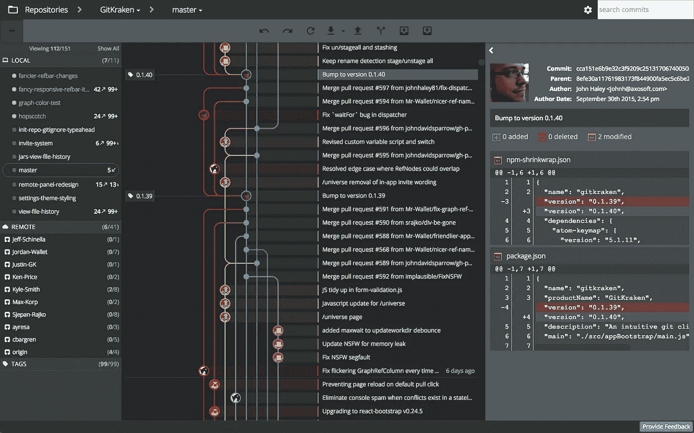

# 面向前端开发的🖥️桌面应用。我的工作空间。

> 原文：<https://medium.com/hackernoon/%EF%B8%8F-desktop-apps-for-front-end-development-my-workspace-f2190713f6b1>

## 简短介绍…

**这篇文章**的目的是展示一些工具，它们真正帮助我和我的同事更快更容易地开发前端应用&。

这将成为那些仍在寻找如何用必备工具改进工作站以创建出色解决方案的人的指南。

# 原子

> 适用于**Mac**/**Windows**/**Linux**

 [## 21 世纪的可破解文本编辑器

### 在 GitHub，我们正在构建我们一直想要的文本编辑器:从本质上来说是可破解的，但在第一天就变得平易近人…

atom.io](https://atom.io/) 

这个很棒的代码编辑器有我需要的几乎所有东西…语法突出显示*(是的，我知道那是通用特性*😂 *)* ，嗯……包经理📦，内置 hints❗️，还有漂亮的 UI *(对我来说，很重要)。*

**为了像专业人士一样使用 Atom，你需要安装一些插件**(但要小心，因为其中一些插件可能会降低 Atom 编辑器的速度)。

以下是我使用的方法，我肯定会推荐给任何人:

 [## 1.抗锯齿

### 非常简单但非常有用的插件。配备 Retina 显示屏的 MacOS 用户必备。

atom.io](https://atom.io/packages/antialiased)  [## 2.编辑器配置

### 如果你在需要不同代码风格的多个项目上工作，这个插件将帮助你自动切换编辑器参数。

atom.io](https://atom.io/packages/editorconfig)  [## 3.突出显示-已选择

### 另一个必备，但这次是给每个人的。“高亮显示-选定”可帮助您快速找到同一个高亮显示的单词的其他外观。

atom.io](https://atom.io/packages/highlight-selected)  [## 4.项目经理

### 绝对牛逼的插件，让我完全控制多个项目。在项目之间切换就像按 Ctrl-Cmd-P 一样简单。

atom.io](https://atom.io/packages/project-manager)  [## 5.待办事项-显示

### 我通常会留下一些 TODO 注释，过一段时间后我会忘记。这个插件帮助我组织它们并跟踪项目状态。

atom.io](https://atom.io/packages/todo-show) 

Atom 很好，但有些用户说它的性能很差。对我来说——它完全满足我的需求，但是如果你面临这样的问题，你可以尝试[崇高文本 3](https://www.sublimetext.com/) 或 [VS 代码](https://code.visualstudio.com/)。

## 基特克拉肯

> 适用于**Mac**/**Windows**/**Linux**

 [## 适用于 Windows、Mac 和 Linux 的 Linux | GitKraken

### 释放北海巨妖！GitKraken 是传说中的 Git GUI 客户端，适用于 Windows、Mac 和 Linux。Git 初学者和高级…

www.gitkraken.com](https://www.gitkraken.com/) 

由 [axosoft](https://www.axosoft.com/) 制作的牛逼 **Git 客户端**。GitKraken 对每个人来说都是绝对**免费**。我喜欢主要是因为它的现代设计和未来的用户界面概念。

Image from [https://forum.unity.com/threads/gitkraken-com.393521/](https://forum.unity.com/threads/gitkraken-com.393521/)

他们总是为每件事做简单的备忘单和说明:

注意，和 Atom 一样，GitKraken 也是建立在使用 JS、HTML 和 CSS 的电子 T2 平台之上的，不同之处在于 GitKraken 不是开源的:(

…那是因为他们也有一个**付费的专业版**，你可以用每年**49 美元**或者**获得，如果你有一个** [**GitHub 学生包**](https://education.github.com/pack) (免费一年)。

## 终端. app

> 仅适用于 **Mac 电脑**

terminal.app

**是的……一个内置的 Mac 应用。但是值得一提的是，它比我们在 Windows 中使用的要好得多。**

对于 **Windows 用户。**请考虑使用以下产品之一:

*   [**Cmder**](http://cmder.net/)**——我把它作为我的主要命令行工具。它是高度可定制和强大的工具。**
*   **[**Hyper**](https://hyper.is/)**——又一款用电子制作的桌面应用。这个终端的优点是，您可以使用一些 Javascript 代码轻松地根据您的需要对其进行定制。****
*   ****Git Bash——也值得一提。在你安装 git 之后，你会得到这个 bash 控制台应用程序。优点是您有内置的 bash 命令。但是我面临的问题是，与其他终端应用相比，我得到的运行时输出较少(例如，如果你运行类似`npm install`的命令，你将看不到安装进度)。****

## ****其他应用程序****

****这些应用程序使开发更加社会化，…****

**** [## 无冲突的语音和文本聊天

### 使用现代语音和文字聊天应用程序加快游戏进度。清晰的声音，多服务器和渠道支持，移动…

discordapp.com](https://discordapp.com/) 

**Discord** —最初为游戏玩家开发的语音和文本聊天应用，但也有被开发者广泛使用的。在那里你可以找到像[react flux](https://www.reactiflux.com/)和 [SpeakJS](https://www.reddit.com/r/mobilewebdev/comments/5a0jil/speakjs_a_discord_server_for_all_things_javascript/) 这样的社区。

 [## 懈怠。工作发生的地方

### 懈怠是工作流动的地方。它是您需要的人、您共享的信息和您使用的工具的来源…

slack.com](https://slack.com/) 

**Slack** —专为团队合作打造的聊天 app。开发者世界中另一个流行的聊天客户端。绝对值得去看看 [FrontEndDevelopers](http://frontenddevelopers.org/) 团队。

 [## 特雷罗

### 无限灵活。非常容易使用。出色的移动应用。它是免费的。特雷罗记录一切，从…

trello.com](https://trello.com) 

**Trello**——根据我的需要，它是一个强大的 TODO 任务管理器，可以帮助我跟踪学习进度，给其他人分配任务和安排工作。

你可以通过这个链接下载他们的桌面应用:[https://trello.com/platforms](https://trello.com/platforms)

## 结论

没有结论。这些只是我更喜欢的满足我需求的应用程序😎。而不是广告或为自己谋利的东西。

> 在评论中随意展示你每天用于前端开发的桌面应用！****