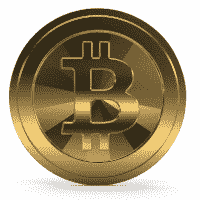

# 2018 年 1 月 2 日:神秘领域最大的故事

> 原文：<https://medium.com/hackernoon/01-02-2018-biggest-stories-in-the-cryptosphere-549958230499>

1.  **印度因加密货币被误解**

今天早上早些时候，许多消息来源[报道](https://qz.com/1195316/budget-2018-busts-bitcoin-arun-jaitley-has-just-killed-indias-cryptocurrency-party/)印度政府将积极尝试阻止人们使用比特币等加密货币。这是因为印度不承认它们是法定货币，尽管印度愿意在支付系统中采用区块链技术。许多人将这些话解读为对该国将加密货币定为非法的警告。许多人认为[这至少部分导致了今天比特币价值的下跌。然而，印度区块链委员会主席 Ajeet Khurana 表示](https://cointelegraph.com/news/india-bitcoin-prices-drop-as-media-misinterprets-govts-regulation-speech)[政府的话被曲解了](https://yourstory.com/2018/02/indian-blockchain-committee-head-clarifies-cryptocurrency-not-illegal-india/)。库拉纳同意加密货币不是法定货币，但不认为政府会取缔它们。他实际上说，政府讨论这个问题的事实表明这个问题变得多么相关。

**2。立陶宛，潜在的欧洲区块链和加密货币中心**

第一个国际区块链中心在立陶宛首都维尔纽斯开业，这是欧洲唯一的一个。该倡议将与澳大利亚、中国、加拿大、英国、格鲁吉亚和直布罗陀等国家的区块链中心建立联系。就职典礼在 1 月 27 日举行。此次活动的主要话题是对密码市场的监管以及其他可能会扰乱世界但需要监管的潜在发现。此外，几天后，立陶宛财政部长 Vilius sa poka 讨论了该国对金融科技和加密货币监管的开放程度。萨波卡认为，区块链，其背后的技术，可以帮助改革各种服务以及公共部门。

**3。伊利诺伊州考虑使用区块链**

昨天，伊利诺伊州区块链任务组向大会发布了一份[报告](https://ipfs.io/ipns/QmVkoraZ3xJhtNhjt9wPBDzKW3XbmCsFUxc9iekJ9XcBHQ/)，称正在考虑使用区块链。这项技术将用于管理居民的身份证，以及改善公共部门的资产。[资产的例子](https://www.coindesk.com/illinois-eyes-blockchain-for-ids-and-public-asset-management/)可以是税收抵免、社会福利和市政债券。这将使这一进程更加透明和有效。身份信息将被分散，使公民能够与不同的政府机构共享这些信息。此外，还建立了一个[数据库](https://airtable.com/shreIXQjzluCxam37/tbl7qVDFKKiEcFFrc)，用于跟踪各国调查区块链和 DLT 在公共部门使用情况的举措。

**4。据加密货币对冲基金经理**称，比特币被高估了 15%

今天比特币[再次跌破 1 万美元](http://uk.businessinsider.com/bitcoin-price-cryptocurrency-thursday-february-1-2018-2?r=US&IR=T)。这是由几个因素造成的，这是两周内第二次发生这种情况。然而，[BKCM LLC 创始人兼首席执行官布莱恩·凯利](https://www.cnbc.com/brian-kelly/)认为[比特币被高估了约 15%](https://www.cnbc.com/2018/02/01/bitcoin-is-still-overvalued-by-15-percent-cryptocurrency-hedge-fund-manager.html) 。这位加密货币对冲基金经理根据交易估算了一个内在价值，并给出了 8000 美元的理想价格。因此，凯利认为价格会进一步降低。然而，因为它仍然是一项年轻的技术，他建议不要做空比特币。

> 要想在你的邮箱里收到我们的每日新闻综述，请在这里注册:[http://bit.ly/BlockExNewsRoundup](http://bit.ly/BlockExNewsRoundup)