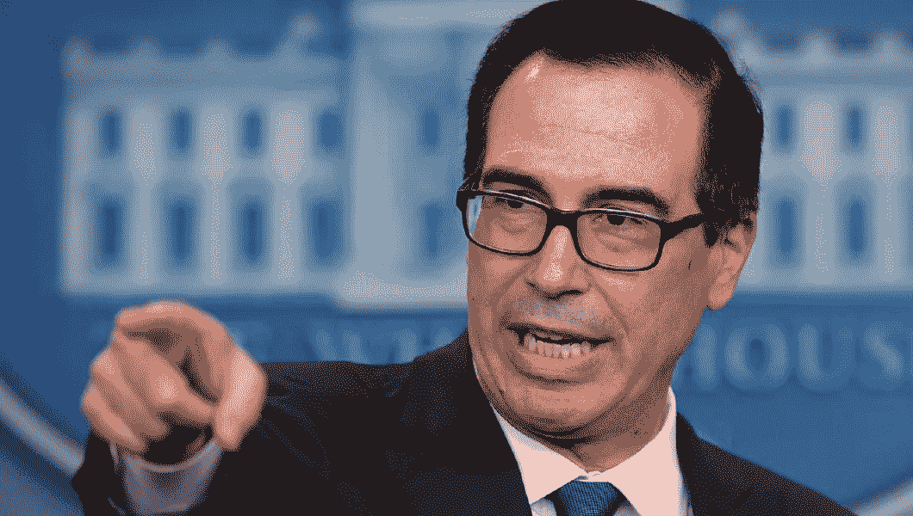

# 2018 年 2 月 2 日:神秘领域最大的故事

> 原文：<https://medium.com/hackernoon/02-02-2018-biggest-stories-in-the-cryptosphere-ae7caeaa6c45>

**1。联邦快递将区块链技术整合到其运营中**

航运公司联邦快递(FedEx)决定通过加入运输联盟(BiTA)的[区块链](https://bita.studio/)，开始在运营中实施区块链技术。该消息最早由行业新闻网站 [FreightWaves](https://www.freightwaves.com/news/fedex-bita-blockchain-logistics-plans?rq=fedex) 报道。区块链技术[与公司物流](https://www.coindesk.com/fedex-moves-forward-blockchain-logistics-plans/)的整合将提高透明度和安全性。区块链将用于公司的几个部门。例如，一个使用它来存储争议解决数据的试点项目刚刚启动。这将有助于确定永久分类账需要哪些数据，以便于处理客户对通过公司相互交付的货物的争议。

**2。用区块链验证教育和工作经历历史**

亿万富翁企业家戴维·格芬可能是为了获得工作而谎称获得学位的最成功的人之一。然而，区块链技术现在可以使这种做法更加困难。互联网企业家陈士骏推出了基于区块链的系统 EchoLink。招聘人员和雇主将能够证明候选人的教育，工作经验和技能历史。考虑到电子教育市场的蓬勃发展，这可能是一个有用的工具。此外，陈本周宣布在伯克利区块链实验室推出数字货币。

**3。尼日利亚参议院将调查比特币**

尼日利亚政府[启动了对加密货币的调查](https://www.bloomberg.com/news/articles/2018-01-30/nigerian-senate-orders-investigation-of-bitcoin-trading-jd1r7d6p)，以评估其优势和风险。这是由于比特币在该国越来越受欢迎。参议院银行和其他金融机构委员会将评估加密货币作为一种投资形式的潜力，并就如何应对这一现象向政府提出建议。尼日利亚中央银行最近[反对加密货币](https://www.bloomberg.com/news/articles/2018-01-25/central-bank-in-africa-s-top-bitcoin-market-warns-of-gamble)。然而，公民，尤其是千禧一代，正在[应对诸如缺乏就业机会、通货膨胀侵蚀他们的储蓄以及兑换货币困难等问题。目前，交易商们正在使用 Telegram 来执行他们的 KYC 协议，作为打击欺诈的一种方式。](https://www.ccn.com/bitcoin-catches-the-eye-of-nigerias-lawmakers/)

**4。Mnuchin 在 G20 峰会上呼吁讨论加密货币**

去年 12 月，我们[报道了](/@BlockEx/19-12-2017-biggest-stories-in-the-cryptosphere-ac5cb011c0b0)法国财政部长布鲁诺勒梅尔希望将比特币纳入讨论话题。德国财政部长沃尔夫冈·朔伊布勒和意大利财政部长皮埃尔·卡洛·帕多安同意这一提议。现在，美国财政部长史蒂文·姆努钦[也呼吁在布宜诺斯艾利斯举行的 20 国集团峰会上讨论加密货币。在参议院银行委员会的一次演讲中，姆努钦肯定地说，他不认为比特币是一种威胁，但仍然认为比特币参与非法活动需要得到处理。不管个人立场如何，加密货币都是一个难以忽视的现象。](https://www.coindesk.com/mnuchin-talk-crypto-regulation-g20-summit/)

> *要想在你的邮箱里收到我们的每日新闻综述，请在这里注册:*[*http://bit.ly/BlockExNewsRoundup*](http://bit.ly/BlockExNewsRoundup)