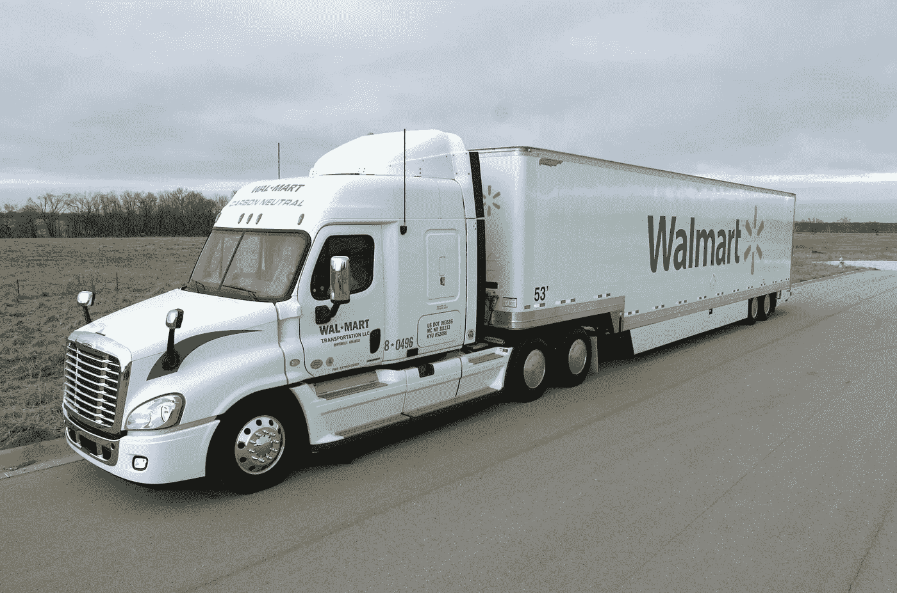

# 2018 年 2 月 3 日:神秘领域最大的故事

> 原文：<https://medium.com/hackernoon/02-03-2018-biggest-stories-in-the-cryptosphere-44af92292aaa>

**1。沃尔玛将依靠区块链技术**

沃尔玛已经向美国专利商标局申请了[专利](http://appft.uspto.gov/netacgi/nph-Parser?Sect1=PTO2&Sect2=HITOFF&u=%2Fnetahtml%2FPTO%2Fsearch-adv.html&r=1&p=1&f=G&l=50&d=PG01&S1=20180061162.PGNR.&OS=dn/20180061162&RS=DN/20180061162)。该巨头希望利用区块链技术来改善其“智能包裹”交付跟踪系统。[智能包](https://www.coindesk.com/walmart-using-blockchain-tech-make-shipping-smarter/)将由一个存储区块链信息的记录设备组成。将被记录的信息的例子是递送的内容及其位置。它也可以和技术创新一起使用，比如无人驾驶汽车。然而，这并不是沃尔玛第一次想利用区块链开展业务。我们之前[报道过](/@BlockEx/14-12-2017-biggest-stories-in-the-cryptosphere-9d6aba39be4)关注食品安全的联盟。

**2。英格兰银行行长呼吁制定加密法规**

英国银行行长兼 20 国集团金融稳定委员会主席马克·卡尼呼吁制定加密法规，以打击非法活动，保护金融系统。卡尼希望目前适用于金融部门的法律标准也适用于加密市场。他继续说，目前这个市场的规模意味着它对整个金融市场没有强大的影响力。然而，鉴于它越来越受欢迎，这种情况可能会在未来发生变化。没有人呼吁禁止，而是呼吁建立一个监管框架。最后，英国央行行长确认，监管很快就会出台，这个话题肯定会在即将到来的 G20 会议上讨论。

**3。墨西哥国会通过加密监管法案**

一项呼吁对日益增长的金融科技行业进行监管的法案已经获得墨西哥国会下议院的批准。考虑到加密货币公司也属于这一群体，墨西哥是首批发布此类法规的国家之一。这个消息证实了之前[报道的](https://hackernoon.com/23-02-2018-biggest-stories-in-the-cryptosphere-a9555b26b697)传闻。此外，新法案允许开放银行业务，即金融机构通过公共应用程序接口共享信息。然而，如前所述，加密货币不会被视为法定货币。

**4。另一家银行承认加密货币可能成为他们的竞争对手**

[摩根大通](https://www.newsbtc.com/2018/02/28/jp-morgan-chase-recognizes-cryptocurrency-as-a-risk-publicly/)、[美国银行](https://www.ft.com/content/99fdd3e4-1821-11e8-9e9c-25c814761640)和[高盛](https://www.coindesk.com/goldman-sachs-latest-bank-label-crypto-business-risk/)最近都表示，加密货币对他们的商业模式构成了威胁。现在，另一家银行也说了同样的话。地区性银行威斯银行在其年度报告[中分享了这些信息，并向美国证券交易委员会(SEC)提交了文件。该机构承认，这项技术可能会导致客户流失。此外，作为一家相对较小的银行，它需要更多的时间来研究和采用这项技术。因此，在快速变化的情况下，它将很难跟上拥有适应市场资源的大型机构。](https://www.sec.gov/Archives/edgar/data/203596/000119312518060835/d488809d10k.htm)

> *要想在你的邮箱里收到我们的每日新闻综述，请在这里注册:*[*http://bit.ly/BlockExNewsRoundup*](http://bit.ly/BlockExNewsRoundup)