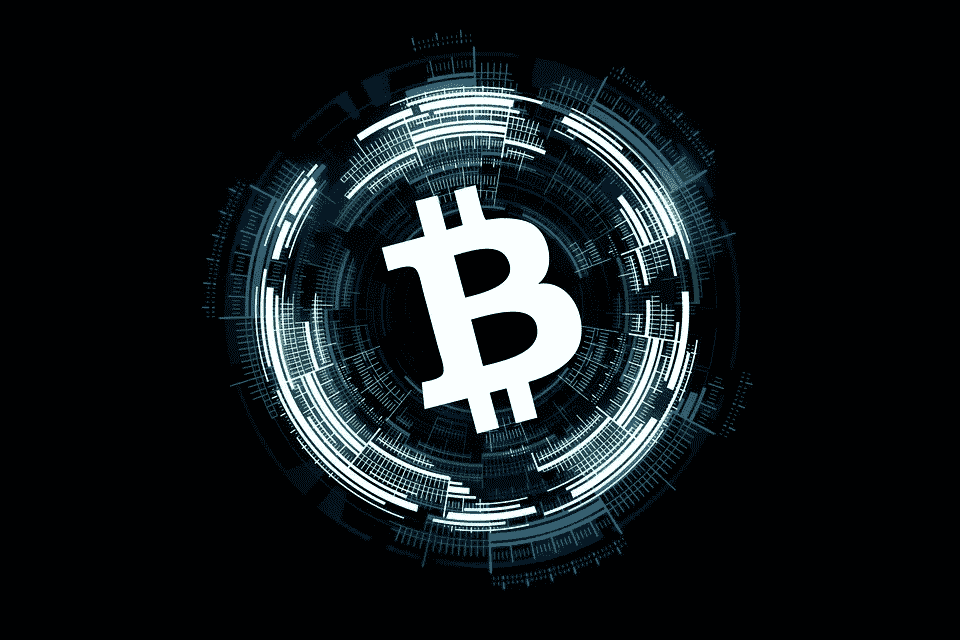

# 2018 年 2 月 5 日:神秘领域最大的故事

> 原文：<https://medium.com/hackernoon/02-05-2018-biggest-stories-in-the-cryptosphere-698775eefd63>

通过 BlockEx

**1。自律贸易协会 CryptoUK 要求议员执行法规**

[CryptoUK](http://www.cryptocurrenciesuk.info/) ，英国加密行业的第一个自律贸易协会，呼吁国会议员[将金融行为监管局(FCA)的法规和指导方针应用于加密货币](https://www.ccn.com/british-cryptocurrency-trade-group-seeks-fca-oversight/)，将其置于该机构的管辖之下。该提议是为了回应美国财政部委员会宣布将对加密货币展开调查。除了 BlockEx，CryptoUK 的其他成员还包括比特币基地和 eToro。在这些提议中，有一个加密许可证将授予符合反洗钱和 KYC 的加密交易所。还补充说，理想情况下，重点应放在中介机构，而不是加密货币本身，因为点对点政策已经存在。该组织认为，监管是行业繁荣的基础。

**2。韩国中央银行称加密和区块链将导致无现金社会**

一段时间以来，韩国中央银行——韩国银行(BOK)一直试图创造一个“无现金社会”。现在已经宣布 [crypto 和区块链被认为是实现](https://cointelegraph.com/news/south-korean-central-bank-crypto-and-blockchain-to-provide-cash-free-society)目标的可能工具。昨天正式宣布了无现金社会试点，以及区块链和加密货币在支付等方面的参与。一个调查数字货币及其对金融系统的影响的组织也已经成立。其目标是节省货币生产成本(2016 年花费了 4700 万美元)并改善客户体验。此举也将有助于打击黑市交易，因为黑市交易主要基于现金交易。

**3。汽车行业大腕发起区块链研究联盟**

汽车行业的一些大腕发起了一个区块链研究联盟。宝马、通用、福特和雷诺已经合作成立了移动开放区块链倡议( [MOBI](https://www.dlt.mobi/) )。参与该项目的 30 个成员包括博世、伯克利(区块链)、Hyperledger、Fetch.ai、IBM 和 IOTA。该项目于今天启动，旨在降低成本，提高安全性，增加交通便利性。他们希望通过区块链技术改善的方面是“支付、数据跟踪和供应管理，消费者金融和定价，以及更具未来感的领域，如自动驾驶汽车和共乘系统”。虽然这不是汽车制造商第一次加入这种类型的团体，但这是第一个专注于该行业的联盟。

**4。以太坊区块链上记录的朝鲜和约**

韩国开发者 Ryu
Gi-hyeok[在以太坊区块链](https://cointelegraph.com/news/korean-peace-treaty-goes-live-on-ethereum-blockchain-forever)上记录了朝鲜和韩国之间和平条约的细节。通过这样做，他创造了历史。在 2018 年朝韩峰会上，领导人文在寅和金正恩签署了《板门店宣言》，然后通过两个[交易](https://etherscan.io/tx/0xf56d81301da93f71368ad7f8d605648d77be6edb13e8875cf3e5906f38d1b548)用英语和韩语记录下来。

> 这是由 BlockEx 为您带来的新闻综述。

> *要想在你的邮箱里收到我们的每日新闻综述，请在这里注册:*[*http://bit.ly/BlockExNewsRoundup-Updates*](http://bit.ly/BlockExNewsRoundup-Updates)