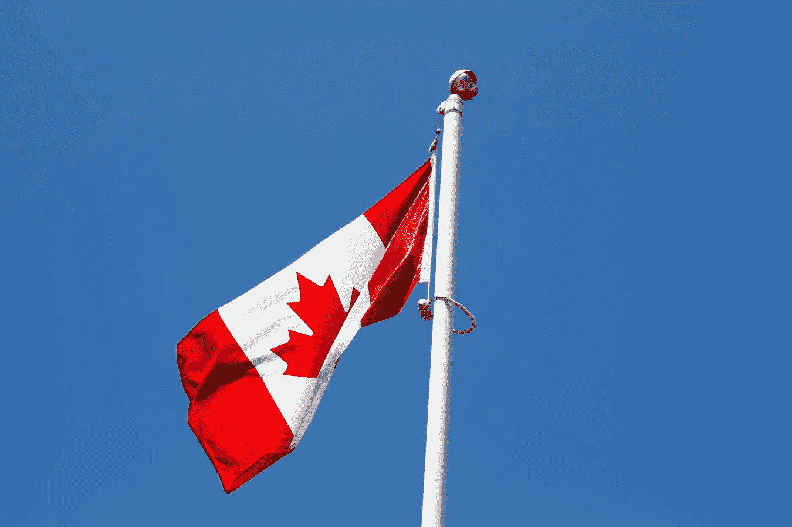
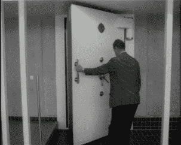

# 2018 年 6 月 2 日:神秘领域最大的故事

> 原文：<https://medium.com/hackernoon/06-02-2018-biggest-stories-in-the-cryptosphere-be42171cbed4>

**1。加拿大银行将为加密货币建造金库**

加拿大小型银行 VersaBank 正在开发一个[虚拟保险箱](https://www.bloomberg.com/news/articles/2018-02-06/a-tiny-canadian-bank-is-building-a-vault-for-crytpocurrencies?cmpid=socialflow-facebook-business&utm_content=business&utm_campaign=socialflow-organic&utm_source=facebook&utm_medium=social)，能够安全地存储加密货币等数字资产。该项目将于 6 月完成，届时来自世界各地的客户都可以使用这项服务。他们在一月份通过[新闻发布会](https://www.businesswire.com/news/home/20180123005360/en/)首次宣布了这一消息。考虑到许多银行对加密货币的敌对态度，这是一个大新闻。首席执行官大卫·泰勒说

> “大多数人真正有价值的资产都包含在某种数字格式中，无论是契约、合同还是加密货币。”

此外，曾受雇于黑莓公司的 Gurpreet Sahota 已被聘为网络安全专家。许多基金已经对这个金库表现出兴趣，尽管价格还没有确定，但它会很贵。

**2。公众仍然可以购买密码，只是不能用信用卡**

在过去的几天里，许多媒体报道银行禁止顾客用信用卡购买加密货币。截至今日，美国银行、摩根大通、花旗和 Capital One 都在名单之列。维珍货币公司和劳埃德银行集团也禁止其客户使用信用卡购买加密产品。后者拥有劳埃德银行、哈利法克斯银行、苏格兰银行和 MBNA 银行，这意味着它们都将采取同样的立场。许多人认为这一决定是因为信用卡用户害怕无力偿还贷款。然而，客户仍然可以使用其他支付方式，比如借记卡和银行转账。然而，澳大利亚的四大银行并不打算采用同样的规则。

**3。CFTC 不希望加密监管有害**

J.美国商品期货交易委员会(CFTC)主席 Christopher Giancarlo 认为，在发布加密货币法规时应该采取“无害”的方法，因为应该有一个平衡。吉安卡洛在[的书面证词](https://www.banking.senate.gov/public/_cache/files/d6c0f0b6-757d-4916-80fd-a43315228060/A2A6C1D8DDBB7AD33EBE63254D80E9E3.giancarlo-testimony-2-6-18b.pdf)中讨论了这个话题。他认为，对于监管机构来说，忽视创新不是负责任的做法。[加密货币不会因为主体忽视它而消失](https://www.coindesk.com/cftc-to-take-do-no-harm-approach-on-crypto-regulation/)。他说，类似的方法在互联网出现期间被采用，分布式账本技术应该有同样的机会蓬勃发展。董事长认为，期货交易所和期货清算所应该负责处理公众对自我认证的比特币期货产品的担忧。

**4。新加坡副总理不认为有理由禁止加密货币**

新加坡中央银行受托评估加密货币的风险。据副总理尚达曼说，还没有找到禁止这种交易的理由。副总理认为这种现象还太年轻，如果它最终成功了，其后果仍然未知。新加坡金融管理局一直在进行调查，但没有发现支持禁令的具体证据。他接着说，由于加密交易所的监管，加密货币可能都受到单一立法的约束。

> *要想在你的邮箱里收到我们的每日新闻综述，请在这里注册:*[*http://bit.ly/BlockExNewsRoundup*](http://bit.ly/BlockExNewsRoundup)