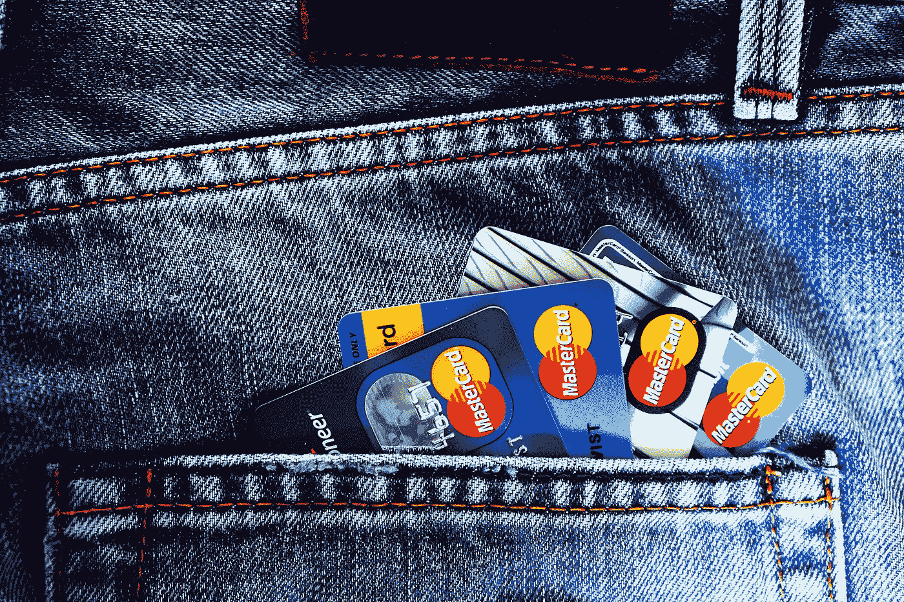

# 2018 年 6 月 4 日:神秘领域最大的故事

> 原文：<https://medium.com/hackernoon/06-04-2018-biggest-stories-in-the-cryptosphere-d1ef0847361b>

**1。SEC 主席杰伊·克莱顿对 ICOs** 有正面评价

美国证券交易委员会主席杰伊·克莱顿(Jay Clayton)在普林斯顿大学(Princeton University)举办的“加密货币和初始硬币发行”讲座上分享了对 ico 的积极评价。该机构的最高官员[已经确认并非所有的 ico 都是欺诈性的](https://www.coindesk.com/sec-chief-not-icos-bad/?utm_content=bufferff12f&utm_medium=social&utm_source=twitter.com&utm_campaign=buffer)。在这份声明发布之前，许多与会者想知道 SEC 起诉项目的决定是否意味着它对这种新的筹资方式持负面看法。相反，这位董事长辩称，证交会采取的行动实际上将帮助这个新兴行业走向成熟。他接着说，他们宁愿现在就从一开始就停止这种欺骗行为，而不是等到它成为一个成熟的行业。

**2。Monex 将购买 Coincheck 的所有股份**

昨天我们[报道了【Monex 将在周五分享其收购加密交易所 Coincheck 的更多细节。经纪公司现在已经](/swlh/05-04-2018-biggest-stories-in-the-cryptosphere-2b40a3a2302)[发布了新闻稿](http://file.swcms.net/file/monexgroup/en/news_release/auto_20180405405863/pdfFile.pdf)。根据该文件，Monex 将收购 Coincheck 的所有股份。股份收购协议已于今日签署，而收购将于 4 月 16 日实施。收购价格总计 36 亿日元(3350 万美元)，基于交易所在财年结束时(2018 年 3 月)的估计净资产。Coincheck 还[发布了一份新闻稿](http://corporate.coincheck.com/2018/04/06/51.html)，其中涵盖了此次收购背后的原因，并概述了将发生的变化。

**3。信用卡巨头新韩银行与 OmiseGo 合作**

韩国信用卡巨头新韩卡公司[与东南亚流行的在线支付平台 OmiseGo](http://pulsenews.co.kr/view.php?year=2018&no=221175) 建立了合作关系。新韩希望推出区块链支持的应用程序，如数字令牌奖励系统。OmiseGo 了解该行业，因为其开放支付平台包括来自多个国家的各种加密货币和数字货币。目前，它已经发布了由区块链技术支持的手机优惠券。通过这种合作，它希望通过扩大区块链支持的数字银行和支付服务，遵循“超连接管理”的业务战略。

**4。亚利桑那州签署关于数据的区块链法案**

亚利桑那州州长[道格·杜西签署了一项法案](https://legiscan.com/AZ/text/HB2603/id/1718691)，允许企业持有和共享区块链的数据。该法案于 4 月 3 日签署，现已成为亚利桑那州法律的一部分。之前的法案在众议院以 56 票赞成，3 票反对，1 票弃权通过。这份名为 [HB 2603 的账单是旨在帮助这些新兴技术发展的清单之一。事实上，参议院将对另外两项法案进行三读:HB 2602，该法案将阻止城镇禁止在住宅中开采加密货币 HB 2601，该法案涵盖证券和众筹。它将允许在数字交易中使用虚拟硬币作为交易媒介。我们之前也](https://cointelegraph.com/news/arizona-blockchain-bill-signed-into-state-law)[报道过](https://hackernoon.com/09-02-2018-biggest-stories-in-the-cryptosphere-87f43192308a)由于 SB 1091 法案，公民可以使用比特币纳税。

> *本新闻综合由*[*BlockEx*](http://bit.ly/BlockEx_)*为您带来。*

要想在你的邮箱里收到我们的每日新闻综述，请在这里注册:[http://bit.ly/BlockExNewsRoundup-Updates](http://bit.ly/BlockExNewsRoundup-Updates)