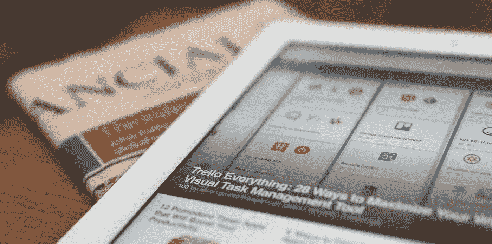
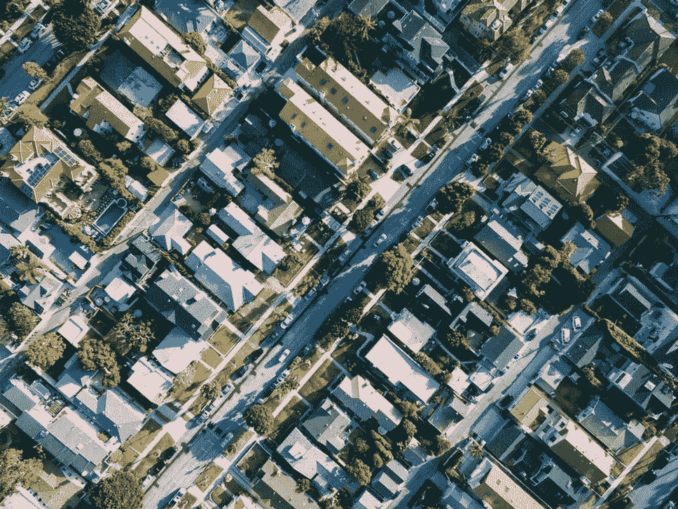

# 2018 年 6 月 6 日:神秘领域最大的故事

> 原文：<https://medium.com/hackernoon/06-06-2018-biggest-stories-in-the-cryptosphere-acf69454bd18>

通过 BlockEx

**1。金融业谴责谷歌的加密禁令**

来自金融行业的高管[谴责](https://www.ccn.com/finance-industry-slams-googles-crypto-ban-as-unethical-and-unfair/)谷歌的加密禁令，我们之前[报道过](https://hackernoon.com/23-03-2018-biggest-stories-in-the-cryptosphere-e2cdd7acd640)。紧随谷歌之后的是脸书和推特。ico 和加密货币上的广告，以及加密交易所、交易和钱包都不再被允许。这项禁令被认为是不合理的，也是不道德的。布莱克摩尔集团首席执行官菲利普·纳恩指出，谷歌和脸书都对区块链技术和加密货币表现出兴趣。我们甚至在之前的[中报道过](https://hackernoon.com/21-03-2018-biggest-stories-in-the-cryptosphere-33e9c6381cf4)Twitter 首席执行官杰克·多西称比特币将在 10 年内成为世界单一货币。此外，纳恩还补充说，其他种类的“不道德”产品仍在这些平台上做广告。

**2。南非央行成功测试区块链支付**

南非储备银行(SARB)发布了一份关于其 Khokha 项目的[报告，探索成功的测试。这个消息是通过发布一份声明宣布的。Khokha 项目背后的想法是使用概念验证来重建一个基于 DLT 的批发支付系统。这将使参与者获得实践经验，然后他们将在现实生活中运用这些经验。在试用期间，支付系统的处理时间从通常的两个小时减少到两秒钟。然而，报告指出，在考虑正式替换之前，仍有许多问题需要解决。早在二月份，SARB 就宣布启动这个项目。](https://www.resbank.co.za/Lists/News%20and%20Publications/Attachments/8491/SARB_ProjectKhokha%2020180605.pdf)

**3。Crypto Startup Circle 想成为美国持牌银行**

高盛支持的加密初创公司 Circle 对成为美国持牌银行感兴趣。为了增加所提供服务的数量，这家初创公司正在申请联邦银行牌照。此外，作为经纪和交易场所的注册也在讨论之中。如果得到美国证券交易委员会(SEC)的批准，符合证券描述的代币将可以在其平台上交易。在 SEC 的注册将优先于银行执照。由于这一举措，Circle 将减少对传统持有者的依赖。

**4。纽约州将试行本地加密货币？这是一个纽约议员想要的**

纽约州议员罗恩·金呼吁[纽约州试行加密货币](https://www.coindesk.com/lawmaker-wants-new-york-state-to-pilot-local-cryptocurrencies/)，试图帮助当地社区。如果第 A11018 号法案通过，当地社区货币将通过 10 个试点项目发行。这些货币可能是加密货币或其他数字形式的货币。基于邻里的生态系统将整体受益，因为顾客将被鼓励在当地购物。金说，就业增长将会受益，这将对各个社区产生长期的社会影响。

> 本新闻综合报道由 [BlockEx](http://bit.ly/BlockEx_) 为您带来。

> *要想在你的邮箱里收到我们的每日新闻综述，请在这里注册:*[*http://bit.ly/BlockExNewsAndUpdates*](http://bit.ly/BlockExNewsAndUpdates)