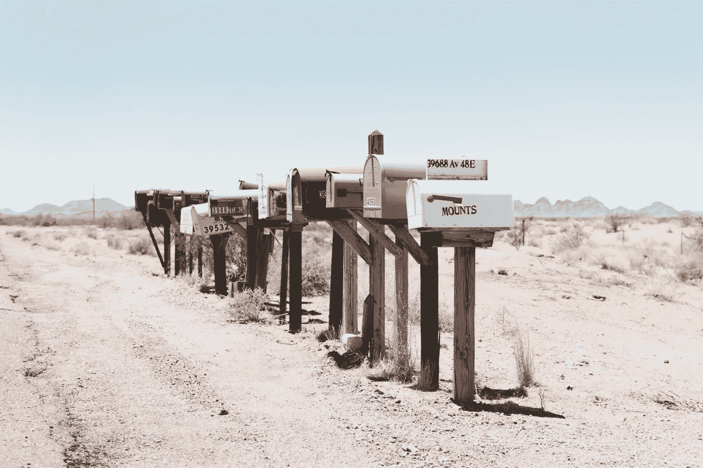
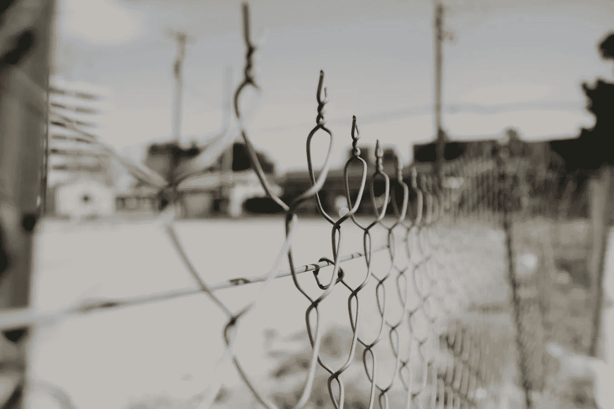

# 2018 年 6 月 9 日:神秘领域最大的故事

> 原文：<https://medium.com/hackernoon/06-09-2018-biggest-stories-in-the-cryptosphere-abd1740f0b69>

通过 BlockEx

**1。欧盟应该有一套标准化的密码规则吗？**

比利时智库 Bruegel [在一份为欧盟财政部长准备的报告中建议欧盟在所有成员国之间采用标准化的加密货币监管框架。这些规定将适用于加密交易所和 ico，该智库认为，这两个领域缺乏监管清晰度。这将允许每个国家充分利用加密和区块链的潜力，同时管理风险。该报告还没有公布，随后将在](https://www.reuters.com/article/us-eu-regulation-crypto/eu-should-adopt-common-cryptocurrency-rules-report-for-ministers-says-idUSKCN1LL1OZ)[召开经济和财政部长非正式会议](https://www.eu2018.at/calendar-events/political-events/BMF-2018-09-07-Informal-Ecofin.html)。该文件将在 9 月 7 日和 8 日于维也纳召开的会议上共享。我们之前[讨论过](/@BlockEx/30-08-2018-biggest-stories-in-the-cryptosphere-a04372659afa)本次活动期间将讨论的主要主题的草案。

**2。两位著名的密码专家称，美国在区块链方面落后了**

在 TechCrunch 扰乱旧金山期间，Ripple 首席执行官布拉德·加林豪斯和 TechCrunch 创始人迈克尔·阿灵顿[证实，美国在加密法规方面缺乏行动，导致该国在区块链和技术未来方面落后](https://techcrunch.com/2018/09/05/the-us-is-losing-out-to-the-rest-of-the-world-on-blockchain-warn-major-crypto-figures/)。而脸书、IBM 和 Twitter 等巨头正在关注区块链，看他们如何利用新技术；大多数目前正在启动的创业公司都位于美国以外。阿林顿接着说，尽管一些投资在美国，但 80-90%在亚洲、欧洲和以色列。除了缺乏监管透明度，他还提到了税收和签证程序。最后，他呼吁 SEC 加强监管，这一观点得到了加林豪斯的赞同。首席执行官还提到需要一个监管机构。两人还将新兴技术与几十年前互联网的出现进行了比较。

**3。韩国投资者希望高盛解释加密**

韩国邮政，韩国国家邮政服务，[想了解更多关于 crypto](https://www.bloomberg.com/news/articles/2018-09-05/a-112-billion-money-manager-asks-goldman-for-lessons-in-crypto) 的知识。公司总裁 Kang Seong-ju 透露，加密货币是他与高盛的首席运营官和即将成为首席执行官的 David Solomon 会面时讨论的话题。本月底，韩国邮政将与这家金融服务公司的加密研究团队在香港会面，研究数字资产以及区块链和人工智能等新技术。尽管这家韩国公司对投资该领域没有兴趣，但公众对其日益增长的欢迎程度促使他们调查这些技术的优势和风险。另一方面，高盛任命了一位数字资产市场的主管，正如我们[昨天](https://blog.goodaudience.com/05-09-2018-biggest-stories-in-the-cryptosphere-958aa8d9cc41)报道的，高盛正计划为加密基金提供托管服务。

**4。区块链被用来跟踪假释罪犯**

中国中山市决定利用区块链网络追踪假释中的罪犯。当地一家新闻媒体今天宣布了这项倡议。这个基于区块链的系统是由当地司法部门推出的。用这种方法监视前科犯的活动，将提高整个系统的效率。对劳动力的需求也会减少。区块链网络已经在社区服务中心铺开。在这里，假释犯在报到时需要执行日常职责。关于每个受试者活动的数据将随时可用。作为一个区块链支持的平台，社区矫正工作人员和相关执法机构可以获得这些数据。

> 本新闻综合报道由 [BlockEx](http://bit.ly/BlockEx_) 为您带来。

> *要想在你的邮箱里收到我们的每日新闻综述，请在这里注册:*[*http://bit.ly/BlockExNewsAndUpdates*](http://bit.ly/BlockExNewsAndUpdates)