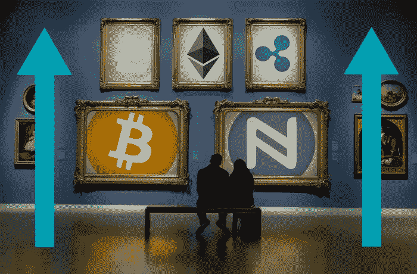

# 2018 年 7 月 2 日:神秘领域最大的故事

> 原文：<https://medium.com/hackernoon/07-02-2018-biggest-stories-in-the-cryptosphere-bb770173b634>

**1。加密货币终于再次崛起**

经过数周的下跌，一些人声称比特币泡沫已经破裂，[加密货币终于重新夺回了自己的地位](https://www.coindesk.com/bitcoin-jumps-over-20-percent-as-crypto-markets-regain-poise/)。今天早些时候，十大加密货币都有两位数的涨幅。当天晚些时候，前 100 名选手都设法让[处于绿色状态](https://cointelegraph.com/news/crypto-market-rebound-btc-back-over-8k-top-100-coins-in-the-green)。总市值上升至 3520 亿美元，增长 25%。考虑到昨天的低点是 2760 亿美元，这是相当可观的。然而，与上周的 5000 亿美元和 1 月份的 8300 亿美元相比，这些数字仍有所下降。关注[比特币](http://www.independent.co.uk/life-style/gadgets-and-tech/news/bitcoin-price-live-updates-latest-value-exchange-rate-digital-cryptocurrency-futures-investment-a8196566.html)，尽管相比上周下跌了 20%，但相比一年前仍上涨了 655%。加密货币市场非常不稳定，但硬币的多样性可能有助于稳定市场。

**2。日本桃航:仍在开发中的比特币支付系统**

日本最大的廉价航空公司桃航[向公众](https://cointelegraph.com/news/japanese-airline-confirms-future-btc-payment-option-in-the-works)保证，比特币支付系统仍在开发中。许多人担心项目延期后会宣布取消。这项服务于去年五月首次发布，加密交换公司 BITPoint Japan 是其合作伙伴。此外，日本承认比特币为合法支付手段，这意味着该公司将能够计划在该国机场周围建立自动取款机。许多人担心对该国最大的密码交易所的攻击将意味着计划将被取消。然而，该公司称价格波动是延误的原因。

**3。中国支付提供商加入 Ripple**

Ripple 刚刚在其网站上宣布，中国支付提供商连连国际已经加入 RippleNet。它的作用是作为一个第三方支付工具，客户可以使用它在网上购物。中国在线零售业目前正稳步增长，2017 年达到 6720 亿美元。中国是全球 1.32 万亿美元市场规模的最大贡献者(2018 年预测)。该公司将使用 RippleNet 作为其支付服务，Ripple net 是由 Ripple 的区块链技术支持的支付网络。连连的首席执行官亚瑟朱[说](https://www.coindesk.com/chinas-payment-firm-eyes-blockchain-for-overseas-transaction/?utm_content=buffer4bc37&utm_medium=social&utm_source=twitter.com&utm_campaign=buffer)[xCurrent](https://ripple.com/solutions/process-payments/)将使他们能够改善客户体验并减少支付交易次数。

**4。台湾副总理:政府不应错误估计加密货币的影响**

台湾副总理施俊吉发布了一份报告，呼吁政府不要错误估计加密货币对国家的金融影响。在这篇文章中，讨论了加密货币在台湾日益流行的问题。Jun-ji 呼吁政府对这一现象进行评估，并做出监管回应。副总理做了[对比](https://www.ccn.com/govt-plan-safeguards-cryptocurrency-impact-taiwan-official/)来量化加密货币的总规模。在某一时刻，比特币市值达到 1700 亿美元(交易价格为 1 万美元)。这几乎相当于台湾所有银行的总资产，是政府财政预算的两倍。

> 要想在你的邮箱里收到我们的每日新闻综述，请在这里注册:[http://bit.ly/BlockExNewsRoundup](http://bit.ly/BlockExNewsRoundup)