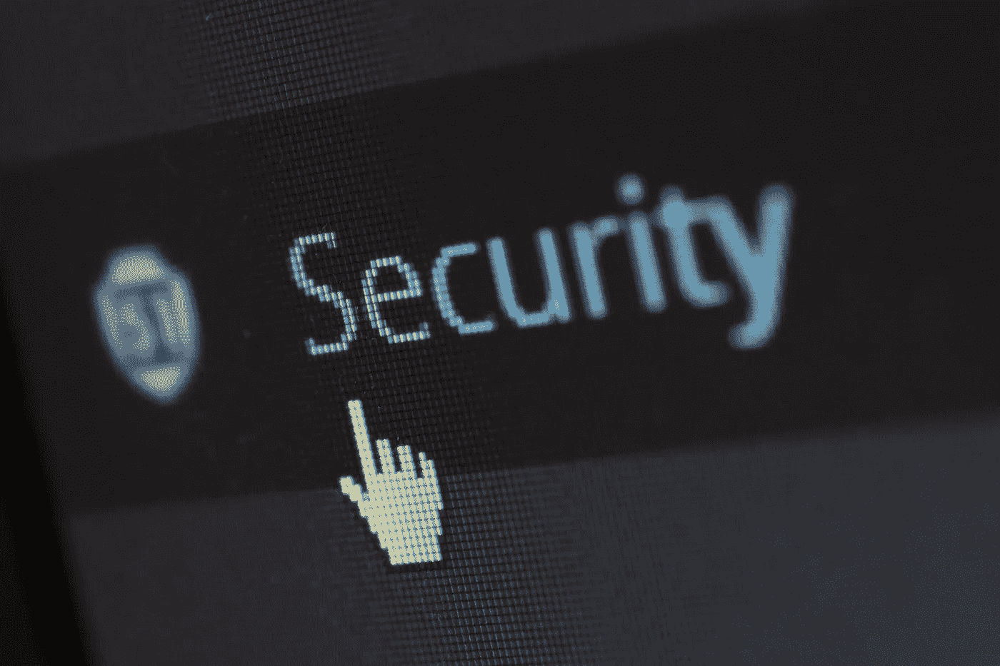

# 2018 年 7 月 3 日:神秘领域最大的故事

> 原文：<https://medium.com/hackernoon/07-03-2018-biggest-stories-in-the-cryptosphere-e4608e633053>

**1。富士通开发技术应对智能合同风险**

IT 巨头富士通[在其网站上宣布](http://www.fujitsu.com/global/about/resources/news/press-releases/2018/0307-01.html)目前正在研究一种技术，以应对在处理[智能合同](https://www.investopedia.com/terms/s/smart-contracts.asp)时可能出现的风险，以及在源代码中建立位置。这将通过使用能够识别以太坊交易序列中存在的风险的算法来实现。由于这个由富士通实验室和富士通研发中心联合进行的项目，现在有可能识别所有六种类型的风险。以前，“认证交易调用的来源”并不总是可能的，特别是因为智能合约通常在多个位置之间共享。“交易内部信息”很难被发现。检测率现在已经从 67%上升到 100%，准确率高达 88%。

**2。华为申请专利利用区块链进行知识产权保护**

中国跨国公司华为已经向国家知识产权局申请了一项专利，将区块链的技术用于保护知识产权。在这种情况下，区块链将启动一个对等内容分发网络，在该网络上添加一个验证组件。这将确保请求下载的实体拥有批准请求所必需的私钥或许可证。所需信息将全部存储在区块链上。还不知道专利申请是否会被接受。然而，必须指出的是，这并不是该公司第一次对区块链技术表现出兴趣。事实上，该公司此前已经加入了 [Hyperledger 区块链项目](https://www.hyperledger.org/about)。

**3。参议院通过法案——代币可以免除怀俄明州的安全条例**

3 月 6 日星期二，怀俄明州参议院通过了众议院第 70 号法案。特定的[代币现在将被豁免](https://cointelegraph.com/news/wyoming-bill-passes-in-state-senate-aims-to-exempt-tokens-from-security-regulations)于‘证券条例和货币传输法’之外。为了获得免税资格，代币不能作为投资出售，而是作为消费用途提供。此外，二级市场上的价格操纵不会发生。然而，这并不是参议院中提出的唯一一个此类法案。我们之前[报道过](https://hackernoon.com/20-02-2018-biggest-stories-in-the-cryptosphere-100cd402b7d8)参议院 111 号法案，该法案以 30 票中的 26 票通过。该法案要求对加密货币免除财产税。

**4。委内瑞拉石油被宣布为非法**

根据国内法，委内瑞拉国家加密货币的发行被宣布为非法。这个决定是由国家议会做出的，国家议会是该国两个对立的立法机构之一。该组织接着称该项目是一个骗局，对感兴趣的投资者来说也是一个风险。[此外](https://www.coindesk.com/venezuelas-national-assembly-declares-petro-cryptocurrency-illegal/)，有人声称企业必须接受加密货币，这是反对派认为违宪的另一个方面。拉斐尔·古兹曼(Rafael Guzman)等代表人物认为，Petro 将会恶化这个国家的现状。然而，全国制宪会议等机构认为这一倡议是对强加的国际制裁的反叛行为。

> 要想在你的邮箱里收到我们的每日新闻综述，请在这里注册:[http://bit.ly/BlockExNewsRoundup](http://bit.ly/BlockExNewsRoundup)