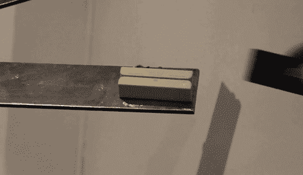

# 2018 年 8 月 2 日:神秘领域最大的故事

> 原文：<https://medium.com/hackernoon/08-02-2018-biggest-stories-in-the-cryptosphere-81d7758e498a>

**1。欧洲央行行长:银行有可能很快持有比特币**

欧洲中央银行(ECB)行长马里奥·德拉吉[在欧洲议会会议](https://www.ecb.europa.eu/press/key/date/2018/html/ecb.sp180205.en.html)上表示，欧洲银行有可能[在未来持有比特币头寸](https://ibsintelligence.com/ibs-journal/ibs-news/ecb-keep-eye-cryptocurrency-predicts-buy-banks/)。在这种情况下，欧洲央行将密切关注。根据德拉吉的说法，银行最初并没有对加密货币表现出任何兴趣。然而，美国交易所上市比特币期货合约等变化开创了一个先例，这种情况可能很快就会改变。此外，德拉吉还[暗示](https://www.ccn.com/european-banks-soon-hold-bitcoin-admits-ecb-president/)一个即将到来的“单一监管机制”,该机制将被启动，以检查受监管机构或银行可能因数字资产而面临的风险。

**2。比特币现金增长领先**

前 10 大加密货币又回到了[增长](https://www.coindesk.com/bitcoin-cash-outpaces-crypto-market-consolidation-with-20-spike/?utm_content=buffer3db0c&utm_medium=social&utm_source=twitter.com&utm_campaign=buffer)，比特币现金(BCH)在百分比方面领先。在格林威治时间下午早些时候，该指数在 24 小时内上涨了 19%。按市值计算，BCH 是第四大加密货币，但仍设法超过第一大加密货币比特币。与 48 小时前相比，总市值上升了 40%。此外，高盛投资研究主管史蒂夫·斯特朗金(Steve Strongin)对整体增长趋势发表了评论。正如我们昨天报道的，前 100 种加密货币都是绿色的。斯特朗金觉得奇怪的是，新硬币不会使以前的硬币贬值，反而会随着它们一起升值。

**3。印度的加密职位空缺增长了 290%**

我们之前[报道过](https://hackernoon.com/01-02-2018-biggest-stories-in-the-cryptosphere-549958230499)关于印度将禁止加密货币的担忧，后来被证明是没有根据的。尽管如此，印度密码市场似乎正稳步上升(T2)。求职网站 India India 现在透露，加密职位空缺增长了 290%。此外，52%以上的求职者在找工作时使用与区块链相关的词汇。该公司的董事总经理萨希·库马尔[承认](https://news.bitcoin.com/more-crypto-jobs-in-india-despite-delhis-stance-on-bitcoin/)这个行业仍然相对较小，但相信到 2022 年它会达到 77 亿美元。考虑到比特币交易总量的 10%来自印度，这似乎是一个合理的预测。最后，一项调查显示印度人比英国人和美国人更看好加密货币。

**4。巴克莱银行仍然允许用信用卡购买密码**

我们之前[报道过](https://hackernoon.com/06-02-2018-biggest-stories-in-the-cryptosphere-be42171cbed4)许多银行禁止客户使用信用卡购买加密货币。美国银行、摩根大通、花旗、第一资本、劳埃德银行集团和维珍货币都在名单中。然而，“四大”英国银行集团巴克莱向其客户保证，他们仍将被允许使用信用卡进行这种类型的购买。该银行将密切关注交易，以防止和标记可疑交易，但不会发布禁令。

> *要想在你的邮箱里收到我们的每日新闻综述，请在这里注册:*[*http://bit.ly/BlockExNewsRoundup*](http://bit.ly/BlockExNewsRoundup)