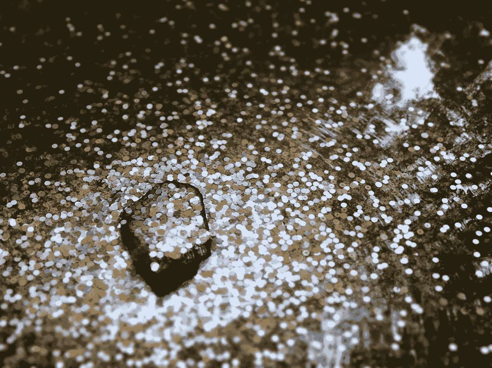
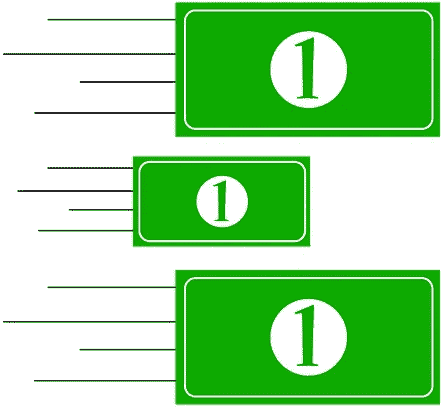
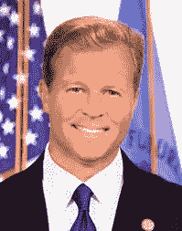

# 2018 年 8 月 3 日:神秘领域最大的故事

> 原文：<https://medium.com/hackernoon/08-03-2018-biggest-stories-in-the-cryptosphere-1ecaba597ebf>

**1。加密交易所 Coincheck 补偿先前黑客攻击的受害者**

总部设在东京的加密交易所 Coincheck 称[将赔偿](https://www.bloomberg.com/news/articles/2018-03-08/coincheck-to-start-paying-back-victims-of-500-million-heist)名黑客受害者。1 月 26 日星期一，260，000 名用户的 NEM 硬币被盗。他们现在可以期待下周收到赔偿，按照袭击后记录的兑换率(每张代币 0.81 美元)。据首席执行官和田幸一郎称，用于补偿的资金是通过差价交易获得的。和田和首席运营官大冢洋介还补充说，更多的信息将在未来几天提供。该交易所还加强了安全措施。必须指出的是，这一事件影响了 NEM 的价格，在黑客攻击后跌至 30 美分。然而，Coincheck 最近的公告帮助加密货币增长了 7%。

**2。SWIFT 成功实施区块链银行间试点**

环球银行间金融电信协会(SWIFT)与其他 34 家全球交易银行联合发布了一份报告，内容涉及分布式分类账技术(DLT)概念验证(PoC)如何有利于 Nostro 账户(一家银行在另一家银行持有的外币账户)的识别。PoC 是基于[Hyperledger Fabric 1.0 版的](https://www.finextra.com/newsarticle/31787/adoption-of-dlt-presents-significant-operational-challenges-for-swift-member-banks)。这一试点被认为是成功的，涉及到 Nostro 账户持有人与他们的服务人员分享记录在分类账中的机密交易。然而，尽管在测试期间取得了积极的结果，但也有人指出，DLT 需要进一步改进，概念验证也需要重新设计，以使其采用可行。

**3。CFTC 专员呼吁加密自律**

商品期货交易委员会(CFTC)专员 Brian quintez[在 2 月 7 日星期三举行的雅虎金融全市场峰会上讨论了加密货币和监管](https://finance.yahoo.com/news/regulate-top-u-s-official-tells-crypto-companies-211659905.html)。这位美国专员表示，加密货币行业应该建立一个自律组织(SRO)，而不是等待政府干预。同一天，当美国消费者新闻与商业频道在[收市时接受采访时，他接着说，监管将增加这个行业的可信度，这是它的参与者所希望的。他指出，证券交易委员会今天早些时候宣布，现在将要求数字资产交易平台向他们注册。然而，他认为这一举措本身是不够的。即使有政府监管，专员仍然认为应该有自律组织。](https://www.cnbc.com/2018/03/07/regulation-can-add-to-credibility-cftc-commissioner.html?__source=Facebook%7Ccrypto)

**4。塞拉利昂举行区块链驱动的首次总统选举**

位于西非的塞拉里昂举行了第一次由区块链资助的总统选举。区块链投票创业公司 Agora 使用 DLT 跟踪了整个过程。结果由私人授权的区块链实时监控。这些数据随后被传递给具有适当权限级别的个人，以确保这个过程是民主的。其他国家已经与 Agora 取得联系，使用他们的服务进行选举。Agora 的首席运营官·贾龙·卢卡舍维奇分享了他的热情，这对担心选举舞弊的国家来说意味着什么。此外，他还讨论了对于一些人来说，塞拉里昂是第一个拥有区块链投票的国家这一事实可能会感到惊讶。还讨论了该程序如何仍有改进的余地，例如，在区块链选票是人工插入的。

> 要想在你的邮箱里收到我们的每日新闻综述，请在这里注册:[*http://bit.ly/BlockExNewsRoundup*](http://bit.ly/BlockExNewsRoundup)