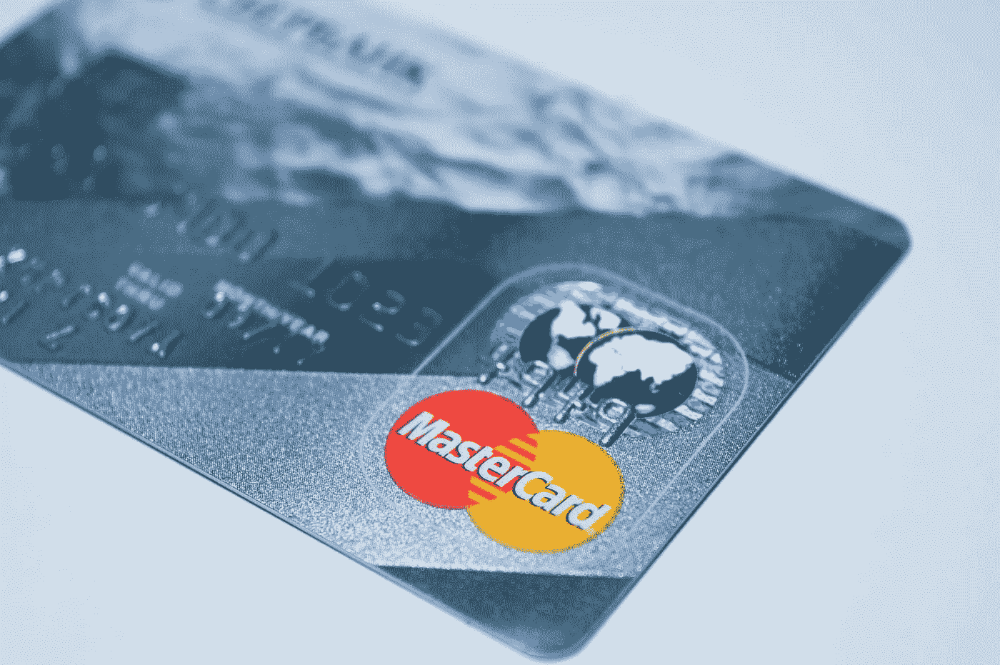

# 2018 年 8 月 6 日:神秘领域最大的故事

> 原文：<https://medium.com/hackernoon/08-06-2018-biggest-stories-in-the-cryptosphere-9aba9ff870c>

通过 BlockEx

**1。万事达卡将为其信用卡使用公共区块链**

万事达卡已经向美国专利商标局(USPTO)申请了一项[专利](http://appft.uspto.gov/netacgi/nph-Parser?Sect1=PTO2&Sect2=HITOFF&u=%2Fnetahtml%2FPTO%2Fsearch-adv.html&r=1&p=1&f=G&l=50&d=PG01&S1=20180158051.PGNR.&OS=dn/20180158051&RS=DN/20180158051)，以便[建立一个公共区块链来认证在销售点使用他们的信用卡进行的支付](https://www.coindesk.com/mastercard-patent-would-put-credit-cards-on-a-public-blockchain/?utm_content=buffer56f69&utm_medium=social&utm_source=twitter.com&utm_campaign=buffer)。用户的支付凭证将通过任何人都可以访问的区块链平台得到证实。两种方法的系统将与销售点设备相结合，以获得完全安全的交易。据估计，卡提供商每年因盗卡损失 20 亿美元。这项专利可能是这个问题的答案。

**2。韩国最大的加密交易所被政府批准**

韩国最大的加密交易所 Bithumb 已经被当地政府清除了任何非法活动。金融当局和国家税务局(NTS)一致认为，该交易所没有逃税或可疑活动。政府机构在得出这一结论之前对交易所进行了数月的调查。这对于加密行业来说将是一种解脱，因为许多人认为政府试图用 Bithumb 来给在这个国家运营的其他公司树立一个榜样。

**3。两名律师表示，美国大学正在投资加密货币**

资本基金法律集团创始人 John Lore】表示越来越多的美国[大学已经开始投资比特币和以太坊等加密货币](https://www.ccn.com/universities-have-started-to-invest-in-bitcoin-start-of-institutional-adoption/)。由于律师-客户特权，这些机构没有透露，但注意到金额仍然有限。大学管理着大量资金，不倾向于进行高风险投资。一些机构投资加密货币的事实意味着，这种新兴技术被视为一种足够稳定的投资资产。

**4。加密采矿的高需求导致魁北克阻止请求**

魁北克政府不得不停止接受秘密矿工对水力发电的新请求，因为高需求导致人们担心魁北克水电公司可能无法为每个人提供足够的能源。此前，魁北克水电公司表示，需求超过了该公司的中短期产能。众所周知，区块链工业对魁北克水电公司来说是一个巨大的商机。事实上，在这一暂停期间，该公司希望找到一种可持续的方式来继续为加密矿工和居民提供服务。

> 本新闻综合报道由 [BlockEx](http://bit.ly/BlockEx_) 为您带来。

> *要想在你的邮箱里收到我们的每日新闻综述，请在这里注册:*[*http://bit.ly/BlockExNewsAndUpdates*](http://bit.ly/BlockExNewsAndUpdates)