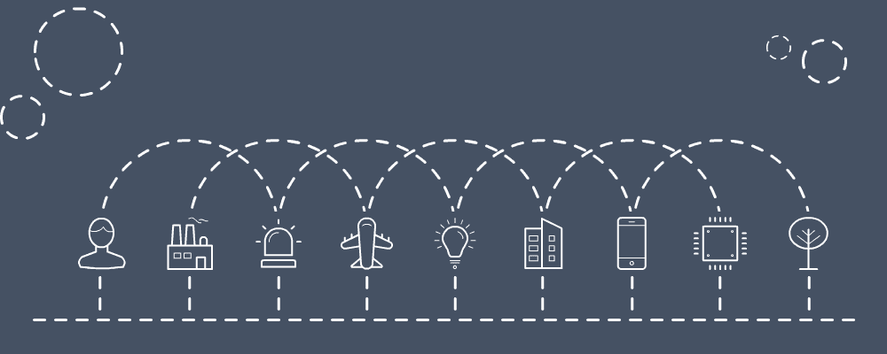

# 2018 年 9 月 2 日:神秘领域最大的故事

> 原文：<https://medium.com/hackernoon/09-02-2018-biggest-stories-in-the-cryptosphere-87f43192308a>

**1。台北确认对 ID** 进行 IOTA 技术测试

之前[曾报道](https://cointelegraph.com/news/taipei-partners-with-iota-to-become-a-blockchain-powered-smart-city)台北市已经与 IOTA 建立了合作伙伴关系，使用区块链的技术，目的是将自己变成一个智能城市。IOTA 是面向物联网(IoT)的 Tangle 技术背后的平台。T4 已经证实将会把这项技术专门用于其公民身份识别系统。这一消息是由信息技术专员李伟斌宣布的。该项目名为数字公民卡，不仅将与 IOTA 合作实施，还将与当地初创公司 BiiLabs 合作实施。IOTA 的 Tangle ID 服务将在未来用于其他几个项目，旨在保护人们免遭身份盗窃。

**2。华盛顿特区有四套豪华公寓，你可以用比特币购买**

[位于 Girard ST . NW 1471 号的四套公寓](https://www.washingtonpost.com/news/where-we-live/wp/2018/02/07/four-condos-in-northwest-washington-list-for-569000-to-949000-and-bitcoin/?utm_term=.83f8dc06b953)以前是一栋独栋住宅，目前正在出售，可以选择使用比特币作为支付方式。[据住宅经纪公司 Venditti 称，这是该地区第一个此类房源。这两套一居室公寓在 BTC 的售价为 56.9 万美元，在 BTC 的售价为 66.5 万美元。这套两居室的标价为 67.7 万美元/60 BTC。最后，这套两居室顶层公寓售价为 94.9 万美元/84 BTC。潜在买家首先需要获得批准，以获得可能的额外融资。此外，双方同意考虑到在要约被接受之日和交易发生之日之间，比特币的价格可能会发生变化。](https://www.ccn.com/washington-d-c-gets-its-first-bitcoin-condo-listings/)

**3。想用比特币缴税？也许在亚利桑那州！**

目前，亚利桑那州正在考虑多项法案，其中一项将允许公民用比特币缴税。美国亚利桑那州将是第一个允许这样做的州。另一项法案也呼吁将加密货币视为货币，而非商品。州代表杰夫·韦宁格[肯定了](https://www.newsbtc.com/2018/02/08/arizona-may-become-first-state-accept-bitcoin-tax-bill/)这些法案是该州未来在加密货币和区块链方面的重要性的标志。然而，亚利桑那州参议院少数党领袖史蒂夫·法利是反对这一想法的声音之一。使用的论点是，如果比特币失败，纳税人的钱将面临风险。法利认为美元应该足够了，并指出加密货币的波动性。

**4。美国政客接受史上最大比特币捐赠**

现任密苏里州共和党候选人、前自由主义者奥斯汀·彼得森收到了美国政治家接受的最大一笔比特币捐赠。相当于 0.284 BTC，在收到时的价值为 4 500 美元。彼得森总共收到了 24 枚比特币的捐赠。然而，这并不是加密货币第一次被用于竞选捐款。事实上，共和党政治家兰德·保罗在 2016 年总统竞选期间也接受了比特币。[第一个接受这种支付方式的人物](http://time.com/93765/jared-polis-bitcoin/)实际上是 2014 年国会竞选期间的民主党政治家 Jared Polis。联邦选举委员会甚至建立了一套指导方针。

> 要想在你的邮箱里收到我们的每日新闻综述，请在这里注册:[http://bit.ly/BlockExNewsRoundup](http://bit.ly/BlockExNewsRoundup)