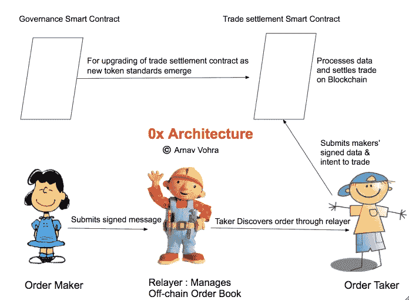
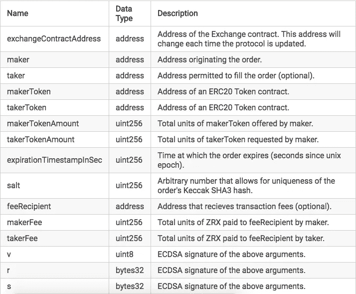

# 0x (ZRX)分析:以太坊上的分散式交换协议

> 原文：<https://medium.com/hackernoon/0x-zrx-in-depth-project-analysis-e8d8c46f3146>

Explanation Below!

# (I)为什么是分散式交易所？

**1。集中交易所:**

a)因单点故障而遭受黑客攻击的风险，从而导致数百万美元的损失。

b)由于法律责任而导致关闭的风险。
这些交易所必须遵循该国的法律，它们的长期运作取决于它们所立足的国家。例证:目前在我的祖国印度，交易员们面临着风险，即在印度央行下令银行停止支持加密货币交易所后，交易所随时可能停止运营。

基本上，这些都存在所有集中式服务都存在的问题。

**2。分散的交易所:**

a)您的加密/数字资产的保管仍由个人控制，从而消除了资金损失的风险。
b)不信任:你只需要信任开源的智能合约代码，从而确保没有人得到优惠待遇。

理论上，分散的交易所可能比集中的交易所更好，那么与集中的交易所相比，分散的交易所缺少哪些特征呢？

1.  用户友好型:目前大多数分散式交易所都受到一些基本功能的困扰，比如用户界面不好，尽管随着时间的推移，它们正在变得越来越好。
2.  **流动性**:目前，没有太多的买家&卖家，因此缺乏流动性，每当有大量的买卖订单时，就会导致巨大的价格波动。尽管如此，随着越来越多的人开始在分散的交易所交易，流动性问题将会得到解决。
3.  **交易费**:大部分去中心化的交易所都是建立在以太坊之上的。
    交易费对应以太坊气费，可观。
4.  **仅支持 ERC20 令牌**:建立在以太坊之上的分散式交易所仅支持 ETH & ERC20 令牌交易。对其他加密的支持将在跨链原子交换成为主流后得到修正。

**一些突出的分散交换项目:**

1.  [凯伯网](https://kyber.network/)
2.  [Bancor 网络](https://www.bancor.network/)
3.  [Airswap](https://www.airswap.io/)
4.  [以太三角洲](https://etherdelta.com/)
5.  [IDEX](https://idex.market/)
6.  [恒星术语](https://stellarterm.com/)

# ㈡0x 小组

## 创始人:

1.威尔·沃伦(首席执行官) :加州大学圣迭戈分校机械工程学士

2. [Amir Bandeali](https://www.linkedin.com/in/abandeali1/) (首席技术官) :理学学士。金融(辅修计算机科学)UIUC——尽管是一名交易员，但他也在业余时间积累了 CS 技能

## 顾问:

**3 名比特币基地校友** —弗雷德·厄尔萨姆(联合创始人比特币基地)、奥拉夫·卡尔森-威(比特币基地第一名员工；创始人保利链资本)，琳达谢(前总理；联合创始人标量资本)。
乔伊·克鲁格(创始人奥格，潘迪拉联席首席信息官)

完整团队:[此处](https://0xproject.com/about)

# (三)0x 架构:

建筑的直观解释: [**此处**](https://www.youtube.com/watch?v=MfGZk0z6i90)

0x 是一个协议，即它是公共基础设施，任何人都可以在它的基础上创建一个营利性企业(中继)。该团队决定避免建造一个有围墙的花园，而大多数模型都是这样做的。

该团队私下筹集的资金只够支付法律费用，并在不考虑商业模式的情况下生存下来。

从某种意义上来说，这是在解决一个公共产品问题(为各种 dapps 提供流动性)，ICO 模型通过为他们提供生存资金、建立团队以及如果他们的项目成功并且他们的代币价格上涨，他们在财务上受益，从而帮助团队实现这一目标！

在其核心，0x 协议是一种**消息格式**:

每个订单都是包含订单参数和相关签名的数据包。订单参数通过 Keccak SHA3 函数连接并散列为 32 字节。订单发起者用他们的私钥签署订单散列以产生 ECDSA 签名。

0x message format

您通过在信息中指定**参数**来指定您的交易意向，如下所示:

1.  你正在交换的代币
2.  汇率
3.  你愿意进入交易的时间(到期时间)
4.  makerFee，takerFee-由制造商和 taker 分别支付给 feeRecipient(Relayer)的 ZRX 的总单位。

0x Architecture- OffChain Order Book, OnChain Settlement

上图代表 0x 架构，解释如下:

我们在交易中有三方:继电器，制造商，接受者:

1.  **Relayer(列表如下)**以应用程序或网站的形式构建 UI，并维护离线订单簿。我们假设中继站有一个类似于 [**雷达中继**](https://app.radarrelay.com/) **的网站。**
2.  订单生成者报出他的交易价格和消息格式的其他参数。他在消息上签名，从而在网站上推送订单(订单簿)。
3.  订单接受者在网站(订单簿)上看到制造商的订单，并提交购买订单。通过这样做，他正在通过**贸易结算合同向区块链提交交易。**
    他需要支付汽油费(ETH)和加油费(ZRX token)。
4.  **交易结算合同**处理**接受方**发送给它的数据，并据此在区块链上结算交易。
5.  随着新令牌标准的出现，**治理契约**用于升级**贸易结算契约**。

注意:0x 团队仅维护贸易结算和治理智能合同。0x 的目标是通过令牌投票来升级合同。该团队正在彻底研究治理(关于与 Aragon 团队合作的传言)，包括像流动民主这样的事情，令牌持有者可以将投票权委托给他们认为有能力代表他们投票的人。

# (四)转播商的角色和商业模式:

Relayers 主持一个离线订单簿(大幅降低交易费用)，并以他们认为合适的方式向公众广播，例如:移动应用程序、网站。

B- Model : Relayers 可以通过多种方式赚钱，例如:收取交易费、在网站上做广告等。

**要了解中继员是什么样子，肯定要看一下** [**雷达中继**](https://app.radarrelay.com/) **。**

将使用(或正在使用)0x 协议的中继列表:

1.  [阿玛迪斯](http://amadeusrelay.org)
2.  [DDEX](https://ddex.io/)
3.  [右旋](https://www.dextroid.io/)
4.  [ERC 德克斯](http://ercdex.com)
5.  [Ethfinex](https://www.ethfinex.com/)
6.  [IDT 交易所](https://www.idtexchange.com/)
7.  [MobiDex](http://mobidex.io)
8.  [打开继电器](https://openrelay.xyz)
9.  [Paradex](https://paradex.io/)
10.  [**雷达雷**](https://radarrelay.com/)
11.  [SharkRelay](https://app.sharkrelay.com/)
12.  [海洋](https://the0cean.com)
13.  [令牌罐](https://tokenjar.io/)
14.  [托肯龙](https://tokenlon.token.im/)

# (V)为什么 0x 会起作用？：

在接下来的几年里，将会有无限多的代币。
一个单一的中继器无法列出其平台上的所有令牌。

将有少数继电器会主导市场，但他们将无法研究和列出所有的代币，因为纯粹的代币量。
因此，将会有数百个转播商迎合某个特定的细分市场，例如:房地产转播商将会非常不同于预测市场转播商。

0x 将允许所有这些中继器建立在其协议之上，从而为数千甚至数百万令牌提供流动性。

# (六)0x 令牌的演变:

0x 是一个治理令牌，它允许随着时间的推移升级 0x smart 合同，而不会导致所有市场停止运行。

它还用于向中继支付交易费用，这一功能确保生态系统中的所有利益相关者都有一定数量的 0x 令牌，并被推动参与治理流程。

[0x 令牌 Coinmarketcap](https://coinmarketcap.com/currencies/0x/)

# 资源

[0x 网站](https://0xproject.com/)

[0x 合同](https://0xproject.com/docs/contracts)

[0x 白皮书](https://0xproject.com/pdfs/0x_white_paper.pdf)

[0x 常见问题解答](https://0xproject.com/faq)

## ***社交:***

[0x 聊天](https://chat.0xproject.com/)

[0x 推特](https://twitter.com/0xproject)

[0x Reddit](https://reddit.com/r/0xproject)

给我一些掌声来表达我的爱吧！此外，我还经营着一个区块链 youtube 频道，我在其中制作教育内容，并采访该领域的创始人。

频道链接:[https://www.youtube.com/arnavvohra7](https://www.youtube.com/arnavvohra7)