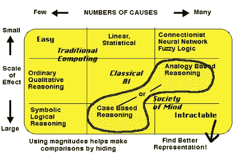
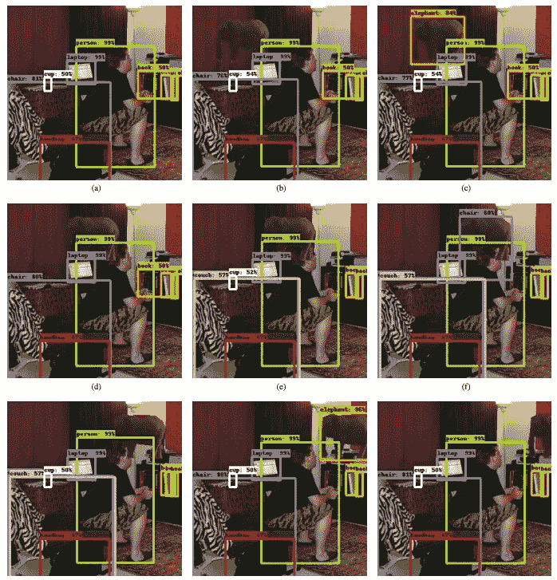
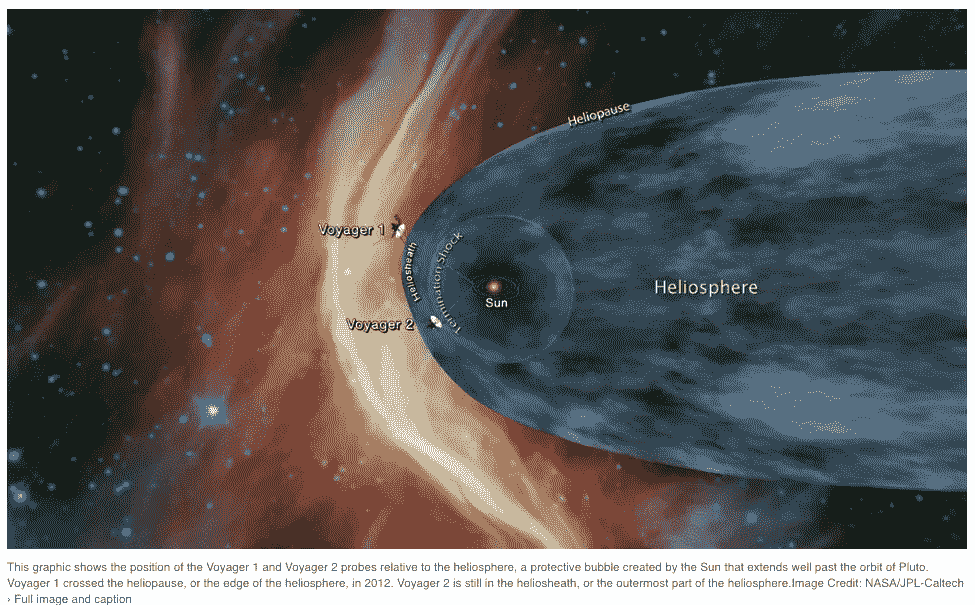
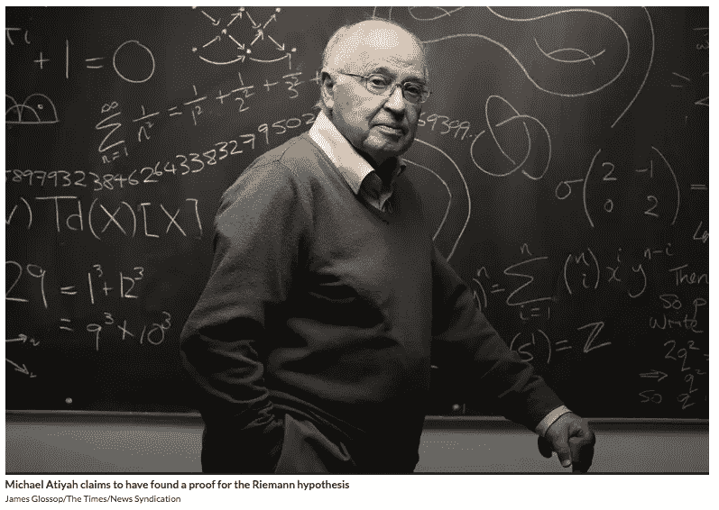

# 1 —本周最酷的事情

> 原文：<https://medium.com/hackernoon/1-cool-things-this-week-43e7a7dec431>

第一周:2018 年 9 月 29 日至 2018 年 10 月 6 日

欢迎来到本周酷事系列。每周，我都会分享一些我看到的论文或文章。希望其他人会在评论区分享一些链接。

我们开始吧。

# 类别:人类 n.0 和/或世界 n.0 (n=1，2，…)

这一类别将包括有可能改善人类或我们生活的世界的突破。

## BrainNet:一个多人脑对脑接口，用于大脑之间的直接协作( [Link](https://arxiv.org/abs/1809.08632) )

作者介绍了 BrainNet，这是第一个“用于协作解决问题的多人非侵入式直接脑-脑接口……该接口允许三个人类受试者使用直接脑-脑通信来协作和解决任务。”研究人员建立了一个三方大脑连接，让三个人玩一个“类似俄罗斯方块”的游戏。

这很酷，因为他们希望(最终)未来的脑-脑接口将使人们能够通过使用某种“*连接大脑的社交网络”来连接人们的网络，从而协作解决问题。*

## 这种机器人皮肤可以让无生命的物体移动([链接](https://singularityhub.com/2018/09/25/this-robotic-skin-makes-inanimate-objects-move/#sm.000jw8dqthwyeri11592a95qp5nwo))

当你能看的时候为什么要说什么…

# 类别:如何思考…

这一类别将包括帮助我以稍微不同的方式思考的公式。

## 人工智能技术的未来([链接](https://web.media.mit.edu/~minsky/papers/CausalDiversity.html))

这篇 1992 年的文章是马文·明斯基写的。我喜欢他作品的简洁和思想的深刻。这周没发现，重温了一下，不得不收录。他谈到了我们狭隘的人工智能是如何受到限制的，即国际象棋程序下棋很好，但它们都不能阅读(或理解)文本。然后他提出了一个解决这个问题的高级方法；他建议“只通过在同一系统中使用几种不同类型的表示来制造多功能的人工智能机器。”是的，它是高层次的，是的，它是概念性的，是的，它是古老的，但我认为它很棒，因为这张图片:

Marvin Minsky’s causal diversity matrix

每次都让我停下来。

# 类别:关于人工智能的一切

尽管发生了很多有趣的事情，我还是会尽量缩短这个类别。

## DeepMind 关于链接记忆的新研究，以及它如何应用于 AI([Link](https://singularityhub.com/2018/09/26/deepminds-new-research-on-linking-memories-and-how-it-applies-to-ai/#sm.000jw8dqthwyeri11592a95qp5nwo))([Original](https://www.cell.com/neuron/fulltext/S0896-6273(18)30682-2))

有什么[想法](https://www.sciencedaily.com/releases/2018/09/180919111527.htm)？我们使用一种叫做情景记忆的东西——链接多个记忆——来获得创新的见解。但是我们还不知道我们是如何做到的。来自英国和德国的神经科学家团队与 DeepMind 合作，发现了一种神经回路，负责人类大脑连接个体情景记忆来解决问题的方式。

情景记忆让我们知道我们以前是否见过某人，或者回忆起我们的生活事件。DeepMind 想用插曲记忆的想法来启用 AI。“如果我们能够理解允许人们这样做的机制，我们就有希望在我们的人工智能系统中复制它们，为它们提供更大的快速解决新问题的能力，”DeepMind 的研究员马丁·查德威克说。

## 房间里的大象([链接](https://arxiv.org/pdf/1808.03305.pdf)

在这项研究中，研究人员展示了“一系列最先进的物体探测器的常见故障”。最先进的物体检测器可以检测客厅中的多幅图像。现在，当一个对象(对象的图像=大象)被移植到原始客厅图像中时，它在许多情况下都不会被检测到——它不会注意到大象！“如果房间里真的有一头大象，你作为一个人可能会注意到它，”T4·罗森菲尔德说。“系统甚至没有检测到它的存在。”

奇怪的是，在某些情况下，它还会在没有大象的图像中出现标签错误——也就是说，以前的椅子现在变成了沙发。

Detecting an elephant in a room. A state-of-the-art object detector detects multiple images in a living-room (a). A transplanted object (elephant) can remain undetected in many situations and arbitrary locations (b,d,e,g,i). It can assume incorrect identities such as a chair (f). The object has a non-local effect, causing other objects to disappear (cup, d,f, book, e-i ) or switch identity (chair switches to couch in e). It is recommended to view this image in color online.

## 大卫·帕特森说，是时候采用新的计算机架构和软件语言了

摩尔定律结束了。加州大学教授兼谷歌工程师大卫·帕特森(David Patterson)说，“如果摩尔定律仍然有效，我们现在落后了 15 倍。我们正处于后摩尔定律时代。”

“为处理特定类型的计算问题而定制的革命性的新硬件架构和新软件语言，正等待开发，”他说。“如果人们愿意致力于这些事情，就有图灵奖等着我们去拿。”

# 类别:用数据做事

这一类别将包括一些有趣的数据相关部分。

## 美国梦在一些社区更难找到

[机遇图册](https://www.opportunityatlas.org/)试图回答这个问题:“美国哪些社区为孩子们提供了摆脱贫困的最佳机会？”他们的回答是“使用匿名数据跟踪 2000 万美国人从童年到 30 多岁的生活。”

[The Opportunity Atlas](https://www.opportunityatlas.org/)

# 类别:探索太空

这个类别将拥有所有与太空相关的东西:有意义、旅行、殖民等。

## 美国宇航局旅行者 2 号可能正在接近星际空间([链接](https://www.jpl.nasa.gov/news/news.php?release=2018-232)

美国宇航局的旅行者 2 号宇宙飞船于 1977 年发射。它正在去星际空间的路上。

旅行者 2 号距离地球不到 110 亿英里(约 177 亿公里)，或超过地球到太阳距离的 118 倍。

## 月亮开门营业([链接](https://www.theatlantic.com/science/archive/2018/09/spacex-ispace-moon-commercial-business/571357/))

“许多公司已经将目光投向了月球，他们正在加紧实施向月球表面发射航天器的计划。他们正在敲定航天器设计和发射合同，并设定了一些即将到来的最后期限。只有三个国家——美国、苏联和中国——成功地在月球上软着陆，而且他们的任务都是由国家机构执行的。(其他国家有*坠毁*-着陆，这[正是它听起来的](https://science.nasa.gov/science-news/science-at-nasa/2006/28jul_crashlanding)。)从来没有公司在月球上放置过航天器，但如果几个关键人物在未来十年内如愿以偿，月球表面可能很快就会布满它们。”

“对这些公司来说，登月不再是阿波罗时代的民族主义梦想。这是一个市场。他们不想把旗杆留在风化层，而是希望政府和商业部门的客户付钱给他们，让他们把硬件送到月球，或者在月球地壳中开采矿物。他们想帮助将月球上的冰转化为可用的资源，例如用于深空任务的燃料。他们希望这项工作能够产生收入，就像火箭发射对 SpaceX 的影响一样。”

# 类别:哦天哪！

本周，这一类别会有一些让我有点不安的事情——我希望对这些事情抱有希望，但现实变得更加残酷。

## 尽管声称有证据，黎曼假设可能仍未解决

在最近的一次谈话中，迈克尔·阿提亚(1996 年获得菲尔兹奖)声称已经解决了[黎曼假设](https://en.wikipedia.org/wiki/Riemann_hypothesis)。这是克莱数学研究所列出的七个[千年奖问题](http://www.claymath.org/millennium-problems/millennium-prize-problems)中的一个，只有一个问题——庞加莱猜想——得到了解决。它带有 100 万美元的奖金。

[New Scientist](https://www.newscientist.com/article/2180504-riemann-hypothesis-likely-remains-unsolved-despite-claimed-proof/)

“解决黎曼假设，你就出名了。如果你已经出名了，你就会变得声名狼藉，”Atiyah 在他的演讲中说。“没有人相信黎曼假设的任何证明，因为它太难了。没有人证明过，那么为什么现在要有人证明呢？当然，除非你有一个全新的想法。”

大多数人怀疑这个问题是否最终得到了解决。

# 类别:我知道，但是没办法

这正是类别标题所说的。

## 一端卡在沙子里的干海草随风旋转，划出同心圆。([链接](https://www.reddit.com/r/mildlyinteresting/comments/9kovnr/piece_of_dried_seaweed_with_one_end_stuck_in_sand/))

当你能看见的时候为什么要写…

WOW

# 类别:特别版

偶尔，当一些很酷的事情发生，而它不属于以上任何一类。

## 2018 年诺贝尔生理学或医学奖([链接](https://www.nobelprize.org/prizes/medicine/2018/summary/))

**10 月 1 日周一:**2018 年诺贝尔生理学或医学奖被联合授予詹姆斯·p·艾利森和本庶佑，“以表彰他们通过抑制负性免疫调节发现癌症疗法。”

## 诺贝尔物理学奖([链接](https://www.nobelprize.org/prizes/physics/2018/prize-announcement/))

【2018 月 2 日，星期二:【2018 年诺贝尔物理学奖被授予“激光物理学领域的突破性发明”，其中一半被授予阿瑟·阿什金“光镊及其在生物系统中的应用”，另一半被授予杰拉德·穆鲁和唐娜·斯特里克兰“因为他们产生高强度、超短光脉冲的方法”

## 诺贝尔化学奖([链接](https://www.nobelprize.org/prizes/chemistry/))

**10 月 3 日星期三:**瑞典皇家科学院决定将 2018 年诺贝尔化学奖一半授予弗朗西斯·h·阿诺德“酶的定向进化”，另一半则共同授予乔治·P·史密斯和格雷戈里·p·温特爵士“肽和抗体的噬菌体展示”。

## 诺贝尔文学奖([链接](https://www.nobelprize.org/prizes/literature/))

2018 年诺贝尔文学奖已经延期。

## 诺贝尔和平奖([链接](https://www.nobelprize.org/prizes/peace/2018/press-release/))

**10 月 5 日星期五:** [挪威诺贝尔委员会](http://nobelpeaceprize.org/)决定将 2018 年诺贝尔和平奖授予 Denis Mukwege 和 Nadia Murad，以表彰他们为结束使用性暴力作为战争和武装冲突武器所做的努力。

## 诺贝尔经济学奖

**10 月 8 日星期一:**将于瑞典(CEST)当地时间上午 11:45 宣布

如果你喜欢你所读的，一定要评论或鼓掌——作为一个新作家，这意味着很多。

我每周都会这样做，所以如果你感兴趣的话，请跟我来。