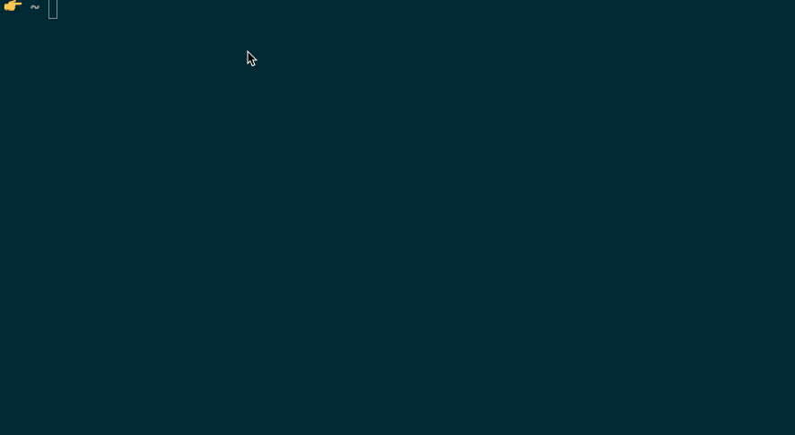

# 1 分钟*在 Kubernetes-kapp 工具中运行一项服务

> 原文：<https://medium.com/hackernoon/1-min-to-run-a-service-in-kubernetes-kapp-tool-907fcec9f01a>


Photo by Nick Fewings ([https://unsplash.com/@jannerboy62](https://unsplash.com/@jannerboy62))

在我之前的一篇名为 [**从 Makefile 到 Kubernetes 上的 Go 语义版本服务**](https://hackernoon.com/from-makefile-to-go-semantic-versioning-service-on-kubernetes-3fae678db87c) 的文章中，我谈到了创建一个简单的 Go 服务，它运行在 Kubernetes 上并返回下一个语义版本。举个例子:你把类似这样的`minor/0.1.0`发送给服务，服务用`0.1.1`响应。

在那篇文章的结论中，我提到我的大部分时间都花在了解决 Kubernetes 部署文件( [Helm](http://helm.sh) )和 Makefile 上，实际上我并没有在我的代码上花很多时间。

由于我做过一些 React 开发，我想起了一个叫做`create-react-app`的工具——这个工具可以帮助你创建一个基本的 React 应用程序，你可以在几秒钟内构建并在浏览器中运行。我认为，如果在 Kubernetes 中有类似的应用程序/服务可以快速启动并运行，这将是非常有用的。

这就是 [**kapp**](https://github.com/peterj/kapp) 工具的诞生——一个帮助你创建 Go 服务并让它们立刻在 Kubernetes 中运行的工具！

你可以从[这里](https://github.com/peterj/kapp/releases)下载该应用的第一版。完整的源代码可以在 [GitHub repo](https://github.com/peterj/kapp) 上获得。

# [kapp](https://github.com/peterj/kapp) 快速概述

安装了 **kapp** 之后，您可以像这样创建您的第一个 Go 服务:

```
cd $GOPATH/src/github.com/peterj
kapp create helloworld --package github.com/peterj/helloworld
```

这将在当前文件夹下创建一个名为`helloworld`的文件夹，其中包含以下文件:

```
helloworld
├── .gitignore
├── Dockerfile
├── Makefile
├── VERSION.txt
├── docker.mk
├── helm
│   └── helloworld
│       ├── Chart.yaml
│       ├── templates
│       │   ├── _helpers.tpl
│       │   ├── deployment.yaml
│       │   └── service.yaml
│       └── values.yaml
├── main.go
└── version
    └── version.go
```

您的服务会得到一个`Dockerfile`，将它安装到 Kubernetes 的舵图，以及`Makefile`和`docker.mk`文件中的一些有用的 Makefile 目标。

看看下面的 gif，它向你展示了如何创建一个新的应用程序，初始化它，构建它，并在本地运行它。



Create a new app and building it locally

# 部署到 Kubernetes

现在您已经创建了应用程序，是时候在 Kubernetes 中部署和运行它了。从本地运行的应用程序(作为二进制文件)到在 Kubernetes 上的容器中运行的应用程序需要几个步骤:

*   创建 Dockerfile 文件
*   构建并标记 Docker 图像
*   将图像推送到注册表
*   创建 Kubernetes 部署文件
*   创建 Kubernetes 服务文件
*   部署 Kubernetes 部署和服务

当你运行 **kapp** 时，你已经为你的应用得到了一个`Dockerfile`和掌舵图(Kubernetes 部署，服务文件)。与 Makefile 一起，您还可以获得为您执行上述步骤的任务。

让我们先从设置 Docker 注册表开始:

```
$ docker login # you can skip this if you're already logged in
$ export DOCKER_REGISTRY=[registry_username]
```

使用 Docker 注册表集，我们可以构建映像:

```
$ make build.image 
```

然后我们可以将它推送到注册表中:

```
$ make push.image
```

最后，我们可以将我们的应用程序部署到 Kubernetes:

```
$ make install.app
```

就是这样！您的应用程序现已在 Kubernetes 中部署并运行。此时，您可以为集群创建一个代理(例如`kubectl proxy`)或者让一个终端在集群内部运行来访问您的服务。

# 快速迭代

完成服务的初始部署后，您就可以快速迭代应用程序了。

你可以修改你的代码，也可以选择升级应用版本(`make bump-version`)并运行:

```
make upgrade
```

升级已经在 Kubernetes 上运行的现有应用程序。

# 结论

这是一个有趣的兼职项目，我可以用它来引导任何新的(Go)服务开发。该项目的源代码可在 [GitHub](https://github.com/peterj/kapp) 上获得。所有公关和问题都非常受欢迎！

# 感谢阅读！

欢迎对本文的任何反馈！也可以在 [Twitter](http://twitter.com/pjausovec) 和 [GitHub](http://github.com/peterj) 上关注我。如果你喜欢这个并且想在我写更多东西的时候得到通知，你应该订阅[我的时事通讯](https://tinyletter.com/pjausovec)！

> ***** 可能多，可能少，但是标题里有一些数字(最好小一点)还是比较流行的。我记得技术/编程书籍的标题是“10 天学会 X”。过了一会儿，标题中的那些日子变成了小时，现在我们说的是分钟…秒，接下来是微秒，纳秒？