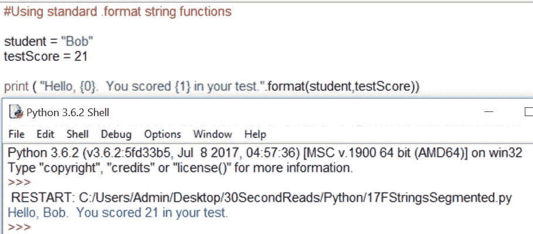
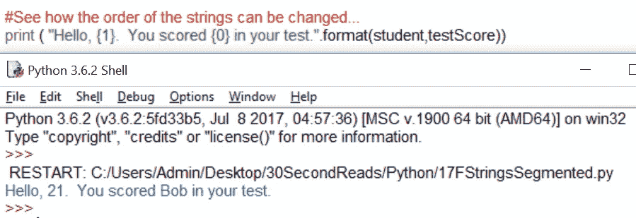
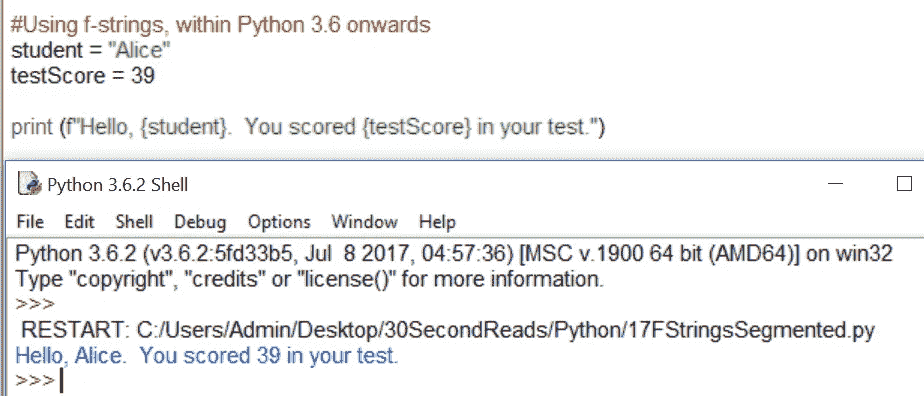
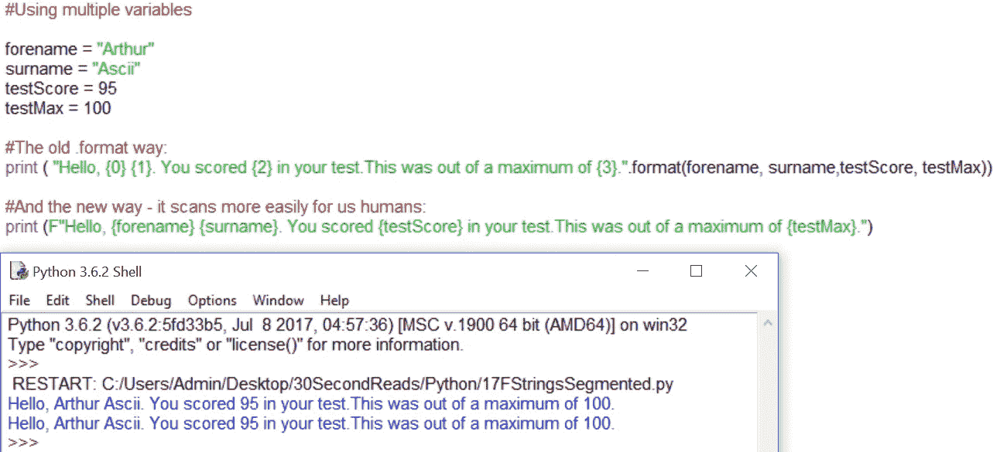
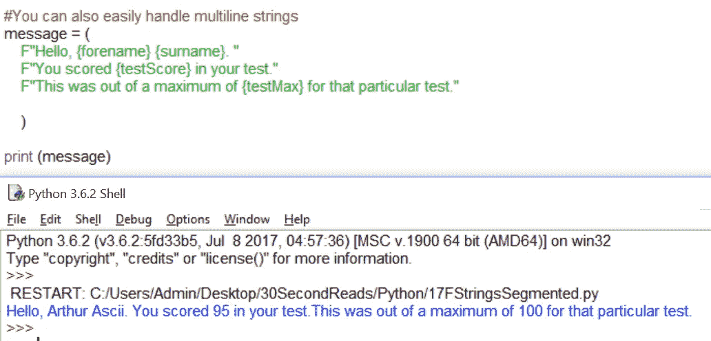
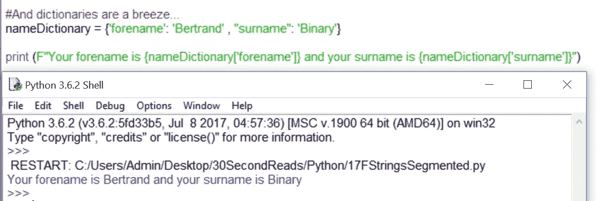

# 1 分钟阅读# 17:Python 中的 f 字符串*

> 原文：<https://medium.com/hackernoon/1-minute-read-17-strings-in-python-4c13934ca684>

你知道一根绳子有多长？如果它和 Python 中操纵字符串的许多方法一样长，那么它确实很长。2016 年发布的 Python 3.6 引入了一种全新的字符串格式化方式。被称为“格式化字符串文字”，它们比之前的任何东西都要有效得多。例如，下面是使用**处理字符串的标准方式。格式**:

你可以很聪明地改变变量被调用的顺序(索引):

以这种方式可以获得无尽的乐趣…然而…还有另一种方式:

注意这里(F“Hello……”)的用法——**F**可以大写为 F(“Hello……”),它告诉 Python 您希望在这个字符串中使用之前声明的变量。

f 弦扰乱了老派的皮达尼斯派，他们已经非常习惯于。格式方法。这相当于从顶装式洗衣机转向前装式洗衣机。f-string 简单明了，更好更简单，而且在速度测试中，解析速度更快。下面是一些稍微复杂一点的代码，为了更加清晰起见，使用了大写字母 F:

你可以看到旧的。格式方法是绝对好的，但它有点长。新的 f 弦方式只是更好地扫描我们弱小的人类大脑，消除了上瘾。格式参数。下面是另一个例子——使用多行字符串:

最后，字典——在 Python 中处理起来从来都不容易，但是使用 f-string 确实更有意义:

深信不疑？如果没有，跳到 Python 3.6 或 3.7，给他们几天时间。你永远不会回头。

*不可否认，这比“一分钟阅读”要长，但是 f 弦只是值得阅读一分钟以上。我承认我把这个问题拖长了一点。咯咯笑。