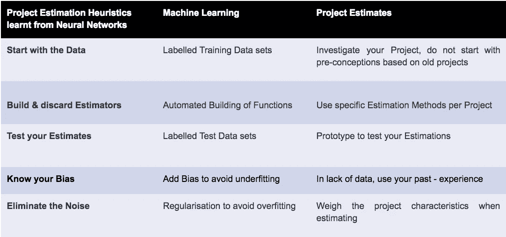

# 项目评估的黑暗艺术

> 原文：<https://medium.com/hackernoon/1-the-dark-art-of-it-project-effort-estimation-estimates-are-broken-daa06bf5496b>

评估一个复杂的 IT 项目充其量是一种艺术形式。但通常，称之为黑暗艺术是描述它的更好的方式:你需要神奇的力量来做好它，双方(供应商和客户)中的一方可能会利用另一方。

在困惑的时候，将我们人类所做的与人工模型进行比较是有用的。例如，神经网络是为了理解人脑而发明的。我将遵循类似的方法，通过更简单的理论眼镜来检查我们复杂的世界:第一篇博客的第二部分，我们将比较项目估计和神经网络如何预测未来。

第二部分将从比特币在互动者网络中获得信任的方法中得出一些结论，用于我们的项目工作，并建议如何在不依赖魔法水晶碗的情况下进行合作。

现在，让我们总结一下，我们是如何评估项目并试图处理不确定性的。

# 难以忽视的真相

艺术是一个直觉的过程，被少数不一定能够解释他们如何得出结论的人所掌握。换句话说，艺术是伟大的，但它绝对不是你想要的 it 项目和价值 10 亿欧元的服务行业的基础。但是实际上我们就是这样做的:即使估计一个 2 周的冲刺也很难做到，估计一个复杂的数月或数年的项目事实上超出了我们目前的技能范围。如果我们得到的估计是“正确的”,通常它们是因为错误的原因而正确的(一部分被高估了，另一部分被低估了),或者它们是正确的，就像一个坏了的钟一天正确两次一样。

关键是:项目估算是(？)必然。一些客户部门需要申请一些预算，一些系统集成商需要得到一些报酬。我们只需要计划，如果不计算工作量，你会怎么做。事实上，有些公司和个人只是比其他人更容易获得项目评估。所以，一定有什么方法可以把它做好。

# 我们如何评估项目

以典型的 IT 顾问或销售人员为例。客户要求她/他提供一个解决方案，有许可成本，有安装和定制软件的一次性成本，还有持续的运营成本。一个客户部门需要该功能，并有一个内部采购部门，该部门需要一个数字来决定购买是否可以通过。你不想危及你的交易，实际上你认为你会为你的客户做一些有用的事情。所以，你必须想出一个数字。许可证成本是小菜一碟，很明显，你现在忽略了运营成本。但是您很难决定为满足客户的需求而安装和运行软件的成本。因为没有人，当然你也不知道，客户想要什么，需求会如何发展。对于任何一个中等复杂的项目来说，一个客户无法预先准确知道他需要什么是一件小事，然而你却被要求给出一个“粗略的估计”。

所以，你需要一个能让项目交付的数字，你自己赚你的利润，非常重要的是:你不想惹上麻烦:没有“出血”的项目，没有财务损失，在“上线”之前不停止项目。如果你和我一样，你会愿意在你的交付上承担低风险，并更多地了解你的客户需要什么。

当你评估你的项目时，你需要解决这个问题。但坦率地说，你没有那么多选择:

*   自下而上:您尝试确定您将需要实现的技术的点点滴滴。例如界面、数据库表、用户界面、工作流和批处理作业。你给它们分配一个数字，也许你把它们分为简单、中等和高度复杂。你把这些加起来，这就是你的估价。
*   自上而下:我们评估项目的用户数量、流程和与其他系统的接口，将它们与类似的项目(客户规模、行业、技术)进行比较，然后得出一个粗略的数字，不确定这些流程在技术上如何实现。

自底向上方法的关键是你需要知道很多，并且在你的需求和设计上已经非常先进。这对于具有固定范围的小项目来说总体上工作得很好，例如对于固定的 2 周 sprint。但是即使在那里，这种方法也有它的问题。技术可能很复杂，从用户角度来看，需求的微小变化可能会导致实施成本的显著差异，例如，当您需要从外部系统检索额外数据时。

自上而下的方法是你在复杂的长期项目中前进的唯一方式，你只是没有足够的细节来估计自下而上的方法。本质上，你需要在数据很少的情况下预测未来。更糟糕的是:与产品组织相比，在客户处交付软件要求更高，因为您无法控制客户的过程。即使你能接受他不能知道所有需要知道的，你也不知道是否有合适的客户团队来处理这些不确定性。

# 我们如何处理评估时的不确定性

如果你需要提供那个神奇的数字，而你没有掌握黑魔法，你就陷入了困境，你需要用下面的策略之一来摆脱它:

**1。你心甘情愿地高估了努力**，也就是你定义了一个大的缓冲区。例如，你认为像制作用户界面这样的某个领域会很乏味，即使你知道你有一个很棒的 UI 开发人员，并且有非常好的线框。通常，这甚至是在你的客户联系人同意的情况下进行的。你知道客户等级和采购允许请求工作一次，你们都知道，有许多未知，所以你需要安全的一面。这是一个你可以很容易证明的领域，但实际上它是所有“未知的，你甚至不知道的”的缓冲区

我排除了“恶意推销员”的情况，根据我的经验，这是一种极端情况，因为所有的推销员都想在后续项目中做更多的生意。即使可能会有一瞬间有意夸大努力，这样做的目的是为了保护整体的成功。通常，这甚至是在客户的“默许”下完成的。

这里有另一种摆脱这种困境的方法。通常情况下，如果客户的信任基础不足以进行缓冲估计，您会使用这种策略。

**2。你定义了一个固定的范围**，例如你会说我们将只提供我们平台已经提供的标准功能。将不会有定制什么的。这基本上就是在 Business 2 消费者市场上发生的事情:你只需获得你下载的应用程序，这一点与你的具体情况没有任何变化。

这是第一个策略的“反面”。要么你夸大努力，要么你完全修正努力。困难在于:一个典型的企业 IT 项目和订购你的新餐桌是不一样的。企业流程是复杂的，技术和大群体达成一致意见的过程(就像在议会中一样)本质上是复杂的。没有任何需求会像进入流程时那样离开流程。如果客户遇到新的要求，你需要重新协商。

因此，为了给客户最大的灵活性，你不能向他们承诺功能，而是专业知识。

**3。你建议一个时间&材料项目**。客户从你的团队购买时间，你不承诺一个工作软件。如果您将与客户本身密切合作，这是非常常见的，例如，客户将交付需求和测试。

从表面上看，如果你是供应商，这是首选方法。因为你很少冒险。如果交付遇到暴风雨天气，只要你的团队表现出色，船就可能沉——谁能衡量或质疑这一点。但是这些风险方法中的大部分也会给你自己带来风险。好的交易包含了下一笔交易的种子，如果你卖了几个小时，而你的客户失败了或者从别处得到了他需要的技能，你就失去了中长期收益。

但是等等，我们不是在预测未来事件方面取得了很大的进步吗？是的，我们做到了。在科技领域，就在我们眼前:神经网络能够在非常不同的领域做出一些惊人的预测，比如用于皮肤癌检测的贷款信用分析。从成功的故事中学习是明智的。

# 机器学习如何预测未来

在数据分析中，机器学习是一种用于设计复杂模型和算法的方法，这些模型和算法有助于预测。神经网络是机器学习的一个分支，它松散地模拟脑细胞及其连接，深度神经网络使用隐藏层来模拟输入和预测输出之间的复杂关系。虽然许多基本想法存在了几十年，但随着使用大型数据集和更强的 CPU 能力来生成令人信服的结果，它们经历了一次复兴。

尽管有数学符号和功能，神经网络的策略通常是常识。有太多不同的模型和机制，但它们通常都遵循以下策略。因此，我们可以用它们来指导我们的行动，作为一个复杂的启发来指导我们的行动。

请注意，通过这个简短的比较，我们并不要求开发一个完整的评估框架。然而，我们确实声称，仔细观察一个正式的和成功的理论来预测未来可以给我们评估项目工作的方法带来许多好处。

# 从数据开始——你的经验是次要的

如果你看看一个神经网络是如何建立的，这与我们试图评估项目的方式有显著的不同。

神经网络从数据开始，例如，我们会有一个描述过去项目的大集合，并用我们真正需要交付的努力来“标记”它们。然后，我们让复杂的模型建立一个“理论”，一个能够预测记录的努力的数学函数。我们的赌注是:对于一个新项目，我们还不知道努力的方向，希望这个函数能准确预测我们需要什么。

在“项目世界”中，通常隐含的理想是寻找一个“主评估者”。这样一个评估者，例如一个有许多列的巨大的 excel 表，将有如此多的因素(技术、行业、用户基础、集成)并运行如此多的项目迭代，以至于它能够捕获关于如何预测未来某个时间点的工作的本质。

机器学习可以告诉我们，我们没有足够专注于收集我们试图评估的项目的具体数据。根据以前不同客户不同项目的经验进行假设和推断似乎不是一个有前途的策略，然而，我们经常遵循这个策略。

# 建立和放弃许多评估者

在神经网络中，我们没有野心去(过度)归纳一个理论。只要我们有足够的数据来支持算法，我们可能会更好地从非常特定的分布中获取数据，例如仅从特定行业的项目中获取数据。构建“理论”，即预测结果的功能，是一个自动化的过程。机器学习专注于预测器的自动构建，并在现有数据中寻找模式。

面对一个新的数据集，你高兴地扔掉你的函数，去建立一个新的预测函数

对于我们评估项目工作的方式，这意味着一旦我们获得足够的数据，我们最好为每个行业、技术甚至每个项目建立一个新的评估者(这是我们的预测函数，我们的“理论”)。寻找这一个评估者来预测任何努力是我们成功的榜样没有遵循的策略

# 经过测试的评估—无一例外

这个想法非常简单，实际上很难解释，我们在估算项目预算时不使用这个简单的想法。在神经网络构建了将输入(您对项目的描述)映射到输出(我们过去项目所需的工作)的函数之后，我们针对我们为此目的而搁置的数据集的一小部分来测试该函数:我们能否验证我们的函数泛化得很好，并能够预测它之前没有看到的数据的工作？

在项目中，这意味着评估一个复杂的几个月的项目，而不制作一个原型或最小可行的项目来测试预测的努力是否实际上足以交付所需的解决方案，这是非常愚蠢的。

测试假设是常识，我们不在任何单个项目中选择这种方法的唯一原因当然是厂商和供应商之间的权力关系。双方可能都不愿意承认预测努力的困难，并且双方都希望当努力被错误地估计时，他们可能是受益者。

机器学习告诉我们，不测试我们的估计是一种不专业的方法，应该彻底根除。

# 了解你的偏见，消除噪音

神经网络以欠拟合和过拟合数据的概念运行。

“欠拟合”你的数据意味着你没有构建一个足够好的函数来预测我们知道是正确的项目的成果。有时，我们可以通过添加“偏差”来解决这个问题，也就是说，我们添加了一个我们无法从数据中扣除的值，只是因为我们认为可以从其他来源了解如何预测努力。

这很常见，可以理解为一种心理状态:你认为部署软件很容易——但事实并非如此。你没有数据来支持你的说法，但你却带着这样的偏见。你不应该那样做，我们知道这一点。机器学习可以提醒我们这一点，并给我们一些术语来指出这一点。

过度拟合代表了硬币的另一面。您已经构建了一个评估器，它可以详细地预测现有项目数据的工作量。你可能有很多关于你的项目的信息(“特性”)，但没有查看这么多项目。从某种意义上说，你解释得“过头”了。你的预测器不会很好地概括未知数据，因为你可能听到了“噪音”，这是一些关于你的项目的信息(项目室是在建筑物的北面还是南面)，这些信息是不相关的，但模糊了你的分析。

有系统地处理过度拟合的方法。例如，您可以减少关于项目的信息，并手动删除看起来不相关的功能。另一种策略被称为“规范化”:你保留所有信息(这样你就不会有丢失信息的风险)，但你会给它们不同的权重。

我们不会深入这些技术，但是我们想强调的是，项目评估可以从这些成熟的技术中学到很多。

下面是我们指出的类比的简短总结

更微妙的一点是:机器学习实际上使用大量的能量来检测真正有所作为的特征，这些特征对于人类观众来说可能是不可见的。作为人类，我们会提出“开发人员经验丰富”或“UI 复杂”这样的特征，因为我们知道这会影响我们的项目评估。人工智能会根据你的数据自动完成这项工作。这可以让我们减少刻板印象对我们想要使用的因素的影响。生产软件是一个社会过程，像公司文化或我们使用的通信工具这样的软因素对我们的交付有巨大的影响，甚至可能比我们使用的技术更重要。但即使这是我提出的一个偏见，一台机器也可以提供我们没有预料到的功能。

如果我们有合适的数据集，我们就有可能提出比目前更准确的预测项目评估的算法。用算法代替人类具有巨大的优势，可以让我们处理比人类可能处理的大得多的数据集。即使是评估和交付了许多项目的最有经验的顾问，对于针对非常大的数据集运行的算法也是外行。

# 摘要—允许地址

“估计”一词和“粗略估计”等限定语重新定义了估计的含义。一个估计总是“模糊的”或“粗略的”。估计仅仅是:估计。对于中等复杂的产品，将评估放入我们公司模型的核心会带来风险。

如果我们承认“估计问题”，我们就能更好地处理不确定性。项目评估失败的原因与任何预测失败的原因相同:我们没有足够的数据来预测未来，我们没有准确地建立我们的模型，等等。机器学习网络可以告诉我们，哪里可以改进。