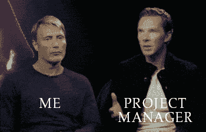

# 1 年后的产品管理

> 原文：<https://medium.com/hackernoon/1-year-of-product-management-later-99e7273f1694>

一年多前，我开始在一家金融科技初创公司担任产品经理，老实说，我觉得这个角色改变了我。作为一名运营和金融出身的人，我不得不学习很多以前认为理所当然的东西。我必须改变我的思维方式和解决问题的方法。我也不得不失去自我，我会解释为什么。但最重要的是，我不得不阅读许多博客，了解这个产品[管理](https://hackernoon.com/tagged/management)的事情是如何真正运作的。我发现有很多很棒的内容。

所以今天，我们不再谈论“做一个好的项目经理的五个注意事项”等等。我想我应该分享一下我观察到的和学到的。不多不少。公平的警告，这不是一篇我会谈论“查看客户数据”或“告诉你如何成为一名好经理”的文章(我自己并不那么自信…还没)。

1.  **不要让业务团队独自推动产品路线图**

[https://gph.is/2w3jKcb](https://gph.is/2w3jKcb)

由一个人或几个人提出的路线图永远行不通。这是因为一个人永远无法真正抓住构建产品的现实。一个人的观点不仅可能偏向某个特性，而且也可能是不现实的。我们发现构建路线图的最佳方式是让每个人都参与进来(设计师、开发人员、营销人员)。我们不仅可以围绕产品交付设定更现实的期望，而且通过听取不同利益相关者的意见，我们还可以以有利于公司长期发展的方式构建和规划产品发布，而不仅仅是为我们带来一些快速的成功。

**2。摆脱你的偏见**

我再怎么强调这一点的重要性也不为过。如果你是一个即将成为项目经理的开发人员，你需要了解设计团队是如何工作的，了解他们的思维模式，并了解他们来自哪里。试着加深对 UX 过程的理解，明白制作模型只是工作的一部分。他们进行的研究是构建伟大产品的另一个重要方面。

如果你来自商业背景，你真的有适合你的工作。你不仅需要尝试并理解 UX 过程，还需要理解你的平台所使用的技术。你需要学习一些你可能从未听说过的术语，比如设计思维或 SCRUM(不，我不是在说橄榄球)。但你也需要学会说不。销售和 P&L 可能是你所擅长的，但要打造一个伟大的产品，你需要学会对一些特别的客户要求说不。就像我老板常说的，“不要忽视北极星，我们建造的一切都应该朝着它前进。”所以尽量避免分心。

**3。不要让那篇在线文章让你相信某人拥有最好的项目管理工具**

当我刚开始在 [FinFabrik](https://www.finfabrik.com/) 工作时，我仍然趾高气扬(“我曾在硅谷工作过，所以我认为我知道所有最好的工具”)。我很快意识到，我的运营和项目管理风格不一定很适合这家新公司。理由

*不同的团队规模*

*工作文化不同*

*同事的不同工作经验和行业背景*

*最重要的是——不同的期望*

我想让大家明白的一点是，没有哪两组人是完全一样的。虽然你可以在公司之间发扬你自己的原则和职业道德，但是工具和软件可能不会无缝地转移。不要相信你得到的每一个评论和建议，也不要追求项目管理工具的绝对完美。找到合适工具的机会成本可能远远高于它给你带来的好处。

**4。不要对那些巨型耳机感到太舒服**

戴上一副巨型耳机，然后“走神”*咳咳*可能是一种非常流行的工作方式，但作为产品经理，你不应该对这种设置感到太舒服。人们说你需要有很强的沟通能力才能成为一名优秀的项目经理，这是有原因的。你需要多交流。不，说真的，很多。当然，会有很长一段时间，你需要清理积压的工作，查看客户的反馈，甚至创建一个路线图供管理层审阅。但是这项工作还涉及到以下大量内容

*内部团队质疑对客户的承诺并推迟时间表*

*客户推后您团队推荐的时间表，并试图提前交付日期*

*销售和营销团队询问特定功能的更新，以便他们能卖得更好*

因此，你会看到很多人回头看谁有空聊天，很多谷歌日历扫描来看谁有空聊天，还有很多垃圾消息来看谁有空聊天。

为了有效地做到这一点，你需要发展另一项关键技能，不要让人讨厌或分心。请记住，作为项目经理，您的工作是帮助确定问题的解决方案，然后离开。

**5。每天阅读**

[https://gph.is/2vBSW3s](https://gph.is/2vBSW3s)

对于新的项目经理(以及任何想成为专业人士的人)来说，这是绝对不可避免的。我见过很少人(0)能够不花几个小时研究就过渡到这份工作。通过参加设计思维的课程，阅读敏捷方法论的书籍，或者仅仅是老式的咖啡聊天来更好地理解这个职位的该做和不该做的事情。在你出去充实自己之前，我会给你一个建议，就像我之前说的，不要试图复制粘贴你看到或读到的任何东西作为你公司的解决方案。根据你的公司所处的阶段，可能只有少数建议适用于你。

**6。回顾之前先自省**

反思这一周，不仅仅是和你的团队，也包括你自己。我不是说你不应该在周五下午 6 点喝杯啤酒，拍拍自己的背，因为你一周都在努力工作，只是在你这样做之前花一点时间。

我并没有强迫你写日记或做任何事情(除非那是你的事情)，只是花 15 分钟，按照你通常在 sprint 回顾会上遵循的完全相同的步骤。问问你自己你做得好的是什么，你可以如何改进。一周 15 分钟，我想我们可以给自己那么多时间。

最后，我想说这是我担任过的最令人愉快，但也是最具挑战性的角色之一。这个角色不仅涉及到大量的思考，而且将你置于驾驶员的位置，以确保任务的及时执行。如果你有任何有趣的故事或指点给我，我很乐意听听！