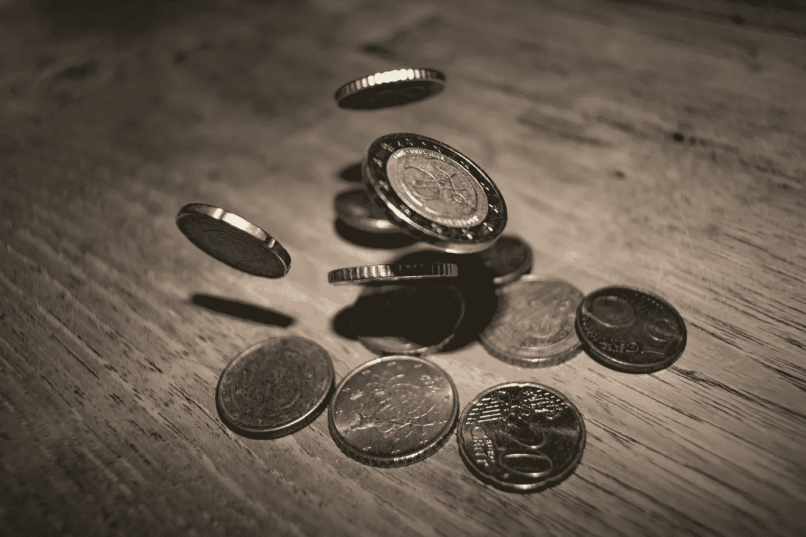

# 2018 年 11 月 7 日:神秘领域最大的故事

> 原文：<https://medium.com/hackernoon/10-07-2018-biggest-stories-in-the-cryptosphere-2ccfe896040f>

**1。CEZA 接受首个经济区加密交换**

早在四月份，我们[报道了](https://blog.goodaudience.com/26-04-2018-biggest-stories-in-the-cryptosphere-7ccdc8cc9b6d)菲律宾政府决定为区块链和虚拟货币公司建立一个指定的经济区。该项目由卡加延经济区管理局(CEZA)监督，该管理局也提供了应遵循的监管框架。据[透露](http://www.manilatimes.net/ceza-grants-licenses-to-crypto-firms/418219/)三家密码交易所已经获得了许可证。其中之一是香港的黄金千禧快播有限公司(GMQ)。第二个也是香港的，最后一个是泰国的。这三家交易所是首批从 70 家申请者中被接受的，并承诺各投资 100 万美元(协议的一部分)。CEZA 预计将筹集 300 万美元的投资。

**2。韩国希望规范加密、ICO 和区块链**

韩国立法者想要为加密货币、首次发行硬币(ico)和区块链制定法规。目前正在起草一项法案，将在 7 月 13 日至 26 日举行的国民议会特别会议上提交。属于不同政党的成员都对此事非常感兴趣。该提案是否会立即成为法律还未确定。事实上，这个问题仍然存在意见分歧，有更重要的政治和经济问题具有更高的优先地位。活动期间，自由党韩国(LPK)代表 Song Hee-kyung 和韩国互联网和安全局(KISA)还将举办一场关于“国内加密交换的安全性”的政策辩论。

**3。华尔街交易员称比特币仍是头号加密投资**

Susquehanna 国际集团数字资产负责人巴特·史密斯(Bart Smith)表示，就加密货币投资而言，比特币仍是最佳选择。在美国消费者新闻与商业频道的“快钱”活动中，他分享了自己的想法。史密斯解释说，比特币是一种“你今天实际上可以使用，人们正在功能上使用”的硬币，因此，它代表了一种更可靠的投资。尽管价格有所下降，但这仍然是它相对于其他加密货币的优势。再者，去年还发行了比特币期货。他接着说，人们向国外汇款的数量很大。然而，与比特币相比，西联汇款或银行等中介通常更慢、更贵。

**4。加密公司推出与欧元挂钩的加密货币**

加密公司 Stasis[发行了一种名为 EURS](https://www.ccn.com/malta-based-crypto-firm-stasis-launch-euro-pegged-stable-cryptocurrency/) 的加密货币，与欧元的汇率为 1:1。准备金定期核实，这确保了任何发行的金额都可以得到支持。这枚硬币是在马耳他商会大楼发行的。在同一场合，总理约瑟夫马斯喀特宣布了新的加密和区块链条例。Stasis 首席执行官格雷戈里·克鲁莫夫透露，机构投资者对稳定的加密货币尤其感兴趣。希望降低投资组合波动性的投资者也在关注这枚硬币，因为它在参与 ico 时加快了他们的交易时间。

> 本新闻综合报道由 [BlockEx](http://bit.ly/BlockEx_) 为您带来。

> 要想在你的邮箱里收到我们的每日新闻综述，请在这里注册:[*http://bit.ly/BlockExNewsAndUpdates*](http://bit.ly/BlockExNewsAndUpdates)