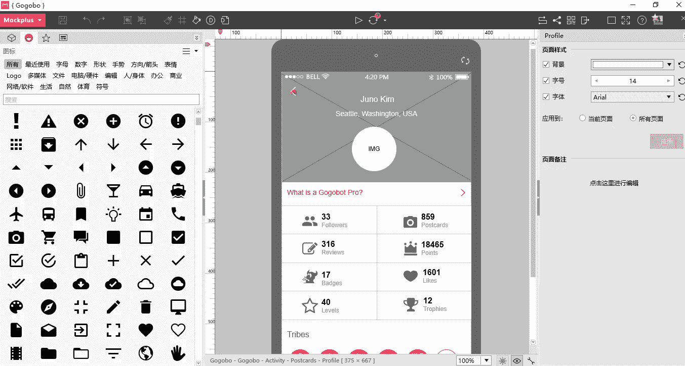

# 2018 年 App 设计&网页设计 10 大最佳免费矢量图标资源

> 原文：<https://medium.com/hackernoon/10-best-free-vector-icon-resources-for-app-design-web-design-in-2018-24e02704331b>

图标是设计中必不可少的元素。丰富的免费图标库会节省很多。2018 年 10 大最佳免费矢量图标网站，供设计师免费下载。

网上有丰富的设计资源，包括免费的矢量图标和免费字体。有了这些容易获得的资源，没有理由不利用它们。它们会为你节省很多时间，在截止日期前给你喘息的空间。

然而，每个公司和项目都有自己独特的设计规范。字体、按钮和图标应该使用什么颜色？应该使用什么——矢量图标还是位图？考虑到所有这些规格，很难找到完美的图标——即使手头有所有的资源。或者也许，特别是在资源有限的情况下。选择的数量多得让人应接不暇！

为了帮助你简化流程，Mockplus 精心挑选了一份**最佳免费矢量图标资源**。这个列表将节省你搜索完美矢量图标集的时间，无论你追求什么风格。

# 1.弗里皮克

**价格:免费**

**格式:SVG/AI/EPS**

下载:[https://www.freepik.com](https://www.freepik.com/)

Freepik 是最大和最受欢迎的在线查找免费矢量图标的平台之一。它标榜自己是“免费矢量的领先搜索引擎”，旨在帮助用户找到免费矢量图标，插图，图标，PSD 和照片。该网站提供了超过 815，100 个免费和付费运营商的大集合。与大多数其他网站不同，Freepik vectors 的质量非常好，可以下载 AI、EPS 或 SVG 格式的文件。

# 2.扁平图标

**价格:免费**

**格式:SVG/PNG/PSD**

下载:[https://www.flaticon.com/](https://www.flaticon.com/)

FlatIcon 拥有超过 961，000 个免费矢量图标，被称为网络上最大的免费矢量图标数据库之一。它的数据库包含 PNG、SVG、EPS、PSD 和 BASE 64 格式的免费图标。所以，不管你在找什么类型的矢量图标，你都可以在这里找到你需要的资源，包括一些最流行的。风格自由的社会媒体图标集。

# 3.图标查找器

**价格:免费**

**表单:SVG/PNG/AI**

下载:[https://www.iconfinder.com](https://www.iconfinder.com/)

Iconfinder 迄今为止提供了 2，592，445 个 SVG 图标，无疑是顶级的免费图标搜索引擎之一。在这里，你可以找到适合各种设计颜色的免费图案。重要的是要注意，虽然有许多图标库，但它们可能无法满足您的确切需求，所以您可能需要自己编辑图标。

Iconfinder 图标编辑器是 Iconfinder 的一项新功能。这是一个免费且易于使用的在线图标编辑工具。你不需要下载或安装软件，你可以通过浏览器使用它。调整图标的颜色、大小或文本非常简单。即使没有矢量编辑软件，用图标编辑器也绝对可以满足最基本的图标编辑需求。

# 4.图标 8

**价格:免费**

**格式:SVG/PNG/EPS/PDF**

下载:【https://icons8.com 

Icons8 有 74，600 个图标，涵盖了包括 Android、iOS 和 Windows 在内的各种风格。下载不需要连接网络。你只需要选择一个图标，并把它拖到你喜欢的编辑器。您甚至可以直接更改图标的颜色和大小，而无需登录(png256 和 png512 除外，它们需要登录才能访问)。Icons8 支持 PNG、SVG、PDF 和 EPS。

# 5.偶像忍者

**价格:免费**

**格式:SVG/PNG**

下载:[http://www.iconninja.com](http://www.iconninja.com/)

图标忍者是一个支持近 100 万免费图标素材的搜索引擎。它支持关键字搜索。所有材料提供详细信息，如格式、宽度、高度、文件大小等。，这使得它们非常适合前端工程师或 PPT 设计师使用。这些材料有巴布亚新几内亚和 SVG 两种版本。

# 6.Vector.me

**价格:免费**

**格式:AI/EPS/ SVG**

下载:[https://freedesignfile.com](https://freedesignfile.com/)

Vector Me 是一个很受欢迎的网站，可以找到免费的矢量、徽标、图案和剪贴画。该网站包含超过 280，000 个矢量图标。你可以免费使用这些文件，但需要提供归属。

# 7.矢量 4free

**价格:免费**

**格式:艾**

下载:[http://vector4free.com/](http://vector4free.com/)

Vector4Free 的收藏并不庞大——只有 1500 多个免费的矢量元素和图标，但质量很好，所有东西都有很好的标记，所以很容易找到你想要的东西。所有特色矢量图像都免费供个人使用，但在将它们用于商业目的之前，请检查附属细则。

# 8.Vecteezy

**价格:免费+付费**

**格式:EPS/AI**

下载:[https://www.vecteezy.com](https://www.vecteezy.com/)

Vecteezy 是一个索引网站，有很多免费的矢量图形。它收集了大量的图片资料，并每天更新。一些矢量图形由其他设计师共享，大多数材料可以免费下载——除了那些标有绿色和“高级”的。Vecteezy 有一个图标编辑器，所以你可以编辑图标的颜色，字体，大小等。下载前。

# 9.新项目

**价格:免费**

**格式:SVG**

下载:[https://thenounproject.com/](https://thenounproject.com/)

Noun 项目旨在创建一个包括免费使用的高清符号图标的媒体库。来自世界各地的设计师每天都会提交新的作品，因此自项目实施以来，收藏量大幅增加。需要注意的是，Noun 项目提供的格式是 SVG，所以必须配合 Adobe Illustrator 或 CorelDraw 等工具使用。

# 10.滴水不漏

**价格:免费**

**格式:SVG/AI**

下载:[https://dribbble.com](https://dribbble.com/)

作为全球最大的设计师分享平台，Dribbble 每天都有高质量的设计作品更新。这里面自然包括了很多优质的免费矢量图标资源。用正确的关键词搜索，你会发现惊喜。

目前很多矢量图标资源需要结合 Adobe Illustrator 或者 CorelDraw 等工具。

这就提出了一个很关键的问题:**在设计之初，你是如何利用这些优质的图标资源的？**

答案？您需要一个支持 SVG 图标导入的[原型工具](http://www.mockplus.com/)。

一个这样的原型工具是 Mockplus。它有广泛的内置免费矢量图标资源，可以作为一个图标库。它的 2600+矢量图标集合对于一般项目来说绰绰有余。如果需要其他样式的矢量图标，可以通过内置的 SVG 组件导入外部图标。

这些是我们今天想和你分享的最好的免费矢量图标资源。我们希望它们能让你的工作流程更加顺畅，在不影响质量的前提下缩短你的设计过程。

有关图标资源的更多信息:

[为什么图标会影响用户体验？](https://www.mockplus.com/blog/post/icons-affect-ux)

空心图标和实心图标:哪一个对识别更友好？

[免费设计资料——为设计师提供的 1208 种谷歌字体包](https://www.mockplus.com/resource/post/free-package-of-1208-google-fonts-for-designers)