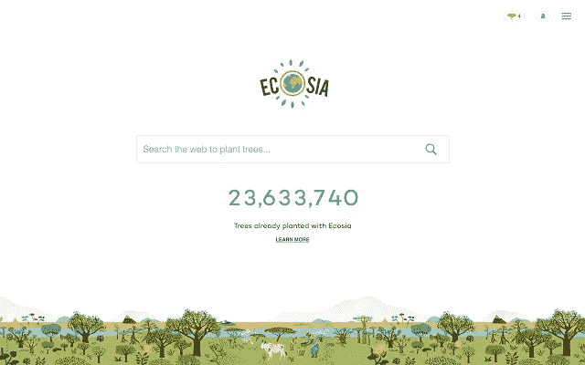
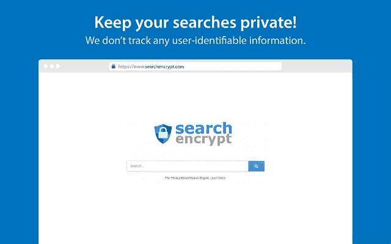
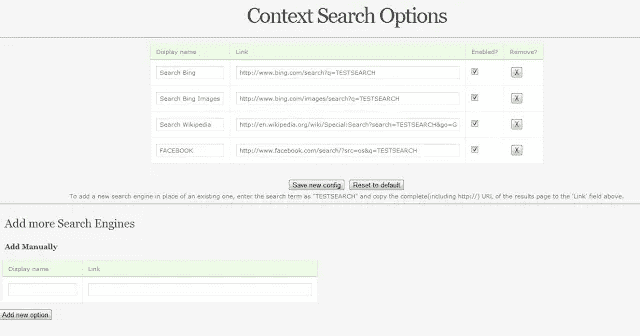
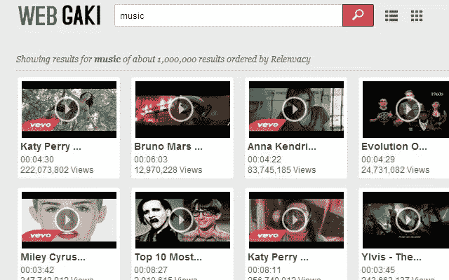
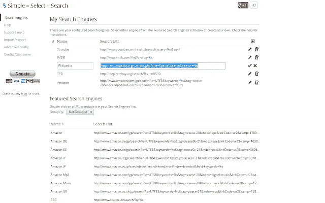
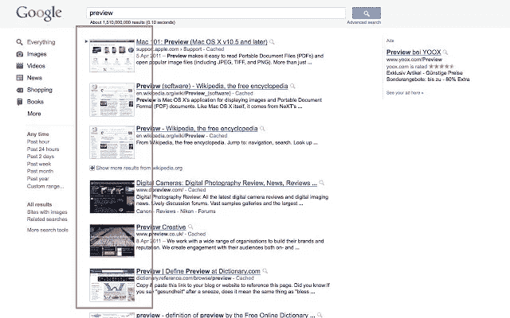
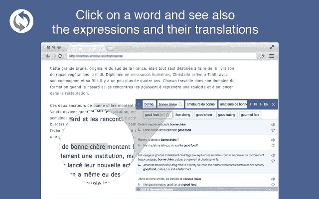

# Chrome 网上商店的 10 个最佳搜索工具扩展

> 原文：<https://medium.com/hackernoon/10-best-search-tool-extensions-in-chrome-web-store-286262a741b1>

以下是 Chrome 网络商店搜索工具类别中排名靠前的 [Chrome 扩展](/searchencrypt/the-best-browser-extensions-for-privacy-f611d8bc90a6)列表。这些扩展将有助于改善您的搜索体验，并且可以帮助您比传统搜索引擎更快、更容易地找到信息。

# ecosia——种树的搜索引擎

**评级:** ⭐⭐⭐⭐⭐

**描述:**这个扩展将你的搜索引擎设置为 Ecosia，并定制你的新标签页，这样你就可以在每次搜索时种树。

这个扩展将 Ecosia 设置为你在 Chrome 中的默认搜索引擎，允许你直接从浏览器的地址栏进行搜索。它还可以定制您的新选项卡页面。通过使用它，你可以免费保护环境——只需在网上搜索一下。

 [## Ecosia -种树的搜索引擎

### 这个扩展将您的搜索引擎设置为 Ecosia，并定制您的新标签页，这样您就可以用每个…

chrome.google.com](https://chrome.google.com/webstore/detail/ecosia-the-search-engine/eedlgdlajadkbbjoobobefphmfkcchfk) 

# 搜索加密——私人搜索引擎

**评分:** ⭐⭐⭐⭐⭐

**描述:** [搜索加密](https://www.searchencrypt.com)使用本地加密来保护您的搜索。我们的私人搜索引擎结合了 AES-256 加密和安全套接字层加密。然后，它从我们的搜索合作伙伴网络中检索您的搜索结果。完成搜索后，您的搜索词会过期，因此即使其他人可以访问您的电脑，搜索词也是保密的。

使用 Search Encrypt 可以让你更有信心和隐私地搜索网页。搜索网络不应该需要提交大量的你的个人信息，这就是为什么我们创建了我们的[私人搜索引擎](https://choosetoencrypt.com/news/search-encrypt-use-private-search-engine/)来保护你的数据安全。

**Search Encrypt 如何让你的搜索保持私密:**
1。没有以任何用户可识别的方式跟踪搜索历史
2。过期浏览器历史记录
3。SSL/HTTPS 加密
4。设计隐私。透明度

使用 Search Encrypt 作为你的默认搜索引擎将会帮助你在网上练习安全搜索！

 [## 搜索加密-一个私人搜索引擎

### 通过将可能被跟踪的搜索重定向到 Search Encrypt(一种注重隐私的搜索),使您的搜索保持私密

chrome.google.com](https://chrome.google.com/webstore/detail/search-encrypt-a-private/oodblefojaocanejnikhhjcglbaelpbp) 

# 上下文菜单搜索

**评分:** ⭐⭐⭐⭐⭐

**描述:**使用右键菜单在不同的搜索引擎中搜索选中的文本

该扩展可用于使用上下文菜单搜索选定的文本。不同的搜索引擎可以根据用户的意愿添加到右键菜单中。

搜索结果显示在新标签中，根据用户设置的选项，该标签可以是聚焦标签或背景标签。新打开的标签的位置也可以由用户设置为紧邻当前标签或最后一个标签。

也可以排列右键菜单中搜索引擎的顺序。添加了 40 个常用搜索引擎的列表，以便用户可以轻松选择。如果需要，用户还可以添加未包含的选项。

 [## 上下文菜单搜索

### 使用右键菜单在不同的搜索引擎中搜索选定的文本

chrome.google.com](https://chrome.google.com/webstore/detail/context-menu-search/ocpcmghnefmdhljkoiapafejjohldoga) 

# 搜索切换器—默认搜索

**评分:** ⭐⭐⭐⭐⭐

**描述:**搜索切换器可以让你快速方便地在互联网上最好的搜索引擎之间切换。我们的扩展帮助您…

搜索切换器可以让你快速方便地切换互联网上最好的搜索引擎。我们的扩展可以帮助您在最流行的搜索网站上找到您想要的内容。我们还将您的默认搜索引擎设置为搜索切换器。

只需点击一下，你就可以轻松搜索许多热门网站，包括[、谷歌](https://hackernoon.com/tagged/google)、雅虎！、必应、维基百科和 Reddit。

工作原理:
1。点击 Chrome 浏览器中的搜索切换器图标。
2。选择您想要搜索的网站(例如 Google 或 Yahoo！).
3。在搜索框中输入您的搜索词，然后按 Enter 或单击搜索按钮。

使用搜索切换器 Chrome 扩展在顶级搜索引擎和网站上搜索。你可以在必应、谷歌和雅虎之间轻松切换。搜索引擎直接从我们的扩展。

 [## 搜索切换器-默认搜索

### 搜索切换器可以让你快速方便地切换互联网上最好的搜索引擎。我们的分机…

chrome.google.com](https://chrome.google.com/webstore/detail/search-switcher-default-s/ijpllhfchmeiadiiegdleehaofdklpcd) 

# 视频搜索极客

**评分:** ⭐⭐⭐⭐

**描述:**视频搜索引擎让娱乐世界离你只有一个点击的距离。

视频搜索引擎让娱乐世界离你只有一次点击的距离。轻松找到优秀的 YouTube 视频，并搜索世界上最大的在线视频库。

只是搜索和去-有趣的猫，伟大的音乐和其他一切介于两者之间。视频搜索 app 应有尽有。喜欢 YouTube，但讨厌花几个小时去寻找很棒的视频？视频搜索应用程序让您掌控最佳娱乐。

视频搜索应用程序是终极的视频搜索引擎-让你只需搜索就能访问数百万个视频。根据相关性、日期、评分或观看次数过滤您的搜索-这是找到精彩视频的最佳和最简单的方法。

选择上传日期或按类别过滤-找到每个人都在谈论的精彩视频变得如此容易！搜索任何关键词，浏览页面——使用复杂的算法，视频搜索 app 总能帮你找到你要找的视频，不费吹灰之力。

观看网格或列表视图中的视频-然后只需点击播放，直接从 WebGaki.com 观看视频。视频搜索应用程序甚至可以显示视频的长度、简短描述、观看次数和频道名称。

 [## 视频搜索极客

### 视频搜索引擎让娱乐世界离你只有一步之遥

chrome.google.com](https://chrome.google.com/webstore/detail/video-search-geek/pjaccgpokiicmmlmkpmhhmpagmcbfmgo) 

# 简单=选择+搜索

**评分:** ⭐⭐⭐⭐⭐

**描述:**右键点击所选文本，在多个搜索引擎上搜索 Chrome。支持分组引擎、incongito 等等。

很简单:选择一些文本，点击鼠标右键，在你喜欢的搜索引擎上搜索。

配置您的搜索引擎非常容易！

 [## 简单=选择+搜索

### 右击所选文本，在多个搜索引擎上搜索 Chrome。支持分组引擎、incongito 和…

chrome.google.com](https://chrome.google.com/webstore/detail/simple-select-%2B-search/aagminaekdpcfimcbhknlgjmpnnnmooo) 

# 搜索预览

**评分:** ⭐⭐⭐⭐⭐

**描述:**通过插入预览图片和人气排名来增强您的搜索页面。

SearchPreview 的唯一目的是增强您的搜索结果页面。它在 Google、DuckDuckGo、Yahoo 和 Bing 搜索中插入网站预览图片(缩略图)和受欢迎程度排名。SearchPreview 不会处理或保存个人用户数据。SearchPreview 仅处理其功能所需的非个人用户数据。如果您关闭这些功能，则不会传输或保留任何用户数据。详情请阅读隐私政策。

5.0 版本新增:
-移除相关链接/广告功能
-修复:Bing 上的一些搜索显示每个结果三个预览
-修复:返回到一些 Google 搜索时搜索结果的边框

 [## 搜索预览

### 通过插入预览图像和受欢迎程度排名来增强您的搜索页面。

chrome.google.com](https://chrome.google.com/webstore/detail/searchpreview/hcjdanpjacpeeppdjkppebobilhaglfo) 

# TinEye 反向图像搜索

**评分:** ⭐⭐⭐⭐

**描述:**这是官方的 TinEye Chrome 扩展。查找图像的来源、使用方式，或者查找分辨率更高的版本。

TinEye 是网络上第一个使用图像识别技术的图像搜索引擎，而不是使用关键字、元数据或水印。当您提交要搜索的图像时，TinEye 会为其创建一个独特而紧凑的数字签名或“指纹”，然后将该指纹与我们索引中的所有其他图像进行比较，以检索匹配。TinEye 通常不会找到相似的图像；它查找精确匹配，包括那些已被裁剪，编辑或调整大小。

 [## TinEye 反向图像搜索

### 这是官方的 TinEye Chrome 扩展。找出一个图像来自哪里，它是如何使用的，或找到更高…

chrome.google.com](https://chrome.google.com/webstore/detail/tineye-reverse-image-sear/haebnnbpedcbhciplfhjjkbafijpncjl) 

# 通过图片搜索(通过谷歌)

**评分:** ⭐⭐⭐⭐⭐

**描述:**这个扩展允许你使用网络上的任何图片启动谷歌搜索。

在网上找到一张你很好奇的图片？有了这个扩展，你可以使用网络上的图片在谷歌上发起搜索。您可以发现各地的照片，了解更多艺术作品，识别地标，等等。

要使用这个扩展，右击网络上的图片，选择“用这个图片搜索谷歌”您还可以添加一个可点击的“按图像搜索”图标，当您指向图像时，该图标会出现。当您按图片搜索时，您会看到显示该图片以及类似图片在网络上出现位置的结果。您可以查看包含该图像的网页，或者查找不同大小或分辨率的相同图像。

 [## 通过图片搜索(通过谷歌)

### 这个扩展允许你使用网络上的任何图片启动谷歌搜索。由谷歌图片团队完成。

chrome.google.com](https://chrome.google.com/webstore/detail/search-by-image-by-google/dajedkncpodkggklbegccjpmnglmnflm) 

# 在上下文中反向翻译

**评分:** ⭐⭐⭐⭐⭐

**描述:**在上下文中翻译单词和短语，提高你的语言技能。西班牙语、法语、俄语、意大利语等。

翻译网页中的单词和短语(包括 PDF 文件、网飞和 Primevideo 字幕)，包括西班牙语、法语、意大利语、葡萄牙语和其他 8 种语言。

只需点击一下就可以看到上下文中的翻译(选中的单词和包含它的表达)。您的搜索历史会自动保存，您可以选择您最喜欢的单词和短语来丰富您的词汇，使用所有 Reverso [工具](https://hackernoon.com/tagged/tools)练习它们。以阅读模式保存您喜爱的网页，并通过集成的翻译功能从您的所有设备上访问它们。

许多其他功能:全文翻译，拼写检查，语法，字典。与其他 Reverso 服务同步。它是免费的！
还提供德语、葡萄牙语、俄语、阿拉伯语、荷兰语、希伯来语、波兰语和罗马尼亚语版本。

**感谢阅读！**🙏

***你喜欢使用哪些扩展？让我知道！*** 📃

# 阅读更多内容…

 [## 保护隐私的最佳浏览器扩展

### 有大量的浏览器扩展选项可以帮助改善你的网络用户体验。如果你是…

medium.com](/searchencrypt/the-best-browser-extensions-for-privacy-f611d8bc90a6)