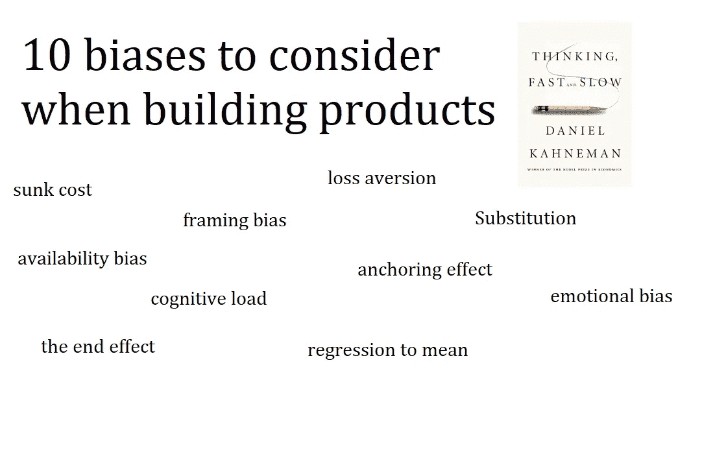
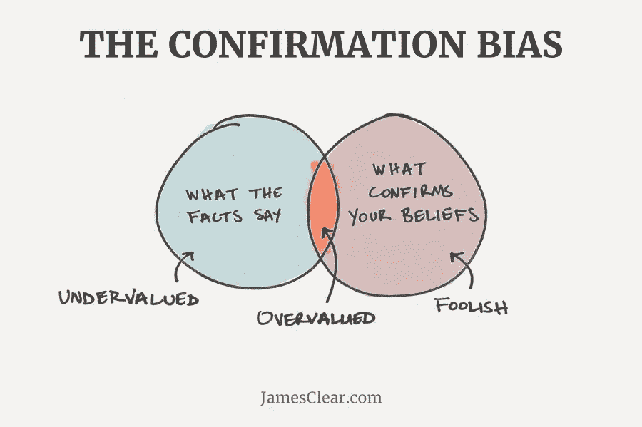
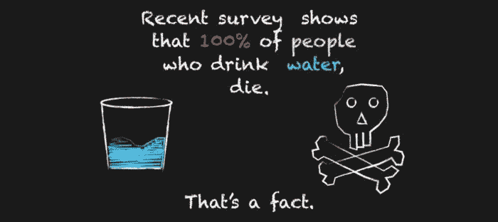
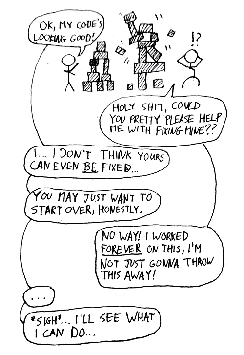

# 根据“快速思考和慢速思考”构建产品时要考虑的 10 个偏见/概念

> 原文：<https://medium.com/hackernoon/10-biases-concepts-to-consider-when-building-products-from-thinking-fast-and-slow-e900db11271e>

## 超越认知负荷。这些想法会让你大吃一惊。

Biases and effects which affect decision making

我们都听说过认知负荷——人脑一次只能处理这么多信息，所以限制呈现给用户的选项/信息的数量是个好主意。

但是人类的行为和思考远不止认知负荷。《思考的快慢》是一本非凡的书——书中充满了例子和场景，展示了人类在做决策时是如何犯错的。

卡尼曼将人类决策分为两个系统——系统 1——一个直觉的、快速的决策者，系统 2——一个理性的、缓慢的决策者。然后他用这两个系统来证明错误是如何进入我们的思维的。

让我向你介绍 10 大影响和偏见。

## 1.确认偏差

Confirmation bias — paying more attention to things that reinforce our beliefs

让我给你举个例子——你正在做一些用户研究，一个用户提到他有一个问题——他找不到刷新按钮。你突然想起有同样的问题。这是工作中的确认偏见。我们寻求强化我们信念的信息，同时积极忽略与我们观点相反的信息。确认偏差来自于当你有了一个解释，你采纳了它，然后，自上而下，你强迫一切都符合那个解释。

## 2.框架效应

问题的框架会影响结果。假设你正在考虑癌症手术，医生告诉你，1 个月存活率是 90%。你觉得很好。现在考虑这个——第一个月有 10%的死亡率。这两种说法在逻辑上是相同的。从情感上来说，生存是好的，另一方面，死亡给我们敲响了警钟。这对产品经理来说是重要的一课——你的**产品文案至关重要**。

## 3.相关性不是因果关系

But that doesn’t mean drinking water leads to death :)

每当我们看到一个模式，我们就试图解释它。他在第二盘打得很差，因为他累了。有一种更简单的方式来解释它——从长远来看，所有的事情都回归(收敛)到平均值——你有时做得很好，有时做得很差。所以我们看到一个模式并不意味着它是相关的或者由它引起的。

## 4.代替

我们回答更简单的问题——当我们被问到一个复杂的问题时，我们用一个更简单的问题代替它——一个我们能回答的问题。例如:“你对自己的生活有多满意？”“这些天”被替换为“我现在的心情是什么？”我应该投谁的票？变成了“哪个候选人更讨人喜欢？”

## 5.原因胜过事实

独裁领导人和营销人员早就知道这一点。比起统计数据和事实，人们更容易被轶事和个人故事所感动。因此，烟草广告以穆克什为特色，而不仅仅是滚动统计数据。

Mukesh Harane — the face of an anti-tobacco campaign by the Indian Govt

## 6.沉没成本谬论

We hate loss

你可能对这个很熟悉。我们对某样东西投入越多，就越不可能放弃。人们呆在糟糕的婚姻、工作和环境中的主要原因。因此，让你的用户从一开始就投资是很重要的。这也是为什么退出 FB 很难——我们在情感上投入了太多，很难放手。

## 7.参照效应

新公寓的要价会影响你对合理购买价格的判断吗？你高兴以低于起价 1500 英镑的价格买了一件 1000 英镑的毛衣吗？这些都是锚定效应——一个人造锚会影响我们如何做决定。你看过 SaaS 计划的定价页吗？例如，假设企业级每月 1000 美元，提供无限的云存储空间，而专业级每月 300 美元，提供 750 的存储空间。由于大多数人不需要无限的存储空间，他们最终会购买专业级，并认为他们刚刚为自己节省了 800 美元，而你很高兴他们购买了你的目标产品。

## 8.可用性/可用性偏差的科学

对我们来说更“可用”的信息会影响我们的决策。媒体报道的飞机失事让我们思考飞行的安全性。几率并没有改变我们对这件事的感觉。我们的感觉和记忆对我们更有用，因此比需要系统 2 处理的统计数据更能影响我们的决策。

## 9.光环效应

如果我们第一次看到一个人在好的光线下，随后就很难让光线变暗。我们的第一印象通常是持久的印象。此外，当一家公司表现良好时，我们会很快将其归因于卓越的战略、首席执行官的远见等，而当它表现不佳时，我们会再次夸大首席执行官的作用和他们的战略。这又是光环效应在起作用。因此，如果用户对你的产品有一个好的第一印象，这种影响可能会持续下去。获得正确的应用入门体验至关重要的另一个原因。

## 10.我们的环境影响我们的决定

我们喜欢认为自己是独立的决策者，能够自己拿主意。但是我们不断受到周围环境的影响，从而影响我们的决定。想想前任——最高领导人的大照片应该让你服从。

暂时就这样了。如果你喜欢我的帖子，请点击下面的“推荐”按钮，并留下评论！我很乐意收到你的来信。