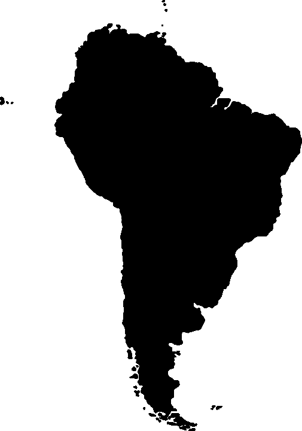

# 值得关注的 10 家跨境拉美金融科技初创公司

> 原文：<https://medium.com/hackernoon/10-cross-border-latin-american-fintech-startups-to-watch-f54499e6dbe>

金融科技初创公司正在彻底改变拉丁美洲的金融业。这些初创公司是该地区首批金融技术提供商之一，通过他们的跨境努力，他们正在帮助消费者和公司监控他们的财务状况，进行支付和获得贷款。以下是拉丁美洲十家跨境金融科技初创公司值得关注。

# 1.[闪烁](http://www.blinking.cl/)

总部位于智利的 Blinking 是一款帮助中小企业控制现金流的金融应用。该应用的功能包括监控发票、管理财务和与客户沟通。Blinking 与 BCI 保理公司和 Banco Security 有合作关系。

# 2.[阿弗洛](http://www.aflore.co/)

Aflore 是一家金融科技初创公司，通过非正式的金融顾问向尚未接入银行系统的拉丁美洲人提供贷款。该公司总部位于哥伦比亚，但服务于整个非洲大陆的消费者。2014 年，Aflore 被提名为拉丁美洲最具社会责任感的初创公司之一。

# 3.[阿莱格拉](https://www.alegra.com/)

总部位于哥伦比亚麦德林的 Alegra 是拉丁美洲最具全球性的金融科技初创公司之一，为拉丁美洲以及美国和西班牙的客户提供服务。他们为中小企业提供基于云的会计和发票软件，最近注册用户超过 50，000 人。

# 4. [Recarga 支付](https://recargapay.com.br/)

这个移动支付平台成立于阿根廷，但目前在巴西的日常货币支付和转账市场占据领先地位。客户可以在 Recarga Pay 移动应用上执行许多交易，如支付账单、购买礼券和向其他账户转账。这家初创公司最近在 B 轮融资中筹集了 2200 万美元。

# 5.[ü银行](http://ubankapp.com/)

ü银行帮助普通人更高效地存钱。这个应用程序将日常任务和习惯转化为节省机会，例如每次跑步时节省一定的钱，或者每周保留一定比例的工资。bank 总部位于智利，但已经计划在其他拉美国家推出其服务。

# 6.[门户金融](http://www.portalfinance.co/)

Portal Finance 在哥伦比亚的波哥大和智利的圣地亚哥设有办事处，帮助中小型企业从保理公司找到最有利于业务的条款。Portal Finance 评估来自公司的电子发票，并向投资者提供信息，这使得投资者可以快速、透明地提出融资要约。2017 年 4 月，门户金融获得来自 [Magma Partners](http://magmapartners.com/) 的风险投资资金。

# 7. [Ebanx](https://business.ebanx.com/en/)

总部位于巴西的 Ebanx 是一家跨境支付处理公司，连接整个拉丁美洲的电子商务商户。最近，Ebanx 筹集了 3000 万美元来开发更多的项目。Ebanx 的一些主要合作伙伴是 Airbnb、全球速卖通、Spotify 和 Udacity。

# 8.[阿尔巴戈](https://www.allpago.com/)

总部位于柏林，但在南美各地设有办事处，Allpago 是拉丁美洲地区领先的支付提供商，在单一平台上提供在线支付处理。该平台帮助支付提供商和电子商务商家接受所有当地和相关的支付方式和货币。2017 年 10 月，Allpago 成为商人风险委员会(Merchant Risk Council)的签名成员，这是一个打击电子商务欺诈和欺诈性支付的全球组织。

# 9.[里皮奥](https://www.ripio.com/en/)

Ripio 成立于阿根廷，提供数字支付和比特币服务。他们在阿根廷、墨西哥和巴西等几个拉丁美洲国家开展业务，服务包括账户间转账、申请信用额度以及买卖比特币。2017 年，Ripio 筹集了 190 万美元，以帮助拓展更多的南美市场。

# 10. [Afluenta](https://www.afluenta.com/)

Afluenta 是拉丁美洲第一家“合作金融”公司，将寻找投资和信贷服务的人与投资者联系起来。目前，Afluenta 在阿根廷、秘鲁和墨西哥开展业务，并计划很快在哥伦比亚、巴西、乌拉圭和智利开展业务。

**你知道我们应该把其他跨境金融科技初创公司加入这个名单吗？在评论中与我们分享吧！**

*原载于*[*www.launchwaymedia.com*](https://www.launchwaymedia.com/blog/2018/4/5/10-cross-border-latin-american-fintech-startups-to-watch)*。*