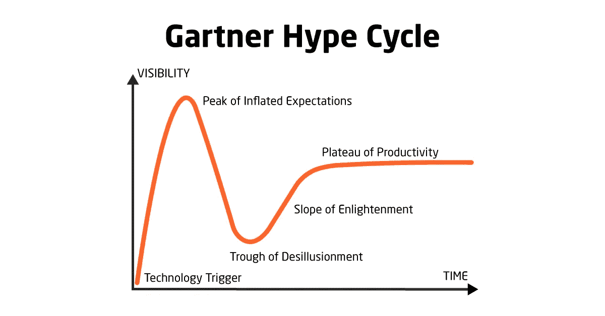
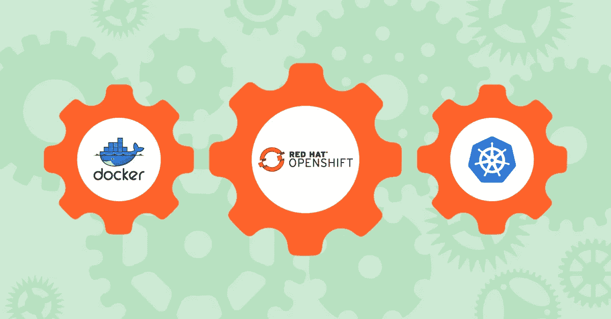

# 2018 年 10 大颠覆性开发运维趋势

> 原文：<https://medium.com/hackernoon/10-disruptive-devops-trends-of-2018-b0b6d5719376>

2017 年对于 DevOps 来说是很棒的一年。Kubernetes 的不断广泛采用，Docker 中期待已久的原生支持，无服务器计算的兴起，等等。2018 年呢？

在 IT Svit 部门，我们习惯于[提供开发运维即服务](https://itsvit.com/our-services/devops-service-provider/)，因此我们必须保持领先，以保持竞争力。我们密切关注技术的最新发展和 DevOps 行业的最热门趋势，并且我们总是很高兴与我们的读者分享一些有用的见解。

DevOps 服务演进的大方向保持不变——更可靠的工具、更好的云基础设施管理、更好的云安全。Docker 仍然是容器化领域的王者，Kubernetes 作为容器编排工具的地位一如既往地强大。尽管如此，DevOps 服务演进有 10 个显著的特征，我们将在下面详细讨论它们。

# DevSecOps 正在崛起

[Equifax 数据泄露](https://www.ftc.gov/equifax-data-breach)是 2017 年的一个沉重打击，但它只是强调了加强软件交付安全方面的必要性。只有将安全程序融入其业务结构的企业和托管服务提供商才能在充满漏洞和后门安全漏洞的世界中生存并取得成功。

# DevOps 团队将拥有更多管理权力

随着 [DevOps 的采用在 2017 年](https://itsvit.com/blog/2017-in-review-state-of-devops-adoption/)继续增长，全球各地的企业决定授权他们的 DevOps 工程师，并给予他们管理职位。这很有意义，因为 IT 部门应该仍然是组织中创新的主要驱动力，董事会中有另一个声音是一个好趋势。不重视和支持 DevOps 文化的高管有可能在 2018 年被推到一边。

# 更多开发，更少运营

借助 Terraform 和事件驱动的[Kubernetes 管理](https://itsvit.com/blog/kubernetes-management-choose-start/)平台(如[Brigade](https://itsvit.com/blog/news/brigade-new-kubernetes-management-tool-microsoft/))等配置编排工具，只需更少的人来管理基础设施代码，更多的人可以专注于新代码的持续设计、集成和交付。DevOps 工作流经常被重新平衡，以使软件交付能够完成重复的管理任务。

# 聊天平台是一种新趋势

如果你可以通过聊天应用程序向你的系统发出命令，为什么要同时在几十个标签中工作呢？ChatOps 已经存在了一段时间，到目前为止还没有获得显著的地位，但前景令人难以置信。想要重启服务器吗？Ping 一个电报机器人。需要创建吉拉机票吗？从聊天窗口进行。是时候部署新的一批代码了吗？打开聊天频道，复制并粘贴一个简单的命令。

# 微服务周围的灰尘开始沉降

从单片应用到模块化微服务的转变是一种自然的发展。然而，微服务目前接近 Gartner 炒作周期的膨胀预期的峰值。

人们期望它们彻底改变我们交付和操作软件的方式，然而它们的采用面临着多重挑战和问题。我们确信，幻灭的低谷不会太深，生产率的稳定期已经很近了。到目前为止，DevOps 工程师开始意识到微服务不会像许多人希望的那样是灵丹妙药。

# 服务网格是 DevOps 世界的新宠

[服务网格](https://buoyant.io/2017/04/25/whats-a-service-mesh-and-why-do-i-need-one/)或专用于服务到服务通信的基础设施层简化了基于动态容器的网络拓扑的操作。它们使服务发现、流量路由、负载平衡、健康检查和监控变得更加容易。它们不是 Docker 容器、Kubernetes 集群或 app 微服务所独有的，可以部署在传统的虚拟机甚至无服务器计算中。为了表明服务网格日益增长的重要性，传统的负载平衡解决方案提供商，如 HAProxy、NGINX 或 Traefik，现在将自己重新定位为数据平面。

# 与云无关的基础架构获得概念

随着近 **25%的 AWS 客户在 2017 年的运营中使用 Docker** ，并且这一数字逐年增长，云服务提供商(CSP)面临着统一其产品的需求。我们的意思是，每一个 CSP，无论是 AWS、Azure 还是谷歌云平台，都必须提供相同的核心功能集，以允许产品运行。当然，细节决定成败，因此 AWS 可能更适合某些类型的任务，而 GCP 可能在其他一些功能上表现出色，在不同的时代可能是更好的选择。

由于这些核心功能必须相同或相似，因此必须有可能频繁地从一个提供商更换为另一个提供商(多云战略)，或者在公共云和私有云之间更换(混合云计算)。像 [Terraform](https://itsvit.com/blog/what-is-terraform-and-why-it-rocks/) 这样的工具使这一切成为可能，问题是通信服务提供商是否看到了通过为客户提供改变平台的可能性来获得更多利润的机会，以便使用目前最适合他们的功能集。

# Red Hat OpenShift 成为 Docker 和 Kubernetes 的竞争对手

由于 **84%的 AWS 用户选择 Linux 操作系统**，使用最适合它的产品可能是一个明智的选择。Red Hat Foundation 投入了大量精力来开发 OpenShift，这是一个企业级生产就绪型容器管理平台，具有 reach 软件构建和交付功能，能够轻松跨越云环境。如果与云无关的云基础设施管理方法相结合，OpenShift 可以成为 [Docker 和 Kubernetes](https://itsvit.com/blog/docker-kubernetes-till-death-us-part/) 的有价值的替代品。

# 无服务器计算和 FaaS 的进一步发展

AWS Lambda 和 Azure 函数都提供了功能即服务功能，这种功能提供了无与伦比的能力。随着这些技术变得越来越广泛使用和普及(由于边缘计算和 AR/VR 项目的进一步采用)，我们预计更多的消费者会意识到 FaaS 方法的好处:由于没有任何要创建和推送的工件，您的代码更快地到达服务，并且所有的扩展都是通过 FaaS 平台本身完成的。这对于运行时间有限的短期任务和后台作业来说是非常特殊的。

# DevOps 将采用预测性安全实践

处理安全漏洞是一项既费力又费神的任务，更不用说对组织造成的经济损失了。采用预测性安全流程并将其实施到现有工作流中，将有助于许多企业加强对恶意和欺诈用户的防御。对您的系统进行压力测试，找到潜在的漏洞并在罪犯之前关闭它们，将安全性集成到软件开发生命周期中，并保持安全。

# 关于 2018 年破坏性开发运维趋势的最终想法

DevOps 行业肯定会搭上顺风车。越来越多的组织将经历数字化转型，并在其工作流程中采用 DevOps 文化。对熟练的 DevOps 工程师和值得信赖的承包商的需求只会增加。

你关注哪些 DevOps 趋势？我们是不是错过了一个有趣的话题？我们的一些观点是否不合时宜？请在下面的评论中告诉我们！