# 10 款 Firefox 开发工具你可能还不知道

> 原文：<https://medium.com/hackernoon/10-firefox-dev-tools-tricks-that-will-blow-your-mind-d641f1714903>

> 对学习 JavaScript 感兴趣？获取我的 [JavaScript 手册](https://flaviocopes.com/page/javascript-handbook)

我是浏览器开发[工具](https://hackernoon.com/tagged/tools)的粉丝，这是一个秘密的强力武器🚀对所有美国网络开发者来说。

没有它们，我们会绝望地看着网页，试图找出为什么元素没有对齐，图像没有被加载🤦‍，我们对其他更复杂的情况一无所知。

我最近开始在日常浏览中使用 [Firefox](https://hackernoon.com/tagged/firefox) ，我意识到我对 Firefox 开发工具知之甚少。此外，我意识到他们在过去几年中取得了多大的进步，我想——他们应该得到更多的关注😄！所以这里有一个帖子，展示了你可以用它们做的一些事情，还附有一些漂亮的 gif 图片，让你更容易快速掌握每个主题。

# 截图招数

## 对整个页面进行截图

在设置中启用截图按钮，并按下它以创建包含页面截图的图像。它将保存在默认的下载文件夹中，使用当前的页面宽度。

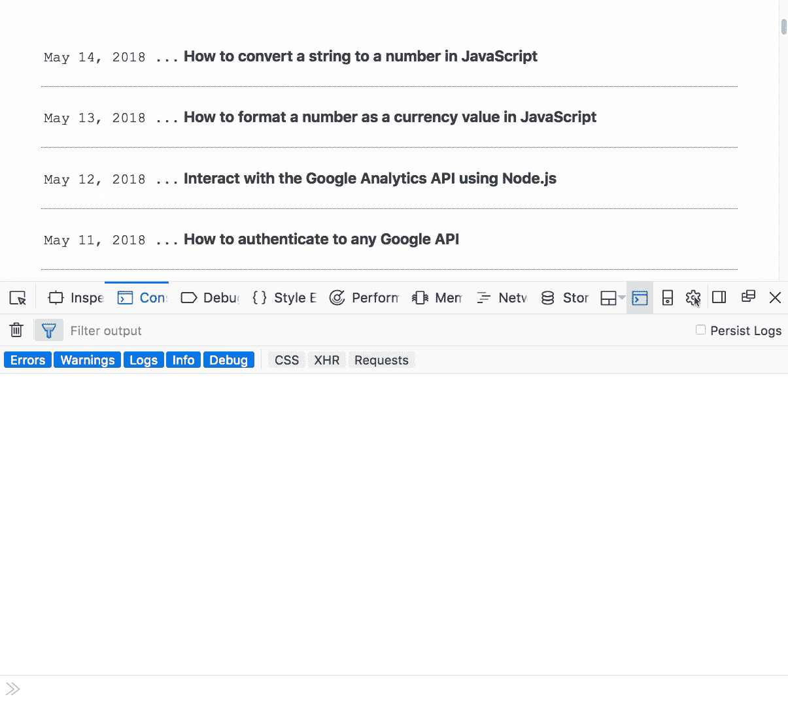

## 拍摄单个节点的屏幕截图

在元素检查器中选择一个元素并右键单击，然后选择**截图节点**:

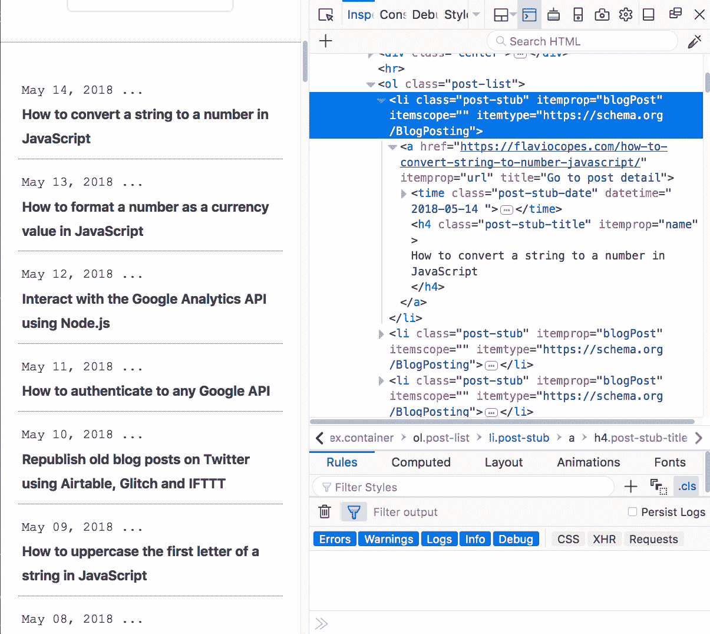

# 从元素中移除类

有时一个元素有多个类，您不能立即发现哪个类引入了特定的样式属性。通过选择一个元素并点击规则面板右上角的`.cls`按钮，您可以看到所有类的列表，并且您可以轻松地禁用/重新启用它们。

在那里，您还可以向该元素添加一个新类:

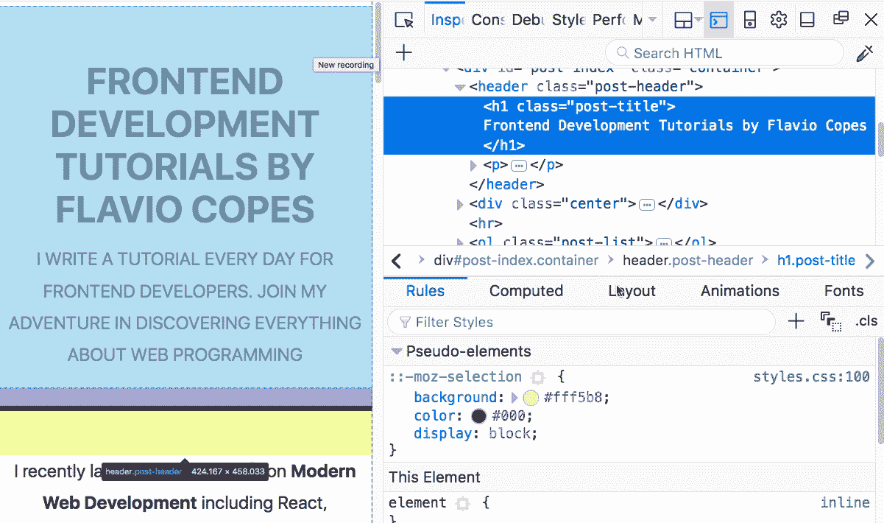

# 元素面板中的拖放

在“元素”面板中，您可以拖放任何 HTML 元素，并更改其在页面中的位置

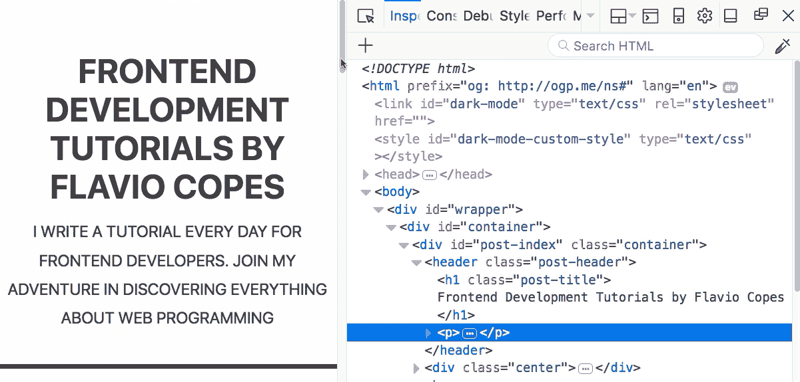

# 引用控制台中当前选定的元素

在 Elements 面板中选择一个节点，并在控制台中键入`$0`来引用它。

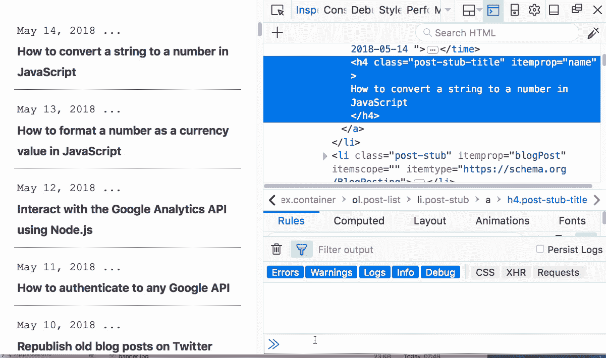

## 选择器 API 快捷方式

Firefox 开发工具控制台的一个非常酷的特性是选择器 API 的快捷方式:

*   `$()`是`document.querySelector()`的快捷方式
*   `$$()`是`document.querySelectorAll()`的快捷方式

# 使用控制台中最后一次操作的值

使用`$_`引用控制台上一次执行操作的返回值

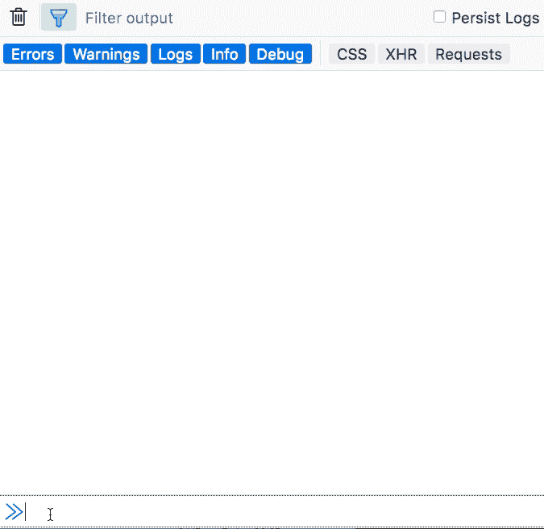

## 在控制台中引用检查器中的任何元素

右键单击任意元素并选择**在控制台**中使用。它将被赋给一个临时变量。

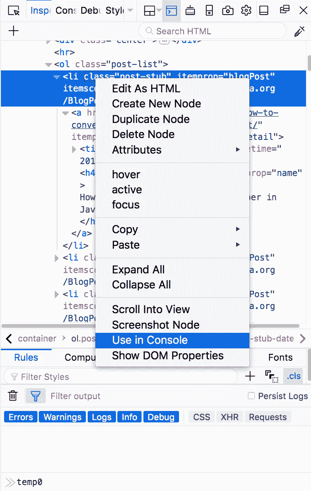

# 调试 JavaScript

您可以从调试器面板中设置 JavaScript 源文件的断点，并且可以设置要监视的 JS 文件中的任何表达式:

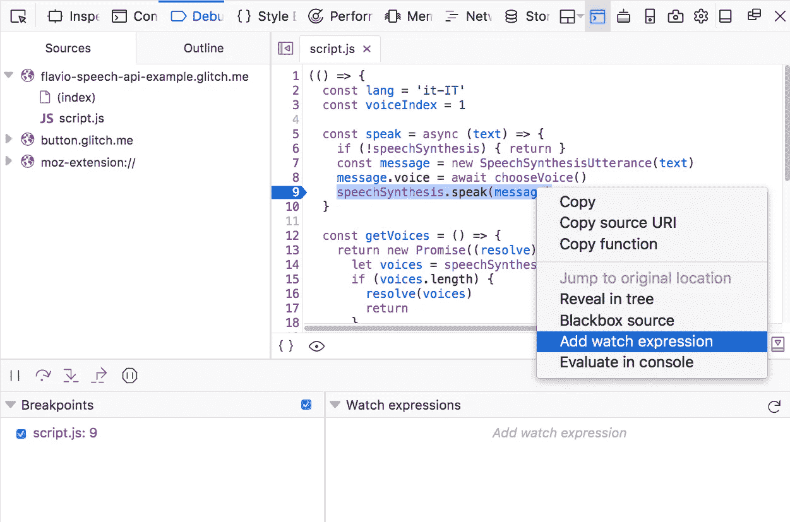

重新加载页面时，断点和观察表达式设置保持不变，脚本将在所需位置停止:

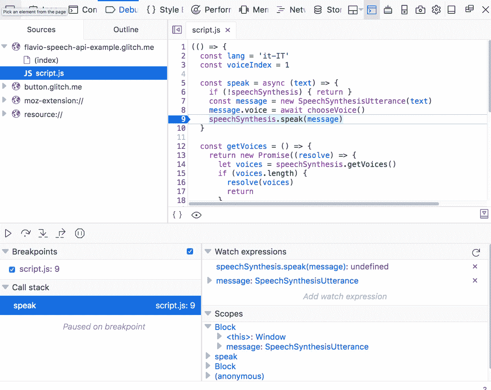

# 找出实际使用的字体

CSS 中的`font-family`允许你设置一个要使用的字体列表，如果第一个没有找到，它将返回到第二个，以此类推。但是，当您查看页面时，如何知道实际应用的是哪种字体呢？是带下划线的那个:

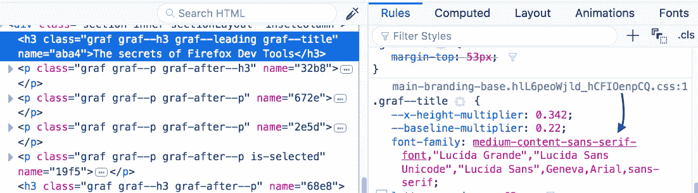

# 检查 CSS 网格

CSS 网格是最近新出现的令人惊奇的 CSS 特性。

Firefox 开发工具有一个很棒的检查器，在使用网格时帮了我们很大的忙:

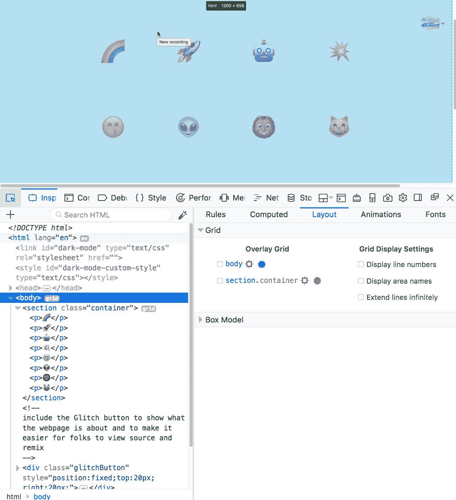

如果您使用**网格模板区域**，您可以使用“显示区域名称”复选框显示它们:

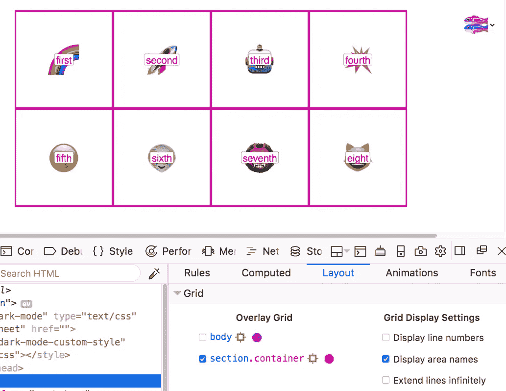

> 对学习 JavaScript 感兴趣？获取我的 [JavaScript 手册](https://flaviocopes.com/page/javascript-handbook)