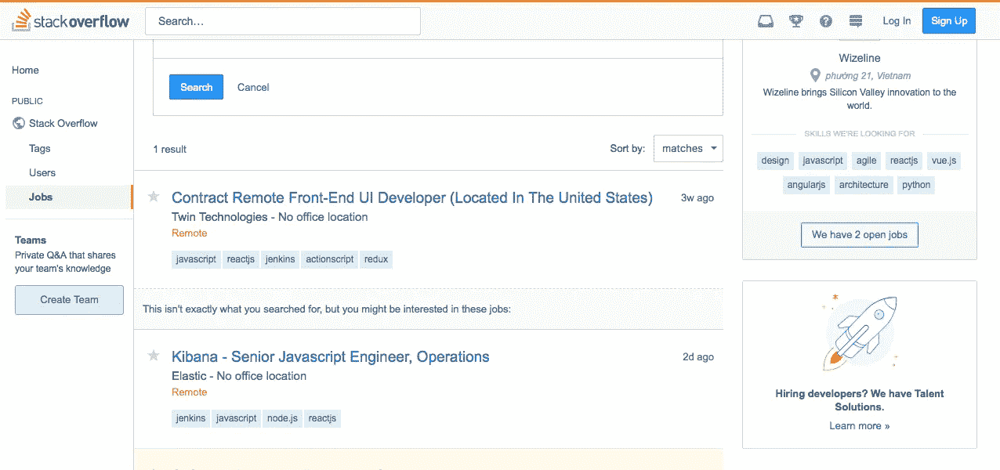
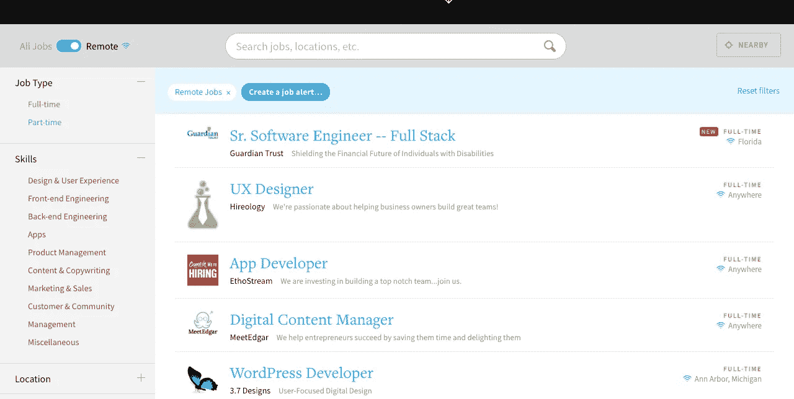
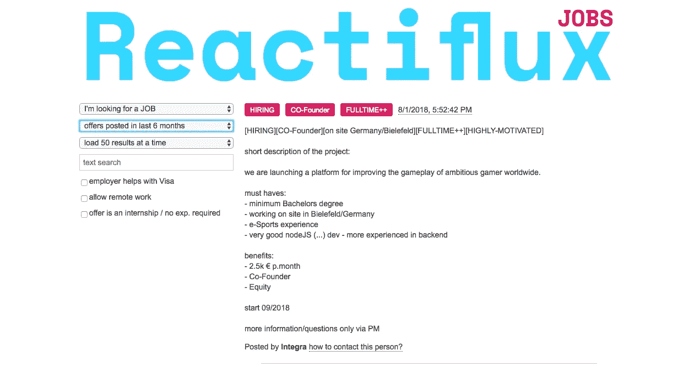
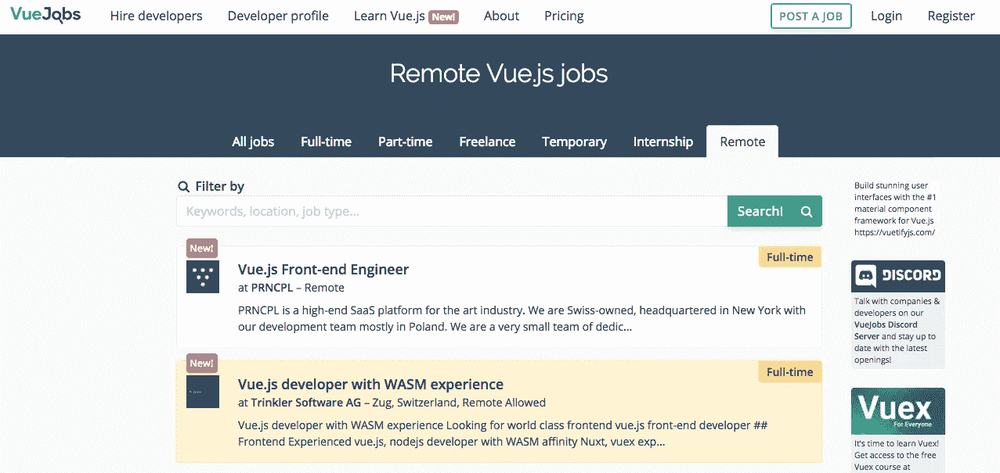
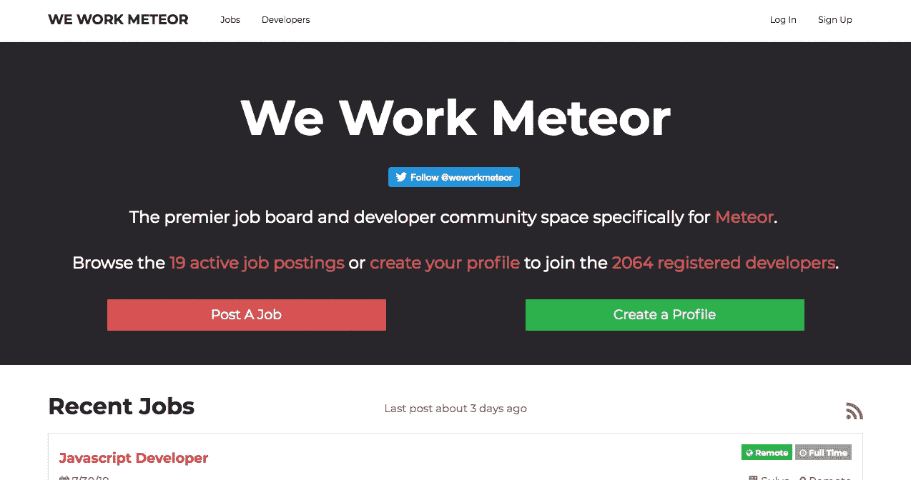
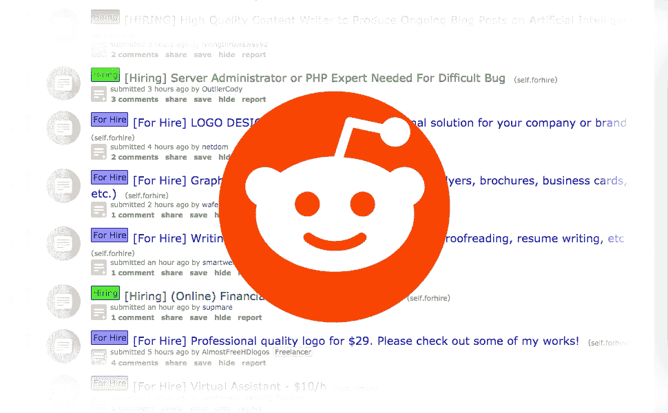

# 寻找下一个远程网络开发自由职业项目的 10 个免费地点

> 原文：<https://medium.com/hackernoon/10-free-places-to-find-your-next-remote-web-development-freelance-project-ee6bc5476a07>

你是一个正在寻找下一个远程自由职业项目的网络开发人员吗？

像 UpWork、Freelancer 和 Fiverr 这样的中间人市场并不是你唯一可以找到远程工作的地方。有更好的方法找到好的远程自由职业项目。

远程项目会一直发布在各种地方，比如社交媒体网站、多个工作公告板和论坛。

在这篇文章中，我将与你分享 10 个不同的网站，你可以查看这些网站来找到你的下一个远程自由职业网站开发项目。

# 1) Hubstaff 人才职位

Hubstaff Talent 是一个不经常被寻找工作的网络开发人员提及的网站。**这里发布的大部分工作都向远程工作者开放。**

在过滤选项方面，您可以轻松地在全职、小时合同和固定价格工作之间进行过滤。

【链接:】[https://talent.hubstaff.com/search/jobs](https://talent.hubstaff.com/search/jobs)

# 2)堆栈溢出作业

堆栈溢出工作是大多数远程技术工作发布的地方。是的，这里发布了许多全职职位，但许多自由职业者的合同职位也在这里发布。

堆栈溢出给了你很多过滤选项。您可以筛选职务是否是远程的，以及是合同职位还是全职职位。最后，它允许您基于技术标签(html、javascript 或 react)或基于您的角色(前端开发人员、后端开发人员、开发人员等)进行过滤。)通过过滤，您可以获得您需要的具体信息。

**链接:**[https://stackoverflow.com/jobs](https://stackoverflow.com/jobs)

# 3)真实的工作

Authentic Jobs 是另一个很好的资源，可以帮助你寻找一个远程的网络开发职位。**这个职位公告板不是专门针对技术的，但是很多网络开发职位会在这里发布。**

它为您提供了将[远程](https://hackernoon.com/tagged/remote)工作过滤为突出主选项的选项。它还允许您在全职和兼职职位之间进行筛选。它给你的另一个过滤选项是技能之间。因此，如果你是一个前端开发人员，你可以确保这些是你唯一看到的位置。

**链接:**[https://authenticjobs.com/](https://authenticjobs.com/)

# 4)反应通量作业

Reactiflux 其实是一个 Slack 社区，不是一个网站。他们有一个#jobs 频道，在那里发布新的工作。但是，Reactiflux 的优秀员工也会将这些工作发布在他们的工作公告板上。

**这里发布的大部分工作都与前端 web 开发有关，有时非常具体到** [**React.js**](https://reactjs.org/) **框架。如果你是一名正在找工作的前端网站开发人员，这是一个很好的信息来源。**

过滤选项包括能够过滤远程工作和仅抓取在特定时间范围内发布的工作。

**链接:**[http://jobs.reactiflux.com/](http://jobs.reactiflux.com/)

# 5) JustUXJobs

JustUXJobs 是一个以设计为中心的工作板，对于寻找远程职位的以设计为导向的前端 web 开发人员来说也很棒。

此网站上没有过滤选项。这个更新不频繁，所以没什么大不了的。滚动一下，看看右边的标签是否与你要找的相匹配。

**链接:**http://justuxjobs.com/

# 6)代码打开作业

CodePen Jobs 是由 CodePen 的创建者开发的一个前端工作板。CodePen Jobs 是前端开发人员寻找远程职位的最佳选择之一。

它不提供任何过滤选项，但它会显示作业是否是远程的以及是否是全职的。

**链接:**[https://codepen.io/jobs/](https://codepen.io/jobs/)

# 7) Vue 工作

Vue Jobs 是一个专注于 Vue.js 的求职网站。如果你是一个前端开发人员，已经知道 Vue.js 或者愿意学习它，这是一个很好的资源。

筛选选项是有限的，但它们在标题中有选项卡，让您在兼职、全职和远程职位之间切换。

**链接:**https://vuejobs.com/

# 8) WeWorkMeteor

WeWorkMeteor 是一个专注于 Meteor.js 的求职板。从我在这个工作论坛的经验来看，不是所有的工作都是针对流星的。此外，大多数工作都是远程自由职业者或合同工。

同样，这里没有过滤选项，但你不需要它们，因为这是一个非常具体的工作板。

**链接:**https://www.weworkmeteor.com/

# 9) Reddit

Reddit 有许多技术和框架相关的子栏目，可以发布职位信息。许多客户在寻找具有特定技能的开发人员时，会来到这里创建一个帖子。

我以前写过一篇文章，讨论应该搜索哪些子网站，以及发送信息的最佳方式，以最大限度地增加你获得远程职位的机会。点击[这里](https://hackernoon.com/how-to-find-your-next-remote-freelance-client-on-reddit-bcdd3cbd533c)阅读那篇。

【链接:】[https://www.reddit.com/](https://www.reddit.com/)

# 10)推特

信不信由你，Twitter 也是寻找自由网络开发项目的一个非常好的来源。我以前在 Twitter 上找到过多个自由职业者的职位。如果你知道如何构思你的信息和搜索正确的关键词，你很容易从人群中脱颖而出。

我还写了一篇专门针对 Twitter 的文章，讲述如何最好地利用 Twitter 来寻找和获得你的下一个远程自由职业项目。点击[此处](https://hackernoon.com/how-to-find-your-next-remote-freelance-client-on-twitter-fa1d2c52f77e)了解更多信息并阅读该文章。

**链接:**https://twitter.com/search-home

# **结论:走出去，找到你的下一个远程项目**

这是 10 个额外的 UpWork，Freelancer 和 Fiverr 替代品，你可以用它们来代替你的下一个项目的搜索。

要想获得一个好的偏远职位，归根结底就是要搜索每天发布招聘信息的网站，当你找到好工作时要迅速伸出援手。用一封出色的电子邮件求职信尽快联系到您。

# 如果你需要一些关于如何写一封好的求职信的建议，请阅读下面这篇文章

 [## 如何写求职信电子邮件以赢得你的下一个远程自由职业项目(免费模板)

### 作为自由职业者，我们赢得客户的主要方法是写建议书，通常以电子邮件的形式。我们已经发送了…

medium.com](/@dericksozo/how-to-write-cover-letter-emails-to-win-your-next-remote-freelance-project-free-template-5530929364f1) 

祝你好运，感谢你的阅读！