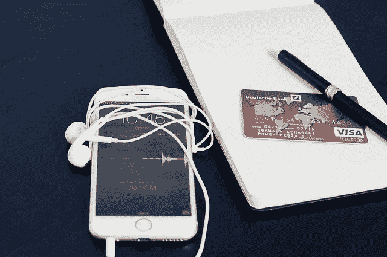

# 成功直运业务的 10 招

> 原文：<https://medium.com/hackernoon/10-hacks-for-successful-dropshipping-business-ef4fad4b8750>

近年来，直运业务模式非常适合新创业者，因为它允许在不需要实体店或库存的情况下销售产品。这种模式使产品制造商能够生产、包装并直接向客户运送订单，而[企业](https://hackernoon.com/tagged/business)所有者无需亲自处理产品，从而降低了企业风险，因为企业所有者只需为销售给客户的商品付款。由于大多数 dropship 商店易于建立，成本低，并且大部分可以自动化，它已经成为大多数在线商店所有者采用的最佳商业模式之一。

以下是新网店店主考虑的 10 大诀窍，他们希望推出一家成功的直运商店，并打入电子商务行业；

**黑客# 1——有一个利基**

经营一家网上商品琳琅满目的综合商店，这种想法乍一听起来可能令人兴奋，但细看之下，这可能是让商店走向失败的第一步。这是因为经营一家过于一般化的商店会减少明确特定受众的机会，这反过来会使品牌推广变得非常困难。然而，利基商店更容易清楚地定义产品的正确受众，并有助于将重点缩小到更多的潜在购物受众，这是成功的关键。

在考虑利基市场时，分析趋势、目标受众和评估竞争对手是很有帮助的。对所钻研的领域有所了解并充满热情也是至关重要的，因为这最终将在建立一个商店以在其利基市场取得成功方面发挥关键作用。

**黑客# 2——验证供应商**

一个品牌的声誉反映在它所提供的产品的质量上，对与哪些供应商合作以及什么产品代表一个品牌的挑剔怎么强调都不为过。虽然决定放弃哪些产品可能是比较容易的部分，但审计合作伙伴的供应商也应该同等重要。选择供应商时需要考虑的一些细节包括如何管理产品内容和数据、库存更新的频率、运输时间和成本，更重要的是如何处理退货。值得将名单缩小到可信度高、争议率低的供应商。

如果某个供应商的表现低于标准，则有必要尽快更换该供应商，因为直运需要高效的透明度和协作来创造最佳的客户体验。

**破解#3 通道**

随着直运的出现及其在电子商务领域越来越受欢迎，已经有无数的渠道向在线店主提供服务。商店决定使用什么渠道是值得考虑的。这些渠道为店主提供预制的商店模板，以适应商店的利基，从而简化了经营在线商店的过程。

确保选择的任何渠道都有正确的集成，以及特定商店所需的插件是至关重要的。由于这个原因，一些没有技术倾向的店主通常会雇佣一个专家根据特定的需求来开发一个商店。

**黑客# 4——品牌化**

创建一个品牌是建立一个商店声誉的关键，如果做得正确，将永远保证回头客。品牌通常包括一个商店的名称，标志，设计布局，以及任何利基产品销售的全面感受。虽然直运有助于偷工减料，但有效的品牌塑造给客户留下持久的印象是至关重要的。

在开店之前，观察其他利基相关的商店，看看什么是有效的，以及如何将这些商店塑造成你的品牌商店，从登陆页面到产品描述，图像质量等等。为了开始品牌化，像 Turfmob 这样的网站在现成的品牌域名上提供很好的交易。

专业提示:在商店的网站上添加信任徽章通常可以改善这类商店的印象，增强顾客结账时的信心。

**黑客# 5——自动化**

不管商店是作为全职工作还是作为被动的收入来源运营，商店自动化的方面越多，店主就越有自由专注于营销等其他关键要素。虽然大多数直运应用程序有助于自动处理协议，但拥有社交媒体自动驾驶仪可以方便地消除在 Twitter 和 Pinterest 等各种社交媒体平台上发布新产品和内容的麻烦。

使用 [EMERGE 应用](http://emergeapp.net)可以实现商店的合理组织，该应用有助于在一个简单易用的平台上从系统中自动创建报价、销售订单和电子邮件。对于有团队成员的商店，EMERGE App 还提供支持团队成员之间共享和协作的功能。更好的是，EMERGE 应用程序适用于 B2B 和 B2C 电子商务商店，并提供对商店销售的更深入分析，以帮助成功的营销。

**黑客# 6——客户服务**

卓越的客户服务是 dropshipper 最好的朋友，对于店主来说，这是从竞争对手中脱颖而出的最佳方式之一。大多数情况下，顾客不仅为产品买单，他们还为购物体验买单，因此商店必须尽最大努力确保顾客的快乐和满意是维持优质客户关系的重中之重。

与客户互动，向他们发送感谢卡，发放赠品和折扣券，所有这些都让客户感到受到重视，这不仅通过推动销售提高了营销投资回报，还增加了回头客的数量。

**黑客# 7——营销**

一个没有合适受众的令人惊叹的商店不过是漂浮在互联网上的另一个不知名的网站。直运的好处显而易见，因为它为企业主腾出了大量时间，让他们可以更加专注于收紧营销策略和为他们的商店吸引流量。首先，三个值得探索的营销渠道是谷歌 AdWords、脸书/Instagram 广告和 Pinterest 广告。

除了这些外部渠道，值得考虑的还有优化转化的网上商店。[工具](https://hackernoon.com/tagged/tools)为了显示稀缺性和紧迫性，适当的搜索引擎优化还应该使用客户评论和内容来推动长期销售。因此，拥有顾客和产品信息以及足够的商店历史数据，以最少的广告支出和较低的购买成本有效地锁定正确的受众是至关重要的。

**黑客# 8——处理退货**

与其他商业模式一样，直运模式也经历了许多不时出现的潜在问题，从货物丢失到产品不令人满意等等。因此，需要对退货进行计划，尤其是当涉及直运时，这可能会有点复杂，因为在到达客户手中时，无法完全保证产品的性质。

从一开始就与供应商讨论政策和协议，明确一旦发生退货，谁会收到退货。作为企业主，获得直接回报有助于提高客户服务质量。但是，这也引入了物流成本。当供应商接受直接退货时，会减少麻烦，但不同的供应商可能会有不同的退货说明。

尽管在经营直运业务时有收到退货的趋势，但尽量少收退货并避免处理复杂是很重要的，因为这可能会影响整体客户满意度。

**黑客# 9——分析**

趋势总是动态的，客户行为也经常变化。Dropshipping 企业主应该始终关注新创意、广告策略、品牌，甚至是你所在领域的潮流产品的竞争性定价。密切关注竞争对手有助于为向最佳受众进行有效营销开辟新途径。

**黑客#10 —参与其中**

经营一个成功的直运业务需要大量的奉献和长期目标。投入时间和金钱，以确保在了解新兴趋势和行业内正在消失的事物时，你仍然处于混合状态。这将最终帮助你不断满足客户的需求，并帮助你与你的竞争对手并驾齐驱。