# 来自我的家庭健康实验的 10 个观点

> 原文：<https://medium.com/hackernoon/10-insights-from-my-at-home-health-experiment-f57332dbfbcf>

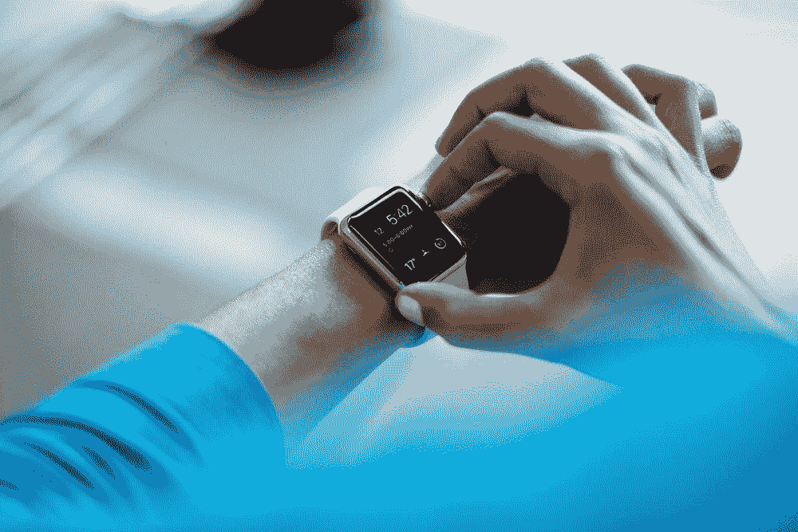

credit: [https://unsplash.com/photos/rCOWMC8qf8A](https://unsplash.com/photos/rCOWMC8qf8A)

在 7 月份，我决定探索如何通过详细记录生物读数和日记来分析和评估我的生活，从而找到改善我的 T2 健康的机会。

下面我描述了我记录的原始数据和我自己发现的因果关系和相关性的 10 个关键见解。我希望这有助于为改善你自己的健康提供一个有趣的框架——如果你想要原始数据，请[给我发电子邮件](mailto:chibuk.jd@gmail.com)。

这里得出的见解在基础上不是定量的，而是对我已经知道的项目的确认——尽管我现在有一些数据来支持我自己的这些假设。

希望你能使用我收集的数据类型和下面显示的相关方法来发现你自己的。

# 原始数据

*   睡眠时间、质量、睡前活动

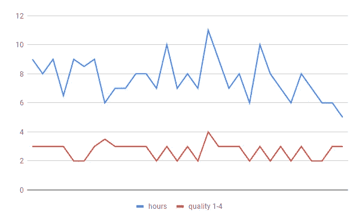

*   梦的描述——关于我梦到了什么的简单文字云——

> 记住具体细节中的公司和产品——有意思…

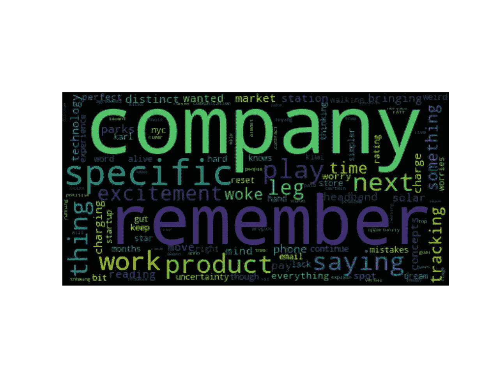

*   饮食项目:我决定关注我吃的东西，而不是热量

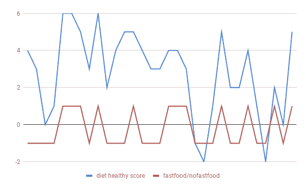

*   白天的精神状态->精神状态和滚动总和

随着这个月的进展，我的精神状态在月中后持续改善。厉害！

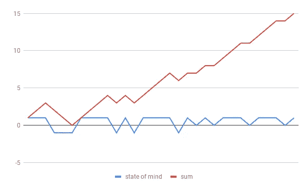

*   每日总步数

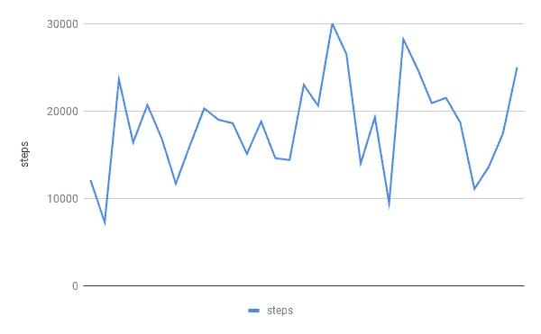

*   血压

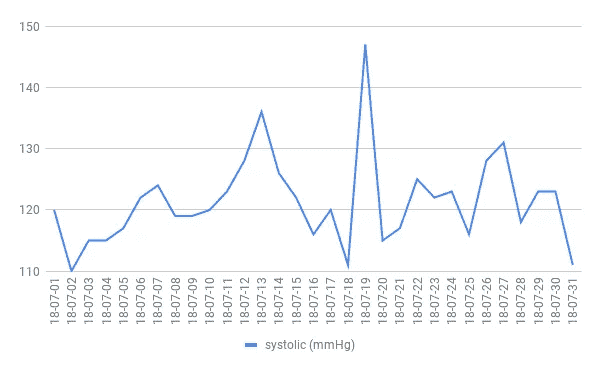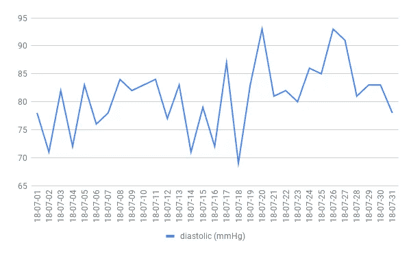

*   静息心率

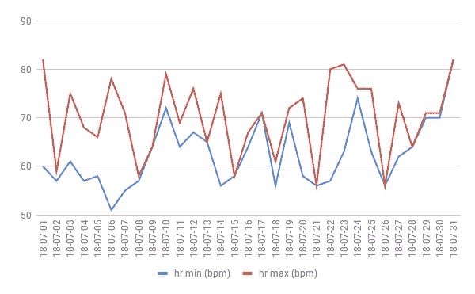

*   温度

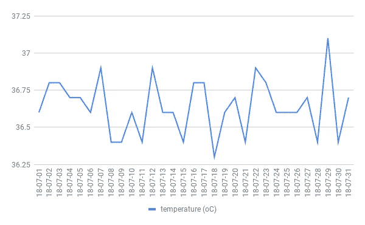

我的发现包括两种核心类型:因果关系和相关性

# 10 个关键见解

## 原因

1.  我发现当我吃快餐的时候(汉堡，比萨饼等等)。)=睡眠质量比其他晚上低 1 级

2.除了一些异常值，当我睡眠时间在 7-8 小时之间时，我的血压最稳定在大约 110-120 毫米汞柱。

有趣的是，7 小时标志是最近从 Fitbit 的海量数据实验中发现的[，可在此处获得](https://blog.fitbit.com/sleep-study/)。

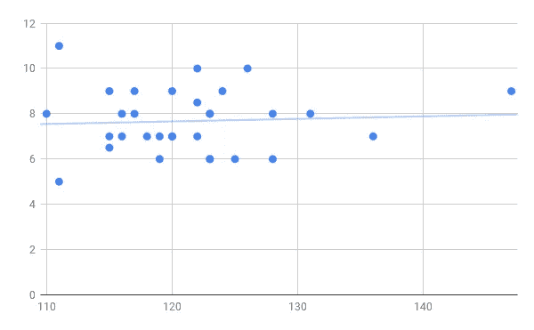

Hours Slept vs. Systolic Blood Pressure (mmHg)

## 相互关系

3.我走得越多，我就越乐观:

*当我走了> 15，000 步=心态总体上更积极*

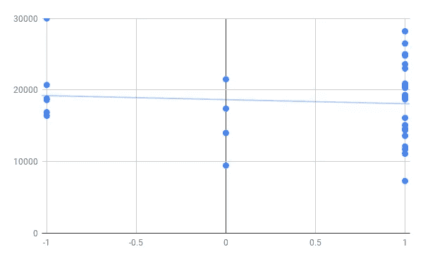

Steps vs. State of Mind

*一个月里我只有 1 天走了 22000 多步，对前景持消极态度。*

4.我吃得少的日子往往是我走得多的日子。)

5.当我吃得更健康时，第二天晚上的睡眠质量比我吃得更差的时候高一个数量级。

6.我睡得越多的日子->我的梦越消极

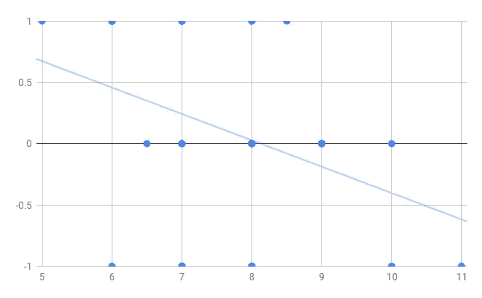

Dream State vs. Hours Slept

7.我走得越多，我的收缩压就越高

8.我睡得越多，第二天血压就越高

Systolic Blood Pressure (mmHg) vs. Hours Slept

9.我睡得越多，我的睡眠质量就越高

10.在接下来的一两天里，我吃得更差，我倾向于更消极的心态——我想知道我是否意识到了这种负面影响，然后反弹回来——

> 如果我跳过了吃更糟糕的部分，会有什么结果。

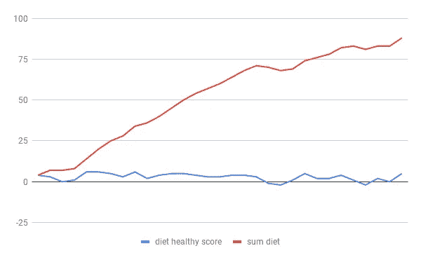

如果你喜欢这篇文章，请鼓掌，谢谢👍

[阅读我的上一篇文章:10 种聪明工作并赢得胜利的方法](/swlh/10-ways-to-work-smart-and-win-bd2a3d927b71)