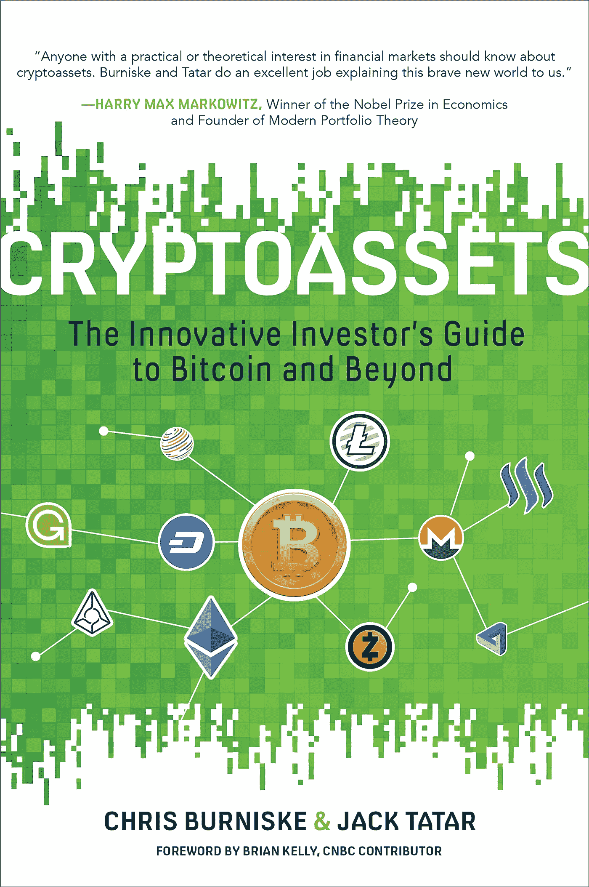
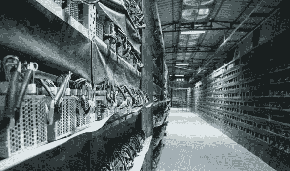
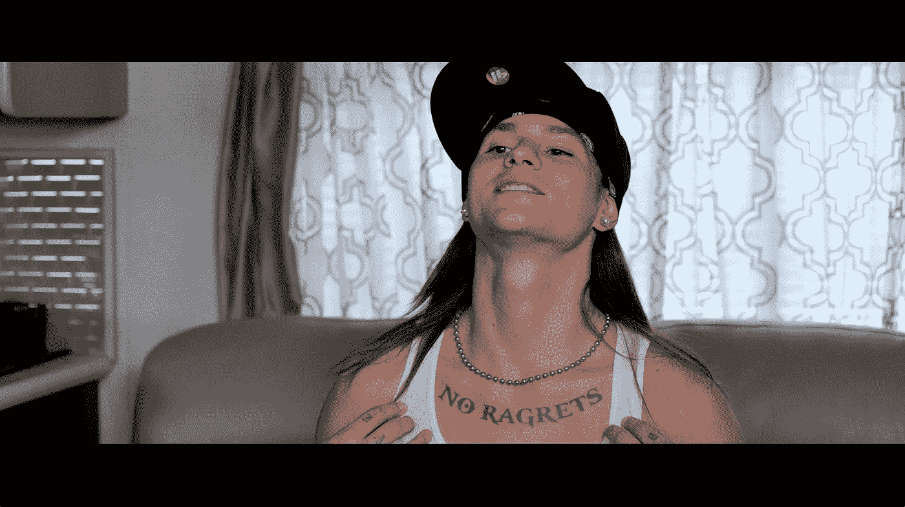

# 加密资产的 10 大要点:比特币及其他创新投资者指南…

> 原文：<https://medium.com/hackernoon/10-key-takeaways-from-cryptoassets-the-innovative-investors-guide-to-bitcoin-and-beyond-59114336dd7e>

如果你完全是投资新手，但你对加密货币感兴趣， [***加密资产:比特币及其他创新投资者指南***](https://www.amazon.com/Cryptoassets-Innovative-Investors-Bitcoin-Beyond/dp/1260026671) 是*你需要阅读的*书。

但我们不要自欺欺人。,,

很有可能你宁愿被网络迷因和猫的 gif 娱乐，也不愿读一本书接受教育——至少这是研究指出的。

S o，把你的最大利益放在心上……我已经去为你读了这本书，摘录了 10 个最佳关键要点，以帮助你实现 2018 年的加密货币投资目标。

这本书分为三个部分，分别是什么、为什么和如何进行加密资产投资，它稍微面向老派金融投资者(即购买股票和债券的人)。

然而，它仍然有一个宝贵的见解宝库，特别是对于我称之为“纯加密投资者”的人，也就是那些根本不拥有任何股票、债券或其他传统金融资产的人..

以下 10 个要点是我遇到的对“纯”加密投资者最有价值的见解，这些投资者正在寻求他们在加密之地的狂野西部所提供的辉煌奖金中的份额。

这篇文章不适合对加密货币和资产完全陌生的人，如果那是你，请帮自己一个忙，通过 [**点击此处**](https://www.amazon.com/Cryptoassets-Innovative-Investors-Bitcoin-Beyond/dp/1260026671) 拿起这本书，这样你就可以了解全貌了。

事不宜迟，10 个关键要点是..

# **1。“恐惧和贪婪仍然是人类特有的特征，可以并将在加密资产中找到一席之地。”**

正如本杰明·格拉哈姆在他的杰作 [*《聪明的投资者*](https://www.amazon.com/Intelligent-Investor-Collins-Business-Essentials-ebook/dp/B000FC12C8/) 中所吹捧的，你希望专注于投资的内在价值，而不被市场的非理性行为(即情绪行为)所困。

(如果你不知道本杰明·格拉哈姆是谁，他是巴菲特的导师。)

管理你的情绪说起来容易做起来难，但是在混乱的时候保持头脑冷静、理性和冷静将会使你在其他人都失去理智的时候取得胜利。如果你还没有跟上潮流，我强烈建议你开始冥想。

一旦你能够更好地管理自己的情绪和感受，你就可以进入下一个阶段，即分析其他市场参与者的情绪和感受，以及这对市场和你的投资可能意味着什么。

# ***2。这不仅仅是一些庞氏骗局，分布式账本技术又名区块链是在这里停留，并可能推动未来。***

“It’s your boy, Carlos Matos!”

我对那些没有掉进加密、比特币、[、区块链](https://hackernoon.com/tagged/blockchain)的兔子洞的人，以及所有这些“神奇”的东西是如何工作的，感到很欣慰。

这些人真的错过了美好的生活。

我说的美好生活是指这样的生活，在这种生活中，你会忘记加密前生活中的所有事情，因为你现在每天都要花一整天的时间，在所有与加密相关的事情上磨磨蹭蹭。

*对于那些没有享受过被吸进这个兔子洞的乐趣的人来说，你必须意识到的是…*

融合的技术总是会遭遇严格的审查和怀疑，因为人们天生抗拒改变，并且倾向于害怕不熟悉的事物。

另一方面，表达坚定信念的早期采用者使这些新兴技术和创新得以问世，并启动滚雪球效应，加速新兴技术走向主流采用。

> “你应该像对待 20 世纪 90 年代初的互联网发展一样，认真对待这项技术(区块链)。这类似于通过电子邮件来赚钱。”
> ——布莱斯·马斯特斯在 2015 年桑德勒·奥尼尔&合伙人投资者大会上对华尔街银行家的演讲

# **3。不要把所有东西都叫做加密货币！Cryptoassets 是一个更好的术语，因为在加密中本质上有 3 种广泛的资产类型:**

1.  加密货币(用作货币或支付手段的加密货币)

2.密码商品(提供数据、存储容量或计算能力等商品的密码)

3.加密令牌(或者提供对区块链上的成品和服务的访问的实用令牌——这些本质上是允许你访问和使用分散应用的令牌)

# **4。不要忘记开发商和矿工！它们对你投资的任何加密资产的长期生存至关重要！**

开发人员和矿工是在后台进行修补以使一切顺利运行的奇才。

如果你在这个领域，了解和认识这个领域的其他参与者是一个好主意，开发者和矿工也不例外，我甚至认为他们可能是最值得关注的参与者之一。

在加密领域，开发人员是快速迭代、修复漏洞和改进加密网络和平台的人，而矿工则提供保护加密网络和保持区块链正常运行所需的硬件和资源。

注意:谨慎的做法是考虑世界上可用的计算散列能力的总量，以及这一总量是否足以支持所有日新月异的区块链项目。]

从上面写给我自己的纸条来看，我的猜测是:

1.  矿商要么在未来通过中国式的在空仓库里架设采矿设备大赚一笔；
2.  这些区块链项目中有很多注定要死亡和失败(不要嘘夏洛克！)**因为** (1)目前世界上没有那么多熟练的区块链开发者,( 2)可能没有足够的硬件、矿工或资源来支持不同的区块链问世；运筹学
3.  一个新的共识系统可能会取得成果，要么停止，结束，或减缓区块链工作证明的采用，使矿工成为多余。

我相信以上三种情况都有可能发生…这更多的是每种情况可能发展到什么程度的问题。

Bitcoin Mining Rig Warehouse

# **5。** [**现代投资组合理论**](https://www.investopedia.com/walkthrough/fund-guide/introduction/1/modern-portfolio-theory-mpt.aspx) **和** [**夏普比率**](https://www.investopedia.com/terms/s/sharperatio.asp) **解释了为什么你可以长期看好加密市场**

机构和传统投资者*将*最终希望参与加密资产。

由于加密市场(在这种情况下是比特币)和传统金融市场之间的相关性几乎为零，将比特币加入投资组合不仅会降低投资组合的整体风险，还可能增加回报。

这对传统投资者来说意味着，将加密资产添加到他们的投资组合中是一个明智的举动，因为这将降低投资组合的整体风险，同时仍然保持或允许整体回报的增加。

尽管比特币的波动性很大，但这背后的神奇之处可以用[现代投资组合理论](https://www.investopedia.com/walkthrough/fund-guide/introduction/1/modern-portfolio-theory-mpt.aspx) (MPT)来解释——你需要阅读这本书或搜索谷歌来解决这个问题，因为我没有时间或空间在这里讨论它。

# **6。美元成本平均到您的进入和退出市场。**

如果你在 2013 年 11 月购买了价值 100 美元的比特币，当时比特币刚刚达到历史高点，那么同样的 100 美元在 2017 年 1 月将只值 83 美元！

如果你选择了“平均成本”,你会有更好的回报(或者至少损失更少)。

如果你不知道平均成本是什么，它实际上是在几天甚至几周内买入或卖出你的加密资产。

这意味着你以不同的价格点购买或出售密码，而不是把所有东西都放在一个单一的价格上。

例如，如果你有 1000 美元投资，你可以将这 1000 美元分成四份，每份 250 美元，并在 4 周内购买比特币或任何其他密码，这样你的“平均美元成本”就达到了。

这是一种降低风险的好方法，也有助于在你在历史高点购买加密资产，却看到它在此后的每一天和每一周都大幅下跌的情况下，将遗憾降至最低。

# **7。法规对 crypto 和 ico 尤其意味着什么..**

随着政府在监管加密方面取得进展，甚至有符合 [**法规的交易所进入市场**](https://hackernoon.com/why-this-new-cryptocurrency-exchange-might-just-make-you-rock-hard-51b3a5916c0a) 谨慎的做法是考虑这些因素将如何影响整个加密市场，在这种特殊情况下，让我们以 ICOs 为例。

安德森·霍洛维茨(Andreessen Horowitz)的分析师本·埃文斯(Ben Evans)在 2015 年发表了一份关于首次公开募股(IPO)的报告，显示投资价值如何随着时间的推移更多地转向私人投资者。

1999 年，科技公司 IPO 所需时间的中位数是 4 年，到 2014 年，这一时间延长至 11 年。

这意味着散户投资者——像你我这样的人——必须等待近 3 倍的时间才能获得购买和投资这些科技公司的机会。

这也意味着私募市场和投资者有更多的时间向这些公司投入更多资金，并在其中建立更大的投资组合。

IPO 时间的推迟是由于监管增加以及 2008 年的金融危机。由于更多的监管，这导致了更稳定的 IPO，并降低了投资者在投资这些 IPO 时面临的风险，但风险越小，回报越少。

自 1986 年微软首次公开募股以来，新技术公司的大部分回报都被私人投资者获得，私人资金增长了 20，000%，而公共资金增长了 60，000%。

然而，脸书在 2012 年的 IPO 中，私人资金增长了 80，000%，公共资金增长了不到 1，000%。

## 那么我们把这些点联系起来怎么样…

IPO 是指一家私人公司向公众出售其股票，同时在证券交易所上市，以便任何人都可以购买、出售和交换该公司的股票。

Spotify 是一家即将进行 IPO 的科技公司。

谈到 ico，它们与 IPO 有一些相似之处。例如，当加密资产被解锁并变得可交易时，或者当硬币在主要交易所上市时，允许每个人现在买卖加密资产/令牌。

ico 和 IPO 并不完全一样，但是很多人都用它来做比较，所以我现在就用它来做比较。

如上所述，Evan 的报告中的一个重要观点是，自 1999 年以来，由于政府监管和干预的增加，科技公司经历 IPO 的时间从 4 年增加到 11 年。

我们已经看到并将继续看到同样的现象发生在 ICO 市场。

## ICO 程序

从一开始，ico 根本不要求收集任何 KYC/反洗钱信息，但现在这是一般的最佳做法，导致 ico 的流程更长。

## 回报越来越向私人投资者倾斜

然而，最近，越来越多的价值似乎正从公众转向私人投资者市场。

几个 ico(**咳** 宝石**咳** Refereum)已经选择取消和放弃他们的公开人群销售，因为他们设法通过私人预售来满足他们的硬性指标。

预售投资者不仅占据了大部分分配，此外，他们还获得了折扣和奖金，因此他们基本上是以低于公开众筹价格的价格购买加密资产。

## 新法规

随着法规的生效，由于需要遵守越来越严格的信息和程序，预计 ICO 流程将需要比现在更多的时间。

这意味着投资者在参与 ico 时面临的风险要小得多，但回报也可能因此降低，尤其是如果回报继续转向私人投资者市场的话。

# **8。加密资产的价值背后有两个主要驱动因素:效用和投机价值。**

投机价值是由人们预测特定加密资产在未来可能被广泛采用而驱动的。

这里的信念是，加密资产的使用和采用越广泛，价格就会越高，因为需求会增加。

一般来说，随着加密资产随着时间的推移而成熟，越来越少的总*价值将来自投机价值，因为它的效用价值将随着时间的推移而增加，并开始“取代”曾经投机的加密资产的价值。*

例如，我们可以说，一项加密资产的投机价值来自于人们相信该团队将能够在某个特定日期执行和运行他们的主网络。

这种“投机价值”随后将被那些相信事实如此的人定价到加密资产中，并且活的主网络还将在未来为加密资产产生甚至更多的价值。

然而，当主网上线时，由于预计主网将在该日期上线并运行，因为团队现在已经执行并完成了工作，所以价格将不再有任何进一步的投机价值。

主网络现在为访问和使用它的人提供了实用价值。

然而，话虽如此，投资者仍有可能进一步推测，因为主网是关于团队可以继续执行的未来机会、合作伙伴关系或计划里程碑的直播。

一旦投资者认为加密资产几乎没有投机价值，这将意味着价格现在主要由加密资产的效用价值反映，因此已经达到投资者的“最大”价值。

在这一点上，大多数投资者会卖出他们的头寸，因为投机价值所剩无几，因此价格进一步升值的可能性很小。

# **9。加密市场的波动非常剧烈**

任何在加密领域摸爬滚打的人都很熟悉市场的波动性。然而，对于外行人来说，市场的波动至少可以说是惊人的。

比特币价格从几个主要的波峰和波谷的波动和下跌平均比其峰值价格下降了 63%，最高价格下跌了 85%和 93%。

比特币在 2017 年 12 月达到 19500 美元的历史高点后，在 2018 年 2 月下跌 69%至 6000 美元的低点。

当价格急剧下跌时，通常发生在价格呈抛物线上升之后，紧接着是缓慢稳定的持续下跌。

在 17 世纪的郁金香狂热泡沫中，**普通人，投资经验最少的人在疯狂的人群中被卷了进去，他们受到的打击最大。**

因此，除非你愿意不顾市场的波动而坚持下去，否则更明智的做法可能是在这个市场观望，直到你收集到更多的资金，或者等到市场波动性小得多的时候——不过，那时回报可能会低得多。

# 10。基本面分析归结为:

*   白皮书
*   加密资产的分散边缘
*   加密网络的评估
*   社区和开发者支持
*   与 crypto 兄弟姐妹的关系(例如，他们是否有分歧，是 ERC20，新区块链，谁是竞争对手？)
*   发行模式(代币或硬币如何铸造，总流通供应量，通货膨胀或通货紧缩等。)

我不会深入到每一点，因为他们需要一个单独的文章本身，这已经够长了！

然而，如果你对如何更好地进行正确的基本面分析感到好奇和感兴趣，我建议你拿起克里斯·伯恩斯克 和[*杰克·塔塔尔*](https://twitter.com/jacktatar?lang=en) 点击这里！

希望你喜欢这篇文章——如果你喜欢，请确保按下鼓掌按钮(+50 ),让我感受到你的爱和感激。

*(我听说这样做的人每次都有 60%的机会看到他们的下一个秘密投资月；)*