# 10 个知识库软件最佳实践示例

> 原文：<https://medium.com/hackernoon/10-knowledge-base-software-best-practice-examples-24f2c9ae845e>

一个好的知识库通常遵循一套最佳实践。这些将有助于您向客户提供有用的内容，并使他们能够自助。

我们现在将通过 10 个优秀知识库的真实例子来说明每个最佳实践。

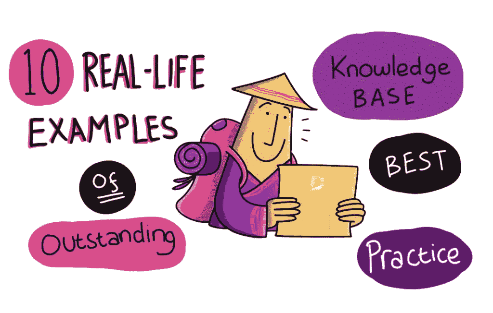

# 内容

# 1.入门教程— MailChimp

对于 SaaS(软件即服务)公司来说，您的软件入职阶段对于客户参与和保留至关重要。当客户注册免费试用并决定他们是否喜欢你的产品时，这也很重要。

新用户必须可以访问您的知识库。这些类型的用户需要快速上手并运行您的产品，这就是文档的用武之地。

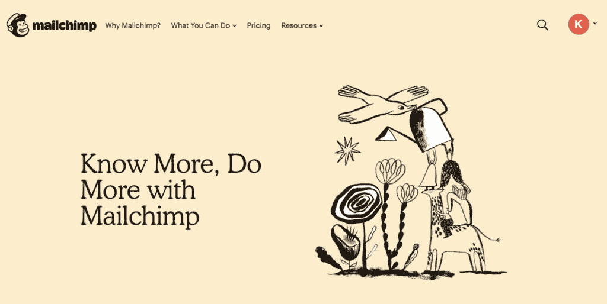

电子邮件营销软件公司 MailChimp 将其[入门教程](https://mailchimp.com/resources/mailchimp-101/)(名为 MailChimp 101)变成其客户难忘的体验。

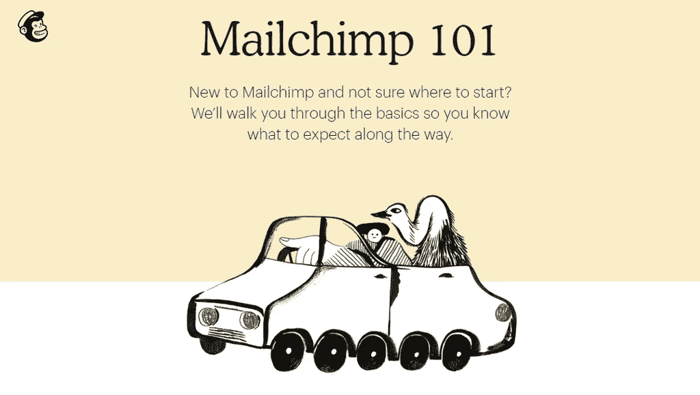

MailChimp 明白，它正在与许多其他产品和服务争夺客户的注意力。它在文档的这个关键阶段投入了大量资金。

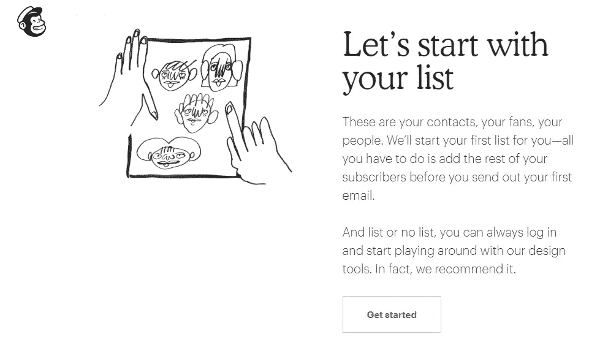

一个长长的滚动页面，吸引人的插图，以及对空白的良好利用，形成了一个令人愉悦的设计。

# 2.信息架构—松弛

你的[信息架构](https://document360.io/blog/knowledge-base-software-information-architecture-best-practices/) (IA)是你知识库内容的框架。它由类别分类、按钮标签、导航菜单和页面间的链接组成。

知识库的内部结构就像一张地图，指引用户找到他们需要的信息。信息架构中的一致性是您构建知识库的关键，让客户能够自助服务。

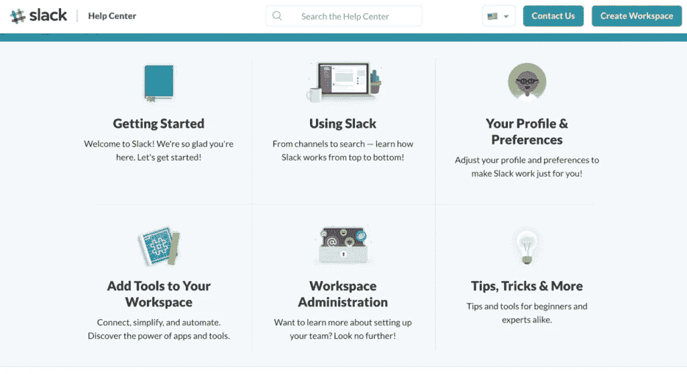

从一开始就很清楚，团队消息软件公司 [Slack](https://get.slack.help/hc/en-us) 有几个核心帮助主题。它用自定义图标来说明这些主题，鼓励用户点击查看更多内容。

当你深入任何一个主题时，章节会打开，显示一个方便的副主题和文章列表——同时继续锚定主导航。

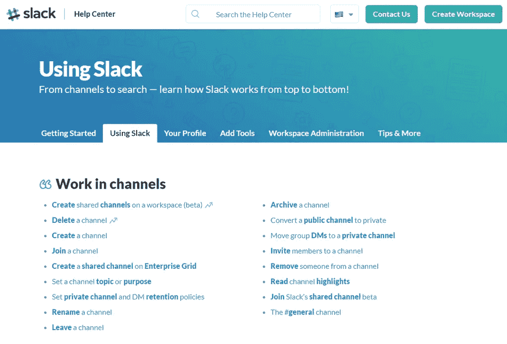

由于使用了信息架构，用户总是知道自己在 Slack 知识库中的位置。

# 3.搜索功能—条带

一个好的搜索功能对于你的知识库也是必不可少的。搜索依赖于你知识库中内置的后端软件，以及对你的内容进行标记和组织。

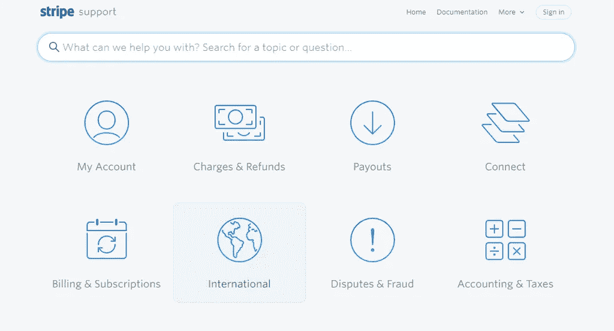

人们以各种不同的方式搜索内容，因此使用建议的搜索是帮助客户发现内容的理想方式。

当用户开始在搜索栏中键入内容时，支付处理软件公司 [Stripe](https://support.stripe.com/) 会显示一个文章列表，以及内容预览，这些内容也标记有类别。

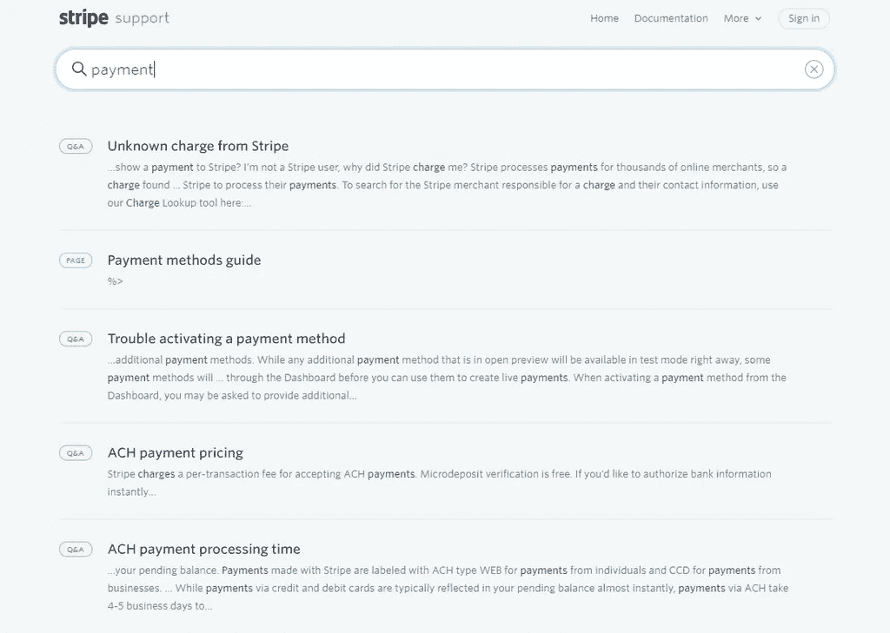

这意味着用户可以细化他们的搜索，而不必通读大量不相关的文章。对于条带搜索，本质是速度——对于时间紧张的开发人员来说是必不可少的。了解更多关于[条纹知识库](https://document360.io/blog/tear-down-of-stripe-knowledge-base/)的分析。

# 4.文章格式— Microsoft

文章格式是指与你如何呈现你的文章有关的任何东西，它不同于你的网站设计。格式通常与字体类型、字体大小、字体粗细、页面布局和图像有关。

[微软文档](https://support.microsoft.com/en-hk)很复杂，面向各种受众。格式化是使其可访问的关键。微软已经把长文章分解成一个小文章列表，并把它显示成一个可折叠的目录列表。

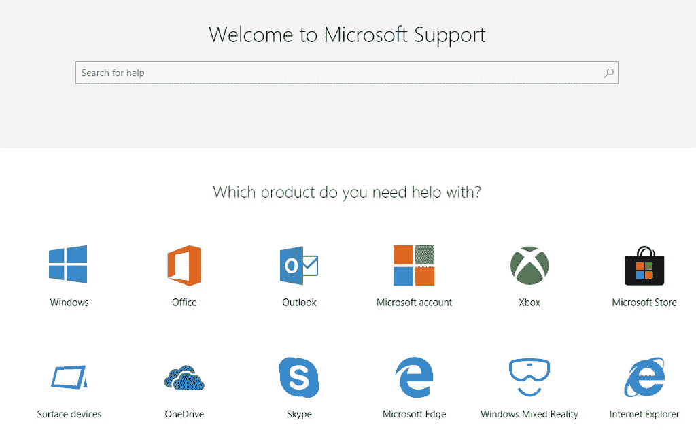

这样可以分解文本，使其更容易浏览，并帮助用户挑选出重要的元素。微软还很好地利用粗体字来吸引人们对页面上最重要项目的注意。

微软在每一段都坚持一个要点或行动，因为这是一个很好的文档经验法则。它使信息更容易理解。

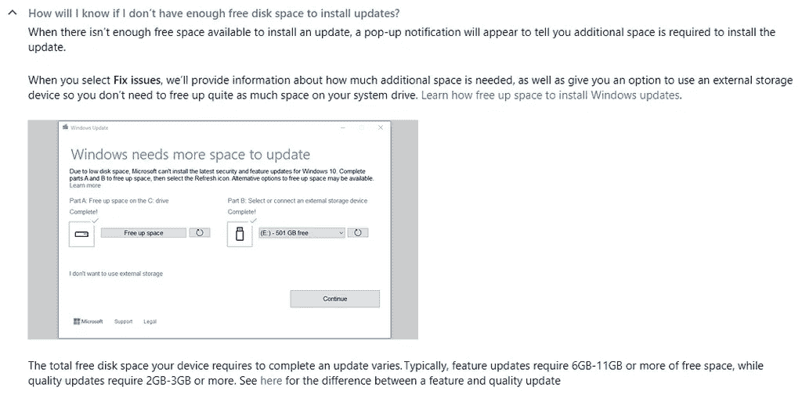

最后，微软使用有序列表来解释各种类型的安装之间的差异。用户可以选择最适合自己的选项，忽略其他选项。

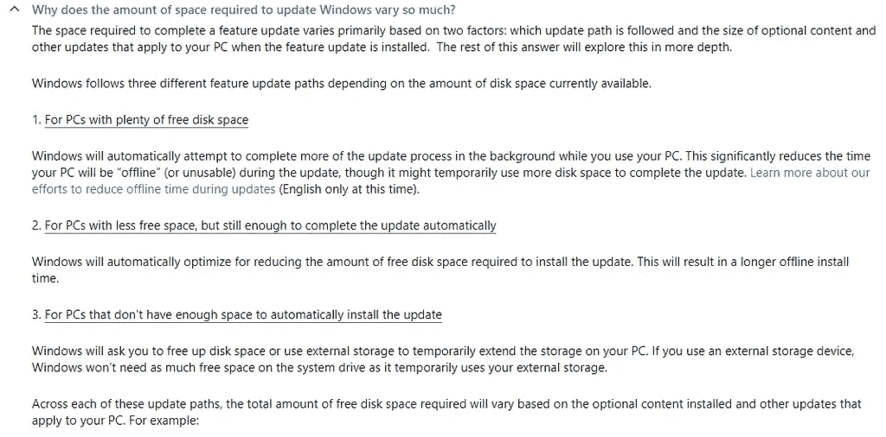

# 5.文章写作— Hubspot

[文章写作](https://document360.io/blog/how-to-write-a-knowledge-base-article/)指的是你在页面上向你的用户解释你的帮助主题时使用的实际词汇。

在你的文档中提出建议或指导用户，而不是使用命令式(命令他们做某事)，这是一个很好的做法。

在编写文档时，有一些重要的规则需要遵循:

*   使用[活动语音](https://examples.yourdictionary.com/examples-of-active-and-passive-voice.html)
*   用随意但专业的语气说话
*   简单易懂的措辞

营销自动化软件公司 [Hubspot](https://academy.hubspot.com/help) 已经用一种普通用户容易理解的方式编写了它的文档。不需要任何专业术语知识。

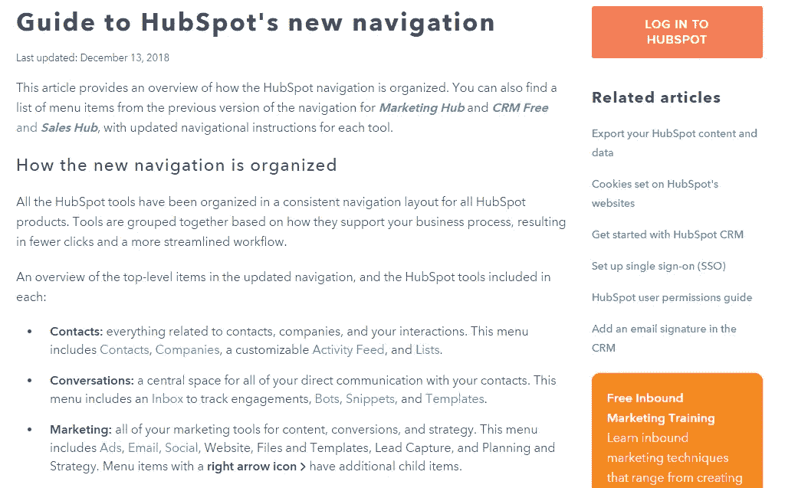

语言简单扼要，用主动语态书写。

文档应该以您的支持团队能够与真实客户交流的方式编写——友好、有帮助、有礼貌。

# 6.用户体验设计— Shopify

用户体验(UX)设计是利用视觉设计原理为你的用户创造积极的网站体验。它将许多元素结合在一起，帮助用户实现他们的目标，这意味着你要设身处地为用户着想，从他们的角度进行设计。

UX 强调了用户接下来需要采取的步骤，并为他们的行动提供了背景。

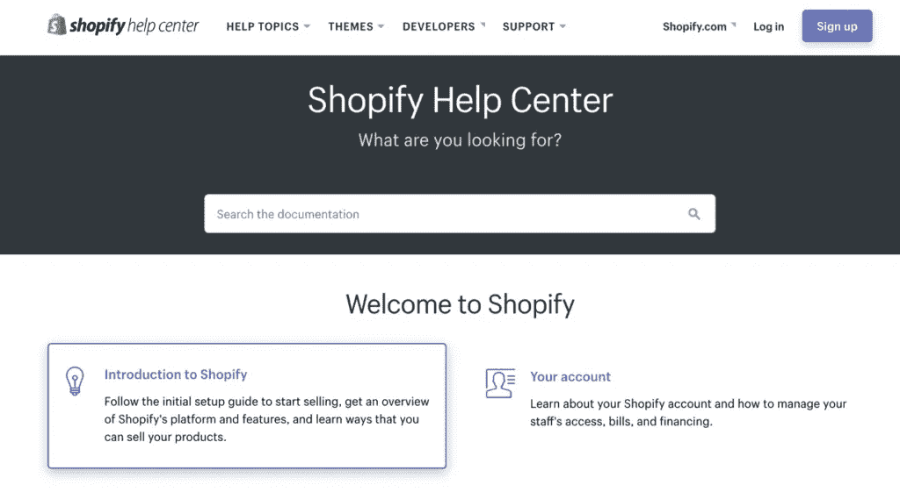

Shopify 知道它的用户很忙，并且面临着经营电子商务业务的压力。它的文档仔细概述了用户在使用其软件时需要经历的真实过程。

Shopify 为用户提供了清晰的选项，并将复杂的流程分解成步骤。这增加了用户成功完成任务的可能性。

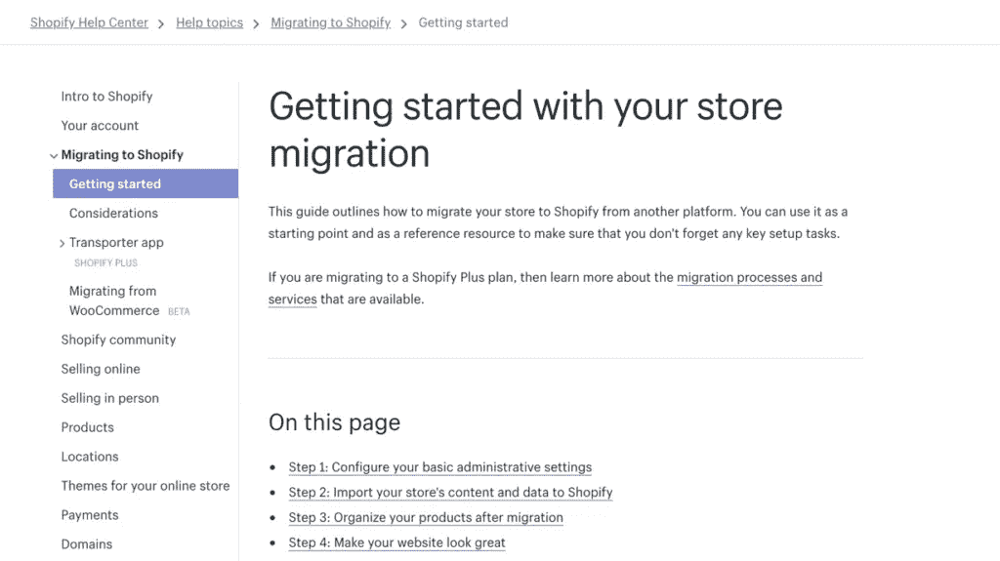

# 7.品牌——优步

顾客总是希望感受到被照顾，知道你认为他们是重要的，喜欢你认真对待他们的关切。给你的知识库打上烙印可以确保它看起来像是你公司的一部分，并且有助于整体用户体验。

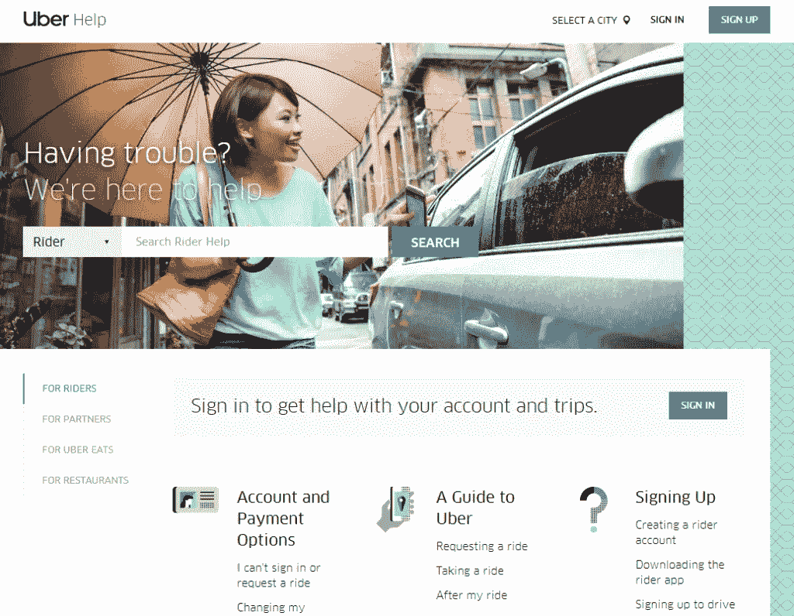

打车软件公司[优步](https://help.uber.com/)在不影响 UX 风格的情况下，以易于识别的优步风格为其文档打上了烙印。优步使用其惯用的字体和颜色，同时也使其知识库友好和易于访问。

关键是保持品牌的微妙但可识别性——不要过度。

# 8.可扩展性— Twitter

可扩展性意味着您的知识库可以处理大量内容。随着产品的发展，你必须能够定期添加。

您应该组织您的帮助内容，这样您就可以扩展您的知识库，而不需要大规模地重新组织它。构建您的类别，使其足够广泛，以包含您打算发布的所有类型的未来内容。

社交媒体应用[推特](https://help.twitter.com/)已经开始分类，叫做:

*   使用 twitter
*   管理您的帐户
*   安全和保障
*   规则和政策

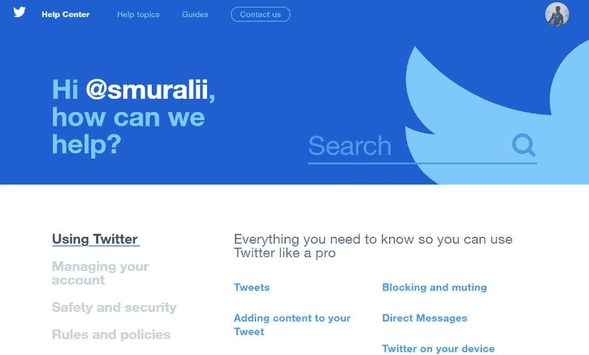

这些足够广泛，可以包含 Twitter 近期的所有用户文档。

我们自己的知识库软件 [Document360](https://document360.io/) 允许您以任何您希望的方式组织您的内容，并且它足够灵活，您可以随时重新排序。

# 9.导航— Meetup

您的导航是知识库的菜单。它包含了你所有的类别和内容，通常可以通过多种方式访问。

社交发现应用 [Meetup](https://help.meetup.com/hc/en-us) 选择在页面主体显示其导航。它显示知识库中的每个子类别，并列出每个类别中的前几个内容页面，以便用户可以决定下一步单击哪个链接。

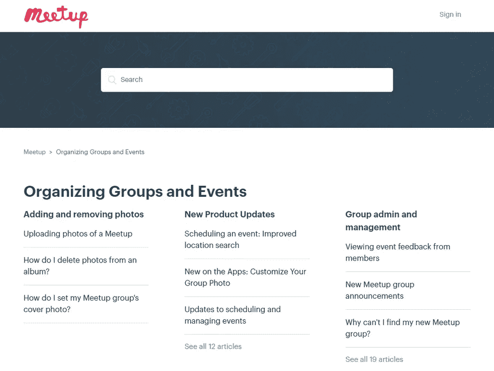

Meetup 清楚地标注了它的类别和内容，当你点击一篇文章时，它还会有快速链接将用户导向相关内容。

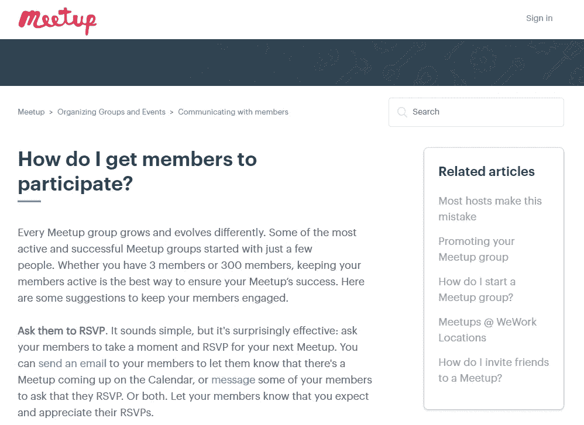

如前所述，将您的导航与良好的搜索功能相结合，以提供集成的自助服务体验。

# 10.图像—帮助童子军

只包含文本而没有图像的文档可能会非常无聊，很难引起注意。插图可以非常舒缓，使您的文档使用起来更加愉快。

服务台软件公司 [HelpScout](https://docs.helpscout.net/) 在文档中很好地利用了图像，为每个类别添加了自定义图标。

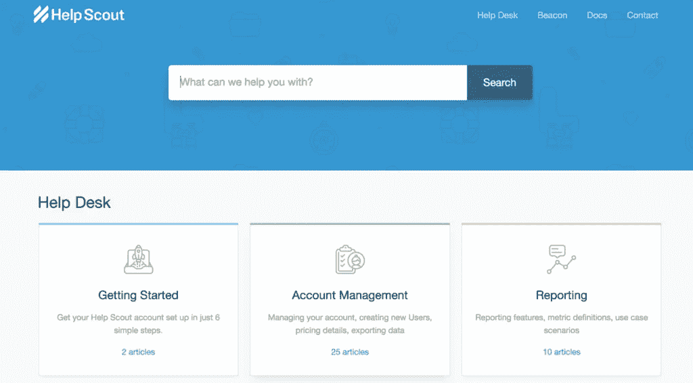

Help Scout 还使用截屏向用户展示该做什么。

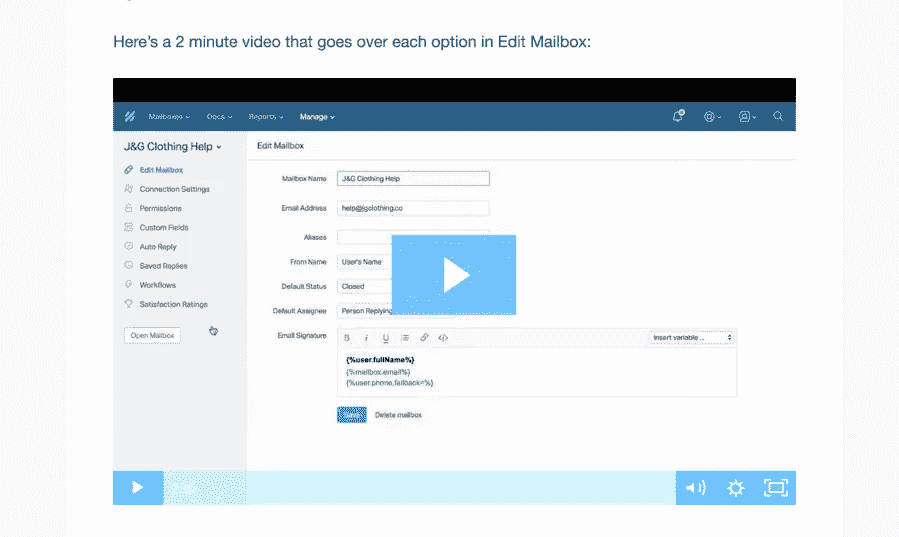

在整个文档中使用视频、截图和 gif，直观地向用户解释如何完成某些任务。

# 结论

如果您经常使用这十个最佳实践，您的文档一定会让您的客户大吃一惊。

从投资入门教程到以可访问的方式编写文档，您的客户会感谢您为帮助他们所做的努力。为你的文本添加插图，使其更具可操作性，这在知识库中越来越受欢迎。

不要忘记关注用户体验，以及您的客户在现实世界中是如何使用您的帮助内容的。让它成为你的客户能够得到他们所需要的默认设置。

花一点时间提前计划你的内容会让你将来更容易扩展你的知识库。现在来看看我们的[知识库软件终极指南](https://document360.io/knowledge-base-software/)。

*原载于 2018 年 12 月 19 日凯瑟琳·希斯*的 [*文档 360.io*](https://document360.io/blog/10-knowledge-base-software-best-practice-examples/)