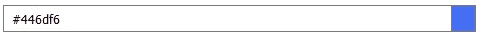

# 10 分钟彩色预览输入栏

> 原文：<https://medium.com/hackernoon/10-minute-color-preview-input-field-b21d06bda031>

虽然`type="color"`并不是大多数 web 开发人员在日常设计中需要的东西，但它是一种随处可见的输入控件，而且对它的支持[还没有在主流浏览器和平台上得到认可。](https://www.caniuse.com/#feat=input-color)

有了一点额外的时间，我决定尝试一个可以用来输入颜色的自定义输入组件。它不像 Chrome 或 Firefox 实现的那样花哨，但它是一个非常简单的组件，可以让你以任何格式(十六进制、rgb()、rgba()、透明或命名颜色——甚至渐变)输入颜色，并向你显示该颜色的预览。

Photo by [Chris Lawton](https://unsplash.com/photos/5IHz5WhosQE?utm_source=unsplash&utm_medium=referral&utm_content=creditCopyText) on [Unsplash](https://unsplash.com/search/photos/color?utm_source=unsplash&utm_medium=referral&utm_content=creditCopyText)

## HTML:定义组件结构

对于组件结构，我们想要非常简单的东西。我对这个问题的看法如下:

*   一个外部`
`容器，将所有东西放在一起。
*   内部的两个`
`容器利用 FlexBox 创建一个可用的布局。
*   第一个容器中的一个`<input>`元素，用户可以在其中输入一些文本。
*   一个彩色的`
`元素，将预览用户输入的颜色。

## CSS:让一切变得美好

在我的实现中，我使用了大约 30 行 CSS。我的代码所做的事情基本如下:

*   使用 FlexBox 设置组件的布局。两个内部`
`容器的比例为 19 比 1。
*   对`<input>`元素应用一些基本样式，使默认元素看起来更漂亮一些。
*   给预览`
`元素一些基本样式，使它看起来像一个颜色预览元素。

## JavaScript:动态组件创建和事件

最后一部分是利用 Javascript 来实现我们的想法。我选择将我的组件模块化，这样我可以使用一个函数将页面中的任何`
`元素转换成我刚刚创建的组件。前面提到的函数在大约 15 行 JavaScript 代码中执行以下操作:

*   将适当的类添加到`
`容器中。
*   用适当的 HTML 代码填充容器。
*   更新其中的元素，使其具有适当的`id`。
*   为`<input>`字段上的输入事件添加一个事件监听器，以使预览`
`元素响应输入更改。

就这些了。该组件如下所示:

Our color picker component

下面是它支持的一些值格式(基本上是 CSS 中任何有效的`background`值):

Supported value formats for the color picker component

组件的完整代码可以在[这里](https://github.com/Chalarangelo/simple-color-picker)找到，如果你喜欢的话，还有一个 [Codepen 演示](https://codepen.io/chalarangelo/pen/BxwLmL)。我还发现，该组件与 Bootstrap(可能还有其他 CSS 框架)兼容，并且在 CSS 中没有任何变化的情况下看起来相当不错，所以您可以将它添加到任何和所有项目中。

*感谢阅读！如果你喜欢这篇文章，给它一个掌声或 50 分钟——这完全取决于你！*