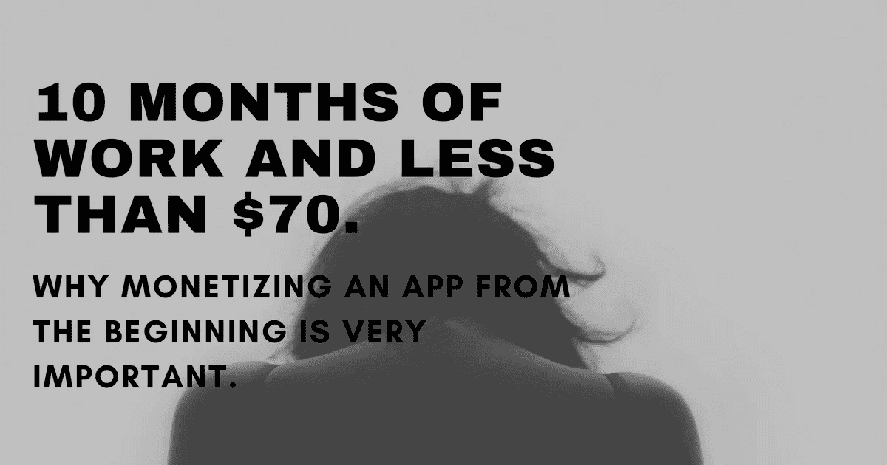
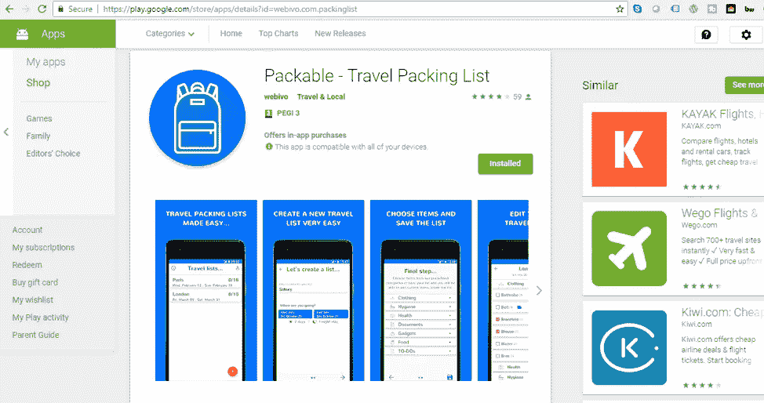
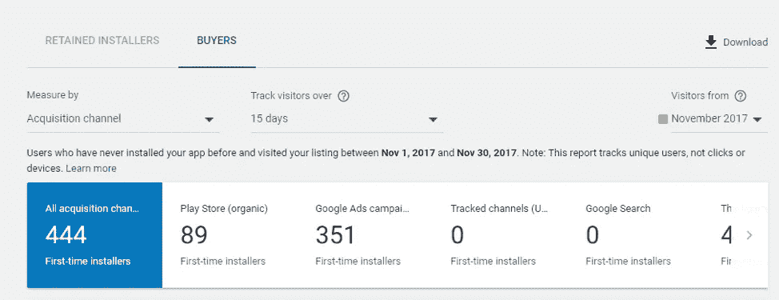
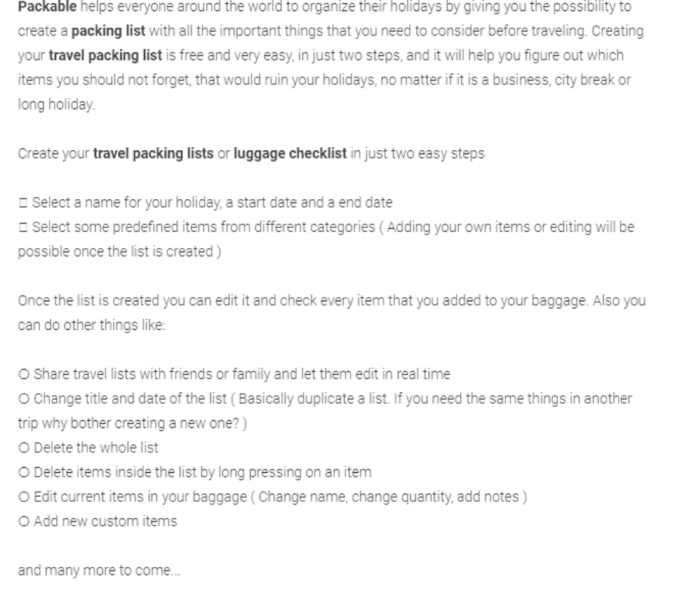
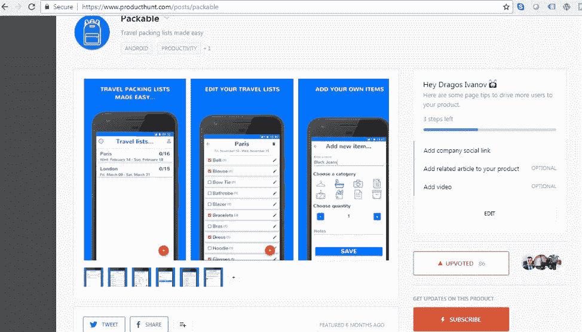
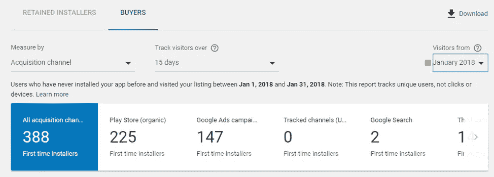
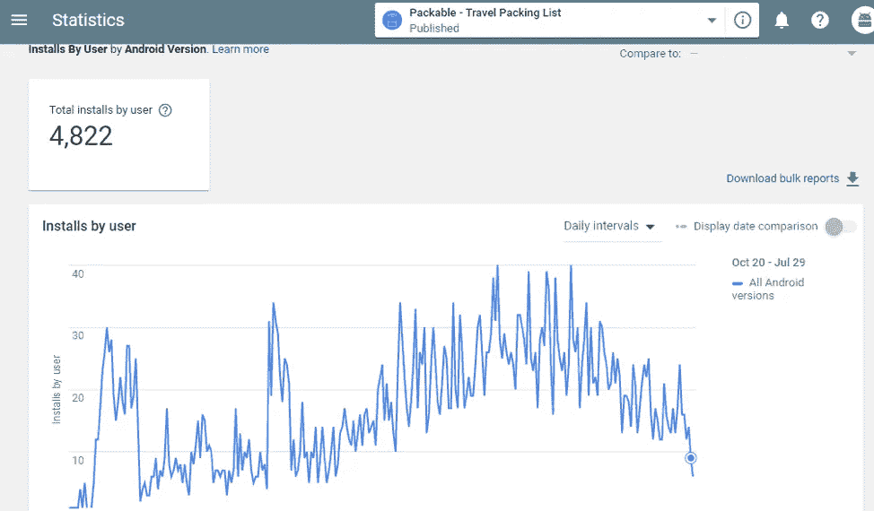
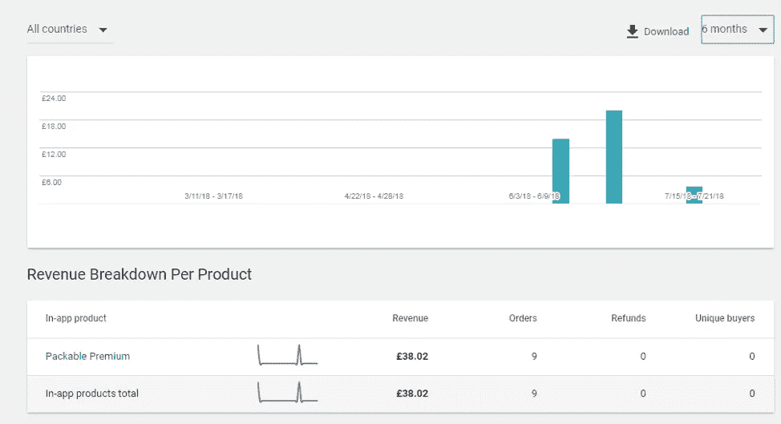

# 10 个月的工作，不到 70 美元。为什么从一开始就把一个 App 货币化是非常重要的。

> 原文：<https://medium.com/hackernoon/10-months-of-work-and-less-than-70-why-monetizing-an-app-from-the-beginning-is-very-important-676de6fb555f>

通过这个故事，我想帮助你从我的错误中吸取教训。

你会发现什么:

*   我如何投资数百小时来开发一个 Android 应用程序
*   我如何获得用户，在哪里推广
*   为什么我花了八个月的时间来添加付费计划，为什么你不应该这样做
*   我是如何赚到不到 50 美元，我本可以避免这次“失败”

# 故事

去年 10 月，当我看到这个应用程序时，我正在做我通常的产品搜索访问。

它的名字很简单:iOS 的打包清单。

我跟踪了当天的上市，我看到它获得了很多支持票，在 500 左右。

作为一名 Android 开发人员和一个有很多想法在我脑海中流动的人，我认为我可以尝试做一件类似的事情，但对于 Android。

我去了 Google Play，做了一点研究后，我看了看这些应用程序提供了什么，它们缺少什么功能。

这是我犯的第一个错误。

你总是认为你可以做得更好，但是“更好”对你未来的客户来说是必要的吗？

一些我认为很好的功能可能对用户没有用。

我还对这个细分市场的前 2-3 个应用程序的下载量感到兴奋。

下载量大并不意味着他们赚了很多钱。

谁知道他们的保留率或投资回报率是多少，或者他们在市场营销上投入了多少，等等。

我没考虑过这些。

我并不是想看看是否有办法从制作应用程序中获得被动收入，我只是想构建它。

我以为我能做得更好，无论如何。

我也有别的想法。在最坏的情况下，我可以在未来的工作中使用我的简历中的应用程序。

这是另一件坏事。

> 如果你在建造某个东西时试图寻找借口，当可怕的事情发生时，你将试图找到原因而不是原因。

我制作了一个 Trello 列表，上面有一些最基本的特性，我花了大约两周的时间来制作第一个版本。我也有一份全职工作。否则，我觉得会更快。

我也试图给这个应用程序起一个很棒的名字，我问过我的朋友，也在社交媒体上问过，我决定叫它:[**Packable——旅行打包清单**](https://play.google.com/store/apps/details?id=webivo.com.packinglist) 。

第一个版本只有一点比市场上的其他旅行打包清单应用程序好。你可以免费创建无限的旅行包装清单。它们被存储在本地的手机存储器中。

我向我的脸书朋友以及 Linkedin 和其他社交网络发布了这款应用。

我还在 2017 年 11 月做了一些 Google Adwords 付费推广，我得到了正好 351 个首次安装者。

我在推广应用程序以获得用户，但在内部我没有任何跟踪指标，这非常糟糕。

除了社交网络和 Adwords，我没有大的营销计划。

猜猜为什么？

我已经有了第二个版本。我告诉自己。

> 这次我要增加更多的功能，我要让它成为最好的旅行打包清单 app。

我浏览了现有应用的评论。

我发现了很多令人兴奋的事情，但这又是一个错误。

为什么你要为一个没有使用你的产品，也没有准备好给你任何报酬的人做一些事情呢？

很多人陷入了接受每个人反馈的陷阱。这是不对的。

反馈如果你是从有问题的人那里收到的，并且愿意付钱来解决问题，这是没问题的。

我在这里说的不是建立一个登陆页面，问你的朋友它好不好。

我说的是毫无理由地花费几十或几百个小时开发功能。

## 我对第二版有什么商业化计划吗？

当然不是。我记得我说“我会首先获得用户，然后我会在应用程序中添加付费计划”，这是在撒谎。

第二版比我发布时花了更多的时间。

我用了 Firebase，让人们在脸书和谷歌上创建账户，这对我帮助很大。

即使在今天，用户也可以在云中保存无限的旅行列表，与朋友或家人分享列表，复制列表，删除列表等等。这些都包括在内。

对于那些不知道 Firebase 是什么的人，如果你想构建一些东西并且需要后端存储，我建议你看一看。

它有一个免费的计划，当你开始的时候会给你很大的帮助。它更侧重于移动应用，但也适用于网络应用。我认为独立黑客是用 Firebase 构建的。

无论如何，在第二个版本中，我添加了许多新功能，即使在今天，我也没有在旅行打包列表应用程序中看到这些功能。

这重要吗？我可以说是的。稍后我会告诉你为什么。

因此，在我完成所有功能后，我想为 Google Play 列表创建一些漂亮的图像，并改进对它的描述。

我用 Canva 快速制作了一些简单的横幅，你可以在上面的图片中看到这些图片。

## 为什么我要更改列表的描述？

在推出新版本之前，我读了很多关于 ASO(应用商店优化)的内容。

ASO 的行为类似于 SEO(搜索引擎优化)。

如果你有一个应用程序，我会建议现在就去改变标题和描述。

这不是一个短期的成功，但它会帮助你获得有机下载。

从我的经验来看，其他东西可以帮助你在 Google Play 搜索中排名靠前。

我在 Google Play 上还有另外三个应用，我注意到评论、下载量、留存和崩溃对你在商店中的排名至关重要。

我可能会写一些关于这个的博客，因为这并不难做到，但是很多人并不知道他们如何才能获得有机用户。

我安排好我的上市之后，就到了推广的时候了。

我为我的工作感到骄傲，我首先想到的是 [**产品搜索**](http://producthunt.com/) 。

我联系了克里斯·梅西纳，他为想在 PH 上发布的制造商提供狩猎服务，他反应非常迅速，也很有帮助。(谢谢，克里斯)

我的错是我联系他后，两天没有查看邮件，误看到了产品搜索上的列表。(你可能想知道什么样的人会两天不查看邮件)

它仍然获得了大约 80 张赞成票，但它是一个彻底的失败。

在这个故事之后，我想再次用 Google Adwords 在 Google Play 上推广我的应用程序。

我在应用程序中有任何分析吗？我有，但不多。

我想快速获得一些用户，看看他们对这款应用的新版本反应如何。

因为我没有在应用程序中跟踪任何东西，所以我在查看 Google Play 开发者帐户的指标。

像有多少人安装和卸载 Firebase 这样的事情也向我展示了其他事情，如每天有多少活跃用户以及他们每次使用该应用程序的时间等。

我觉得 2017 年 12 月完成了第二版，2018 年 1 月开始推广。你会在下图中看到，有机流量从 11 月份开始增长。

我不得不说进行得很顺利。用户似乎对他们拥有的功能很满意；他们通过电子邮件给我反馈，人们在评价和使用这个应用程序。

为什么不呢？一切都是免费的，没有广告，功能比我的竞争对手更好。

所有这些事情让我增加了越来越多的功能，修复了错误，听取了反馈发送到我的电子邮件。

这款应用的有机下载量逐月增长，而我却没有任何计划。

我记得我告诉自己，一旦有超过 1000 名用户在手机上安装了该应用程序，我就会添加一个付费计划。

我现在的问题是:既然很多付费内容已经免费了，我还能添加什么呢？

我想出了夜间模式和无广告计划，我还试图通过解释我在应用程序上做了多少工作来让用户付费。

我把价格定在 4.99 美元左右——终身费用，我说大约是因为在一些国家是欧元，在英国是英镑，我推出了这个应用程序。

## 发生了什么事？

人们开始卸载它，有机流量减少了很多，我很肯定这与人们在安装应用程序后立即卸载有关。

你可以看到上面的报告，以及在我发布新版本后图表的走向。

当然，人们不想再使用这个应用程序可能还有其他原因，但我想我永远也不会知道了。

我决定让这个应用保持原样，因为它已经有了很多功能，不再关注它。

经过数百个小时的工作，我也有了一些顾客。

这款应用赚了不到 50 美元，谷歌也拿到了佣金。

你知道这个故事有趣的是什么吗？这个错误我犯了两次。

两年前，我有一个针对罗马尼亚市场的应用程序。

当我决定添加一个付费计划时，2000 名用户在他们的手机上安装了该应用程序，他们相当活跃。

当我推出付费计划时，即使我以 1 美元的价格出售，也没有人为此付费。

我记得我有另一个借口，也许市场不合适，我应该尝试一个国际市场。

我可以说 Packable 的商业化部分是一个彻底的失败，但人们正在使用这个产品，它在我的 Android 职业生涯中帮助了我。

我从来没有把这个应用看作是我想要完全专注的事情，而更像是一种尝试。

当然，我很想从中赚更多的钱，但这不是世界末日。

## 结论

我强烈建议你不要和我犯同样的错误，尽快考虑将你的应用程序商业化。

为什么重要？

我们都喜欢建造东西，把它们发射到世界上，让人们快乐，但是钱是我们生活中最重要的事实之一。

当然，你可以推出一款应用，获得数百万用户，然后从广告中赚钱，但这有多容易？

赚钱是很重要的，这样你才能感觉到你的工作得到了赏识，你才不会失去注意力。

你可以从付费的人那里得到更多更好的反馈，有了钱，你就能打造出优秀的产品。

我确实知道我是否会在 Packable 上做更多的工作，因为有人最近给我发了一封电子邮件，让我知道一些错误，但谁知道呢。

我已经决定完全专注于一件事，今天我正在研究 **Netcrumb** 。

一个允许创作者在 Wordpress 上快速创建漂亮的响应登陆页面的网络应用。

该产品仍在开发中，但将很快推出测试版。

*最初发表于*[T5【www.failory.com】](https://www.failory.com/blog/mobile-app-failure)*。*