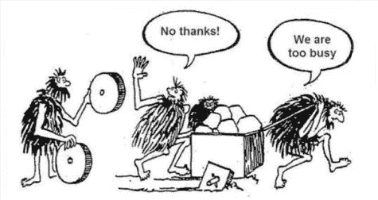

# 关于电子邮件营销自动化的 10 个最常见的误解

> 原文：<https://medium.com/hackernoon/10-most-popular-misconceptions-about-email-marketing-automation-5711ac6ad8d4>

> 你好！我有一个问题要问你。你能告诉我是否有可能有些企业不需要电子邮件营销自动化？我是一个小网店的老板，客户不多，但是那些我有定期购买产品的。为什么我需要发起电子邮件营销活动？即使我做了，手动做不是比花钱买一些额外的平台更明智吗？让我知道你的想法。

这是我们最近从一位潜在客户那里收到的一封信中的一段引文。

他读了我们关于电子邮件营销自动化技巧的信息，开始想知道小企业是否能从中受益。所以我们认为回答并涵盖电子邮件营销自动化的主要误解是很棒的。

## 随着 ProductHunt 上即将到来的 [Triggmine](https://www.producthunt.com/upcoming/triggmine) 发布，我们已经决定让事情变得非常清楚，所以…

如果你有疑问，请系好安全带，我们为你准备了座位。

即使自动化电子邮件营销的想法现在看起来很明显，它仍然是企业主的许多问题的主题。

## **何时实现自动化？**

## **怎么做？**

## 谁应该自动化，谁不应该自动化？

问题很多，答案更多，往往相互矛盾。这就是为什么我们 Triggmine 决定将它们收集在一篇文章中，一起回答。

# 误解 1——自动化只适用于大狗

也许，关于电子邮件营销最流行的误解是，只有拥有大量用户的大企业才能从自动化中受益。

## 如果你的企业规模迅速扩大，用算法取代手工是合乎逻辑的，但在此之前，何必呢？

但是换个角度想想。

小企业的所有者经常不得不自己做所有的事情，没有营销部门甚至专家的帮助。当你不得不担心**生产、分销、运输、咨询、支持**时，电子邮件营销就不太像是首要任务了。

陷入日常事务中，很容易忽略销售，但销售正是为企业带来资金的。人们仍然通过电子邮件买卖东西，正如统计数据显示的那样，这种情况不太可能改变。如果企业主希望店铺发展壮大，投资电子邮件营销至关重要——包括从手工工作转向自动化。

# 误解 2——自动化比手动设置花费更多的时间

对于许多工具来说，这是真的，至少在开始阶段是这样。以 MailChimp 为例。做一个简单的活动很容易，但是如果你想细分你的受众，并自动创建电子邮件(是的，不仅仅是发送，而是创建)，这几乎是不可能的。

然而，现在人工智能永远解决了这些问题。你可以设置一次或两次活动，平台会自己学习。机器学习算法让自动化软件在每封已发送的信件中变得更加智能，在第三次和第四次活动之间，你只需点击一次“发送”按钮。

# 误解 3——我不知道如何选择平台

如果几年前我们还能听到选择不够的借口，那么现在情况就不同了。有太多的解决方案，在其中进行选择成了一种折磨。您认为您可能会错过最适合您的业务的软件，并陷入不断的工具测试的陷阱。

如何走出这一关？尽管联系产品的开发团队。如果我们看到我们的平台确实不是某个特定小众或业务的最佳选择，我们只是直接这么说。当然，每个团队都希望他们的产品能吸引尽可能多的用户(我们也是这样)，但是如果你真的想用 MailChimp 做得更好，我们会马上告诉你。

# 误解 4——我没有专业的营销人员来处理这些事情

事实上，这是追求自动化的一个理由，而不是否认它。

然而，这里效率的关键不仅仅是选择一个管理平台，而是选择一个助手。

> 换句话说，你需要一个不仅能管理你的时事通讯，还能为你创建时事通讯的解决方案。明白区别了吗？

如果你有一个辅助服务，你就不需要营销专家的帮助。该服务本身将是你的营销顾问和专家在一个包。

# 误解 5——如果平台出错了怎么办？

好吧，这不完全是个神话。

电子邮件营销平台**确实处理**大量敏感数据，而**直接代表公司发言**，所以一个错误代价很大。即使是像*把用户的名字放在错误的地方*这样简单的错误也会成为商店或产品声誉的致命一击。

A 如果你利用这个平台与媒体或博客作者进行重要的接触会怎么样？

这种互动中的错误会让你损失数千美元💰。

> *我不想让人失望，但是*人为错误的几率仍然远远高于平台出现故障的可能性*。与自动化软件相比，你更有可能手动复制粘贴错误的名称。*

# 误解 6——如果你做得很好，你不需要自动化

你不需要等到危机来临时才改变策略。如果你进展顺利，恭喜你，但是总有进步的空间。如果一个企业成长，自动化问题是不可避免的。最好尽早面对这个挑战。

# 神话 7——公司将失去个性

我希望我的电子邮件是与客户的对话，而不是机器人无声的聊天。诚然，这听起来是一个不错的动机，但它并不真实。你仍然可以自己写邮件，如果你有这个想法，甚至可以自己设计一个。自动化的美妙之处在于，你总是可以选择自己在过程中的参与程度。

如果你不愿意，你不必把所有事情都外包出去。此外，有了人工智能，即使是机器人写的电子邮件也很难与人类写的区分开来。

# 误解 8——我不想给我的用户发垃圾邮件

不要将电子邮件营销自动化与向客户发送大量电子邮件相混淆。定期发邮件不等于经常发。您可以每周甚至每月开展一次活动。这完全取决于你。

此外，智能平台会根据用户的参与度对时事通讯的最佳时间表提出建议。即使你对频率有疑问，你也可以随时咨询你的自动化助手。

# 误解 9——它贵得离谱

回答的很简单，不是。对于不同类型的企业，包括小公司，有许多解决方案。这些平台面向规模较小的电子商务，价格适中，因为产品创作者清楚地了解目标受众的经济能力。我们知道小商店的老板不喜欢电子邮件营销，所以我们降低了价格。

# **神话 10——这些平台只是名字不同**

或许几年前，电子邮件营销自动化领域确实没有太多创新。现在不是这样的。我们有人工智能、机器学习和区块链来提高自动化的效果。事实上，自动化从未如此具有创新性。

# 只是最后一个想法

这是关于电子邮件营销自动化的 10 个最流行的神话。

## 如果您想跟上电子邮件营销自动化的发展，请订阅 ProductHunt 上的 [Triggmine](https://www.producthunt.com/upcoming/triggmine) 页面，成为第一个利用新一代智能电子邮件营销的人。