# 关于未来工作的 10 本必读书籍

> 原文：<https://medium.com/hackernoon/10-must-read-books-on-the-future-of-work-ef38dd1cf99d>

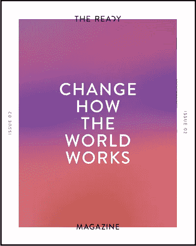

The Ready’s [free magazine](http://theready.com/magazine/)

复杂性、人性和技术的力量给我们的组织带来了传统工作方式无法应对的压力。我们的组织需要更好地为他们的人民和世界服务。这需要从“计划和预测”到“感知和响应”的范式转变。

在过去的几年里，我发现[实施敏捷不足以](/the-ready/beyond-agile-why-agile-hasnt-fixed-your-problems-aabdde9b5ef8)解决这个挑战，所以我踏上了拓宽视野的旅程。当我加入[Ready](http://theready.com)的时候，我得到了一份关于未来工作和组织设计的最有影响力的书籍清单。

在这篇文章中，我将与你分享我最喜欢的 10 本关于未来工作的书。它们没有特定的顺序，如果你更喜欢看而不是读，我还包括了与这本书相关的视频链接。挑选它们其实很容易，因为我发现自己一遍又一遍地向与我共事的高管推荐它们。

**更新**:最近出了两本新书。[勇敢新作](http://www.bravenewwork.com)由 Ready 和我自己的书的创始人[公式 X](http://www.formula-x.co) 。当然，我强烈推荐这两者…

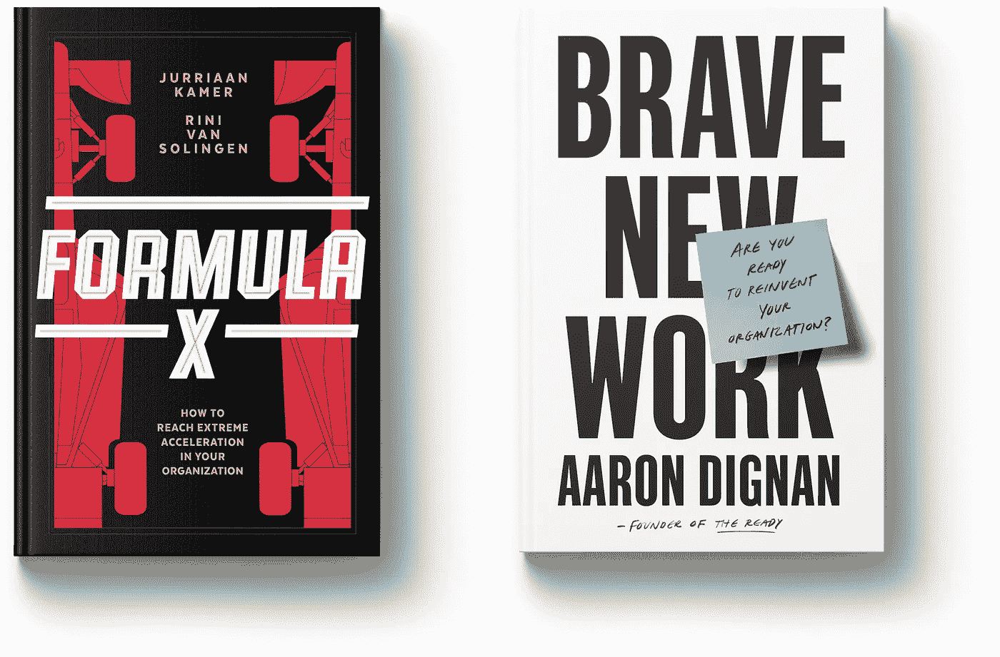

# 自由公司。

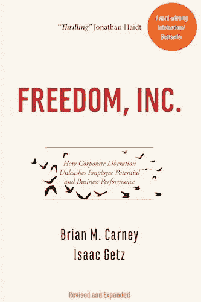

*“解放型领导认为，基于尊重和自由的工作环境比基于不信任和控制的工作环境更自然。各种规模和类型的组织的领导者正在摆脱他们的等级制度和官僚机构，将他们转变为尊重和自由的工作场所。”*

[链接到作者的网站](http://freedomincbook.com/freedom-inc/)

[链接到视频](https://www.youtube.com/watch?v=ZrAFpPbz7O4&cc_load_policy=1)(打开字幕)

# 团队的团队

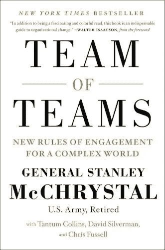

当麦克里斯特尔将军在 2004 年接管联合特种作战部队时，他很快意识到常规军事策略正在失败。世界变化的速度比以往任何时候都快，对于负责人来说，最明智的回应是让小团队自由试验，同时推动每个人在整个组织中分享他们学到的东西。”

[链接到作者的网站](https://www.mcchrystalgroup.com/insights/teamofteams/)

[视频链接](https://www.youtube.com/watch?v=GgrQYS-q5f4)

# 重塑组织(图文并茂)

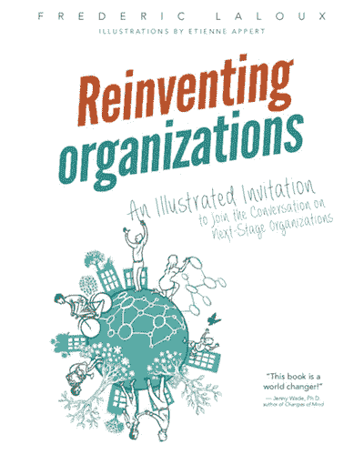

过去，每当人类意识进入一个新的阶段，它都会发明一种全新的方式来构建和运行组织，每次都会在合作中带来非凡的突破。一个新的意识转变正在进行中。这本书以实用的细节描述了大大小小的组织如何在这种新模式下运作。

[链接到作者的网站](http://www.reinventingorganizations.com/)

[视频链接](https://www.youtube.com/watch?v=GxGGkrtKZaA)

# 超越预算的小书

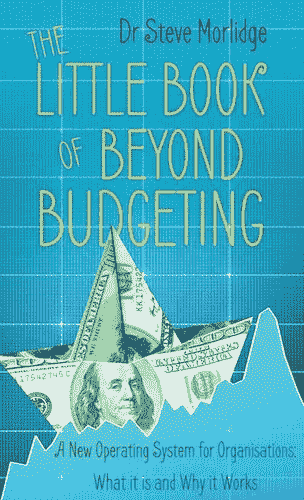

很难想象一个业务流程会像传统预算一样不受欢迎、运转不良和信誉扫地。本书描述了超越预算流程模型如何更好地应对现代组织生活的复杂性和世界的不确定性

[链接到亚马逊](https://www.amazon.com/Little-Book-Beyond-Budgeting-Organisations/dp/1785899287)

[链接到视频](https://www.youtube.com/watch?v=Q49vrSJRM5w)

# 谷歌如何工作

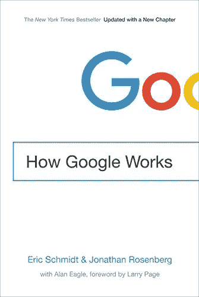

*“在一个一切都在加速的时代，企业成功的最佳方式是吸引聪明有创造力的人，并为他们提供一个可以大规模发展的环境。这本书涵盖了从谷歌学到的企业文化、战略、人才、决策、沟通、创新和应对中断的经验教训。*

[链接到作者的网站](https://www.howgoogleworks.net/)

[视频链接](https://www.youtube.com/watch?v=3tNpYpcU5s4)

# 驱动器

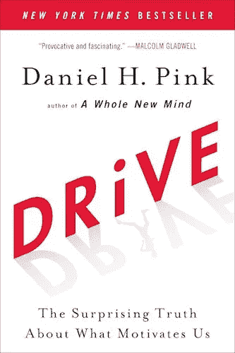

大多数人认为最好的激励方式是金钱奖励——胡萝卜加大棒的方法。然而，研究表明，高绩效和高满意度的秘密是人类内心深处的需求，即指导我们自己的生活，学习和创造新事物，以及通过我们自己和我们的世界做得更好。自主性、掌握力和目的性。”

[链接到作者的网站](https://www.danpink.com/books/drive/)

[视频链接](https://www.youtube.com/watch?v=u6XAPnuFjJc)

# 调转船头！

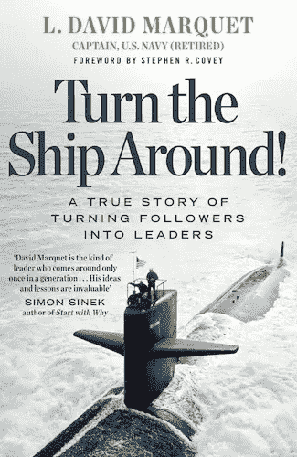

*“调转船头！这是一个真实的故事，讲述了一位船长如何通过挑战传统的领导者-追随者方法，将他的潜艇从舰队中最差的潜艇变成第一的潜艇。相反，他创造了一个工作场所，每个人都为自己的行为负责，人们更加健康快乐，每个人都是领导者。”*

[链接到作者的网站](https://www.davidmarquet.com/books/)

[视频链接](https://www.youtube.com/watch?v=OqmdLcyES_Q)

# Holacracy

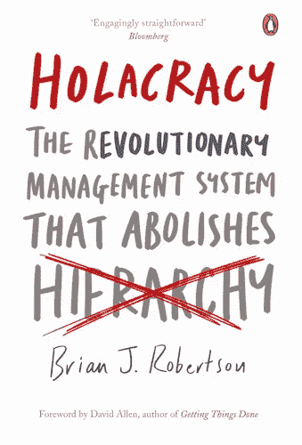

*“Holacracy 在整个组织中分配权力和决策，不是通过等级和头衔，而是通过角色来定义人。Holacracy 创建了快速、敏捷的组织，并通过追求其目标而成功，而不是遵循过时和人为的计划。这不是无政府状态——恰恰相反。”*

[链接到作者的网站](http://holacracybook.com/)

[视频链接](https://www.youtube.com/watch?v=tJxfJGo-vkI)

# 实在说

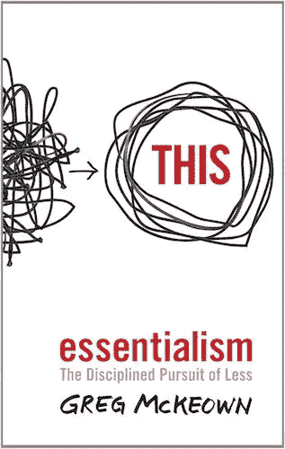

“本质主义者的方法不是在更少的时间里做更多的事情。而是只做正确的事情。这是一个系统的训练，用来辨别什么是绝对必要的，然后消除一切不必要的，这样我们就可以对真正重要的事情做出最大的贡献。”

[链接到作者的网站](https://gregmckeown.com/book/)

[视频链接](https://www.youtube.com/watch?v=v7Nao8lpsIs)

# 精益变革管理

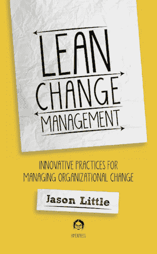

*“通过共创变化绕过变化阻力。创新实践如何显著提高变革项目的成功。这些实践结合了来自敏捷、精益创业、变革管理、组织发展和心理学社区的想法。它将改变你对变化的看法。”*

[链接到作者的网站](https://leanchange.org/lean-change-management/)

[视频链接](https://www.youtube.com/watch?v=G4PBz7gn-fo)

## 我的其他文章

 [## 如何让您的组织像 f1 车队一样快速敏捷

### 提高绩效的七堂组织设计课

中度昏迷](/the-ready/how-to-make-your-organization-as-fast-and-agile-as-a-formula-1-team-438a60f0cc38)  [## 超越敏捷:为什么敏捷没有解决你的问题

### 今天的大多数组织都是缓慢的、官僚的和破碎的。员工、高管、利益相关者和客户是…

medium.com](/the-ready/beyond-agile-why-agile-hasnt-fixed-your-problems-aabdde9b5ef8)  [## 如何建立自己的“Spotify 模式”

### 现在是 2011 年初，你是 Spotify 的首席技术官。在一个大雪纷飞的黑暗中，你凝视着咖啡馆的窗外…

medium.com](/the-ready/how-to-build-your-own-spotify-model-dce98025d32f) 

准备好改变你的工作方式了吗？作为[Ready](http://www.theready.com)的合伙人，我帮助复杂的组织更快地行动，做出更好的决策，并掌握动态团队的艺术。[联系我](http://www.jurriaankamer.com)了解更多，[注册我的简讯*改变世界*](http://newsletter.jurriaankamer.com) 或者预定我[做演讲人](http://www.jurriaankamer.com) *。*

## 请点击👏下面，如果你喜欢这篇文章，[在 Twitter 上关注我](https://twitter.com/kajurria)或者[注册我的简讯](http://newsletter.jurriaankamer.com)。