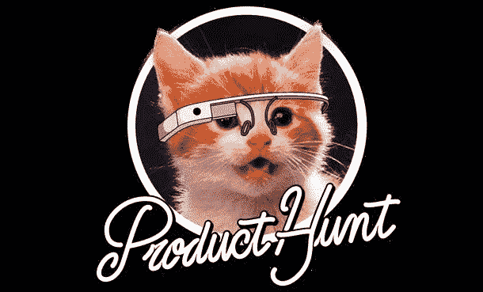
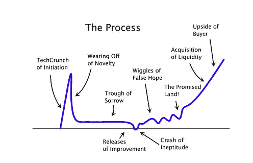

# 关于产品搜索的 10 个最好的即将到来的页面

> 原文：<https://medium.com/hackernoon/10-of-the-best-upcoming-pages-on-product-hunt-f6e674222347>

(I am in no way affiliated with Product Hunt. Just a fan)

> 我喜欢构建能解决实际问题的产品。

在过去的几年里，我已经在[产品搜索](https://medium.com/u/b8b4445269d0?source=post_page-----f6e674222347--------------------------------)社区发布了超过[十几个网络应用](http://jordangonen.com/)。虽然不是每个兼职项目都取得了辉煌的成功，但这个练习教会了我很多关于与朋友合作、识别市场机会、与客户交谈以及围绕想法创造动力的知识。

后者——建立势头——我认为是商业最重要的部分之一(最重要的是实际产品本身)。

驾驶过山车和平衡情绪总是一个挑战，但在一次又一次的实践中，我变得更善于管理预期和制造炒作(内部和外部)。

几个月前，Product Hunt 推出了即将上市的。

> 我们的使命一直是展示出色的产品，帮助制造商与用户建立联系。最近，我们(半悄悄地)推出了一个新功能，叫做 [**即将到来的**](https://www.producthunt.com/upcoming/upcoming) 给社区一个明天的预览🔥产品和制造商有机会在公开亮相前赢得观众和收集反馈。🚀

我发现这个特性是对未来技术的一个很好的窥视。

## 我和我的朋友们正在利用它来建立一个书友会:一个漂亮的工具，可以帮助你记录你读了哪些书。您可以在这里提前获得它[📚。](https://www.producthunt.com/upcoming/bookclub)

在[即将到来的](https://www.producthunt.com/upcoming)有很多项目让我兴奋不已。以下是我最喜欢的一些:

## 霍洛韦

 [## 霍洛韦—产品搜寻

### 霍洛威——地球上最有用的生活指南。寻找产品

www.producthunt.com](https://www.producthunt.com/upcoming/holloway) 

> 霍洛韦是一个可靠的实用知识的家园，保持最新。

## 原子

 [## 原子产品搜索

### atoms——唯一一款为日常购物精心设计的鞋子

www.producthunt.com](https://www.producthunt.com/upcoming/atoms) 

> Atoms 是唯一一款为日常生活精心设计的鞋子。
> 
> 它简单的造型适合工作、散步、无所事事、周末、旅行等等。

## 吸引力

 [## 亲和产品搜索

### 亲密关系情报，在产品搜寻中重新想象

www.producthunt.com](https://www.producthunt.com/upcoming/affinity) 

> Affinity 是一个关系智能平台，旨在管理您在业务中最强大的资产，即您的网络。作为一个轻量级的以人为本的 CRM，Affinity 让你的工作更轻松。

## 产品搜寻团队

 [## 产品搜寻团队-产品搜寻

### 产品搜寻团队——团队展示产品搜寻工作的一种方式

www.producthunt.com](https://www.producthunt.com/upcoming/product-hunt-teams) 

> 我们正在努力为制造商展示他们的团队(以及更多)✨的新方式

## 超人的

 [## 超人的 VIP 产品搜寻

### 超人 VIP -世界上最快的产品搜索电子邮件体验

www.producthunt.com](https://www.producthunt.com/upcoming/superhuman-vip) 

> 超人是世界上最快的电子邮件体验。

## 启动出价

 [## 产品搜索

### 发布你的想法，并让开发者竞标来建造它🚀寻找产品

www.producthunt.com](https://www.producthunt.com/upcoming/launchbids) 

> 在创始人将他们的想法发布到 Launchbids 之后，开发者就可以进行股权竞标来建造它。在一些快速尽职调查之后，创始人会奖励一个获胜者，然后他们开始工作🚀

## 寓言

 [## 寓言-产品搜寻

### 寓言-在产品搜索中使用您自己的 3D 虚拟形象的精彩视频

www.producthunt.com](https://www.producthunt.com/upcoming/fable) 

> 这就是为什么我在建寓言。进行扫描，获得个人 3D 头像，并在 ar 中创建精彩的视频。📸

## 历史搜索

 [## 历史搜索-产品搜索

### 历史搜索——你寻找产品的个人搜索引擎

www.producthunt.com](https://www.producthunt.com/upcoming/history-search-2) 

Meet History Search 是一个搜索引擎，用于搜索您访问过的书签和网页。

## 有意义

 [## 有意义的⚡️产品搜索

### 有意义的⚡️ -从您每天使用的产品搜索网站赚取加密奖励

www.producthunt.com](https://www.producthunt.com/upcoming/make-sense) 

[Make SENSE Web 应用](https://www.producthunt.com/upcoming/makesense.com) ⚡️允许你通过将你的消费者应用数据(如 GitHub 和 Reddit 使用数据)提交到以太坊区块链来挖掘加密奖励。

## 最后形式

 [## 最后形式-产品搜寻

### Lastform -具有高级营销功能的令人惊叹的表格和调查。寻找产品

www.producthunt.com](https://www.producthunt.com/upcoming/lastform) 

> Lastform，一个令人惊叹的表单和调查生成器，具有先进的营销功能。

## 邮件收发室

 [## 邮件室-产品搜索

### 邮件室——给成千上万的记者发电子邮件，用人工智能获取新闻。寻找产品

www.producthunt.com](https://www.producthunt.com/upcoming/mailroom) 

我们正在开发一款应用程序，帮助人们在不雇佣公关公司的情况下管理自己的外联活动——利用人工智能的力量联系成千上万对你的初创公司感兴趣的相关记者。

## 塞克维尔

 [## SeekWell -产品搜索

### seek well——更快地编写代码，自动完成产品搜索的琐碎工作

www.producthunt.com](https://www.producthunt.com/upcoming/seekwell-2) 

> SeekWell 消除了琐碎、重复的工作流程，因此您可以花更少的时间更新报告，花更多的时间增加价值。在 https://www.seekwell.io/[的](http://seekwell.io/)退房

## 梦幻之光

 [## 梦幻之光-产品搜寻

### 梦幻之光-世界上最聪明的产品搜索睡眠面膜

www.producthunt.com](https://www.producthunt.com/upcoming/dreamlight) 

我们正在制造一种睡眠面具，它利用光、声音和基因测试来帮助你更快入睡，醒来时精力更充沛。

## 邦图特

 [## 赏金猎人💸-产品搜寻

### 赏金猎人💸-从朋友那里收钱很有趣🤑🙌寻找产品

www.producthunt.com](https://www.producthunt.com/upcoming/bounty-hunt) 

无论是你的体育联盟，学生俱乐部，还是周末 AirBnb，从团体那里收钱/会费可能是一件痛苦的事。这就是为什么我们建立了 [BountyHunt.io](https://bountyhunt.io/landing) ，一个为你做脏活的智能机器人🤑

感谢阅读！

# 一定要去看看[读书俱乐部](https://www.producthunt.com/upcoming/bookclub):一个追踪你读了哪些书的好方法。