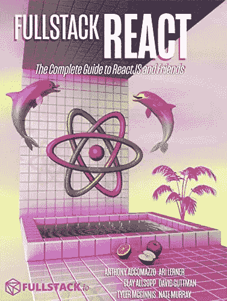

# 每个 Web 开发人员都应该阅读的 10 篇最佳 React.js 文章和教程

> 原文：<https://medium.com/hackernoon/10-react-js-articles-every-web-developer-should-read-f5b745a348dc>

“two people drawing on whiteboard” by [Kaleidico](https://unsplash.com/@kaleidico?utm_source=medium&utm_medium=referral) on [Unsplash](https://unsplash.com?utm_source=medium&utm_medium=referral)

大家好，React 或 React JS 是一个来自脸书的 JavaScript 前端库，它可以让你创建基于 HTML 的 GUI。它提供了一个基于组件的架构，以前只有 Java 和 C#这样的语言才能使用，这使得任务变得更加简单。

由于这个令人敬畏的特性，React 很快成为开发前端的标准 JavaScript 库。这就是许多程序员和开发人员学习 React 或 React JS 的原因。

但是，最大的问题是，**你如何学习反应？**您应该从哪里开始？我知道网上有很多文章、[课程](https://javarevisited.blogspot.com/2018/08/top-5-react-js-and-redux-courses-to-learn-online.html)和书籍，但是你如何选择呢？

嗯，很难但不复杂。您需要一点 React 知识来选择适合您的资源，这就是您将在本文中找到的内容。

我会在这篇文章中分享一些最好的 React 教程和课程供你参考。你可以浏览它们，选择你喜欢的一个开始你的 React 或 React JS 之旅。

# 1.React 开发人员路线图

 [## 完整的 React JS 开发者路线图

### 成为 React 开发人员的图解指南，提供相关课程的链接

medium.com](/javarevisited/the-2019-react-js-developer-roadmap-9a8e290b8a56) 

# 2.React 16 —完整指南(包括 React Router 4 和 Redux)

截止到[周日](https://medium.com/u/b32aa0132f1b?source=post_page-----f5b745a348dc--------------------------------)

 [## React 16 —完整指南(包括 React Router 4 和 Redux)

### 投身其中，从头开始学习 React！了解 Reactjs、Redux、React Routing、动画、Next.js 基础知识以及更多内容！

bit.ly](http://bit.ly/2AGvUNd) 

# 3.完整的反应原生和还原过程

从零开始开发 iOS 和 Android 应用程序-以惊人的速度构建完整的原生移动应用程序！作者:斯蒂芬·格里德

 [## 完整的 React Native 和 Redux 课程| Udemy

### 从零开始开发 iOS 和 Android 应用程序-以惊人的速度构建完整的原生移动应用程序！

bit.ly](http://bit.ly/2ypzXbs) 

## 4.[全栈反应](https://gumroad.com/a/934179955)

如果你喜欢看书和看课程，那么这本书就是给你的。一个明智的开发人员会希望对 web 开发有一个全面的了解。为了获得这一点，你应该使用一些其他的由经验丰富的专业人员使用的学科。

在本书中，您将从 Anthony Accomazzo、Nate Murray、Ari Lerner、Clay 奥尔索普、David Guttman 和 Tyler McGinnis 等专家那里学习 Full Stack React。几乎没有哪本书能让你有机会在一个地方向这么多专家学习。

这本书拓宽了我们对多种框架和采用全栈开发方式的理解。在理解了这篇重要文章中的主题后，你将成为一个自信的开发者。所有的贡献者都是受人尊敬的作者和开发人员，在许多语言和框架方面都有丰富的经验。

**这里是购买这本书的链接**——[full stack React](https://gumroad.com/a/934179955)

# 5 .在使用 React 一年后，我学到的最重要的经验是

由[托马斯·埃格林斯卡斯](https://medium.com/u/ac4e83345a52?source=post_page-----f5b745a348dc--------------------------------)奥玛塞格

 [## 在使用 React 一年后，我学到的最重要的经验是

### 开始一项新技术可能会很麻烦。你通常会发现自己置身于教程和…

medium.freecodecamp.org](https://medium.freecodecamp.org/mindset-lessons-from-a-year-with-react-1de862421981) 

# 6.JavaScript Web 开发人员在线学习的免费 React 课程

由 [javinpaul](https://medium.com/u/bb36d8439904?source=post_page-----f5b745a348dc--------------------------------)

 [## JavaScript Web 开发人员在线学习的 5 门免费 React 课程

### React JS 是用于构建用户界面的最流行的框架或 Javascript 库之一。它的后盾是…

www.java67.com](http://www.java67.com/2018/02/5-free-react-courses-for-web-developers.html) 

# 7.类型脚本反应启动器

 [## Microsoft/TypeScript-React-Starter

### TypeScript-React-Starter—TypeScript 和 React 的入门模板，带有描述如何使用的详细自述文件…

github.com](https://github.com/Microsoft/TypeScript-React-Starter) 

# 8.JavaScript 的 Async/Await 违背承诺的 6 个原因(教程)

穆斯塔法·加法尔

 [## JavaScript 的 Async/Await 违背承诺的 6 个原因(教程)

### 如果你错过了，从 7.6 版本开始，Node 现在支持异步/等待。如果你还没有尝试过…

hackernoon.com](https://hackernoon.com/6-reasons-why-javascripts-async-await-blows-promises-away-tutorial-c7ec10518dd9) 

# 9.所有基本的 React.js 概念都集中在这篇中型文章中

由[萨梅尔布纳](https://medium.com/u/c64c4b529a5d?source=post_page-----f5b745a348dc--------------------------------)

 [## 所有基本的 React.js 概念都集中在这篇中型文章中

### 去年，我写了一本关于学习 React.js 的短文，大约有 100 页。今年，我打算…

medium.freecodecamp.org](https://medium.freecodecamp.org/all-the-fundamental-react-js-concepts-jammed-into-this-single-medium-article-c83f9b53eac2) 

# 10.React 的死亡五指。掌握这五个概念，然后掌握反应。

由[萨夏·格雷夫](https://medium.com/u/156e844b0e31?source=post_page-----f5b745a348dc--------------------------------)

 [## React 的死亡五指。掌握这五个概念，然后掌握反应。

### 几年前，我的朋友 Sean 开始告诉我这个名为 React 的全新前端库将如何…

medium.freecodecamp.org](https://medium.freecodecamp.org/the-5-things-you-need-to-know-to-understand-react-a1dbd5d114a3) 

# 11.表示和容器组件

由[丹·阿布拉莫夫](https://medium.com/u/a3a8af6addc1?source=post_page-----f5b745a348dc--------------------------------)

 [## 表示和容器组件

### 你会发现如果你把组件分成两类，你的组件更容易重用和推理。

medium.com](/@dan_abramov/smart-and-dumb-components-7ca2f9a7c7d0) 

# **12。React.js:有史以来最强大的 UI 库的更好介绍。**
由[伊利亚·苏兹达尔尼茨基](https://medium.com/u/3a3aac20887a?source=post_page-----f5b745a348dc--------------------------------)在[哈克农](https://medium.com/u/4a8a924edf41?source=post_page-----f5b745a348dc--------------------------------)

 [## React.js:有史以来最强大的 UI 库的更好介绍。

### 先决条件:熟悉 HTML、JavaScript 和 CSS。

hackernoon.com](https://hackernoon.com/react-js-a-better-introduction-to-the-most-powerful-ui-library-ever-created-ecd96e8f4621) 

# 13.我们庞大的工程师团队使用由 [Yangshun Tay](https://medium.com/u/1e02c170d37d?source=post_page-----f5b745a348dc--------------------------------) 编写的前端开发指南

 [## 我们庞大的工程师团队使用该前端开发指南

### 深入了解东南亚发展最快的初创公司之一的前端技术，以及他们如何处理前端…

medium.freecodecamp.org](https://medium.freecodecamp.org/grabs-front-end-guide-for-large-teams-484d4033cc41) 

# 14.如何编写可读性高的 React 代码——10 个编码风格技巧

作者 [Nirmalya Ghosh](https://medium.com/u/5fe9e69ae1aa?source=post_page-----f5b745a348dc--------------------------------)

 [## 如何编写可读性高的 React 代码——10 个编码风格技巧

### 当进行代码评审时，开发人员很少有足够的时间来真正理解我们正在评审的每一行代码…

medium.freecodecamp.org](https://medium.freecodecamp.org/10-points-to-remember-thatll-help-you-master-coding-in-reactjs-library-d0520d8c73d8) 

以上是一些 **best React 教程和课程**。一旦你浏览了这些教程和课程，你就能找到你最喜欢的。我的偏好是从 [**React 16 —完全指南**](http://bit.ly/2AGvUNd) 开始，简直牛逼。

顺便说一句，如果你不知道 JavaScript，直接跳上 React 的马车，不要误会我，但我见过一个开发者这样做，我建议你花些时间学习 JavaScript。

 [## React 16:完整课程(包括 React 路由器 4 和 Redux)

### 投入其中，从头开始学习 React.js！学习 Reactjs、Hooks、Redux、React Routing、Animations、Next.js 等等！

bit.ly](http://bit.ly/2AGvUNd) 

开始的几篇文章是:

# 1.你学 JS 学错了

由[本杰明·卡尔德隆](https://medium.com/u/b01dea5ecd5d?source=post_page-----f5b745a348dc--------------------------------)在[黑客日](https://medium.com/u/4a8a924edf41?source=post_page-----f5b745a348dc--------------------------------)

 [## 你学 JS 学错了

### 当我学习发展时，我会对年轻的自己说什么

hackernoon.com](https://hackernoon.com/you-are-learning-js-wrong-a004746d2ff5) 

# 2.JS 中面向对象的小指南

作者[赫尔曼·库特罗](https://medium.com/u/cd021cc54d69?source=post_page-----f5b745a348dc--------------------------------)

 [## JS 中面向对象的小指南

### 在本指南中，我将尝试解释 es6 JavaScript 在面向对象范例中的新特性。

hackernoon.com](https://hackernoon.com/the-little-guide-for-poo-in-js-3cfff83ad095) 

而且，如果你需要更多的选择，你也可以看看我的汇编:

# 3.面向 Web 开发人员的 10 大 JavaScript 教程和课程

 [## 深入学习 JavaScript 的 10 大课程——最好的

### 毫无疑问，JavaScript 是目前最流行的编程语言，这也得到了……

javarevisited.blogspot.com](https://javarevisited.blogspot.com/2018/06/top-10-courses-to-learn-javascript-in.html) 

其他**编程和 Web 开发课程**你可能喜欢的
[面向 Java 开发者的 5 门免费 Spring 框架课程](http://www.java67.com/2017/11/top-5-free-core-spring-mvc-courses-learn-online.html)
[学习 Web 开发的 5 门课程](https://javarevisited.blogspot.com/2018/02/top-5-online-courses-to-learn-web-development.html)
[学习大数据和 Apache Spark 的 5 门课程](http://javarevisited.blogspot.com/2017/12/top-5-courses-to-learn-big-data-and.html)
[学习 Spring Boot 的 5 门课程](https://javarevisited.blogspot.com/2018/05/top-5-courses-to-learn-spring-boot-in.html)
[学习 Apache Kafka 的最佳课程](https://javarevisited.blogspot.com/2018/04/top-5-apache-kafka-course-to-learn.html)
[学习 React Native 的 5 门课程](http://javarevisited.blogspot.sg/2018/02/5-react-native-courses-to-learn-mobile-development-using-JavaScript.html)
[学习 React Native 的 5 门最佳在线课程 初学者](/@javinpaul/top-5-react-native-courses-for-mobile-application-developers-b82febdf8a46?source=---------112------------------)
[5 本书深入学习 React.js](/javarevisited/5-best-react-js-books-for-beginners-and-experienced-web-developers-e7b90b1ab9d2)
[10 门免费课程学习 react . js 钩子和上下文 API](/javarevisited/top-10-free-courses-to-learn-react-js-c14edbd3b35f)

## 结束语

谢谢，你坚持到了文章的结尾…祝你的 React JS 之旅好运！这当然不容易，但是通过遵循这个路线图和指南，你离成为 React JS 专家又近了一步。

如果你喜欢这篇文章，那么请分享给你的朋友和同事，别忘了在 Twitter 上关注 [javinpaul](https://twitter.com/javinpaul) ！

# 附:如果你需要一些免费资源，你可以查看这个[免费 React JS 课程](http://www.java67.com/2018/02/5-free-react-courses-for-web-developers.html)的列表，开始你的准备工作。

 [## 学习 Angular 和 React.js 进行 Web 开发的 10 大免费课程——最好的

### 毫无疑问，Angular 和 React(也称为 Angular JS 和 React JS)是最受欢迎的两种…

javarevisited.blogspot.com](https://javarevisited.blogspot.com/2019/04/10-free-angular-and-react-courses-for.html)