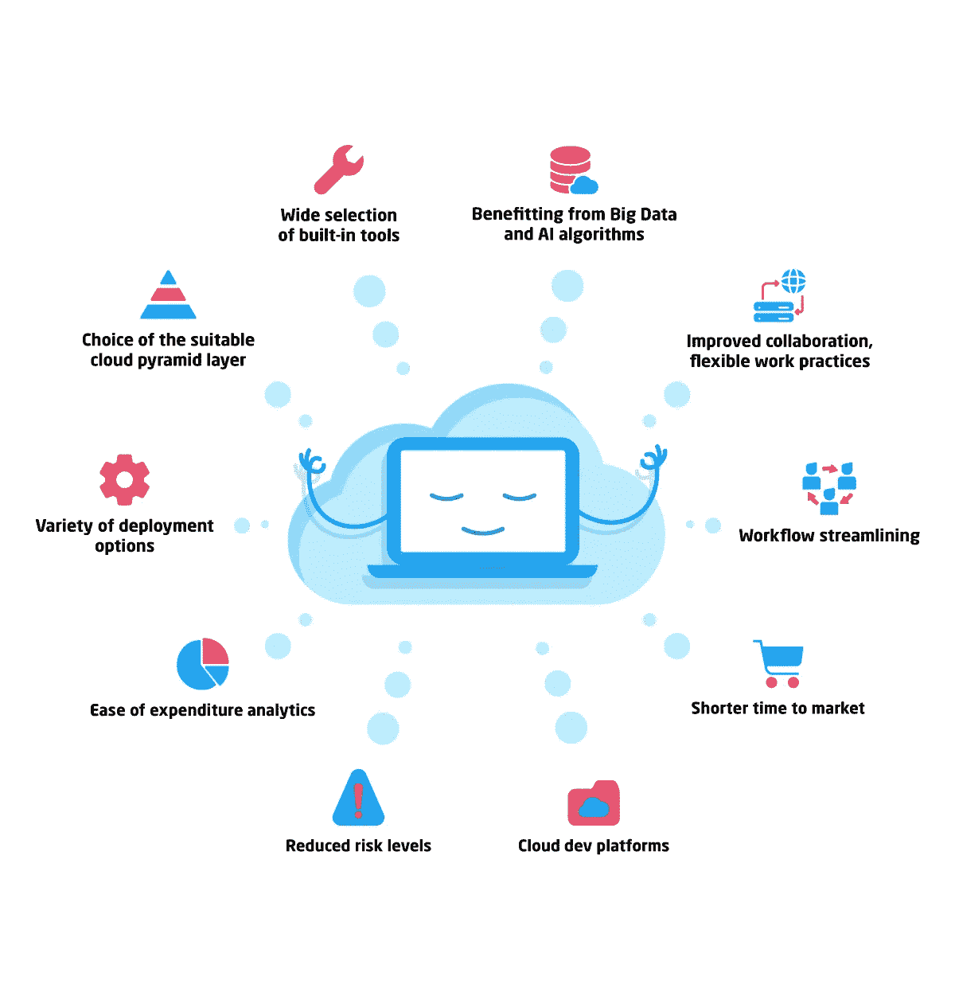

# 尝试云计算的 10 个理由

> 原文：<https://medium.com/hackernoon/10-reasons-to-give-cloud-computing-a-go-dc3184ec550e>

云过渡不再是一个时髦的词。随着超过 52%的企业已经完成数字化转型，云成为了新的标准。

安全性、可扩展性、成本效益、自动备份和恢复等特性构成了云如此伟大的基础。当然，也有一些神话和误解，我们已经揭开了其中的一些。

然而，还有一些更微妙的好处常常被忽视，但却能真正改变您的业务。因此，今天我们列出了尝试云计算的 10 个理由。

# 多种部署选项

企业可以选择最适合他们的三种主要云计算类型之一。想要完全控制流程并准备支付额外费用吗？选择私有云。希望能够以低成本快速扩展和缩减资源，并且不暴露任何任务关键型系统？公共云是你的选择。想两全其美？尝试混合云，尽情享受！

# **选择合适的云金字塔层**

企业可以深入到他们需要的云，并选择最适合他们的[云金字塔层](https://itsvit.com/blog/what-is-the-cloud-pyramid-the-layers-of-devops-services/)。根据您的业务需求，从软件即服务、平台即服务或基础架构即服务中进行选择。

# 多种内置工具可供选择

每个云服务提供商(CSP)，无论是 AWS 还是 Azure，GCP 还是 IBM Cloud，都提供了大量内置功能和工具，几乎涵盖了业务工作流程的任何方面。如果您需要开发一些特定的功能，可以使用 SDK 和 API 网关将您的第三方软件连接到云平台。

虽然有些特性对于任何提供商来说都是通用的，但有些特性却各不相同。因此，您可以选择最适合您特定业务需求的工具和服务。此外，现代工具提供了使用[多云策略](https://itsvit.com/blog/digital-transformation-multi-cloud-strategy/)将多个 CSP 的工具和功能相结合的机会。

# 受益于大数据和人工智能算法

[云成为 AI](https://itsvit.com/blog/ai-becomes-synonym-cloud-computing/) 的代名词，其实。如果您拥有基础设施、计算资源和工具来处理数据流并获得有价值的分析结果，为什么不这样做呢？事实上，2017 年编制的[财富 500 强公司名单中有 54%的公司](http://fortune.com/fortune500/)使用大数据和人工智能来支持他们的业务。我们已经讲述了 [8 个基于大数据的令人印象深刻的商业成功案例](https://itsvit.com/big-data/8-real-life-business-success-stories-based-big-data-part-1/)，您可以亲眼看到其影响是巨大的。

虽然这可能看起来是一个过度的支出项目，但随着业务规模的扩大，你很快就会看到附加值。云平台允许在任何时候将大数据分析和人工智能算法添加到您的服务包中，因此何时添加由您决定。

# 改进的协作、灵活的工作实践

当您的员工在一个基于云的系统上工作并将所有数据存储在云中时，他们可以从任何地方访问所有数据，因为他们只需要一个互联网上行链路。事实上，高达 73%的商务任务涉及到互联网上的协作，这意味着它们可以通过远程办公来完成。

此外，多达 42%的办公室工作人员同意减薪 5%以便在家工作，这意味着从长远来看，公司可以节省数百万美元的工资。因此，除了基础设施支出之外，上云还可以削减你的工资支出，从而确保更健康、更强大的底线。

# 工作流程简化

由于服务器故障或网络问题而无法交付和打印重要报告的日子已经一去不复返了。CSP 负责维护基础设施并确保其不间断可用性，从而简化您的业务工作流程。将基础设施迁移到云会有更多的[好处，但是对业务连续性和所有关键系统的永久可用性的放心对于业务来说是无价的。](https://itsvit.com/blog/moving-infrastructure-cloud-5-not-obvious-benefits/)

# **云开发平台**

在订阅的基础上提供对基于云的软件开发平台的访问比购买多份专有 IDE 软件要便宜得多。请记住，云 SaaS 开发平台提供商自己处理更新，因此您的团队始终可以获得最新的技术，而不必处理更新和兼容性问题。

# 更短的上市时间

云解决方案不需要时间来构建和完善基础设施，只要你开出支票，它们就可用。在 21 世纪快速发展的商业环境中，速度至关重要，花了 9 个月才发布的解决方案可能已经无关紧要了。再加上基础架构设计、部署和管理成本，您就会明白为什么云计算是成功的重要组成部分。

# **降低风险水平**

企业家经常要问的问题是——“如果失败了会怎么样？”比较购买硬件以调配执行任务所需的 128 台服务器的成本，以及正确配置一切所需的时间/人员，或者按小时租用。如果市场预期不明确，是否值得冒险提前 12 个月进行规划并投资构建环境——或者使用免费(或几乎免费)的云服务，使用试用期、折扣和[现场实例](https://aws.amazon.com/ec2/spot/)或 [AWS 预约实例](https://aws.amazon.com/ec2/pricing/reserved-instances/)的灵活系统是否更好？

# **支出优化**

每个企业都应该提前计划好他们的开支和利润。跟踪这些目标的完成情况对于保持安全至关重要。CSP 提供了信息丰富的日志工具和客户仪表盘，有助于轻松跟踪业务目标的完成情况。每周花多少钱？过去 6 个月花费了多少？我们达到自我可持续发展的门槛了吗？

使用云供应商提供的大量数据可视化功能，企业可以审计他们的运营绩效并调整他们的做法，以达到最佳支出并保护他们的底线。

# 关于尝试云计算的最终想法

如您所见，向云的过渡可以带来诸多好处:

*   各种部署选项，
*   多个云金字塔层，
*   过多的内置工具，
*   大数据分析和人工智能算法的易用性，
*   改进的协作和灵活的工作实践，
*   简化的工作流程，
*   基于云的开发工具，
*   更短的上市时间，
*   降低风险水平，
*   支出优化。

请记住，我们从一开始就将明显的优势排除在等式之外。即使获得云计算的任何三个好处，也可以对您的业务产生巨大的推动作用，但是能够利用所有 10 个好处使得云过渡成为一个显而易见的决定，不是吗？

*最初，我把这个故事贴在了我公司的博客上——*[https://itsvit.com/blog/10-reasons-give-cloud-computing-go/](https://itsvit.com/blog/10-reasons-give-cloud-computing-go/)