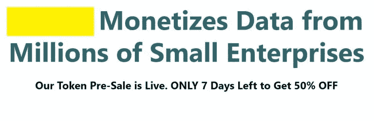
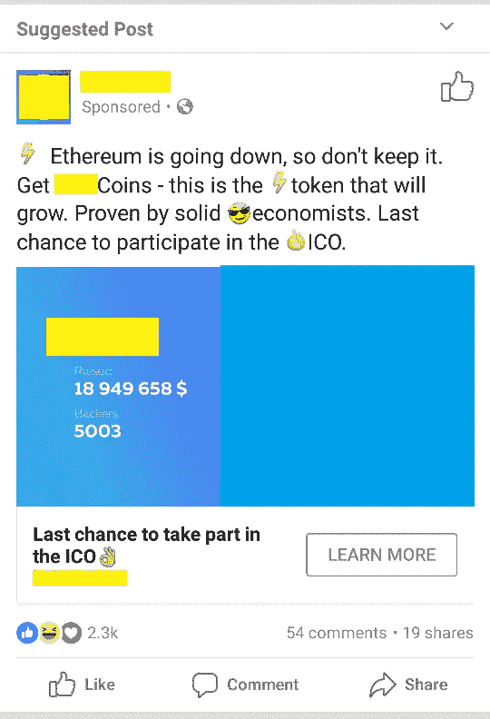

# 10 个迹象表明你正在投资一个糟糕的投资组合

> 原文：<https://medium.com/hackernoon/10-signs-you-are-investing-in-a-bad-ico-d26ab11cdfed>

ico 很多。这种现象始于三年前，由于基于以太坊的 ERC 20 代币，已经变得非常容易获得。在你学会了如何识别好的 ICO 之后，在下面的列表中你会发现 10 个坏的 ICO 投资的红灯。

**1 —团队在密码领域缺乏经验:**没有著名的密码顾问，没有著名的风险投资家投资。观看对团队关键成员的采访可以帮助回答你是否信任他们。

**2 —“这是一家现有的公司，有 3 年的经验，20 名员工”:**公司来这里只是为了钱吗？如果支点不是必需的，那么是的。如果公司在他们的领域已经盈利，除了“轻松赚钱”之外，为什么还需要 ICO？"

**3——每个人的奖金:**奖金筹集的资金越多——价格越有可能接近那个折扣水平。更严重的情况是预售投资者没有归属权。

**4 —硬上限巨大:**除了极少数情况，无限上限或非常高的上限意味着需要巨大的需求才能构成二级市场(或交易所)。没有人会等着在交易所购买代币。

**5 —不真正需要令牌:**整个生态系统都是围绕项目的令牌构建的。如果你可以用以太坊或比特币来代替代币，并且它仍然有效，那么代币就没有存在的必要，因此 ICO 也就没有存在的必要。

**6——激进营销:**当你看到太多脸书和谷歌的促销标语和广告时，尤其是当他们承诺丰厚利润时。那是红灯。

**7 —社区的讨论质量低下:**加入 Telegram，提出问题，看看开发者如何回应这些问题。ICO 的 BitcoinTalk 公告线程也是如此。强大的社区创造高价值的讨论。

**8 —公开发售持续时间过长:**要么上限太高，要么需求太低，或者两者兼而有之。对项目来说，筹集 2000 万英镑的 100%比筹集 4000 万英镑的 50%要好。

**9——没有迹象表明有大型交易所寻求上市 ICO 的代币:**这不会说得很清楚，因为法律团队不让 ICO 团队谈论交易所，但这是游戏的一个重要部分。2016 年，Poloniex 是最热门的交易所，2017 年是 Bittrex 的一年。币安是 2018 年的交易所吗？可能吧。我们所知道的是，每一枚新硬币的加入都有利于最初的 ICO 投资者。

**10-市值已经很大:**假设该公司仅出售 1 亿美元流通代币的 10%，代币初始市值从 10 亿美元开始，没有任何 3 倍或 5 倍会在交易开始前使市值爆炸。这取决于流通供给。怀疑以下几点:如果没有有限数量的代币，一小部分分配给公众，没有锁定为团队保留的代币。

如何找到好的 ico 进行投资？访问我们的 [ICO 列表区](https://cryptopotato.com/ico-list)。

*原载于 2018 年 2 月 26 日*[*cryptopotato.com*](https://cryptopotato.com/10-signs-investing-bad-ico/)*。*