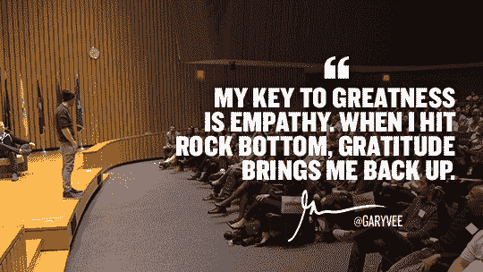

# 每个开发人员都需要的 10 项软技能

> 原文：<https://medium.com/hackernoon/10-soft-skills-every-developer-needs-66f0cdcfd3f7>

[牛津词典](https://en.oxforddictionaries.com/definition/soft_skills)将软技能描述为:

> 使某人能够与其他人有效和谐地互动的个人品质。

像同理心、思想开放和愿意学习都是软技能，无论我们身处哪个行业，都可以利用。

我们已经和 Cronofy 的开发人员谈过了，看看他们认为什么样的软技能对他们最有益，以及如何提高你的软技能。

# 1.神入

能够同情你的团队，可以让你充分理解他们面临的问题，并找到一种方法让你的项目为每个人服务。

当团队成员之间达成共识，无论某人对某个想法的感觉如何，都不会有任何负面反馈或嘲笑时，提出新想法就容易得多。

同理心让我们能够预测别人对我们所说的话可能会有什么反应，这意味着我们可以调整我们对观众的讲话方式。

如果你不喜欢某人的想法，问问自己为什么。然后，当你给出反馈时，先对他们的建议说些积极的话，然后说你不喜欢的，最后说另一个积极的话。这种“三明治”方法意味着，你的反馈对象不会纠结于负面因素，而是会理解他们想法的利弊。

与此同时，与你的用户产生共鸣，可以让你从他们的角度看问题。他们将会使用你的产品，所以你必须总是，*总是*试着站在他们的角度看问题，而不是站在你自己的角度。仅仅因为你喜欢某样东西的外观/工作方式，并不意味着你的用户也会喜欢。

决策应该不仅仅是个人偏好。

# 2.沟通

无论是在工作中还是在家里，有效的沟通都是关键。

我们的开发人员是我们团队的关键部分，他们总是愿意在会议上畅所欲言，无论是与员工还是客户。

为了有效沟通，请记住以下几点:

*   **说话清晰而自信**，即使你对自己没有信心——如果你自信地说，人们会更注意你说的话。
*   **听**。最好的沟通者花在听和说上的时间一样多。
*   不要打断别人说话。让他们说出他们想说的，然后附和你的想法。

# 3.协力

无论你做什么，总会有你必须作为团队的一员工作的时候。

无论是一个开发团队、设计师团队，还是一个项目团队，开发人员都需要与他人合作才能取得成功。

与他人合作愉快会让你的工作更有趣，也会让人们更有可能在未来帮助你。

你可能不总是同意你团队中的人，但是拥有不同的观点有助于建立更成功的公司。

# 4.平易近人和乐于助人

在某些时候，有人会想问你一些事情。它可能是关于你一天的任务，关于一个问题或者一个错误，或者仅仅是关于你周末的计划。平易近人是关键。

如果人们觉得他们不能接近你并问你一些事情，当事情出错时，他们就不太可能向你寻求帮助。这可能意味着一个小问题很快演变成一个大问题。

不平易近人或不乐于助人也意味着别人不太可能在你需要的时候帮助你。

如果你能与人建立融洽的关系，他们更有可能与你合作，而不是反对你。

当你没有时间交流时，通过在你忙的时候戴上耳机和在公司聊天时让自己离线来让别人清楚。如果有人仍然接近你，确定一个你们可以见面讨论事情的时间。

# 5.耐心

有时你会成为团队或会议的一部分，而不仅仅是由开发人员组成的。这意味着你必须解释你的决定背后的原因，并且用一种非技术性的方式来解释。有些人会马上得到一切，而有些人则需要更多的时间。在这样的时刻，对人保持耐心对于团队合作至关重要。

不是每个人都明白编程有多难，或者编写代码需要多长时间。他们可能会要求你做一些事情，而没有意识到他们所要求的范围。这会导致挫败感。花点时间解释为什么事情没有他们想的那么简单，并回答他们的任何问题。一旦你花时间做到这一点，未来的会议将变得容易得多！

# 6.思想开放

当你的思想开放时，你更愿意接受新的想法，不管是你的还是别人的。如果你愿意在摒弃它们之前考虑它们，即使是最糟糕的想法也能激发出伟大的东西。

你有越多的想法，你就有越多的项目去做。

虽然不是你的每一个想法都会变成什么，但你不知道什么会变成什么，除非你深入思考过。

对新想法保持开放的心态，不仅仅是来自你的团队，还有公司的其他人，甚至是客户。客户是使用你产品的人，所以他们是告诉你什么有效，他们需要什么的最佳人选。

# 7.问题解决

在你职业生涯的某个时刻，你会面临一个问题。它可能定期发生，也可能很少发生，但这是不可避免的。

你如何处理问题将对你的职业生涯和你工作的公司产生重大影响。

解决问题是雇主在未来员工身上寻找的一项关键技能，所以你解决问题的例子越多越好。

当处理一个新问题时，总是客观地看待它，即使它是你无意中造成的。

一旦你知道了到底是什么问题，找出是什么引起的。一旦你知道了原因，就很容易找到解决办法。差不多了。

同样重要的是要记住，无论是不是你造成的问题，你都不必独自解决它。与团队内外的人一起工作比单独解决问题更快。

# 8.有责任

责任就是对你的错误负责。承认你所做的决定造成了不良后果可能很难，但从长远来看，你和你的雇主都会受益。

当你逃避自己的错误时，你或你的同事将来很有可能会犯同样的错误。

不要逃避发生的事情，举起手来承认责任。利用机会分析哪里出了问题，然后利用这些数据来解决问题，并教你和你的同事如何避免类似的错误。

# 9.创造力

当我们从一个不同的、不太明显的角度看待事物时，最好的想法和解决方案往往会出现在我们面前。这就是最有创造力的人——从程序员到企业家到作家——与其他人的区别。

尽管人们普遍认为，创造力是可以学习的，但它来自实践。

阅读小说、写作、艺术、手工艺、甚至烹饪都是探索创造力的方式。你探索的创造性方法越多，就越容易找到不同的方法来解决同一个问题。

# 10.时间管理

当你有很多事情要做的时候，知道如何管理你的时间是至关重要的。

你花多少时间做计划？

居然编码？

和你的团队一起想出新点子？

有效地管理时间可以让你专注于最重要的事情，更有效地完成任务。

像[番茄工作法](http://www.lifehack.org/articles/productivity/the-pomodoro-technique-is-it-right-for-you.html)这样的技巧，你在一项任务上工作一段时间，休息一下，然后继续工作，或者[看板](https://leankit.com/learn/kanban/what-is-kanban/)，你可以想象你的任务，如果你倾向于多任务处理，这是建立一个惯例或学习如何集中注意力的好方法。

虽然有时需要同时处理多项任务，你可能会觉得你在做的时候完成了很多工作，但研究表明这对生产力不利。

不全神贯注意味着任务需要更长的时间来完成，你也更容易出错。

如果你经常同时处理多项任务，优先处理你的待办事项，然后用上面提到的方法来帮助你集中注意力。当你全神贯注时，你会惊讶于你完成事情的速度有多快！

# 轮到你了

作为开发人员，哪些软技能对您最有帮助？

如果您认为我们在推特上错过了什么，请告诉我们！

这本书最初是作为[两部分系列文章](https://goo.gl/cqcc2Y)在[cron soy 博客](https://goo.gl/LkS8rX)上发布的。