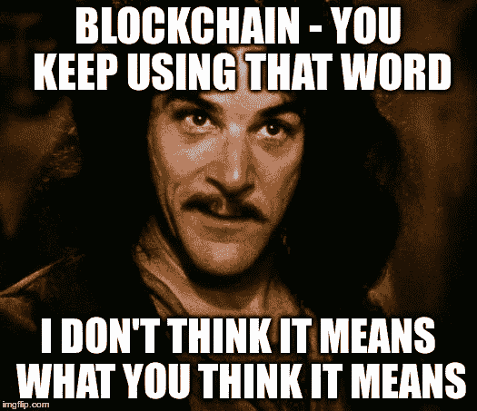
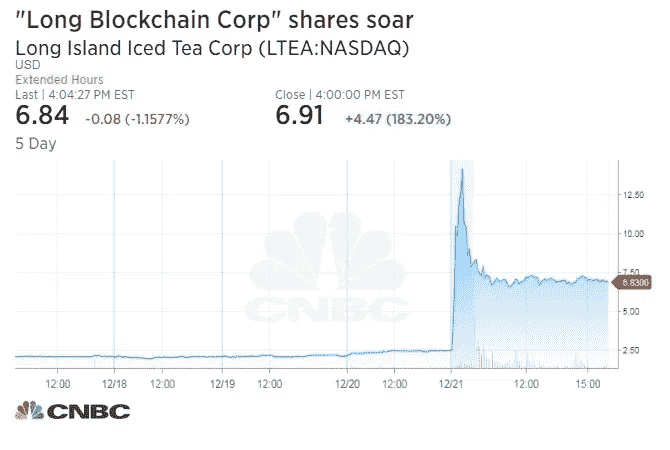
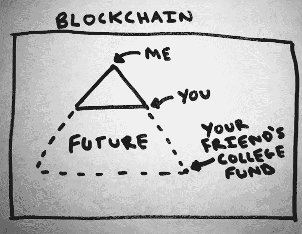

# 区块链不是的 10 件事

> 原文：<https://medium.com/hackernoon/10-things-blockchain-isnt-dcb7966d22e5>

即使在 2017 年[区块链技术也被认为是被夸大了](https://www.gartner.com/smarterwithgartner/top-trends-in-the-gartner-hype-cycle-for-emerging-technologies-2017/)。每个人和他们的表亲都开始相信[区块链](https://hackernoon.com/tagged/blockchain)将会颠覆每个行业，改变地球的面貌，并在这个过程中让默默无闻的 ICO 投资者成为百万富翁。

围绕加密货币的炒作和兴奋让人们相信了一些关于区块链技术及其实际功能的疯狂事情。

许多人现在对这项技术的潜力有错误的印象，认为它不是。

正如我之前讨论过的，[区块链](https://www.cryptobeginners.info/blog/what-is-blockchain/)只是一个具有一些独特特征的数据库结构。

它允许多方在数据库上实时记录和共享信息，并且不需要相互信任，因为他们通过代币/硬币被激励去做正确的事情。

这些特性显然非常具体，因此只有在特定的环境下才真正有用。

例如，当用于比特币等加密货币时，它们非常聪明，因为比特币背后的区块链允许人们以低廉的价格向世界任何地方的任何人汇款，而不需要银行或其他中介。

然而，区块链实际上并不适合每一种数据存储，当然也不应该被用来解决一个无人问津的问题。

在这篇文章中，我将从反对者和过度热心者(排名不分先后)两个角度来分析区块链及其应用(如比特币)的 10 个非之处:

# 1.比特币不是[史上最大骗局](https://www.recode.net/2018/4/24/17275202/bitcoin-scam-cryptocurrency-mining-pump-dump-fraud-ico-value)，不是老鼠药，也没有死。

2017 年，金融界的一些大腕开始抨击比特币，包括沃伦·巴菲特、查理·芒格和摩根大通首席执行官杰米·戴蒙。

比特币和它所基于的区块链——像所有早期技术一样——有其缺陷。

[工作验证](https://www.cryptobeginners.info/blog/crypto-terminology/#pow)共识机制使用[令人难以置信的电量](https://arstechnica.com/tech-policy/2018/05/new-study-quantifies-bitcoins-ludicrous-energy-consumption/)，许多人正在利用该系统进行投机和非法活动。

但是说这项技术会因为这些缺陷而失败就有点像在 1995 年说互联网不会工作[，因为它笨拙而无组织。](https://www.newsweek.com/clifford-stoll-why-web-wont-be-nirvana-185306)

10 年来，尽管比特币已经被宣布死亡数百次，但它一直表现强劲。

表面上看起来可能有些不靠谱，但用海军拉维坎特的话说:

> “比特币是将人类从寡头和暴君手中解放出来的工具，被装扮成一个快速致富的计划。”
> -海军拉维坎特在[推特上](https://twitter.com/naval/status/955998687670411264?lang=en)

专注于这项技术的负面，称比特币是一种欺诈，是对它实际上能让我们做什么一无所知。

# 2.区块链不是提高公司股价的一种方式

[柯达](https://www.theverge.com/2018/1/9/16869998/kodak-kodakcoin-blockchain-platform-ethereum-ledger-stock-price)、[长岛冰茶](https://www.bloomberg.com/news/articles/2017-12-21/crypto-craze-sees-long-island-iced-tea-rename-as-long-blockchain)和[在线公司](https://www.bloomberg.com/news/articles/2017-10-27/what-s-in-a-name-u-k-stock-surges-394-on-blockchain-rebrand)都是公司将“区块链”加在他们的名字上，看着他们的股票价格飙升，却看不到一个区块链的例子。

# 3.区块链不是庞氏骗局

除非你买了庞兹币，这实际上是一个庞氏骗局。

甚至不要让我开始使用 [Bitconnect](https://thenextweb.com/hardfork/2018/01/17/bitconnect-bitcoin-scam-cryptocurrency/) 。

# 4.加密货币不只是骗子的专利

当然，有很多[井](http://fortune.com/longform/bitcoin-mt-gox-hack-karpeles/) [有案可稽](/blockchannel/someone-just-stole-9-000-of-crypto-from-me-dc04e89c289d) [案件](https://blog.coinbase.com/on-phone-numbers-and-identity-423db8577e58)[密码](/@CodyBrown/how-to-lose-8k-worth-of-bitcoin-in-15-minutes-with-verizon-and-coinbase-com-ba75fb8d0bac) [黑客](https://www.coindesk.com/understanding-dao-hack-journalists/)和[诈骗](https://cointelegraph.com/news/dont-believe-the-hype-the-five-largest-ico-exit-scams-expert-take)，这是业界非常关注的一个领域。

[正如我在](https://www.cryptobeginners.info/blog/common-crypto-scams/)之前讨论过的，区块链理工大学提供的匿名性是这些骗子和黑客得以存在的原因。

但这是这项技术的一个不幸的副作用，而不是它的目的。

像 ISIS 这样的恐怖组织使用社交媒体来招募新成员，这并不意味着我们必须放弃脸书和推特。

巴勃罗·埃斯科巴赚了这么多美元，他会烧掉它们，只是为了让他的女儿温暖。整个制药业都靠现金运转。这让现金变坏了吗？

# 5.区块链不是你的非区块链创业公司筹集资金的一种方式

仅仅因为你看到了一个无名公司，仅仅因为一个想法就筹集了数百万美元，并不意味着你也可以或者应该这样做。

ICO 的目的是向潜在用户分发令牌，激励他们使用您的区块链。令牌最终应该做些什么。如果你的创业与区块链没有任何关系，那么你就不需要代币，所以不要想用代币来筹集资金。

# 6.区块链不会彻底改变你的业务

除非你的企业需要区块链提供的所有好处，否则你最好还是把数据存储在上面。

# 7.区块链不会颠覆每个行业

听说过“这就像 X 行业的优步”这句话吗？这已经进入了区块链领域，一些公司真的试图为区块链创造优步，还有其他一些事情。

这种方法的一个小问题是，并不是每个行业都需要区块链。

所以你不喜欢优步的商业行为，认为解决方案——而不是仅仅使用 Lyft——是区块链？

一个分散的、点对点的拼车网络听起来确实很性感。

但这完全忽略了为什么区块链是组织拼车的糟糕方式的所有原因。

根据定义，没有管理公共区块链的中央权力机构，那么在这个分布式公司中，谁来做决策呢？

争议解决呢？一旦数据被上传和验证，它不会去任何地方。你没搭顺风车就被收费了？司机做了很坏的事，你需要报告吗？太糟糕了，因为没人在听。

发展呢？一个没有人负责的分布式公司如何与一个拥有成熟市场的历史上资金最多的初创公司竞争？

即使一个去中心化的优步能够克服一切阻碍，创造一个有效的服务，它真的会比优步好多少？

优步(以及其他集中式拼车应用)目前运行良好。替代方案并没有好到哪里去。

将许多现有行业放在区块链上的潜在好处还不足以让用户改变他们的行为。

# 8.区块链不是一种让[为克苏鲁](https://web.archive.org/web/20170610214743/http://cthulhu.tk/)做出牺牲的方式

这件事说得越少越好。

# 9.区块链不是迷因的平台

[Dogecoin](https://dogecoin.com/) 是最知名的迷因币，2013 年[作为一个玩笑从比特币中分出](https://www.cryptobeginners.info/blog/crypto-terminology/#hard-fork)，并在 2017 年达到 20 亿美元的估值。

# 10.区块链不是没用。

除非你的代币[字面没用](https://uetoken.com/)。

# 那是什么？

尽管我已经列出了所有不应该使用区块链的地方，但仍然有区块链是完美应用的情况。

让我们来看看需要区块链的条件:

1.  共享的“仅添加”数据库
2.  多名作家
3.  缺乏信任
4.  消除中介的需要
5.  共识和验证

碰巧的是，钱完全属于这一类。像比特币这样的应用符合所有这些标准，因此是区块链理工大学的一个奇妙应用。

不幸的是，截至 2018 年，区块链还没有太多其他经过验证的大众市场应用。

这并不是说永远不会有，我们只是还没有发现它们。

这就是本文的观点:区块链不是一项无用的技术，但它也不是你的企业、经济和整个人类的救星。

我们都需要意识到这项技术的真正潜力，并为它实际能够实现的目标做好计划。

*如果你想了解更多关于比特币的信息，以及为什么它一直是最重要和最昂贵的加密货币，请查看专门为初学者编写的“* [*【比特币终极初学者指南】*](https://cryptobeginners.info/bitcoin-guide/) *”:深入了解比特币，它是如何工作的，以及它为什么重要。*

*如果您想免费获得指南的第一章，请在此留下您的电子邮件地址。*

*最初发布于*[*www .crypto 初学者. info*](https://www.cryptobeginners.info/blog/10-things-blockchain-isnt/) *。*