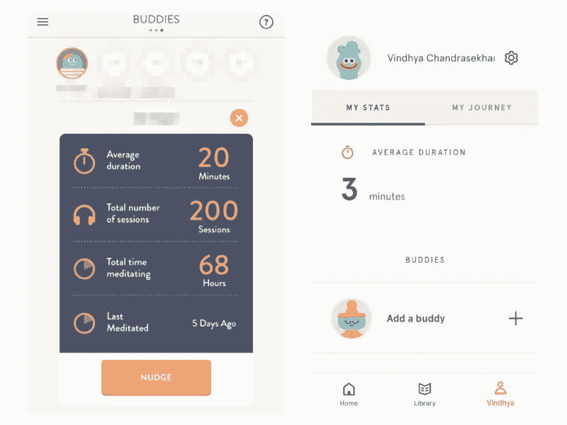

# 每个产品经理都能从 Headspace 学到的 10 件事

> 原文：<https://medium.com/hackernoon/10-things-every-product-manager-can-learn-from-headspace-655e6d1d5a01>

Headspace 是我现在最喜欢的应用之一，不仅因为我从中获得了巨大的价值，还因为它真的教会了我如何偶尔喘口气。鉴于创业世界的这种忙碌文化，你需要不断地奔跑去解决下一个问题！这不是我们团队独有的。这是来自我们整个行业的团队，团队成员没有花足够的时间停下来思考。这种日以继夜的工作和想要不断运送伟大产品的结合，使得冥想、锻炼和度假成为当务之急。难怪正念已经成为一个 2 . 5 亿美元的市场。鉴于 Headspace 在这个市场的表现，我决定更好地了解这款应用。

对于那些还没有发现 Headspace 的人来说，这是一个正念和冥想应用程序。它承诺让*“冥想变得简单”。虽然这是一项值得追求的使命，但却是一项相当艰巨的任务。然而，顶空已经在这方面取得了很大的进展。在我们自己的团队中，每一个其他人都至少经历过一次 Headspace 会议，并在会后感觉好多了。我们喜欢它帮助我们实现的正念。但是作为首相，它教会我的不仅仅是冥想！以下是一些宝贵经验的总结:*

# **1。船上的通行权**

对于任何下载应用程序的人来说，Headspace 会马上告诉你它看到你在哪里使用应用程序。旅行时在公交车上，繁忙的一天在办公室，在家里舒适的沙发上，甚至在山里度假。无论你是谁，无论你在哪里，你都可以冥想。

在他们之前的入职屏幕上，他们只是告诉你“为什么”你应该冥想。我想他们很快意识到，这甚至不是问题所在。每个人都知道为什么它是好的，他们不知道他们什么时候可以冥想。让你的用户加入进来，对不同的产品意味着不同的事情。在你的应用首次推出时，尽早确定给你的用户带来什么价值是非常重要的，这是一个你应该随着你的成长而经常访问和参与的漏斗点，Headspace 似乎已经抓住了这一点！

# **2。与你的用户交谈，不要告诉他们:**

这种语言让人感觉安全、新鲜、简单。这几乎就像你在和那个给你你需要的建议的朋友说话，以一种不会冒犯你的方式。这里重要的一课是知道你的用户如何交谈，因此你应该如何与他们互动。当你压力很大或情绪低落时，你通常会推荐冥想应用。Headspace 似乎非常了解用户情绪，他们的应用程序副本很有道理。许多应用程序都有非常普通的内容，甚至目标用户都不会与之联系，因为它不针对特定的人。了解你的用户在哪里，他们是谁，并与他们交谈是至关重要的。

# **3。先接触，后销售:**

当你第一次打开 app 的时候，它并没有马上跟你谈 Headspace 的订阅模式。那个信息离我们很远。我第一次使用这款应用时，根本不知道它还有付费版本。在 UX 方面，它专注于让你完成第一次“基本”冥想。仅此而已。所以，首先向用户展示你能提供什么——成为他们的习惯，然后销售。只有在你向他们证明了你的价值之后，才要求他们付出时间和金钱。

# **4。让设计变得有趣:**

通常，冥想被认为是一项很难完成的任务。人们普遍认为这是为瑜伽士和僧侣准备的，不是为普通人准备的。因此，如果你在 Playstore 上寻找“冥想”，你会发现一些应用程序，其中 Guruji 会告诉你练习这些技巧的正确方法。对于第一次来说，这可能相当吓人。Headspace 了解这一点，因此创建了一个有趣、迷人、非通用的插图，使用柔和的颜色，在您进入 Headspace 世界时营造出一种温暖的感觉。这里的教训是——让设计与众不同，但也要让它与你的受众相关。每次看到淡紫色背景上的大眼蓝绿色阿米巴生物，我都会想到 Headspace。同样的，每次 Loco 用户看到河马，他们就会联想到我们。建立一个在应用之外得到认可的品牌——这是我们应该不断努力的事情。

# **5。奖励权:**

虽然这似乎很难实现，可能是因为冥想还不是我的习惯，但我认为奖励正确的行为对任何应用程序来说都是关键。我喜欢刚完成一天后的连续次数。第一次和 Headspace 互动，就给了我一种成就感。游戏化在各种应用程序中都有使用，但要把它做好是极其困难的。虽然我很想看到跑步记录的思维过程有所改变(比如可能限制在第 90 天，并在此之后给出其他成绩)，但我认为这是一个好的开始！在 Loco 上，我们有一个条纹的概念，我们已经看到了很大的数字——但在另一个博客上有更多！我的观点是，通过小成就来保持用户参与不是一件容易的事情，但是要确保你奖励他们更多可操作的事情。

# **6。巧妙推送通知:**

我真正喜欢的另一件事是他们的通知。作为一家每天有 6 款游戏的公司，我们的挑战是在正确的时间让人们使用这款应用。推送通知 CTR 很难破解，但 Headspace 做了一些不同的事情，我很高兴能尝试 Loco！它给你这些*正念时刻*，他们称之为。它不需要点击，不需要行动。它只是想让你重新思考，集中注意力，练习正念。所以如果我想每天都保持正念，我能做什么呢？冥想！这就是他们想要的召回！太棒了。我还喜欢 Headspace 有一个大的橙色圆圈作为他们的标志，这样即使你在另一个应用程序/屏幕上，通知托盘上的标志也会抓住你的注意力。

# **7。内容是关键:**

虽然营销和公关很棒，但没有什么比建立内部内容更能推销你的品牌价值了。顶空似乎已经得到了这个爆炸！Headspace 有一个[每日博客](https://www.headspace.com/blog/)，一个 [youtube 频道](https://www.youtube.com/user/Getsomeheadspace)，其大部分视频的浏览量超过 1000 万，一个播客和创始人本人(修道士变成科技大亨)的内容。无论是在应用内部还是与应用相关的事情上，他们都积极宣传他们的承诺——*让冥想变得简单。*即使在 Loco，我们也知道制作高质量的内容而不仅仅是游戏更新是多么重要！这就是为什么我们在 Instagram 上制作迷因、猜谜语、制作小故事游戏等——在吸引用户的同时创造相关的、仍然以本地为中心的内容。

# **8。** **创造稀缺:**

一旦我经历了足够多的顶部空间，我就会渴望更多，但现在它有了付费墙。到这个时候，Headspace 已经让我明白了它能给我带来的价值。为了尝试更多，我必须拿出我的钱包。我对此没意见，因为我真的想体验一下 Headspace 能提供的更多。我们在 Loco 很早就明白了这一点，这就是为什么我们一直没有游戏。我们已经指定游戏，用户必须在正确的时间来玩。这种稀缺性吸引用户不断回来。

# **9。社交化**

让用户回到应用程序的一个好方法是让他们将他们的朋友添加到你的应用程序中！Headspace 可以让你轻推你的朋友，让他们了解你的进展。每当你使用你喜欢的应用程序时，你肯定会用它给你的朋友打电话。一旦你的朋友上了这个应用，你会犹豫要不要离开，因为对你建立的社区有太多的依恋。我们在 Loco 也是这样开始的，通过引入朋友排行榜，所以你可以保持你的社区紧密团结和竞争力。Headspace 还会告诉你目前有多少人在冥想，让你觉得身边有志同道合的人。我们在应用程序中也是这样做的，向用户显示当前有多少用户在玩你的游戏。知道你不是一个人，是让你感觉你是比你自己更大的事物的一部分的好方法。

# **10。** **多研究，少假设。**

Headspace 不是卖给你废话。它不是假设一个市场正在解决一个根本不存在的问题。它不会在推文建议上构建功能。它是通过研究建立的。他们的网站上有一个专门的部分，向你展示他们正在进行的研究发现了什么，以及他们如何努力做得更好。他们依靠数据做出强有力的决策。虽然这是一项艰巨的任务，但 Headspace 似乎做得很好。

这就是我作为一名项目经理从 Headspace 学到的东西——一个我个人和现在职业上都喜欢的应用程序！

我们将继续分解我们喜欢的应用程序，并从中吸取一两个教训。与此同时，如果有一款应用激发了你的灵感，或者你希望我们分析一款应用，请在评论中告诉我们，我们会尽力而为！

*资源:*[*clever tap*](https://clevertap.com/blog/push-notification-best-practices/)*，* [*UX 设计*](https://uxdesign.cc/a-feature-proposal-to-headspace-4445643aba9c) *，* [*商业内幕*](https://www.businessinsider.in/Ive-used-a-meditation-app-loved-by-Wall-Streeters-and-Olympic-athletes-daily-for-the-past-8-months-and-now-I-cant-imagine-my-life-without-it/articleshow/53802281.cms) *，* [*福布斯*](https://www.forbes.com/sites/kathleenchaykowski/2017/01/08/meet-headspace-the-app-that-made-meditation-a-250-million-business/#455322bd1f1b)