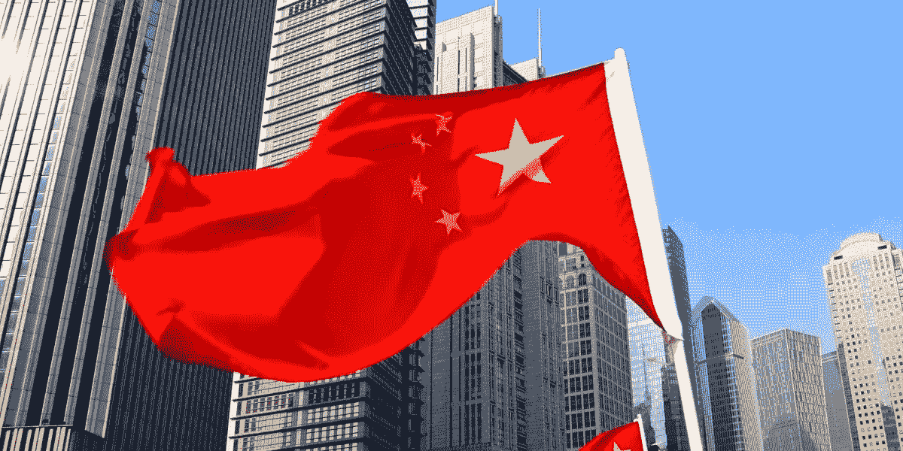

# 进入中国 ICO 市场你需要知道的 10 件事

> 原文：<https://medium.com/hackernoon/10-things-you-need-to-know-about-entering-china-s-ico-market-5b607cac30fb>

Photo credits to Shutterstock, I do not own or claim the copyright

我们公司和我一直在为项目、交易所、加速器和机构投资者(VC)提供有关进入中国市场的建议。中国政府对加密货币的法规进行频繁的更新和决策，而英语使用者所能获得的信息总是不够快或不够充分。除了政府方面的障碍，中国网民/公民的本性和习惯与美国网民/公民有很大的不同。它创造了另一层屏障。

以下是我很高兴与所有观众分享的 10 件最重要的事情，以便更多地了解这个神秘而迷人的市场-

1.  中国官方禁止使用 ICO。在任何法律文件和网站上，都应该列明中国公民不得参与其中。*注:港台两地居民投资 ico 仍有一定自由度，甚至一些项目在港台两地都相当活跃。*
2.  **所有人们熟悉的社交媒体都被禁止了。**包括 Telegram、脸书、Twitter、insta gram……哦对了，还有 Medium、YouTube 和 Google！我看到的大部分项目只是通过从中国无法访问的渠道进行交流，有时网站上的视频也来自 YouTube！最糟糕的是，一些白皮书需要从 Google Drive 下载。
3.  不建议大规模的会面。有几次相对较大规模的会议或中型会议被迫取消。最近的一个例子是中国最大的博彩节日——中国国际娱乐城(China Joy)，大量区块链项目准备参加一个附属的区块链展会，但几天前就被取消了。
4.  **中国媒体很贵。一些出版物仍然会收取相当多的钱，即使这是一个角度好的好故事，而且来自领先的项目。此外，大多数主流媒体没有报道加密货币，特别是 ico，以遵循政府的指导方针，这给了加密垂直新闻频道这样做的空间。**
5.  **注意术语和措辞**。有些术语和词语应该禁止在中国使用，否则内容将被删除，帐户将被禁止。
6.  **一些隐秘的大牌其实在中国是臭名昭著的。一些知名的有影响力的人有可疑的行为，但是这种新闻没有被西方媒体报道。高调并不意味着他/她能给一个项目带来真正的价值或积极的影响。小心选择和谁一起工作。**
7.  **有假发言人的假会议**。第二层或第三层会议假装所有有影响力的人和行业巨头都参加了他们的活动，但事实并非如此。做更多的尽职调查检查和验证。在亚洲，每天到处都有由中国人主持的会议，不可能所有的贵宾都去。
8.  **读者群也可能是假的。**某些媒体利用机器人操纵观点，因此这不应是选择媒体合作伙伴的唯一决定因素。团队和内容质量是评估他们的领导能力和他们创造好故事的努力的更好方式。
9.  **没有电子邮件营销&简讯。**它们并不真正适合中国。
10.  **几个有中国背景的好市民区块链。**尽管目前市场和监管似乎不是 100%有希望，但有不少来自亚洲的具有中国背景的公共区块链可供开发者考虑，包括 QTUM、VECHAIN、NEO、MIXIN NETWORK 和 BUMO。当在早期阶段探索选项时，不要忘记检查它们。

在接下来的文章中，我将分享韩国、日本、香港和台湾的小贴士，敬请关注！