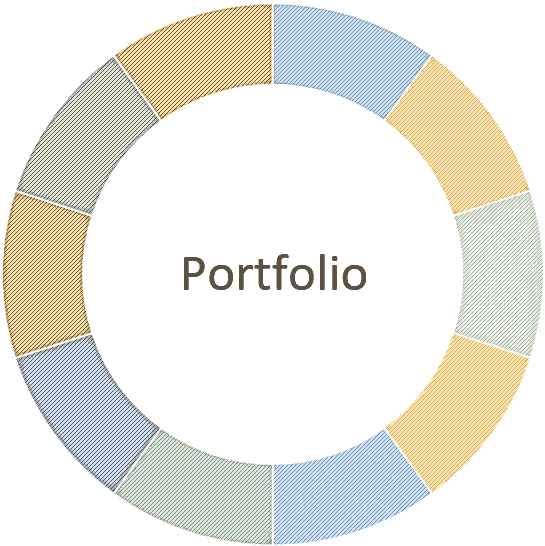

# 创建黑仔加密货币投资组合的 10 个技巧

> 原文：<https://medium.com/hackernoon/10-tips-for-creating-a-killer-cryptocurrency-portfolio-447f1a191a9c>

本文的目的是帮助加密货币投资者渡过难关，创造一个经得起时间考验的全面投资组合。这些提示将打破硬币和市场的不同方面，在确定某个硬币是否是一个有前途的投资时，应该考虑这些方面。这个列表是为你的加密竞赛设计的一个起点，而不是一个包含所有可能细节的详尽指南。最终，由投资者决定哪种资产最适合他们的投资组合。

一旦你花时间制定了你的战略，你就可以使用 Shrimpy 通过一个单一的界面来管理你的所有资产。在这里报名[。](https://www.shrimpy.io)

# 1.流通供给、总供给和市值

## 市值

在评估一枚硬币时，我首先检查的是市值。我会查看市值对于目标市场是否合理。我会考虑它与具有类似市值的硬币之间的关系，并尝试想象一两年后的市值会是多少。有了这个粗略的估计，我就大致了解了硬币的价值在未来会如何变化。请记住，在此期间，发行量将如何增长。这一点很重要的原因是，如果你预计明年硬币的总市值将增长 10%，但流通供应量的年增长率超过 10%，那么硬币的价格实际上会下降。通过观察这一点，我们对硬币产生了合理的增长预期。

## 循环供应

查看流通供应时，有几个关键因素需要评估。首先是发行量的扩张速度有多快。这意味着新硬币进入流通的速度。新硬币进入流通的速度越快，价格就越难攀升。接下来，注意流通供给占总供给的比例。随着流通供应量达到总供应量，这意味着将有更少的硬币进入流通，并可能迫使价格上涨。另一方面，如果流通供应量只是总供应量的一小部分，这表明价格将受到市场未来稀释的影响。

让我们看一个简单的例子，价格上涨如何影响基于流通供给的市值。假设我们有两枚面值都为 1 美元的硬币，但一枚硬币的流通供应量为 1000 枚，另一枚硬币的流通供应量为 10 亿枚。如果两种硬币的价值都增加 1 美元，这意味着小流通硬币的市值将达到 2000 美元，大流通硬币的市值将接近 20 亿美元。这表明，虽然一枚硬币中 1 美元的变化只会使另一枚硬币的市值增加 1000 美元，但它却使市值增加了 10 亿美元。这说明了为什么发行量大的硬币更难升值。

## 总供水量

硬币的总供应量与流通供应量密切相关。总供应量表明总共可以铸造多少硬币。这个价值可以帮助你理解硬币的长期潜在价值。如果总供应量非常大，这可能表明随着流通供应量的增加，价格可能会保持稳定，因为新硬币进入流通抵消了价格的上涨。将总供应量考虑在内有助于解决硬币长期升值是否可行的问题。总供应量越高，未来价值的微小变化对市值的影响就越大。如果我们假设一个非常极端的情况，这是可以观察到的。假设一枚新硬币的当前流通供应量为 1000 枚，其总供应量为 10 亿枚，该硬币的当前价格为每枚硬币 1000 美元。虽然目前的市值只有 100 万美元，但为了在流通供应量增加到总供应量时保持这一价格，当流通供应量达到总供应量时，硬币的市值需要达到 1 万亿美元。这表明硬币的价格可能会随着稀释而下降。

# 2.使不同

## 市值

基于市值的多样化意味着选择市值不同的硬币。具有不同市值的投资组合将有几个高市值硬币、中等市值硬币和低市值硬币。例如，常见的投资组合是高、中、低市值硬币分别占 50%、30%、20%。它可以让你在不承担太多风险的情况下看到巨大的短期和长期增长。我最近被问到的一个问题是“什么构成高、中、低市值？”虽然这取决于回答问题的人和市场的当前状态，但一个简单的衡量标准是将前 30 枚硬币视为高市值，接下来的 150 枚硬币为中等市值，其余硬币为低市值。在撰写本文时，这意味着市值超过 5 亿美元的硬币将是高市值硬币，低于 5 亿美元和高于 5000 万美元的硬币将是中等市值硬币，低于 5000 万美元的硬币将是低市值硬币。随着市场的增长和变化，被认为是高，中，低市值的硬币也将发生变化。因此，在按市值分类后对硬币进行分组，可能是比简单地查看严格的美元价值更好的方法。

## 目标市场

加密货币试图解决各种各样的市场。从出版( [Po.et](https://www.po.et/) )到存储( [Storj](https://storj.io/) )到借贷( [ETHLend](https://ethlend.io) )的任何事情都被加密货币打乱了。这并不意味着所有这些市场都会幸存下来。为了防止你的投资组合在其中一个市场萎缩时崩溃，理想的做法是将你的投资分散到许多不同的行业。不要只投资一个行业，而是选择一系列有前途的多元化行业。这些行业包括:分散存储、计算、借贷、开发平台、微支付、隐私、分布式交换、广告和社交媒体。

## 硬币技术

不是所有的硬币都使用相同的技术，也不是所有的技术都是平等的。硬币可以分为多种技术类型，各有优缺点。有不同的挖掘哈希算法，如 [SHA256](https://en.bitcoin.it/wiki/SHA-256) 、 [Scrypt](https://en.wikipedia.org/wiki/Scrypt) 和 [X11](https://dashpay.atlassian.net/wiki/spaces/DOC/pages/1146918/X11) 。然后是工作证明、利害关系证明、活动证明等不同的证明制度。加密货币技术的所有这些差异都会影响其被采用的能力。当构建多样化的投资组合时，重要的是要记住这些技术各有利弊。当市场变化时，它可能开始倾向于特定类型的技术，如果在建立投资组合时没有考虑到这一点，这可能会极大地影响你的投资。出于这个原因，选择使用不同技术的各种硬币是一个好主意。

在我们的技术研究中，了解更多关于多元化如何影响投资组合表现的信息:

 [## 投资组合多样性:技术分析

### 多元化给投资组合增加了多少价值？这是我们希望通过此解决的核心问题…

blog.shrimpy.io](https://blog.shrimpy.io/blog/portfolio-diversity-a-technical-analysis) 

# 3.团队和顾问

## 组

类似于硬币多样性，一个全面发展的团队应该有强大的多样性。这个团队应该由一群受人尊敬的工程师、有创业品牌/设计经验的设计师、有成功营销活动记录的营销人员，以及过去管理过成功项目的领导团队组成。业内最好的团队会具备这些素质，甚至更多。评估一个团队是评估一枚硬币最困难的方面之一，尤其是当可能没有很多关于个人的信息时。引人注目的头衔和浮华的过往经历并不总是能很好地融入创业环境，所以要谨慎接受围绕团队的炒作。

评价团队成员时，不要轻信任何人的话，要深挖细节。他们应该为每个成员列出 LinkedIn 个人资料，为那些发推文的人列出 Twitter 句柄，对脸书页面、博客等进行分组。浏览他们的在线资料可以帮助你详细了解他们的团队，以及他们是否真的致力于他们声称正在开发的产品。

## 顾问

顾问不应该被忽视。虽然他们可能不参与团队的日常活动，但这些顾问告诉我们一些关于团队的非常重要的事情。他们告诉我们一个团队在推销他们的想法时有多有能力，说服高知名度的人这种努力值得他们花时间，并证明他们有强大的影响力。在寻找顾问时，考虑他们与项目试图解决的行业的相关性，看看每个顾问在各自行业中的影响力，并确定他们将有多大的影响力，可以帮助他们利用自己的网络来帮助团队。

# 4.投资者和资金

## 提供资金

资金可以是团队潜力的一个重要指标。如果没有足够的资金，克服困难并取得成功将是一个不可思议的壮举。此外，请注意 ICO 发生的时间以及他们雇佣了多少团队成员。这可以决定他们的燃烧率，并确定未来的前景如何。如果不扩展到其他行业，所有的 ico 都有一个独立的跑道。这意味着资金数量有上限。一旦这些资金用完，开发就会停止，除非工程师决定免费捡起未完成的代码，这是不应该的。就我个人而言，当我看到一家公司没有筹集到大量资金，拥有庞大的团队，他们创造的硬币市值很低，这向我发出信号，他们正在迅速烧钱，不会存在很久。

## 投资者

有时候，给你钱的人比你收到的钱更重要。通过检查加密货币的投资者，你可以了解这个团队受到了多大的信任。一些风险投资公司已经开始投资 ico 和加密货币。如果你看到一种加密货币背后有一家知名风投公司，那肯定是一个好迹象。这表明该团队能够联络并影响业内的决策者，让他们相信他们的团队拥有大量资金。

# 5.产品开发和活动

关于评估一种新的加密货币，我个人最喜欢的部分之一是挖掘他们的公共代码库。我通常会从高层次的评估开始，看一下这样的事情:他们提交代码的频率，他们的存储库的组织程度，有多少不同的贡献者将提交推送到存储库，报告的问题有多少以及有多严重，以及有多少拉请求。其中两个比较重要的是提交的频率和贡献者的数量。我遇到过太多中等和高市值的硬币，它们多年来没有一个承诺，或者只有一个开发商对整个加密货币进行所有的更改。这两者都是不可持续的，并将导致货币崩溃。

一旦我对存储库的状态有了大致的了解，我就开始钻研代码。我对代码的结构有所了解。开发人员是否已经编写了文档化的干净代码？他们是否有强大的测试环境来实际执行代码的关键部分？如果代码没有被很好地记录，或者似乎没有一个强大的测试环境，这可能是一个信号，表明硬币将在未来难以扩展。最后一个阶段实际上是理解部分代码。没有必要理解所有的代码，但是你可以通过浏览代码大致了解开发人员的能力。我检查他们的代码设计是否合乎逻辑和精确，当可能和明显的时候，我寻找优化的使用，我喜欢看到他们使用强大的面向对象设计。

我认为团队编写的代码是我的团队评估的证明。如果我评估他们的团队是一个有强大潜力的团队，那么他们的知识库巩固了我对这个团队的看法。除了通过阅读存储库来证明工作之外，还有其他方法来查看开发人员是否参与其中。通过在 Twitter 上关注开发人员，在技术会议上寻找出场机会，以及参与技术讨论，表明开发人员已经准备好参与社区，具有很强的沟通技巧，并且愿意与社区分享他们的知识。

# 6.白皮书

虽然白皮书很重要，但是对该文档的依赖程度很高。虽然这个想法可能很深刻，但如果他们不能实现这个想法，那就没什么关系了。许多高市值和中等市值硬币有着永远无法实现的宏伟愿景，因为要么它们将耗尽资金，要么技术不可行/不可靠/不实用，要么人们会简单地理解它没有他们想象的那么有用或方便。确保在阅读白皮书时，您寻找能够表明愿景是由不懂加密货币的人设计的白日梦，还是他们正在开发的东西有技术和实践基础的关键指标。几个可能永远不会出现的白日梦的例子是试图做所有事情的硬币。向世界承诺的硬币不理解今天正在使用的各种算法和技术的权衡。

# 7.社区

说到底，虽然一个产品被制造出来了，但这并不意味着人们会使用这个产品。因此，社区是硬币成功不可或缺的一部分。没有一个强大的社区支持硬币，它不太可能成功。这并不意味着目前正在上涨的硬币背后永远不会有一个强大的社区，但这意味着需要对围绕支持硬币的社区的趋势进行评估。通过在社交媒体、论坛和技术讨论板上收集参与度，可以了解社区如何参与其中。随着市场价值的增加，社区参与也应该增加。一枚硬币最近在社区参与中没有匹配就被泵出，这可能是一个迹象，表明幕后正在发生一些事情，将很快导致随后的倾倒。当一个社区聚集起来支持硬币，参与硬币的开发、营销和使用，甚至开始围绕硬币建造东西时，自然增长就发生了。例如，第三方块探索者、价格追踪器、集成到第三方钱包等。随着社区支持的增加，市值也可能随之增加。如果市值领先支撑，谨慎行事。

# 8.营销和宣传

在实际的产品开发之外，团队有能力营销产品是很重要的。除了营销之外，建立有意义的伙伴关系、赞助商和支持在某些方面与产品一样重要。产品开发和营销之间需要有一个平衡。随着时间的推移，随着资金的枯竭，一个没有适当营销的产品可能会失败。相比之下，一枚过度营销的硬币可能会导致炒作超过产品，导致市值远远超过产品的价值。随着公众开始意识到这一事实并开始担心未来，这可能会导致以后的崩溃。这种波动可能会导致不确定性。理想的营销是与产品开发紧密结合的营销。随着产品的成熟，有机增长营销活动并扩大规模是一个积极的方案。

# 9.时间表

时间表是一个重要的指标，表明团队如何保持他们的进程并达到目标。即使是最好的团队也需要交付成果。如果不能按时交付，投资者就会担心，价值也会变得不稳定。一个值得信赖的团队会让社区在他们的时间线内保持循环。一个好的团队会实现他们的目标，或者至少会提供充足的证据来支持他们没有按时完成的原因。

此外，时间表应该合理。当一个团队不能按时完成任务会导致问题时，一个团队有不合理的长时间的时间表也会导致问题。没有仓促，任何团队都可能被引入市场的新的雄心勃勃的硬币推翻。这意味着在匆忙和确保有足够的时间完成任务之间应该有一个合理的平衡。

# 10.资源

投资加密货币是一个持续的过程。在行业成熟的同时，还会有新的技术和机会不断涌现。为了了解你投资的未来前景，掌握最新消息是很重要的。当错误发生时，不要害怕改变策略。也有很多好的资源可以用来收集关于市场和每种加密货币的信息。我将在下面提供一些资源。

市场分析:[https://coinmarketcap.com/](https://coinmarketcap.com/)

硬币评级:【https://www.coingecko.com 

各币社交分析: [https://solume.io](https://solume.io/)

讨论组:[https://bitcointalk.org/](https://bitcointalk.org/)

硬币高级讲解:[https://www.iconomi.net/digital-assets](https://www.iconomi.net/digital-assets)

资源收集:[https://cryptominded.com/](https://cryptominded.com/)

市场分析:[http://coinpuffs.com/](http://coinpuffs.com/)

别忘了查看一下 [Shrimpy 网站](https://www.shrimpy.io/)，在 [Twitter](https://twitter.com/ShrimpyApp) 和[脸书](https://www.facebook.com/ShrimpyApp)上关注我们的更新，并在[Telegram](https://t.me/ShrimpyGroup)&[Discord](https://discord.gg/gXyy95y)上向我们令人惊叹的活跃社区提问。

 [## 加密货币的投资组合再平衡

### 投资组合再平衡是投资者使用了几十年的策略。首先，投资者必须确定如何…

blog.shrimpy.io](https://blog.shrimpy.io/blog/portfolio-rebalancing-for-cryptocurrency)  [## 再平衡与 HODL:技术分析

### 这项研究的目的是描绘一幅公平的画面，说明再平衡作为一种策略如何符合霍德林。为了…

blog.shrimpy.io](https://blog.shrimpy.io/blog/rebalance-vs-hodl-a-technical-analysis) 

如果你觉得这个列表缺少了什么，请留下你的评论。

捕虾队