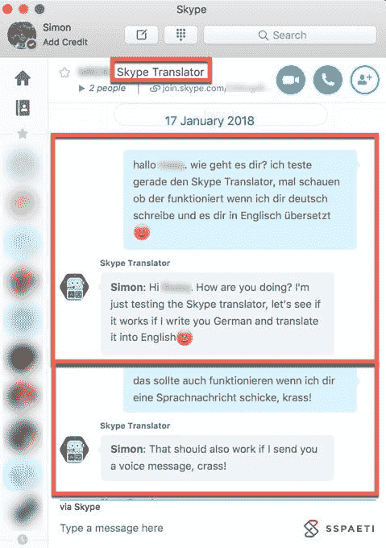
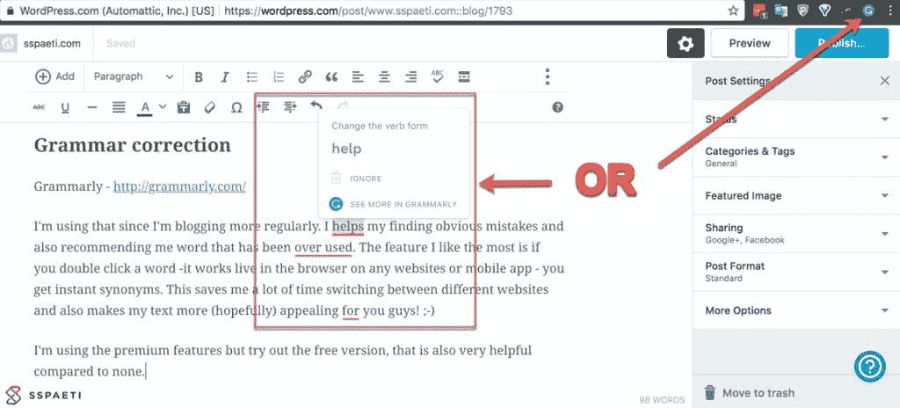
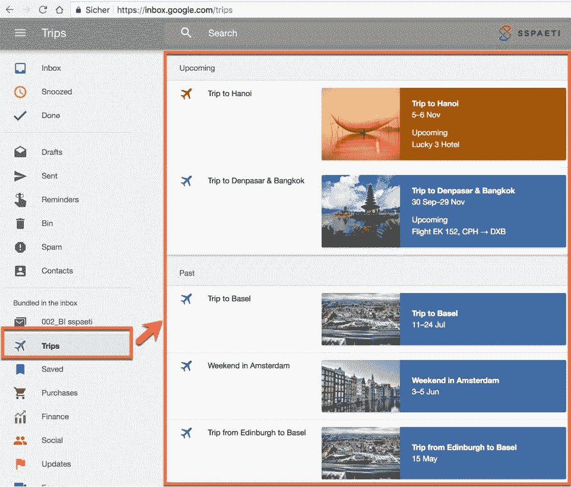
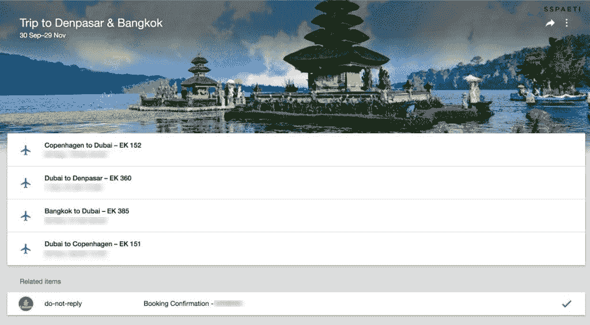
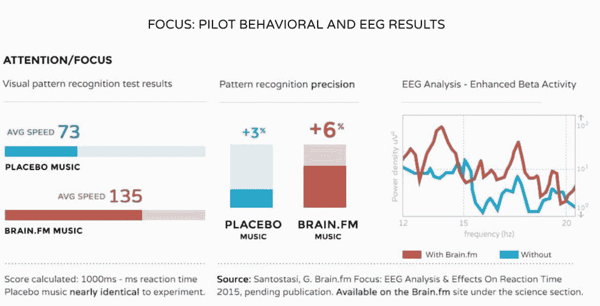
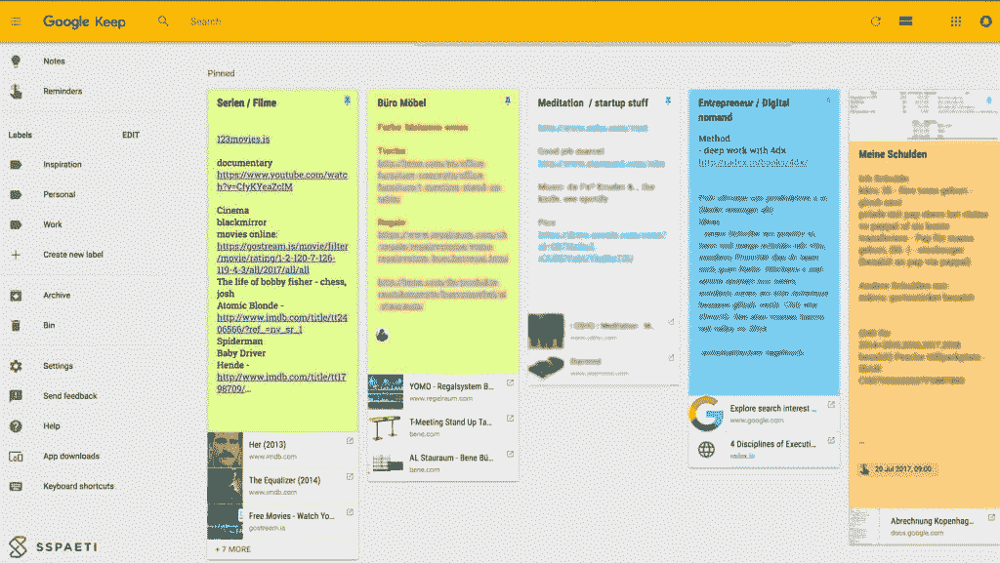
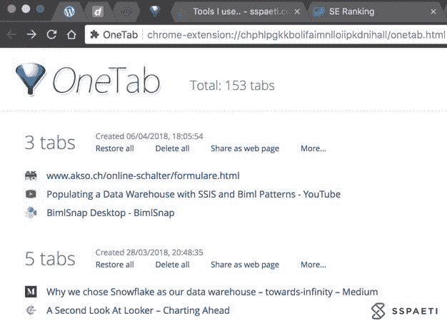

# 提高你#生产力的 10 个工具

> 原文：<https://medium.com/hackernoon/10-tools-that-will-boost-your-productivity-3231785f9f81>

stag beetle and his tool

我使用的工具将集中在**简化你的沟通生活、语法、工作或学习的重点、小笔记和谷歌 Chrome 的两个工具**。有些工具你可能已经知道了，但希望不是所有的功能和特性，因为我试图详细阐述了曾经不明显放在首位。事不宜迟，请享用下面的工具。

# 即时语言翻译

## 在你身边

谷歌翻译——play.google.com[的](https://play.google.com/store/apps/details?id=com.google.android.apps.translate)和 itunes.apple.com[的](https://itunes.apple.com/us/app/google-translate/id414706506?mt=8)

由于这是一个显而易见的文本翻译，许多人可能不知道这个应用程序使用你的相机进行动态翻译。在视频中看看它是如何工作的。

照片也一样。例如，由于我住在丹麦，根本不会说丹麦语，所以在商店里用谷歌翻译阅读我的信件或任何东西从来没有任何问题。这听起来是一件小事，但是**如果你在外国旅行或生活，它可以救你一命**！

## 通话或视频

Skype—[Skype.com](https://www.skype.com/)

语音通话或 Skype 聊天也是如此。他们有一个新的选项，您可以在您的对话中添加 Skype Translator，定义您的语言，Skype 会将其翻译成其他人的语言。下面是一个聊天信息的例子，同样的例子也适用于语音。

# 语法纠正

语法上——[grammarly.com](http://grammarly.com/)

自从更经常地写博客以来，我开始使用语法。它帮助我找到明显的错误，并给我推荐那些被过度使用的单词。我最喜欢的功能是，如果你双击一个单词——它可以在任何网站或移动应用程序的浏览器中运行——你会得到即时同义词。这节省了我在同义词库和我的页面之间切换的时间，让我的文字更吸引你们！😉

我正在使用高级功能，但尝试免费版本，这也是非常有益的相比，没有。

# 电子邮件

谷歌收件箱—[inbox.google.com](https://inbox.google.com/)

如果你使用或拥有 Gmail，你可以直接使用谷歌收件箱，它只是你谷歌邮件的一个视图。

收件箱是简单的。第一步是将每封邮件按照低优先级、促销、更新、财务、购买和您的个人类别进行捆绑。另一个帮助你**用更少的时间写邮件，用这三种状态完成它们**:

*   阅读并将其标记为完成->然后它将被存档并从您的收件箱中删除
*   不阅读并标记它的重要性->它在你的收件箱中保持独特
*   或者打盹->它会在以后提醒你，你不会忘记

## 分类或捆绑

谷歌用人工智能捆绑你的邮件。这在旅行时尤其方便。正如您在下图中看到的，所有与同一趟旅行相关的电子邮件(如酒店、旅行、活动或任何其他电子邮件)都被分组到同一个文件夹中。我没有自己做任何事情，所有的事情都是自动完成的——包括每个目的地的可爱照片。

如果您点击旅行，您会在一个视图中看到所有附加的电子邮件以及航班详情:

当然，谷歌会为此阅读你的电子邮件内容，但他们已经这样做了，为什么不利用它呢？

## 自动建议回复

另一件事是，如果你回复一封电子邮件，谷歌试图给你一个标准的答复，甚至在你写一个字之前就向你建议。有点恐怖，不是吗？然而，如果正确的话，每天可以节省几分钟👌🏻。

## 其他非常有用的功能

*   它会自动将我的**邀请保存到您的日历**中。例如正常的邀请，当然也包括音乐会、航班等等。
*   您可以保存一个链接供以后使用。有时你有一个链接，你想提醒你以后，在这种情况下，你应该把它放在哪里？如果你打开收件箱，除了创建一封新邮件，你还可以点击*保存以备后用*并提醒你它就像一封邮件一样留在你的收件箱里，很酷吧？

更多信息，请参见下面的视频:

## 推迟 Gmail 中的电子邮件

回旋镖—[boomeranggmail.com](https://www.boomeranggmail.com/)

如果你仍然想使用 Gmail，但错过了小睡功能来提醒你或自动发送电子邮件到稍后的时间，你可以使用 Gmail 的插件 Boomerang。

# 让你集中注意力的音乐

focus @ will—[focusatwill.com](https://www.focusatwill.com/)
brain . FM—[brain . FM](https://www1.brain.fm/)
nois Li—[noisli.com](https://www.noisli.com/)
或相同的无人声音乐并放入循环

正如我之前的博客[中提到的，关于工作时听*音乐的帖子*](https://www.sspaeti.com/blog/do-you-listen-to-music-while-working/)，我过去使用，现在仍然使用 Focusatwill。然而，我开始尝试 Brain.fm，因为 Focusatwill 有一个非常垃圾的 Android 应用程序，有很多错误，他们在过去两年内没有修复它。网页版仍然很好，但在工作中使用手机上的应用程序更方便。

尽管如此，使用音乐让你保持或进入专注状态的理由是什么？我的问题是，如果你能，为什么不呢？也许因为你不知道？如果你想尽可能多的完成和最好的质量**，进入** [**深度工作**](https://www.amazon.com/Deep-Work-Focused-Success-Distracted/dp/B01CYKUC9C) **的状态是**的关键。但是我们如何做到这一点呢？没错，音乐对你的大脑就像毒品一样起作用。由于我们中的许多人在背景中播放了错误的音乐，**音乐旨在与你在智力和情感上建立联系，这会降低理解能力并分散注意力**。****

参见显示安慰剂音乐和 Brain.fm 音乐之间差异的[研究](https://www1.brain.fm/assets/pdfs/EEGFocusAnalysis.pdf):

上面提到的三个音乐应用程序是由神经科学家设计的，并在人类大脑上进行测试，不会分散任何注意力。我已经用了很长时间了，我可以向你保证，它们很有效！有时我甚至有点头疼，因为我的大脑长时间处于如此深度的集中状态。与“如何做”相关，包括 Brain.fm 的一些常见问题。这是一个好迹象，表明你的大脑正在努力工作，可以通过多喝酒或少听音乐来避免，只要这种影响也发生在你开始听音乐时，过一会儿就停止听音乐。

你自己试试，现在？！

# 完美的耳机

Bose quiet comfort 15—[Bose quiet comfort 15](https://www.sspaeti.com/blog/need-any-headphones/)
Bose quiet comfort 35—[取消亚马逊上的 Bose QC35](https://www.amazon.com/Bose-QuietComfort-Wireless-Headphones-Cancelling/dp/B01E3SNO1G)

与上面提到的让你集中注意力的音乐相关，**要想更加集中注意力，你应该有一个好的耳机**。我使用 Bose 的耳机已经三年多了。它们相当昂贵，因为你也要为这个品牌付钱，但它们是第一个创造主动降噪功能的产品，可以阻隔外界的噪音。如果你自己还没有体验过，你应该尝试一下，这太棒了！当然，现在其他公司复制了那个，你可以得到更便宜的耳机。我坚持这样做，最近从 Bose 买了第二个带蓝牙的降噪耳机，我不后悔为此花的任何钱。**特别是对于**的旅行，我不再介意任何延误、哭闹的婴儿或旅途中可能发生的任何其他事情。

查看噪声消除的实际效果:

# 小纸条

Google Keep—【keep.google.com】T4(安卓/iPhone)

写了一整篇关于 [OneNote](https://www.sspaeti.com/blog/tools-i-use-onenote-part-ii/) 的帖子，为什么还要用另一个笔记 app？不同之处在于，OneNote 非常适合复杂而全面的笔记，而我使用 Google Keep 来保存没有时间线的小笔记。**例如购物清单、付款清单、要观看的电影或连续剧等。** Keep 简单明了，有不同颜色的小贴纸，你可以四处移动，还有一些有用的功能，如与家人或朋友分享。如果你有一个共同的待办事项列表，你可以在任何地方使用你的手机应用程序和电脑访问它，它会自动同步(基于云)。

# Chrome 插件

除了最近宣布的工具，如 RescueTime，LastPass，Xmarks，Grammarly 也可以添加到 chrome 中，我将在这里介绍两个仅用于谷歌 Chrome 的应用程序。

# 动力

[谷歌 Chrome——应用商店——Momentum](https://chrome.google.com/webstore/detail/momentum/laookkfknpbbblfpciffpaejjkokdgca?hl=de)

这个很简单。每当你打开一个新的 Chrome 标签，这个就会打开一个惊人的图片，包括每天都在变化的报价。你也可以每天添加简单的待办事项。每当我打开一个新标签时，令人敬畏的主要是风景使我高兴，而不是有一个令人讨厌的白色标签。另外，在你打开一个可能会让人分心的网页之前，它会轻轻地提醒你今天的待办事项。

# OneTab

[谷歌浏览器—应用商店— OneTab](https://chrome.google.com/webstore/detail/onetab/chphlpgkkbolifaimnlloiipkdnihall?hl=en)

OneTab 是一个很方便的。每当你发现自己有太多的标签时，我通常很快就会发现这一点，你可以点击一个标签图标将你所有的标签转换成一个列表。当您需要重新访问选项卡时，您可以单独恢复它们，也可以一次全部恢复。

当你的标签在 OneTab 列表中时，**你将节省高达 95%的内存**，因为你将减少在谷歌浏览器中打开的标签数量。我通常将 OneTab 固定在 Chrome 上，如下所示:

# 结尾词

也请查看我的关于 Microsoft OneNote 的[第一部分](https://www.sspaeti.com/blog/tools-i-use/)或[第二部分](https://www.sspaeti.com/blog/tools-i-use-onenote-part-ii/)，并在下面的评论中告诉我你是否有其他很酷的、高效的工具。另外，请继续关注，肯定会有第四部分，因为我还有很多工具在开发中！

*原载于 2018 年 4 月 7 日*[*www.sspaeti.com*](https://www.sspaeti.com/blog/tools-i-use-part-iii/)*。*