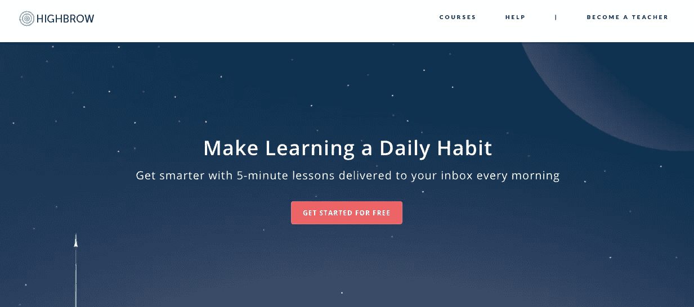

# 10 个提升你早晨习惯的工具

> 原文：<https://medium.com/hackernoon/10-tools-to-upgrade-your-morning-routine-3c468f34d1e9>

每一天都是做得更好、生活得更好、成长、学习更多、成为更多人的机会。抓住它。起床后的第一个小时奠定了你一天的基调，所以充分利用它至关重要。这些工具可以帮助你抓住机会，实现目标，成为你想成为的人。从新闻到智慧到自我发展，为了娱乐和商业，这些应用程序、时事通讯和日常事务可以帮助你每天多活一点。

## 1. [Listenable](https://listenable.io/)

喜欢听播客？然后你会爱上 Listenable 上的音频课程！想学习沟通技巧并提升你的社交游戏水平吗？或者你想了解更多关于健康的知识？无论你对什么感兴趣，Listenable 上都有适合你的音频课程。

使用 Listenable，您可以在通勤、锻炼或遛狗时享受 5 分钟的音频课程。您可以从 3，000 多个由广受欢迎的专家创建的原创音频课程中进行选择。

## 2.[曲高和寡](https://gohighbrow.com/)

高雅的人每天都教你一些新东西。当你啜饮着早晨的咖啡，揉去眼中的睡意时，Highbrow 提供了一个 5 分钟的简短电子邮件课程，帮助你学习从艺术和哲学到商业和个人发展的任何东西。课程一次教授一个人，持续 10 天，在每门课程结束时，会有有趣的知识测验。高雅目录中有超过 250 门课程，你永远不会学不完新东西。

## 3.[好奇的人们](https://curiouspeoples.com/)

《好奇的人们》是一份电子邮件时事通讯，每天帮助你扩展你的常识。每天早上，醒来时会收到一封 5 分钟的新邮件，一边喝咖啡，一边学习艺术、历史和科学。

## 4. [theSkimm](https://theskimm.com/)

世界上发生了很多事情，Skimm 旨在帮助你理解这一切。Skimm 是一个每日收件箱新闻源，每天早上给你不到 10 分钟的时事背景。醒来就能看到人们将会谈论的大话题的快速和易于理解的摘要，省去你在不想要的新闻中挑选你需要的新闻的麻烦。

## 5. [Blinkist](https://www.blinkist.com/)

每天都有数以千计的书籍出版，来自世界各地的专家，主题影响着你的生活。你怎么可能把它们都看完？Blinkist 可能是答案。从他们数以千计的非小说类书籍的数据库中选择，并阅读/聆听每本书 15 分钟的内容摘要。

## 6.[雨披](https://poncho.is/)

当然，有很多无聊的天气应用程序，你可能有过使用非常不准确的天气应用程序的经历。但是没有什么比 Poncho 更好的了——个性化、娱乐性和(实际上)有益的天气应用程序，让你的一天充满活力。

## 7.[顶空](https://www.headspace.com/)

他们说生命发生在每一次呼吸中。Headspace 是一个日常冥想项目，帮助你学会如何控制你的呼吸，改善你的生活，并思考你的方式来获得更好的体验。一个方便的、渐进的引导冥想应用程序，帮助初学者学习向内聚焦，同时挑战更有经验的用户将他们的冥想带到新的水平。选择专门帮助你控制食欲、降低焦虑、提高睡眠质量等的冥想课程。

## 8.[晨酿](https://www.morningbrew.com/)

想以一杯咖啡和商业新闻开始您的一天吗？然后你需要早茶。每天早上及时收到的每日电子邮件时事通讯，这是一种了解商业和技术动态的简单方法，因此您可以提前了解一天的情况。你睡觉的时候世界没有停止，你不能落后。取而代之的是，获取你感兴趣和影响你的商业新闻话题。

## 9. [7 分钟健身程序](https://www.nytimes.com/interactive/projects/well/workouts/?ref=producthunt)

每天七分钟的运动就能改善你的整体健康状况。这就是 7 分钟锻炼背后的哲学和科学。这是一系列有指导的锻炼，不需要任何设备，只需要利用你自己的体重和阻力，这种锻炼对任何人、任何地方都很容易，不用出(太多)汗。作为一项全面的身体锻炼，或者专注于你最关心的部位，这种锻炼是一种很好的方式来开始一天的锻炼。

## 10.[完成](https://www.finimize.com)

"金融不一定是火箭科学."他们在 Finimize 就是这么说的。这份电子邮件简讯总结了每天的重要金融新闻话题，并以一口大小的更新形式提供给您，您可以在三分钟或更短时间内吸收。

*如果你喜欢这个帖子，你可能也会喜欢这些帖子:*

 [## 30 个最好的网站来扩展你的常识

### 重要的是不要停止提问。好奇心有它存在的理由。一个人不能不在…

medium.com](/go-highbrow/the-30-best-websites-to-expand-your-general-knowledge-48c6d80fb367)  [## 注意力持续时间短的人的最佳学习工具

### "一旦我们接受了自己的极限，我们就会超越它们."

medium.com](/swlh/best-learning-tools-for-those-with-short-attention-spans-3feaf46838bb)  [## 25 个帮助你坚持 2018 年新年决心的最佳网站

### 对于那些不知道的人来说，新年决心是一个传统，在这个传统中，一个人承诺做一件…

medium.com](/go-highbrow/25-best-websites-to-help-you-stick-to-your-new-year-s-resolution-in-2016-9ef9d1dd5271)