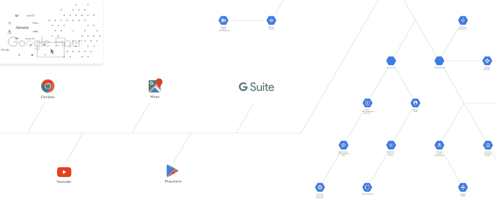

# 针对 web 开发人员的 10 个 UI 调整

> 原文：<https://medium.com/hackernoon/10-ui-tweaks-for-web-developers-af2502b8f994>

## 你不会相信这有多容易！


From UI to UX: tweaks to create an immersive user experience

## 概述

本文是用普通 Javascript 创建交互式信息图系列的第五部分，也是最后一部分。

以前，我们构建了一个功能丰富的用户界面(UI)来浏览相互连接的信息。在本文中，我们将展示为什么创建具有人情味的用户界面如此容易。

## 目标

我们将重点介绍十个 UI 调整，它们将把一次不经意的访问转变成一次卓越的用户体验。

## 概念

UI 设计的核心就是两个词:**情境化**和**交流**。

1.  如果我们能把这个故事联系起来，我们就能确定要解决的问题。
2.  如果我们能设计一个**与**交流的 UI，我们就能引导用户朝着他们的目标前进。

**澄清一下**，这个故事不是关于设计原则或 Javascript 本身。它是关于用户的需求和挑战。因此，“正确答案”应该因项目而异。

让我们通过实际例子来看看这是如何发挥作用的。

## 调整#1

**语境化:**如何呈现信息架构而不弄乱显示？
**沟通:**利用过渡效果讲故事。

**之前:**高亮信息的“惯用”方式。

```
<div id="myElement">
    <a href="myURL">Maps</a>
</div>
```


Undifferentiated content

**之后:**CSS 的调整将给信息架构带来新的维度。


A simple tweak to highlight the information architecture

```
var myIcon = document.getElementById( "myElement" );addEventListener("mouseover", mouseOver );
function mouseOver(event) {
    myicon.style.transform = "scale3d(1.20, 1.20, 1.20)"; // node;
    mylink.style.border = "solid 1px black"; // link
}
```

## 调整#2

**语境化:**如何快速揭示信息层级？
**沟通:**逐步错开集装箱入口。

**前:**一个“典型”页面加载


Without staggered entrance

**之后:**一个交错的入口瞬间凸显信息层级。

**一级**。由文本和媒体组成的核心内容被包装在最右边的一个更大的容器中，这样其隐含的顺序就很明显了。观察 Youtube 嵌入元素的超快速创建，即使其父容器是动态生成的。不用担心任何视频内容会降低网站速度。


Using staggered animation to reveal information architecture

**二级**。中间的容器为有兴趣了解更多信息的用户显示摘要信息和相关主题。

第三层。如果用户确实参与了，他们可以触发最左边的容器来显示更多信息(参见我们故事第四部分的演示)。

启动所有容器的“开始/隐藏”位置。

```
rightContainer.style.transform = "translate3d(50vw, 100vh, 0)";
middleContainer.style.transform = "translate3d(25vw, 100vh, 0)";
leftContainer.style.transform = "translate3d(0vw, 100vh, 0)";
```

将入口朝“结束/演出”位置排序。

```
rightContainer.style.transform = "translate3d(50vw, 0vh, 0)";
setTimeout(() => {
    middleContainer.style.transform = "translate3d(25vw, 0vh, 0)";
}, 200);
setTimeout(() => {
    leftContainer.style.transform = "translate3d(0vw, 0vh, 0)";
}, 400);
```

*   `setTimeout`延迟代码执行以模拟交错动画效果。
*   每个容器的“开始/隐藏”位置是`100vh`(从顶部开始)。“结束/放映”位置将是`0vh`。
*   `keyframes`或`transition-delay`可以产生类似的结果。
*   选择一个`easing` [过渡](https://easings.net/)来创建平滑的动画。

## 调整#3

**情境化:**如何最大化视图和导航空间？
**沟通:**导航事件时自动隐藏未使用的 UI 元素。

**之前:**可见导航空间减半。虽然用户可以查看“粘性”容器上的内容，但在导航事件本身中并不需要它。


Visible navigation space is halved

**之后:**由于用户在导航时不需要粘性容器，我们可以安全地淡出容器以最大化视图和导航空间。


The sticky container fades out contextually to maximise navigation space

```
**fadeOutSticky**(){
    rightContainer.style.opacity = "0";
};// reusing event listener (from part-one discussion)
canvas.addEventListener("mousedown", handlerGrab, false);function handlerGrab(event) { if (event.which == 1) {
        ...
        **fadeOutSticky**();
    };
    ...
}
```

## 调整#4

**语境化:**如何“不屏蔽”活跃元素？
**沟通:**自动隐藏阻塞元素以响应交互事件。

淡出`minimap`，这样当用户“平移”画布时，它就不会“阻挡”鼠标光标(这是第二部分讨论的导航特性)。


The minimap makes way for the mouse cursor contextually

```
canvas.addEventListener("mousemove", handlerMouseMove, false);
function handlerMouseMove(event) {
    if (event.which == 3) {
        if ( **boundingbox**(event.clientX, event.clientY, minimap) != false) {
            minimap.style.visibility = "hidden";
        } else {
            minimap.style.visibility = "visible";
        }
    }
}
```

`**boundingbox**`是一个自定义函数，用于确定鼠标光标当前是否悬停在`minimap`上。

```
function **boundingbox**(ClientX = 0, ClientY = 0, element) {
    if (element.getBoundingClientRect) {
        var rect = element.getBoundingClientRect ();
        y = rect.top;
        xR = rect.right;
        yB = rect.bottom;
        xL = rect.left;
        boxHeight = yB - y;
        boxWidth = xR - xL;
    }
    if ( ClientX <= (xR) && ClientY <= (yB) ) {
        return true;
    } else return false;
 }
```

## 调整#5

**语境化:**如何利用“隐藏维度”揭示更深层次的信息架构？
**沟通:**通过操纵元素上方的**的不透明度来模拟透明效果。上面的内容和**层下面的**层的内容都是可见的，以帮助用户可视化一个更完整的图片。**

只需使用`opacity`值，您就可以拓宽导航视图或创建视觉深度感。注意到在`minimap`(左上)和粘性容器(右手边)下面的半透明层了吗？


Good-old CSS opacity creates both information and visual depth

## 调整#6

如何仅在相关时显示相关信息(无需重新加载页面)？
**沟通:**默认隐藏信息，但在鼠标焦点上显示。

**谷歌云平台(GCP)的一点背景**。在 GCP 世界里， *PubSub* 与其他 GCP 产品紧密结合。虽然 PubSub 可能被归入**大数据**之下，但它也是许多 GCP 产品的关键集成点。我们如何在不弄乱视图的情况下突出这种上下文关系？一旦我们做到了，事情就没那么复杂了。


PubSub and Cloud Storage is the invisible glue that connects many GCP products

这种技术类似于我们突出显示节点的方式(在故事的第一部分中讨论过)。

“隐藏”虚线。

```
dottedLine.style.borderRight = "1px dashed #FFF"; 
// opacity or visibility works well too
```

当我们将鼠标悬停在 *PubSub* 节点上时，之前隐藏的虚线的`eventlistener`变得可见。请注意，其他不重要的链接会被隐藏。只需要一行代码，就可以实现对用户注意力的漏斗效应，讲述一个没有旁白的故事。

```
dottedLine.style.borderRight = "1px dashed #ddd";
```

应用淡入淡出过渡几乎是强制性的。

```
dottedLine.style.borderRight = “300ms ease”;
```

## 调整#7

**Contextualise:** 如何显示鼠标光标的上下文用法？
**沟通:**更新鼠标光标图标，表示不同的用法或行为。

**与小地图互动**。用户在`minimap`中拖动矩形括号(左上)来更新画布(主视图)。光标从默认指针变为四向箭头。



Minimap navigation: updating mouse cursor from pointer to four-way arrow

```
canvas.style.cursor = “inherit”; // default mouse pointer
canvas.style.cursor = “move”; // four-way arrow icon
```

**与主画布互动**。用户拖动主画布。`minimap`上的位置同时更新。光标从“抓取”(手)图标变为“抓取”(拳头)图标。


Canvas navigation: updating mouse cursor from “grab” to “grabbing”

```
canvas.style.cursor = “-webkit-grab”;  // hand icon
canvas.style.cursor = “-webkit-grabbing"; // fist icon
```

## 调整 8

**Contextualise:** 如何给同一个鼠标点击添加上下文用法？
**沟通:**区分一个`mousedown`和一个鼠标点击。

我们想要一个左击来做这个。


The stand-alone left-click: “`mousedown"` and “mouseup” action in a rapid succession

我们还希望一个*延长的*左键来做到这一点。


The grab-and-drag action: a prolonged mousedown with a mousemove to drag things that end with a mouseup

如你所见，左击与*长时间的*左击是不同的。后者拖动画布。

鼠标按钮可以有双重用途，并且仍然感觉直观。当左击在`mousedown`上，而不是`mouseup`上时，可能意味着:

1.  点击某物，或者
2.  拖东西。

实现起来很琐碎。诀窍是知道检测到`mousedown`事件后发生了什么。有直接的`mouseup`事件还是`mousemove`事件？前者建议“标准”点击，后者建议自定义拖动动作。

如果在 300 毫秒内没有检测到`mouseup`，那么让用户拖动画布。

在主`while`循环中(来自第一部分)，监听`mousedown`事件。

```
while (item[i]) {
   itemElementName[i].addEventListener("mousedown", **clickTimer** );
   ...
}
```

添加一个名为`clickTimer`的自定义函数来确定是单击还是拖动。

```
var mouseClick = true;
function **clickTimer**(event) {
    ...    
    // measure the time interval between mousedown and mouseup
    ...
}
```

由于我们只对知道时间间隔是否超过 300 毫秒感兴趣(**而不是**与间隔值本身相同)，我们可以使用一个简单的工具来完成这项工作。

```
// measurement hack
setTimeout(function(){
    mouseClick = false;
}, 300);
```

在`mousedown`上，将`mouseClick`设置为真。但是，300 毫秒后，将其设置为 false。

## 调整 9

**语境化:**如何从“浏览器内”过渡到全屏模式？
**沟通:**提供快速切换选项。

**切换互动**。提供一个互动的选项。默认情况下，“浏览器内”模式不会阻止用户滚动画布(参见第二部分的`scroll`)。切换将启用画布内的导航。


Toggle between “in-browser” and “interactive” mode

```
canvas.style.overflow = "hidden"; // default with scroll disabled
canvas.style.overflow = "scroll"; // enable scroll
```

**切换到全屏**。提供从“内嵌”模式全屏的选项，以最大化导航空间。


Toggle between full-screen and inline mode

```
buttonFullScreen.addEventListener("click", handlerFullScreen, false);function handlerFullScreen(event) {
    ...
    canvas.style.height = "100vh";
    canvas.style.width = "100vw";
    //  transform to new canvas full-width and full height
    //  handle new minimap placement position & adjust the new location position
    //  Calculate relative scroll position after canvas turns full-screen
    fullScreenSize = true; //  global var for other functions
}
```

*   `buttonFullScreen`引用了 HTML `<button></button>`。
*   `canvas.style.height`和`canvas.style.height`将画布切换到全屏。记住考虑`minimap`位置的变化。
*   最后，使用一个布尔标志告诉您的下游函数根据全屏尺寸进行计算(或者不进行计算)。

## 调整#10(用 SVG 缩放)

**Contextualise:** 如何让用户审视特写细节，还能保持高清？
**沟通:**使用鼠标滚动键进行缩放。使用 SVG 实现高清无限缩放。


Zoom incrementally with the mouse-scroll button (before applying easing effect)

使用`zoom` API 来增加或减少大小。

```
canvas.style.zoom = zoomLevel;
zoomLevel = zoomLevel + 0.01; //increment the zoom level
```

## 调整#10(缩放和放松)

**Contextualise:** 如何让 ui 以流畅、人性化的方式做出响应？**沟通:**加入缓和功能，创造直观体验。

动画和缓动效果携手合作，为用户提供有用的视觉提示。一个例子是最初的 iPhone 页末“反弹”效应。

让我们在缩放示例中尝试一下。


Zoom with easing

```
function easeInOutQuad(t, b, c, d) {
    if ((t /= d / 2) < 1) return c / 2 * t * t + b;
    return -c / 2 * ((--t) * (t - 2) - 1) + b;
}function spreadZoom(direction) {
    var time = 0;
    var diff = 1;
    var minTime = 5;
    var maxTime = 40; for (var i = 0, len = diff; i <= len; i++) {
        (function(s) {
            setTimeout(function() {
                if (direction == 'zoomin') {
                    ...
                } else
                if (direction == 'zoomout') {
                    ...
                };
            }, time);
        })(i);
    time = easeInOutQuad(i, minTime, maxTime, diff);
    } // for loop
}
```

结果是更平滑的起止曲线，模仿更自然的响应。

*   `spreadZoom`将一个物理滚动动作分解成一系列更小的虚拟缩放“遍布”一条`easeInOutQuad`曲线。
*   `easeInOutQuad`创造模拟效果。这个公式是基于罗伯特·彭纳的放松方程式。
*   可通过`time`、`diff`、`minTime`和`maxTime`变量进一步配置行为。

## 抛开概念不谈:宽松

为什么说 easing 是 UI 设计的一等公民？


A simple tweak makes the difference between “just ok” and “just right”.

也许是因为它的数学本质，如前面的`easeInOutQuad`示例(第 10 个调整)所示，放松可能是一个被忽视和未被充分利用的功能。然而，它也可以非常简单。一行 CSS 通常就能完成任务。

**CSS 用法**

```
#myElement {transition: 1s ease;}
```

**定制用途**

```
#myElement {transition: 1s cubic-bezier(0.25,0.1,0.25,1);}
```

**Javascript 等价物**

```
myElement.style.transition = "all 1s cubic-bezier(0.25,0.1,0.25,1)";
```

在我们的演示项目中广泛使用了缓动。例如，粘性容器的交错入口得到缓解(调整#2)。SVG 图标和连接链接的缩放和高亮效果也是如此(调整 1)。

让我们放松一下。


The ballerina chasing the mouse cursor, with easing.

## 后续步骤

一些最复杂的用户界面建立在最简单的想法之上。一旦我们将这些想法应用到问题的情境中，我们就能创造出更好的解决方案。

在这个由五部分组成的系列中，我们已经介绍了一些最常见的 Javascript 技术。我想让你带回家的只有一个信息——任何人都可以用简单的工具创造出引人注目的设计；任何人都可以将一次不经意的访问转化为卓越的用户体验。

## 到其他部分的链接

[**第一部分**为设计交互式信息图奠定基础。](/@PageiiStudio/how-to-build-an-interactive-infographic-from-scratch-94128678c83b)

[**Part-two** 增加浏览内容的导航功能。](/@PageiiStudio/how-to-create-a-navigation-ui-bac94a9e51fa)

[**Part-three** 增加动态小地图，增强导航。](/@PageiiStudio/how-to-create-a-two-way-navigation-map-e96600a73cbd)

[**第四部分**添加一个内嵌 UI 来访问分层内容。](/@PageiiStudio/how-to-create-a-progressive-ui-to-enhance-presentation-cc42fe97360c)

第五部分→ 你来了。耶！

如果你喜欢我们的故事，请到 [Pageii 工作室](https://pageii.com/story;title=10-UI-tweaks-for-web-developers)了解更多。